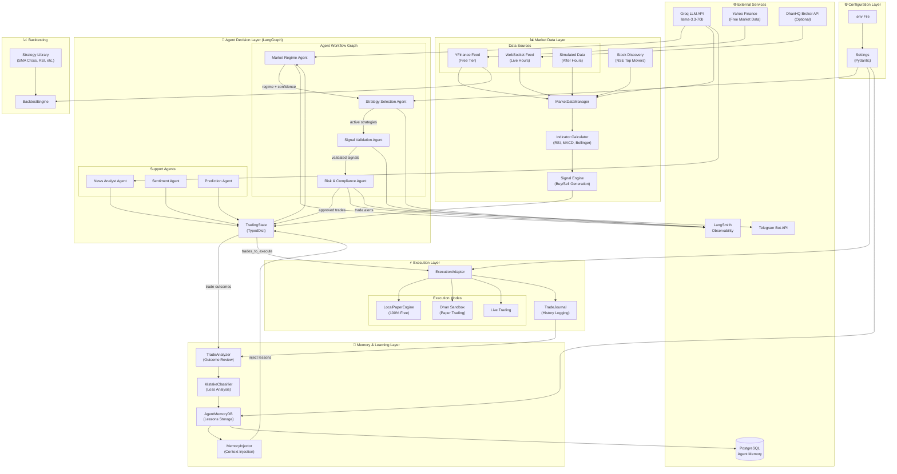
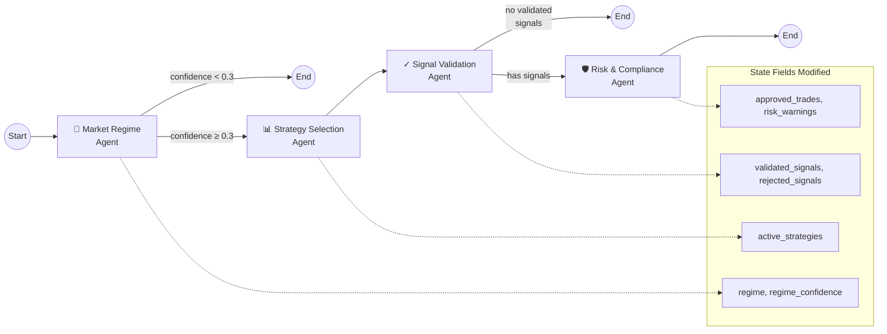
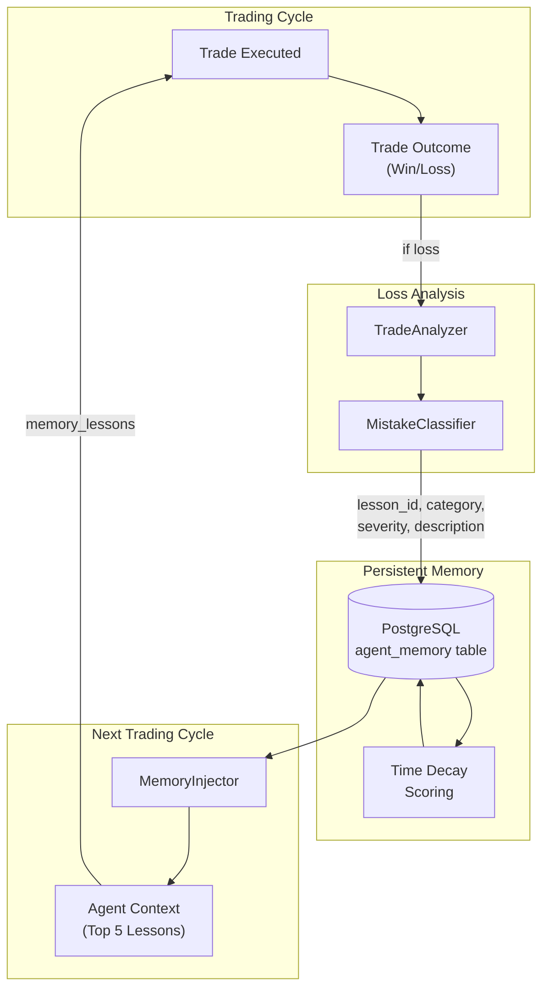

<div align="center">

# 🛡️ RakshaQuant

### Agentic Paper Trading System for NSE

_Where Large Language Models Meet Financial Markets_

[](https://www.python.org/downloads/)
[](https://github.com/langchain-ai/langgraph)
[](https://smith.langchain.com)
[](https://groq.com)
[](https://opensource.org/licenses/MIT)

</div>

---

## 🎯 About This Project

**RakshaQuant** (रक्षा = Protection in Sanskrit) is an autonomous agentic trading system designed for the Indian NSE market. It leverages **LangGraph** to orchestrate a team of specialized AI agents that analyze market data, formulate strategies, validate signals, and manage risk in real-time.

Unlike traditional algorithmic trading that relies solely on hardcoded logic, RakshaQuant introduces **cognitive flexibility**—using LLMs to reason about market regimes (bull/bear/ranging) and adapt its strategies accordingly.

### Key Capabilities

- **🤖 Cognitive Agents**: Multi-agent system that "thinks" before it trades
- **🌐 Live Market Analysis**: Real-time multi-stock monitoring via WebSocket
- **🛡️ Dynamic Risk Management**: Deterministic rules engine + a kill switch that gates execution
- **📊 Professional Dashboard**: Real-time CLI interface for monitoring agent thought processes
- **📝 Self-Improving Memory**: A *closed* learn-from-losses loop — classifies closed trades into
  lessons and tracks whether acting on them helped
- **💰 FinOps**: Tracks Groq token usage + cost with daily budgets, alerts, and a spend kill-switch
- **🎯 Profit-Target Engine**: Turns a return goal into a risk-bounded plan + on/off-pace tracker
- **🧪 Realistic Paper Trading**: Slippage + NSE-style fees, risk-based sizing, durable state
- **🔌 Gated Live Trading**: A unified execution path with order idempotency, a **shadow mode**,
  and broker reconciliation — real orders only fire behind an explicit opt-in
- **🆓 100% Free Tier Mode**: Paper trading without any paid API dependencies (the default)

---

## 🆕 What's New (v2.0)

### Free Tier Paper Trading

No paid broker API required! RakshaQuant now supports **100% free paper trading**:

| Feature             | Free Tier            | Description                              |
| ------------------- | -------------------- | ---------------------------------------- |
| **Market Data**     | ✅ YFinance          | Real NSE quotes (1-15 min delay)         |
| **Execution**       | ✅ Local Paper       | Virtual ₹10L wallet simulation           |
| **News Sentiment**  | ✅ Google RSS + Groq | AI-powered news analysis                 |
| **Stock Discovery** | ✅ Dynamic           | Finds trending stocks from news & movers |

### Dynamic Stock Discovery

No more hardcoded watchlists! The system now **automatically discovers** which stocks to trade based on:

- 📰 **News Mentions** - Scans Google News for trending stocks
- 📈 **Market Movers** - Identifies top gainers/losers

### New Modules

| Module                          | Purpose                               |
| ------------------------------- | ------------------------------------- |
| `src/utils/rate_limiter.py`     | Prevents Groq API rate limit errors   |
| `src/utils/cache.py`            | TTL cache for news, quotes, sentiment |
| `src/notifications/telegram.py` | Trade alerts on your phone            |
| `src/backtesting/`              | Test strategies on historical data    |
| `src/market/stock_discovery.py` | Dynamic stock discovery               |
| `src/execution/paper_engine.py` | Local paper trading engine            |

---

## 🔧 What's New (v2.1 — Production Hardening)

A focused hardening pass made the system correct, measurable, and safe end-to-end. Highlights:

| Area | What changed |
| ---- | ------------ |
| **Correctness** | Market hours evaluated in **IST** (not host-local time); kill switch now **gates order execution**, not just the agent graph; the news/sentiment/ML enrichment is fixed so it actually reaches the LLMs; each trading cycle is error-isolated. |
| **FinOps** (`src/finops/`) | Per-agent, per-IST-day Groq **token + cost accounting**, soft/hard **daily budgets**, an alerting layer (logs + Telegram), and a **spend kill-switch** that pauses LLM cycles when the budget is hit. |
| **Profit goal** (`src/profit/`) | A goal engine turns a monthly target into a **risk-bounded plan** (required win-rate / trade-frequency) and tracks on/off-pace — advisory only, it never relaxes risk limits. |
| **Data quality** | No look-ahead (indicators on settled bars), volume double-count fixed, NaN-sanitized indicators, indicator caching, and a **data-staleness gate**. |
| **Paper realism** | Fills model **slippage + NSE-style fees**; correct long/short/partial accounting (no cash leak); **atomic, crash-safe** state. |
| **Execution safety** (`src/execution/service.py`, `live_executor.py`) | One mode-switched path with **order idempotency**, a **shadow mode** (mirrors live, sends nothing), **broker reconciliation**, and a live fill-lifecycle — all gated behind `ALLOW_LIVE_ORDERS` (default off). |
| **Decision quality** | Signal **confidence is evidence-based** (indicator agreement); position **sizing is risk-based** (risk-per-trade + stop distance, Kelly with real win-rates); the **learning loop is closed**; the **backtester runs the real signal engine** with a before/after scorecard. |

> Every change is covered by tests (**325 passing**), `ruff check` is clean, and the default
> stays 100% free with **no real broker orders** unless explicitly enabled.

### Hardening modules

| Module | Purpose |
| ------ | ------- |
| `src/finops/cost_tracker.py` · `alerts.py` | LLM cost/token accounting, budgets, alerts |
| `src/profit/goal_engine.py` | Risk-bounded profit-target plan + pace tracker |
| `src/execution/service.py` | Unified execution: idempotency + shadow mode |
| `src/execution/live_executor.py` | Live order fill-lifecycle + broker reconciliation |
| `src/execution/costs.py` | Slippage + NSE-style fee model for paper fills |
| `src/memory/feedback.py` | Closes the learn-from-losses loop at trade close |
| `src/utils/market_time.py` | IST (UTC+05:30) market-time helpers |

---

## 🏗️ Architecture

RakshaQuant uses a **hierarchical agent graph** where specialized agents collaborate to make trading decisions.

### High Level Design(HLD)


### System Overview



### Agent Workflow Detail

The 4-agent decision pipeline with conditional edges:



### Memory Feedback Loop

How the system learns from trade losses:



---

## 📖 Detailed Documentation

For a comprehensive deep dive into the system's architecture, reasoning capabilities, and internal logic, please explore our dedicated documentation hub inside the `docs/` folder:

1. 🚀 **[Introduction & End-to-End Workflow](docs/1_Introduction.md)** – Detailed explanation of how trades move from ingestion to completion.
2. 📐 **[High-Level Design (HLD)](docs/2_High_Level_Design.md)** – Bird's eye view of the system's layer separations and memory feedback structure.
3. ⚙️ **[Low-Level Design (LLD)](docs/3_Low_Level_Design.md)** – Granular specifics of each directory, data flows, and class expectations.
4. 🧠 **[System Design & Cognitive Patterns](docs/4_System_Design.md)** – How the AI thinks (ensemble AI vs single prompt), fault tolerance, and design patterns.
5. 📂 **[Component Breakdown](docs/5_Components.md)** – Complete mapping of every script and node.

> ℹ️ These deep-dive design docs describe the core architecture; for the latest hardening
> work (FinOps, profit engine, execution safety/shadow mode, closed learning loop, risk-based
> sizing) see the **What's New (v2.1)** section above and [`CLAUDE.md`](CLAUDE.md).

---

## ✨ Features

### 🤖 The Agent Team

| Agent                   | Responsibilities                                                                                         | Model (Groq)    |
| ----------------------- | -------------------------------------------------------------------------------------------------------- | --------------- |
| **Market Regime**       | Analyzes volatility and price action to determine if market is Trending (Up/Down), Ranging, or Volatile. | `llama-3.3-70b` |
| **Strategy Selection**  | Selects the best trading strategies (Momentum, Mean Reversion, etc.) for the current regime.             | `llama-3.3-70b` |
| **Signal Validation**   | Reviews technical signals against the current thesis to filter out false positives.                      | `llama-3.3-70b` |
| **Risk Manager**        | Deterministic agent that enforces position sizing, stop-losses, and kill switches.                       | _Rules Engine_  |
| **News Analyst** 🆕     | Scans Google News RSS and scores sentiment using AI.                                                     | `llama-3.3-70b` |
| **Sentiment Agent** 🆕  | Calculates Market Mood Index (0-100) for fear/greed signals.                                             | _Hybrid_        |
| **Prediction Agent** 🆕 | ML-based price direction prediction using Linear Regression.                                             | _scikit-learn_  |

### 🖥️ Professional Dashboard


A rich CLI dashboard built with `rich` providing real-time visibility into the system:

- **Market Overview**: Live ticker for 10+ NSE stocks
- **Agent Reasoning**: See _why_ the AI made a decision
- **P&L Tracking**: Real-time unrealized/realized profit monitoring
- **Visual Indicators**: Progress bars for trade confidence and win rates

### 🛡️ Robust Engineering

- **Live/Sim Switch**: Automatically switches to simulated data when markets are closed (IST)
- **Rate Limit Handling**: Token bucket rate limiter with exponential backoff
- **Caching**: TTL cache for news/quotes/sentiment + an incremental indicator cache
- **Evidence-Based Confidence**: Signal confidence comes from indicator agreement, not constants
- **Risk-Based Sizing**: Positions sized from risk-per-trade + stop distance (Kelly with real win-rates)
- **Order Idempotency**: A persisted dedup store prevents double-submitting on retry/restart
- **Observability**: Full decision traces synced to LangSmith + per-day token/cost accounting

---

## 🚀 Quick Start

### Prerequisites

- Python 3.11+
- [uv](https://github.com/astral-sh/uv) (recommended) or pip
- [Groq API Key](https://console.groq.com) (for LLM inference) - **FREE**
- [DhanHQ Account](https://dhan.co) (optional, for live trading only)

### Installation (3 steps)

```bash
# 1. Clone + install (uv is fast)
git clone https://github.com/yourusername/RakshaQuant.git
cd RakshaQuant
uv sync

# 2. Guided setup — creates .env, checks your keys, prints a readiness checklist
uv run python scripts/setup.py

# 3. Add your FREE Groq key to .env (the setup output links you straight there), then:
uv run python scripts/setup.py     # re-run to confirm "[READY]"
```

That's it — `setup.py` is the only thing you need to get from clone to running. It is 100%
free by default (YFinance data + local paper wallet + Groq free tier); no broker account
required and no real orders are ever placed.

### Configuration

Copy `.env.example` to `.env` — it documents every knob. The essentials:

```bash
# Required
GROQ_API_KEY=your_groq_api_key
LANGSMITH_API_KEY=your_langsmith_api_key   # free tier; for tracing

# Free Tier Mode (default — 100% free, no real orders)
MARKET_DATA_SOURCE=yfinance
EXECUTION_MODE=local_paper        # or `shadow` to mirror live without sending orders
ALLOW_LIVE_ORDERS=false           # master safety gate — real orders ONLY when true
PAPER_WALLET_BALANCE=1000000

# Realistic paper costs (set to 0 for ideal fills)
PAPER_SLIPPAGE_BPS=2.0
PAPER_BROKERAGE_BPS=3.0

# FinOps budgets (0 = unlimited; free tier cost is $0)
DAILY_TOKEN_BUDGET=0
DAILY_COST_BUDGET_USD=0.0

# Profit-target goal engine (0 = disabled)
MONTHLY_PROFIT_TARGET_PCT=0.0

# Learning loop (classify closed trades into lessons)
ENABLE_LEARNING=true

# Optional: Telegram Alerts
TELEGRAM_BOT_TOKEN=your_bot_token
TELEGRAM_CHAT_ID=your_chat_id
```

### Running the System

```bash
# Validate config (guided setup also does this)
uv run python scripts/setup.py        # or: scripts/check_config.py

# Launch the live/paper dashboard (main entry point)
uv run python scripts/run_live_trading.py

# Run a backtest
uv run python src/backtesting/engine.py

# Validate the edge OUT-OF-SAMPLE before risking capital (walk-forward, net of real costs)
uv run python scripts/validate_strategy.py
```

### ⚠️ Validate before you trade real money

A single in-sample backtest proves nothing. **`scripts/validate_strategy.py`** runs the live
signal logic on rolling **out-of-sample** windows, **net of realistic NSE costs** (slippage +
brokerage + STT/stamp/GST via the `CostModel`), and prints a blunt **VALIDATED / NOT VALIDATED**
verdict (it requires positive net-of-cost expectancy *and* consistency across folds, not one
lucky window). It also prints a **survivorship caveat**: the universe is current-listed names
only, so a true production go/no-go needs a point-in-time, survivorship-free dataset (NSE
Bhavcopy / a vendor) that YFinance cannot provide. Treat a green verdict as *necessary, not
sufficient* — historical bars also can't capture circuit limits, gaps, or thin-name liquidity.

### The Dashboard

The live dashboard (`rich` TUI) is the main interface. At a glance it shows:

- **Header status bar** — mode/data badges, **NSE OPEN/CLOSED** (in IST) and a live IST clock,
  and session uptime.
- **Account** — balance, total & realized/unrealized P&L, return %, best/worst, and goal pace.
- **Market Overview / Open Positions** — top movers and live position P&L.
- **Market Regime / AI Decision / Agent Activity** — what the agents decided and *why*.
- **Session & Cost** (footer) — today's LLM calls / tokens / **$ cost** (FinOps) and the
  profit-goal pace bar — alongside the scrolling **Activity Log**.

Press `Ctrl+C` to stop (it prints a final P&L + spend summary).

---

## 📁 Project Structure

```
RakshaQuant/
├── src/
│   ├── agents/              # 🧠 The "Brain" of the system
│   │   ├── market_regime.py
│   │   ├── strategy_selection.py
│   │   ├── signal_validation.py
│   │   ├── risk_compliance.py
│   │   ├── news_analyst.py  # 🆕 News sentiment
│   │   ├── sentiment.py     # 🆕 Market mood index
│   │   └── prediction.py    # 🆕 ML predictions
│   ├── market/              # 🌐 Market Data Handling
│   │   ├── manager.py       # Live/Sim auto-switcher
│   │   ├── yfinance_feed.py # 🆕 Free market data
│   │   ├── stock_discovery.py # 🆕 Dynamic discovery
│   │   ├── websocket_feed.py# DhanHQ WebSocket client
│   │   └── simulated_data.py# Realistic market simulator
│   ├── execution/           # ⚡ Order Execution
│   │   ├── service.py       # 🆕 Unified path: idempotency + shadow mode
│   │   ├── live_executor.py # 🆕 Live fill-lifecycle + reconciliation
│   │   ├── costs.py         # 🆕 Slippage + NSE fee model
│   │   ├── adapter.py       # Broker/local routing
│   │   ├── paper_engine.py  # Local paper trading (costs, shorts, atomic state)
│   │   ├── exit_manager.py  # Trailing/time/partial exits (persisted)
│   │   └── journal.py       # Durable trade history
│   ├── finops/              # 💰 🆕 Cost tracking, budgets, alerts
│   ├── profit/              # 🎯 🆕 Profit-target goal engine
│   ├── backtesting/         # 📈 Strategy Testing
│   │   ├── engine.py        # Backtest runner (+ CostModel) + compare_results scorecard
│   │   ├── walk_forward.py  # 🆕 OOS / walk-forward validation + edge verdict
│   │   └── strategies.py    # RealSignalStrategy (uses the live engine) + others
│   ├── utils/               # 🔧 Utilities
│   │   ├── rate_limiter.py  # API rate limiting
│   │   ├── market_time.py   # 🆕 IST market-time helpers
│   │   └── cache.py         # TTL caching
│   ├── notifications/       # 📱 Alerts
│   │   └── telegram.py      # Mobile notifications
│   ├── dashboard/           # 📊 UI Components
│   │   └── cli.py           # Rich terminal dashboard (account/cost/goal panels)
│   ├── memory/              # 📚 Learning System (closed loop: feedback.py)
│   └── config/              # ⚙️ Configuration
├── scripts/                 # 🏃‍♂️ Entry Points
│   ├── setup.py             # 🆕 Guided one-command setup
│   ├── run_live_trading.py  # Main application (dashboard)
│   ├── validate_strategy.py # 🆕 OOS / walk-forward edge validation (run before live)
│   └── check_config.py      # Config validator
├── tests/                   # 🧪 Unit Tests
└── README.md
```

---

## 📈 Backtesting

Test strategies before running live:

```python
from src.backtesting import BacktestEngine, MomentumStrategy

engine = BacktestEngine(initial_capital=100000)
data = engine.fetch_data("RELIANCE", period="1y")
result = engine.run(MomentumStrategy(), data, symbol="RELIANCE")
result.print_summary()
```

**Available Strategies:**

- `RealSignalStrategy` - **runs the live indicator + SignalEngine logic** (faithful to live trading)
- `MomentumStrategy` - Buy on upward momentum
- `MeanReversionStrategy` - Buy oversold, sell overbought
- `SMACrossoverStrategy` - Moving average crossover
- `RSIStrategy` - RSI-based entries

**Prove a change helps** with the before/after scorecard:

```python
from src.backtesting.engine import compare_results

report = compare_results(baseline_result, candidate_result)
print(report["improved"], report["deltas"])  # return/win-rate/expectancy/Sharpe/drawdown deltas
```

---

## 📱 Telegram Alerts

Get trade notifications on your phone:

1. Create bot: Talk to `@BotFather` on Telegram
2. Get chat ID: Talk to `@userinfobot`
3. Add to `.env`:

```bash
TELEGRAM_BOT_TOKEN=your_bot_token
TELEGRAM_CHAT_ID=your_chat_id
```

---

## 🔍 Observability

RakshaQuant is instrumented with **LangSmith** for full observability. You can trace every thought process of the agents:

> _"Why did the agent reject the BUY signal for TCS?"_ > _"What market regime did it detect before entering the trade?"_

All these questions can be answered by inspecting the traces in the LangSmith dashboard.

---

## ⚠️ Disclaimer

> **EDUCATIONAL PURPOSES ONLY**
>
> RakshaQuant is a research project to explore Agentic AI in finance. It is **not** financial advice.
>
> - The default mode is **PAPER TRADING** and is 100% free.
> - Real broker orders are **never** sent unless you explicitly set `ALLOW_LIVE_ORDERS=true`
>   with valid broker credentials; otherwise live/dhan modes run in safe **shadow** mode.
> - Do not connect to a live trading account with real funds unless you fully understand the risks.
> - Algorithmic trading involves significant risk of loss.

---

<div align="center">
    <b>Built with ❤️ by a solo developer exploring the BFSI × AI frontier</b>
</div>


