<p align="center">
  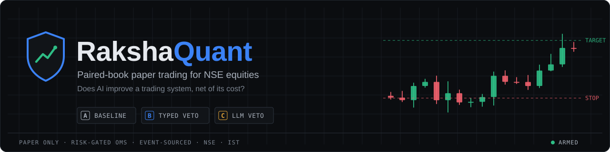
</p>

<p align="center">
  <b>An agentic paper-trading platform for NSE equities, built to answer one question with a
  controlled experiment: <i>does AI improve a trading system, net of its cost?</i></b>
</p>

<p align="center">
  <a href="https://github.com/HimanshuMohanty-Git24/RakshaQuant/actions/workflows/ci.yml"></a>
  
  
  
  
  
  
  
  <a href="LICENSE"></a>
  
</p>

<p align="center">
  <a href="#-the-experiment">Experiment</a> ·
  <a href="#-highlights">Highlights</a> ·
  <a href="#-the-console">Console</a> ·
  <a href="#-architecture">Architecture</a> ·
  <a href="#-quick-start">Quick start</a> ·
  <a href="#-documentation">Docs</a> ·
  <a href="#-project-status">Status</a>
</p>

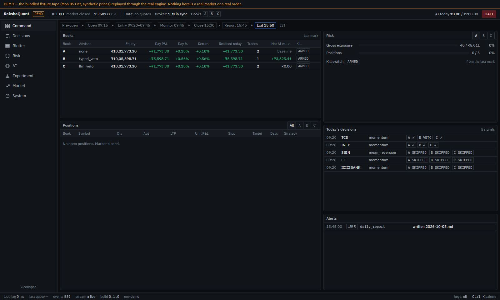

<p align="center"><sub>The web console's <b>Command Center</b>, replaying the bundled demo day: three paired books,
the session schedule, risk, and every book's outcome for each signal.</sub></p>

> [!WARNING]
> **Paper trading only. Educational and research use. Not investment advice.** The engine has no
> path to a real broker: every order fills on a simulated broker that models latency, spread,
> impact, liquidity and NSE charges.

## 🧪 The experiment

A deterministic engine trades NSE cash equities (the NIFTY 50, CNC delivery, long only) for
three **paired books**. All three see exactly the same signals, and only the advisor differs:

| | Book | Advisor | Role in the experiment |
| :-: | --- | --- | --- |
| ⚪ | **A** | none | The baseline: every entry the strategies and risk rules allow |
| 🔵 | **B** | **Typed decision model**: [Laya](docs/runbooks/providers.md) runs locally on CPU and passes the questions it is unsure of to **Jev** (TypeSafe) | Can a structured, calibrated model veto bad entries? |
| 🟠 | **C** | **An LLM of your choice**: OpenAI, Anthropic, OpenRouter, Groq, Ollama or any OpenAI-compatible endpoint | Can a general-purpose LLM do it, and is it worth its cost? |

> [!IMPORTANT]
> **AI can only veto.** It never sizes, prices or adds an order. Any AI failure (timeout, refusal,
> budget, bad output) leaves the deterministic decision in place. Every BUY signal also gets a
> **counterfactual trade**, so a veto is scored by what it actually avoided.

A [pre-registered](docs/experiments/2026-10-month1-preregistration.md) month-long run decides, by
rules fixed in advance, whether each advisor stays. The measure is net AI value (the book's
P&L against book A, minus its AI spend), and veto precision with a confidence interval.

## 📊 At a glance

| 📚 3 | 🧭 4 | 🛡️ 34 | 🚦 47 |
| :-: | :-: | :-: | :-: |
| paired books | strategies (2 trade, 2 shadow) | bounded risk limits | risk reason codes |
| **🧾 46** | **🤖 6** | **🖥️ 8** | **✅ 800+** |
| event types, all recorded | LLM providers, one-line switch | console screens + inspector | tests, on Linux and Windows CI |

## ✨ Highlights

<table>
  <tr>
    <td width="50%" valign="top">
      <h4>🛡️ Risk first</h4>
      Every order passes one OMS gate, exits and kill-switch flattens included. It re-checks
      bounded limits on a fresh snapshot: risk per trade, size, liquidity, exposure, heat,
      sector, daily loss, drawdown and event windows. Kill switches are persisted and latching,
      and a <code>HALT</code> file stops every book.
    </td>
    <td width="50%" valign="top">
      <h4>⚡ Realistic paper fills</h4>
      Latency, spread by liquidity tier, square-root impact, participation caps, gap fills
      through stops, and the full NSE charge schedule (STT, exchange, SEBI, stamp duty, GST, DP).
    </td>
  </tr>
  <tr>
    <td valign="top">
      <h4>📡 Data you can trust</h4>
      Quotes are validated against each scrip's price band, features use settled bars only, and
      the NSE calendar fails closed. Simulated prices can never create orders outside the demo.
    </td>
    <td valign="top">
      <h4>📰 News that blocks trades</h4>
      NSE corporate announcements are classified by the decision models. Entries are blocked
      around results and after major adverse news; exits never are.
    </td>
  </tr>
  <tr>
    <td valign="top">
      <h4>🧠 Provider-agnostic AI</h4>
      Every role runs on any provider via <code>provider:model</code>, with fallbacks, circuit
      breakers, rate-limit pauses, INR budgets and a reply cache. No positions or P&amp;L ever
      reach a prompt.
    </td>
    <td valign="top">
      <h4>🧾 One source of truth</h4>
      An SQLite event store records every fact, and projections are pure functions of the events.
      The daily report, exact replays of any recorded day, and both consoles are built from it.
    </td>
  </tr>
  <tr>
    <td valign="top">
      <h4>🖥️ A real trading terminal</h4>
      A local, token-protected web console with a decision inspector, blotter, risk center with
      typed confirmations, AI desk, experiment view and live event stream. A Rich terminal
      dashboard covers the same data.
    </td>
    <td valign="top">
      <h4>🔬 Honest research</h4>
      Backtests run the paper engine itself over daily bars, with a statistical go/no-go gate
      (≥ 200 trades and a positive confidence interval) and a point-in-time NSE dataset that
      avoids survivorship bias.
    </td>
  </tr>
</table>

## 💻 The console

<table>
  <tr>
    <td width="50%" valign="top">
      <a href="docs/ui/screens/3-inspector-vetoed.png">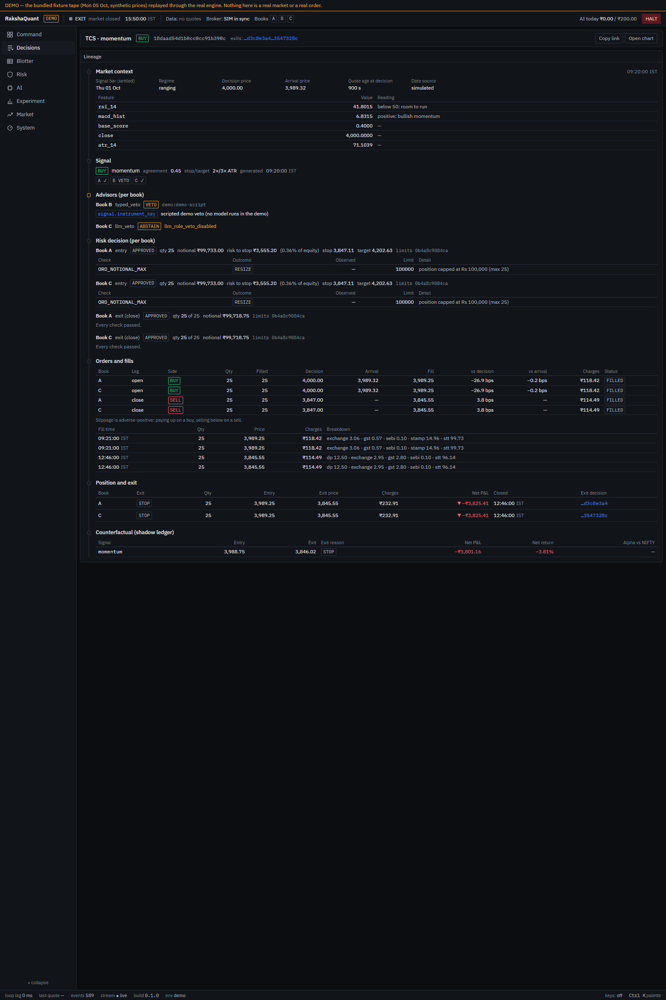</a>
      <br><sub><b>🔎 Decision inspector.</b> A signal book B vetoed: the market context, every book's outcome, the veto and its evidence, the risk checks and the counterfactual that shows the loss it avoided.</sub>
    </td>
    <td width="50%" valign="top">
      <a href="docs/ui/screens/5-risk-center.png">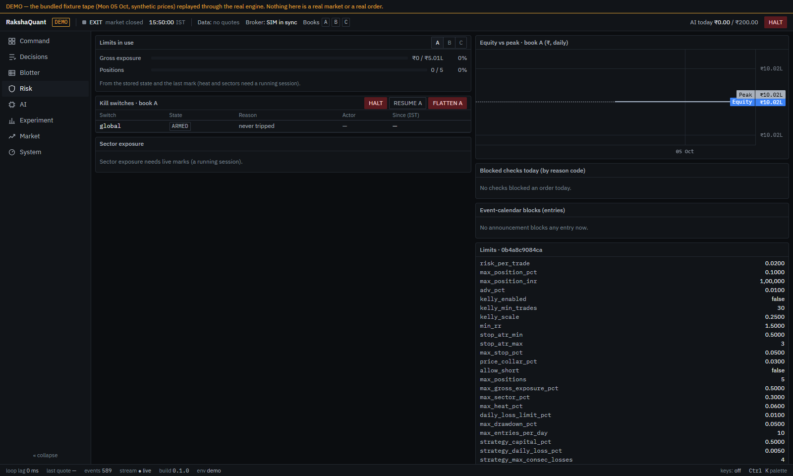</a>
      <br><sub><b>🛡️ Risk center.</b> Each limit's use per book, the kill switches (HALT, typed RESUME and FLATTEN), and today's blocked checks.</sub>
      <br><br>
      <a href="docs/ui/screens/6-ai-desk.png">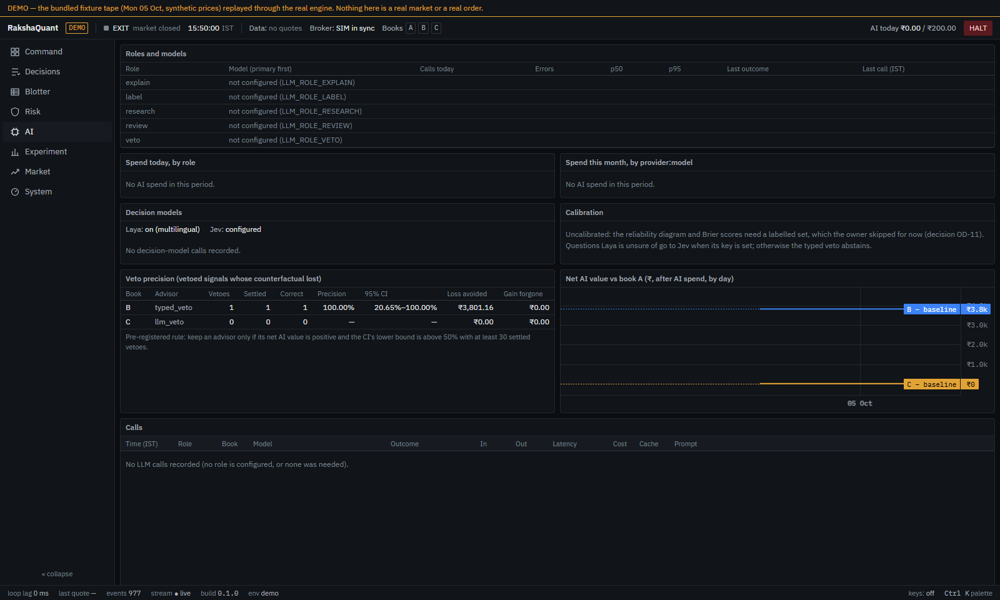</a>
      <br><sub><b>🧠 AI desk.</b> Models per role with their health and latency, spend against the INR budgets, the decision models and veto precision.</sub>
      <br><br>
      <a href="docs/ui/screens/7-experiment.png">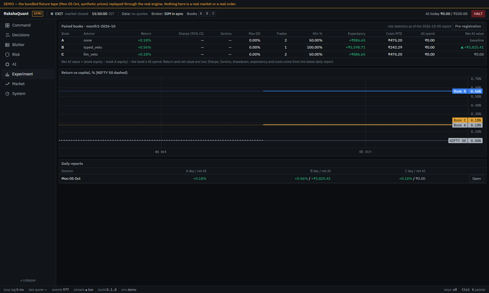</a>
      <br><sub><b>🧪 Experiment.</b> The paired books against NIFTY, net AI value, and the daily reports.</sub>
    </td>
  </tr>
</table>

<details>
<summary><b>More screens:</b> decisions, blotter, market, system, an executed trade</summary>
<br>

| | |
| --- | --- |
| 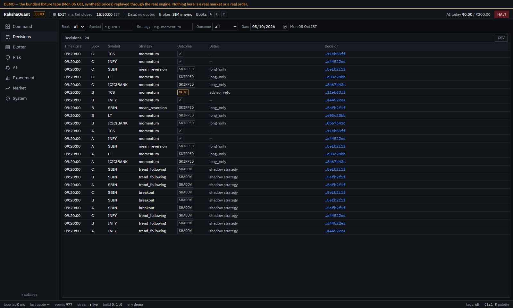 <br><sub><b>Decisions.</b> Every signal and each book's disposition, filterable, with CSV export.</sub> | 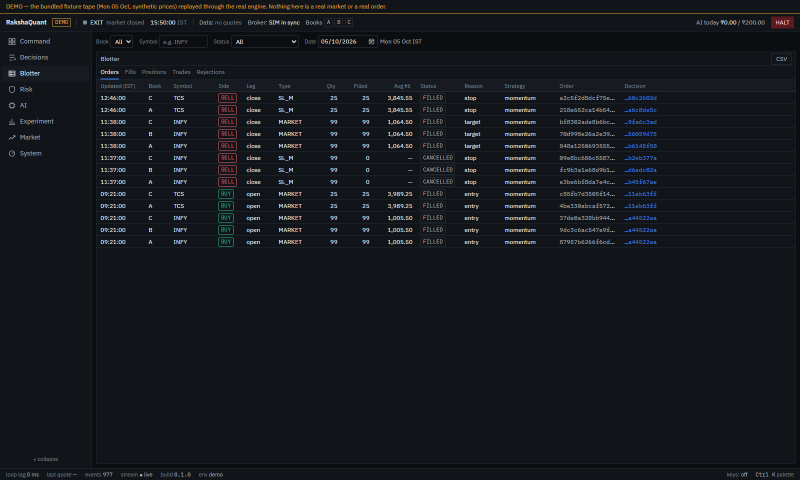 <br><sub><b>Blotter.</b> Orders, fills, positions, trades and rejections.</sub> |
| 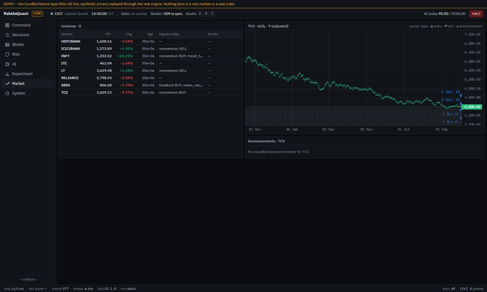 <br><sub><b>Market.</b> The universe with live quotes, daily candles with each book's entries and exits, and the announcements feed.</sub> | 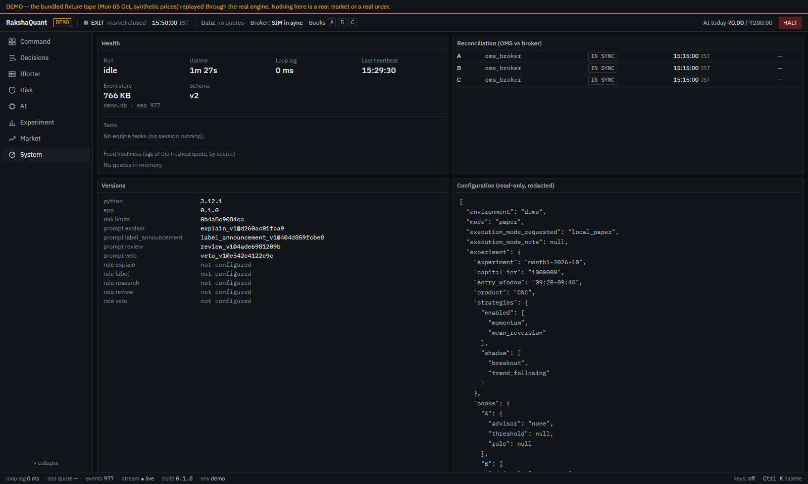 <br><sub><b>System.</b> Health, tasks, feed freshness, reconciliation, versions and a filterable log tail.</sub> |
| 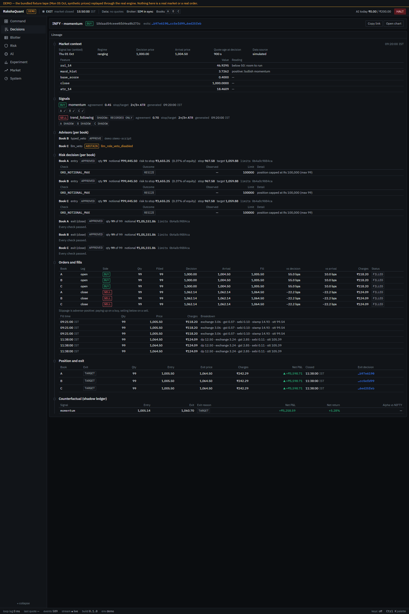 <br><sub><b>Inspector, executed.</b> Signal → risk → order → fills → target exit, with slippage and charges.</sub> | |

</details>

## 🧩 Architecture

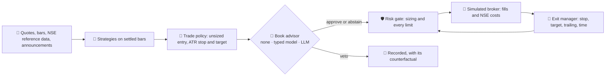
```mermaid
flowchart LR
  D["📡 Quotes, bars, NSE reference data, announcements"] --> S["🧭 Strategies on settled bars"]
  S --> P["📐 Trade policy: unsized entry, ATR stop and target"]
  P --> V{"🤖 Book advisor<br/>none · typed model · LLM"}
  V -->|approve or abstain| R["🛡️ Risk gate: sizing and every limit"]
  V -->|veto| X["🧾 Recorded, with its counterfactual"]
  R --> B["🏦 Simulated broker: fills and NSE costs"]
  B --> E["🎯 Exit manager: stop, target, trailing, time"]
  E --> R
```

Each trading day runs unattended on a fixed IST schedule taken from the NSE calendar:

| 🕘 09:00 | 🔔 09:15 | 🎯 09:20-09:45 | 👀 until 15:30 | 📝 15:45 | 🏁 15:50 |
| :-: | :-: | :-: | :-: | :-: | :-: |
| Pre-open: reference data, history, regime | Market open: quotes, risk monitor, stops | One decision cycle | Exits only | Daily report + Telegram summary | The process exits |

The full picture is in **[docs/architecture.md](docs/architecture.md)**.

## 🔐 Safety by design

- 🚫 **No broker path.** The engine trades on a simulated broker only; there is no code that
  could send a real order.
- 🧱 **One gate for every order.** An OMS without a risk gate routes nothing. Entries fail
  closed, and exits are reduce-only, so they can never oversell or flip a position.
- 🔒 **Latching kill switches.** They are persisted and escalate only; an operator's typed
  confirmation is the only way back.
- 🧪 **No fabricated data in trading.** Simulated prices are blocked outside the `demo`
  environment, and a calendar gap blocks trading rather than guessing.
- 🙈 **No private data in prompts.** Models see public facts only, in JSON data blocks, and
  extra fields in an answer are ignored.
- 🔑 **A local console.** A per-launch token, trusted hosts, an origin allowlist, and typed
  phrases for resume and flatten.

## 🚀 Quick start

You need **Python 3.11+** and **[uv](https://github.com/astral-sh/uv)**. The web console also
needs **Node `^20.19` or `>=22.12`**.

```bash
git clone https://github.com/HimanshuMohanty-Git24/RakshaQuant.git && cd RakshaQuant
uv sync --extra web
uv run python scripts/run_live_trading.py --demo     # a full demo day in the terminal, no keys needed
```

The demo replays a bundled synthetic day through the real engine, in its own `demo`
environment. Book B's veto is scripted there, so you can watch a veto avoid a loss.

<details>
<summary><b>🌐 The browser console</b></summary>

```bash
(cd frontend && npm ci && npm run build)
uv run python scripts/run_live_trading.py --mode web --demo   # prints a one-time console URL
```
</details>

<details>
<summary><b>📈 A paper session on today's market</b></summary>

```bash
cp .env.example .env                    # set ENVIRONMENT=paper; every key is optional
uv sync --extra web --extra decision-local    # decision-local adds Laya for book B
uv run python scripts/setup.py          # readiness check
uv run python scripts/run_live_trading.py --mode web     # or without --mode for the terminal
```

On a holiday or weekend the session exits at once. Started before the open, it waits for
pre-open (09:00 IST); started after the day's session, it exits. To run it every weekday, use
`scripts/install_windows_task.ps1` (see [daily operations](docs/runbooks/daily-ops.md)).
</details>

## ⚙️ Configuration

Everything is optional and lives in `.env`; start from **[.env.example](.env.example)**.

| Setting | Purpose |
| --- | --- |
| `ENVIRONMENT` | `paper` for the experiment; each environment keeps its own state in `var/<environment>/` |
| `LLM_ROLE_VETO` + the provider's key | book C's advisor, as `provider:model` with fallbacks |
| `TYPESAFE_API_KEY` | Jev, the escalation model behind book B |
| `TELEGRAM_BOT_TOKEN`, `TELEGRAM_CHAT_ID` | the daily summary and the dead-man alarm |
| `RISK_*` | bounded risk limits; out-of-range values stop startup |

Every setting and limit is listed, generated from the code, in
[settings](docs/reference/settings.md) and [risk limits and reason codes](docs/reference/risk.md).

## 🧰 Tech stack

| Layer | Built with |
| --- | --- |
| **Engine** | Python 3.11, asyncio, Pydantic v2, a deterministic replay clock |
| **Market data** | YFinance, NSE reference data and announcements, pandas, `ta`, Parquet (pyarrow) |
| **Storage** | SQLite (WAL) event store with projections; a Parquet quote and bar tape |
| **AI** | OpenAI and Anthropic SDKs (OpenRouter, Groq, Ollama, any compatible endpoint); Laya (local) and Jev |
| **Web** | FastAPI, WebSockets, React 18, TypeScript, Vite, Tailwind, TanStack Query/Table/Virtual, Radix, lightweight-charts |
| **CLI** | Rich |
| **Quality** | pytest, Hypothesis, golden replays, Playwright + axe, ruff, mypy (strict), GitHub Actions, Dependabot |

## 📚 Documentation

| | |
| --- | --- |
| 🏗️ **[Architecture](docs/architecture.md)** | How the parts fit: the flow, a trading day, books, risk, AI, the event store |
| 📘 **Runbooks** | [Daily operations](docs/runbooks/daily-ops.md) · [Kill switches](docs/runbooks/kill-switch.md) · [Incidents](docs/runbooks/incident.md) · [AI providers](docs/runbooks/providers.md) |
| 📖 **Reference** (generated) | [Settings](docs/reference/settings.md) · [Risk limits and reason codes](docs/reference/risk.md) · [Events](docs/reference/events.md) · [HTTP API and stream](docs/reference/api.md) · [Packages](docs/reference/packages.md) · [Scripts](docs/reference/scripts.md) |
| 🧪 **[Pre-registration](docs/experiments/2026-10-month1-preregistration.md)** | The month run's hypotheses and decision rules, fixed in advance |
| 🗺️ **[Plan](docs/plan/2026-10-01-platform-v2-plan.md) · [Progress](docs/plan/PROGRESS.md)** | The Platform v2 build: every decision and verified fact |
| 🔍 **[Audit](docs/audit/2026-10-01-platform-audit.md)** | The review of the earlier prototype that motivated v2 |

## 🚦 Project status

- [x] **Platform v2 built:** 13 milestones (M0-M12), every decision logged in [PROGRESS](docs/plan/PROGRESS.md)
- [x] **CI green on Linux and Windows:** lint, strict types, 800+ tests, dependency audits, end-to-end tests
- [x] **A recorded day replays event for event**
- [ ] **A supervised paper day** on the live market
- [ ] **The month run:** 20 sessions, three books
- [ ] **A verdict per advisor**, by the pre-registered rules

> [!NOTE]
> **What to expect.** The first backtest of the two trading strategies, over 2025 on ten large
> caps, was **not validated**: 27 trades, a mean of −0.43% net per trade, and a confidence
> interval spanning zero. That matches the pre-registered expectation that the deterministic
> strategies have no proven edge. The experiment asks whether AI vetoes improve them, not
> whether the system makes money.

## 🧑‍💻 Development

```bash
uv sync --extra dev --extra web                  # add --extra decision-local for Laya (pulls torch)
uv run --extra dev pytest                        # hermetic: never reads your .env
uv run --extra dev ruff check . && uv run --extra dev ruff format --check .
uv run --extra dev mypy src                      # strict; CI also runs a global error ratchet
cd frontend && npm run typecheck && npm run lint && npm test && npm run build
cd frontend && npm run e2e                       # Playwright against the real demo server
```

<details>
<summary><b>Generated files</b> (tests fail when they go stale)</summary>
<br>

| File | Regenerate with |
| --- | --- |
| `frontend/openapi.json`, `frontend/src/api/types.gen.ts` | `uv run --extra web python scripts/export_openapi.py`, then `cd frontend && npm run gen:api` |
| `docs/reference/` | `uv run --extra web python scripts/gen_docs.py` |
| `src/engine/demo_tape/` | `uv run python scripts/build_demo_tape.py` |
| `tests/golden/` | run the golden tests with `UPDATE_GOLDEN=1` |
</details>

<details>
<summary><b>Validating a strategy</b></summary>
<br>

`uv run python scripts/validate_strategy.py --start 2025-01-01 --end 2025-12-31` backtests the
paper engine itself. It reports VALIDATED only with at least 200 trades and a 95% confidence
interval of the mean net return per trade above zero.
</details>

## 📁 Repository layout

```text
RakshaQuant/
├── src/            the engine, strategies, risk, OMS and simulated broker, market data,
│                   AI layers, the event store, the web API and the CLI
├── frontend/       the web console (React, TypeScript, Vite)
├── scripts/        entry points: the session, replays, reports, validation, setup, scheduling
├── docs/           architecture, runbooks, generated reference, the plan, the audit
└── tests/          the Python test suite (unit, property, golden, contract)
```

The package map, generated from the code, is in [packages](docs/reference/packages.md).

## ⚖️ Licence and disclaimer

Released under the **MIT** licence ([LICENSE](LICENSE)). RakshaQuant is a research project. It
is **not** financial advice, it trades on paper only, and its results say nothing about live
trading. Algorithmic trading involves significant risk of loss.

<p align="center"><sub><i>Raksha</i> (रक्षा) means <i>protection</i>: the system is built around its risk controls.</sub></p>
