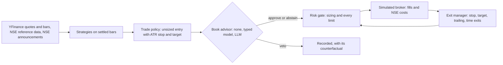

# RakshaQuant

**A paper-trading platform for NSE equities, built to measure whether AI improves a trading
system, net of its cost.**

*Raksha* (रक्षा) means protection: the system is built around its risk controls.

[](https://github.com/HimanshuMohanty-Git24/RakshaQuant/actions/workflows/ci.yml)
[](https://www.python.org/downloads/)
[](LICENSE)


<sub>The web console's Command Center, replaying the bundled demo day: three paired books, the
session schedule, risk, and every book's outcome for each signal.</sub>

> **Paper trading only. Educational and research use. Not investment advice.** The engine has
> no path to a real broker: every order fills on a simulated broker.

## What it does

A deterministic engine trades NSE cash equities (the NIFTY 50, CNC delivery, long only). It
does this for three **paired books** that see exactly the same signals:

| Book | Entries |
| --- | --- |
| **A** | every signal the strategies and risk rules allow: the baseline |
| **B** | the same, but a **typed decision model** may veto an entry: Laya runs locally on CPU and hands the questions it is unsure of to Jev (TypeSafe) |
| **C** | the same, but an **LLM** of your choice may veto an entry |

AI can only **veto**. It never sizes, prices or adds an order, and any AI failure leaves the
deterministic decision in place. Every decision is recorded with its full lineage:

- the signal and its features;
- each book's advisor verdict and its evidence;
- the risk checks, the order, the fills and the exit;
- a counterfactual trade for every signal, so a veto is scored by what it avoided.

So the difference between the books, **net of AI spend**, is measurable. A pre-registered
month-long experiment ([pre-registration](docs/experiments/2026-10-month1-preregistration.md))
decides, by rules fixed in advance, whether each advisor stays.

## Highlights

- **Risk first.** Every order goes through one OMS gate, exits and kill-switch flattens
  included. The gate re-checks bounded limits on a fresh snapshot: risk per trade, position
  size, liquidity, exposure, heat, sector, daily loss, drawdown, event windows. Kill switches
  are persisted and latching, and a `HALT` file stops every book.
- **Realistic paper fills.** Latency, spread by liquidity tier, square-root impact, participation
  caps, gap fills through stops, and the full NSE charge schedule.
- **Data you can trust.** Quotes are validated against price bands, features use settled bars
  only, and the NSE calendar fails closed. Simulated prices can never trade outside the demo.
- **News that blocks trades.** NSE corporate announcements are classified by the decision
  models. Entries are blocked around results and after major adverse news; exits never are.
- **Any AI provider**, switched by one line of configuration: OpenAI, OpenRouter (including free
  models), Groq, Anthropic, Ollama or any OpenAI-compatible endpoint. Every provider gets
  fallbacks, circuit breakers and INR budgets, and no positions or P&L ever go into a prompt.
- **One event store as the system of record** (SQLite). The daily report, exact replays of any
  recorded day, and both consoles are built from it.
- **Two consoles:** a Rich terminal dashboard, and a local, token-protected web terminal with a
  decision inspector, risk controls with typed confirmations, an AI desk and the experiment view.
- **Backtests that run the paper engine itself** over daily bars, with a statistical go/no-go
  gate and a point-in-time NSE dataset to avoid survivorship bias.

<table>
  <tr>
    <td width="50%" valign="top">
      <a href="docs/ui/screens/3-inspector-vetoed.png"></a>
      <br><sub><b>Decision inspector.</b> A signal book B vetoed: the market context, every book's outcome, the veto and its evidence, the risk checks and the counterfactual that shows the loss it avoided.</sub>
    </td>
    <td width="50%" valign="top">
      <a href="docs/ui/screens/5-risk-center.png"></a>
      <br><sub><b>Risk center.</b> Each limit's use per book, the kill switches (HALT, typed RESUME and FLATTEN), and today's blocked checks.</sub>
      <br><br>
      <a href="docs/ui/screens/6-ai-desk.png"></a>
      <br><sub><b>AI desk.</b> Models per role with their health and latency, spend against the INR budgets, the decision models and veto precision.</sub>
      <br><br>
      <a href="docs/ui/screens/7-experiment.png"></a>
      <br><sub><b>Experiment.</b> The paired books against NIFTY, net AI value, and the daily reports.</sub>
    </td>
  </tr>
</table>

## How it works


```mermaid
flowchart LR
  D[YFinance quotes and bars, NSE reference data, NSE announcements] --> S[Strategies on settled bars]
  S --> P[Trade policy: unsized entry with ATR stop and target]
  P --> V{Book advisor: none, typed model, LLM}
  V -->|approve or abstain| R[Risk gate: sizing and every limit]
  V -->|veto| X[Recorded, with its counterfactual]
  R --> B[Simulated broker: fills and NSE costs]
  B --> E[Exit manager: stop, target, trailing, time exits]
  E --> R
```

Each trading day runs unattended on a fixed IST schedule taken from the NSE calendar:

1. **09:00 pre-open:** reference data, history and the market regime.
2. **09:20-09:45:** one decision cycle.
3. **Until 15:30:** exits only.
4. **15:45:** the daily report and a Telegram summary.
5. **15:50:** the process exits.

Read [docs/architecture.md](docs/architecture.md) for the full picture.

## Quick start

You need Python 3.11+ and [uv](https://github.com/astral-sh/uv). The web console also needs
Node `^20.19` or `>=22.12`.

```bash
git clone https://github.com/HimanshuMohanty-Git24/RakshaQuant.git && cd RakshaQuant
uv sync --extra web
uv run python scripts/run_live_trading.py --demo     # a full demo day in the terminal, no keys needed
```

The demo replays a bundled synthetic day through the real engine, in its own `demo`
environment. Book B's veto is scripted, so you can watch a veto avoid a loss.

The browser console:

```bash
(cd frontend && npm ci && npm run build)
uv run python scripts/run_live_trading.py --mode web --demo   # prints a one-time console URL
```

A paper session on today's market:

```bash
cp .env.example .env                    # set ENVIRONMENT=paper; every key is optional
uv run python scripts/setup.py          # readiness check
uv run python scripts/run_live_trading.py --mode web     # or without --mode for the terminal
```

On a holiday or weekend the session exits at once. Started before the open, it waits for
pre-open (09:00 IST); started after the day's session, it exits.

## Configuration

Everything is optional and lives in `.env`; start from [.env.example](.env.example):

| Setting | Purpose |
| --- | --- |
| `ENVIRONMENT` | `paper` for the experiment; each environment keeps its own state in `var/<environment>/` |
| `LLM_ROLE_VETO` + the provider's key | book C's advisor (`provider:model`, with fallbacks) |
| `TYPESAFE_API_KEY` | Jev, the escalation model behind book B (Laya needs `uv sync --extra decision-local`) |
| `TELEGRAM_BOT_TOKEN`, `TELEGRAM_CHAT_ID` | the daily summary and the dead-man alarm |
| `RISK_*` | bounded risk limits; out-of-range values stop startup |

The full lists are generated from the code: [settings](docs/reference/settings.md),
[risk limits and reason codes](docs/reference/risk.md).

## Operations

The [runbooks](docs/runbooks/daily-ops.md) cover:

- **[daily operations](docs/runbooks/daily-ops.md):** setup, the trading day, what to check;
- **[kill switches](docs/runbooks/kill-switch.md):** halt, flatten, resume;
- **[incidents](docs/runbooks/incident.md):** symptoms, restarts, P0 fixes;
- **[AI providers](docs/runbooks/providers.md):** switching models, budgets.

`scripts/install_windows_task.ps1` schedules the weekday session and a dead-man check that
alarms on Telegram when the engine's heartbeat goes quiet. Every script is listed in
[scripts](docs/reference/scripts.md).

## Project status

**Platform v2 is built**: plan milestones M0-M12, with every decision and verified fact in
[PROGRESS](docs/plan/PROGRESS.md). It was a rebuild of an earlier LangGraph prototype after an
[audit](docs/audit/2026-10-01-platform-audit.md).

**Next: the month-long paper experiment.** It starts after a supervised paper day and the
owner's sign-off.

**What to expect.** The first backtest of the two trading strategies, over 2025 on ten large
caps, was **not validated**: 27 trades, a mean of -0.43% net per trade, and a confidence
interval spanning zero. That matches the pre-registered expectation that the deterministic
strategies have no proven edge. The experiment asks whether AI vetoes improve them, not whether
the system makes money.

## Development

```bash
uv sync --extra dev --extra web                  # add --extra decision-local for Laya (pulls torch)
uv run --extra dev pytest                        # hermetic: never reads your .env
uv run --extra dev ruff check . && uv run --extra dev ruff format --check .
uv run --extra dev mypy src                      # strict; CI also runs a global error ratchet
cd frontend && npm run typecheck && npm run lint && npm test && npm run build
cd frontend && npm run e2e                       # Playwright against the real demo server
```

The suite covers unit, property-based, golden-replay, API-contract and end-to-end tests. CI
runs them on Linux and Windows, with dependency audits for both Python and npm.

Some files are generated from the code, and tests fail when they go stale:

| File | Regenerate with |
| --- | --- |
| `frontend/openapi.json`, `frontend/src/api/types.gen.ts` | `uv run --extra web python scripts/export_openapi.py`, then `cd frontend && npm run gen:api` |
| `docs/reference/` | `uv run --extra web python scripts/gen_docs.py` |
| `src/engine/demo_tape/` | `uv run python scripts/build_demo_tape.py` |
| `tests/golden/` | run the golden tests with `UPDATE_GOLDEN=1` |

Validate a strategy before trusting it:
`uv run python scripts/validate_strategy.py --start 2025-01-01 --end 2025-12-31`. It reports
VALIDATED only with at least 200 trades and a 95% confidence interval of the mean net return
per trade above zero.

| Path | Contents |
| --- | --- |
| `src/` | the engine, strategies, risk, OMS and simulated broker, market data, AI layers, the event store, the web API and the CLI ([packages](docs/reference/packages.md)) |
| `frontend/` | the web console (React, TypeScript, Vite) |
| `scripts/` | entry points: the session, replays, reports, validation, setup |
| `docs/` | architecture, runbooks, generated reference, the plan and the audit |
| `tests/` | the Python test suite |

## Licence and disclaimer

MIT ([LICENSE](LICENSE)). RakshaQuant is a research project. It is **not** financial advice,
it trades on paper only, and its results say nothing about live trading. Algorithmic trading
involves significant risk of loss.
