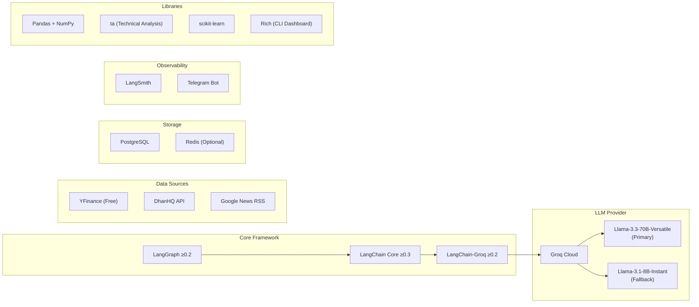

# 1. Introduction

> **📌 v2.1 hardening note.** These design docs describe the core architecture. Since they were
> written, the system gained: a **FinOps** layer (token/cost budgets + alerts), a **profit-target
> goal engine**, execution safety (a unified `ExecutionService` with **order idempotency** + a
> **shadow mode**, gated live fill-lifecycle + broker reconciliation), realistic paper costs
> (slippage + fees), a **closed** learn-from-losses loop, evidence-based signal confidence, and
> risk-based position sizing. See the README's "What's New (v2.1)" and `CLAUDE.md` for the
> current shape. Real broker orders are only ever sent with `ALLOW_LIVE_ORDERS=true`.

## Overview

**RakshaQuant TradingAgent** is an **Agentic Paper Trading System** engineered for the **Indian National Stock Exchange (NSE)**. Unlike traditional algorithmic trading systems that rely on deterministic, hard-coded rules, TradingAgent separates *thinking (decision-making)* from *execution* by modeling real-world trading desk roles — Portfolio Manager, Trader, Risk Manager, and Analyst — through an **ensemble of AI Agents** orchestrated by **LangGraph**.

The core philosophy is to implement a **learning feedback loop** combined with **full observability**, enabling the AI to learn from post-trade outcomes without retraining the underlying language models. Memory lessons from past mistakes are semantically injected into future agent contexts, allowing the system to avoid repeating errors.

---

## Key Differentiators

| Feature | Traditional Algo-Trading | TradingAgent (Agentic AI) |
|---|---|---|
| Decision Logic | Hard-coded rules | LLM-powered multi-agent reasoning |
| Adaptability | Static | Learns from past mistakes via Memory Loop |
| Market Regime Awareness | Manual tuning | AI-classified regime detection |
| Risk Management | Fixed thresholds | AI-enforced with kill switches + capital controls |
| Observability | Logs | Full LangSmith tracing of every decision |
| News Integration | None/Manual | Automated sentiment analysis via NLP |

---

## Technology Stack



---

## How It Works: End-to-End Flow

The system operates in **trading cycles**. Each cycle follows a deterministic pipeline enriched by AI decision-making at key junctures:

```mermaid
flowchart TD
    A["🔄 Trading Cycle Begins"] --> B["📊 Market Data Ingestion<br/>(YFinance / DhanHQ / WebSocket)"]
    B --> C["📈 Technical Indicator Computation<br/>(EMA, RSI, MACD, Bollinger Bands)"]
    C --> D["⚡ Baseline Signal Generation<br/>(Deterministic crossover/breakout rules)"]
    D --> E["🧠 Support Agents Execute"]

    subgraph support["Support Agents (Information Gathering)"]
        E1["📰 News Analyst<br/>Scrapes financial news, computes sentiment"]
        E2["🎭 Sentiment Agent<br/>Aggregates market mood indicators"]
        E3["🔮 Prediction Agent<br/>ML-based price direction prediction"]
    end
    E --> E1 & E2 & E3

    E1 & E2 & E3 --> F["🏔️ Market Regime Detection<br/>(Bull / Bear / Ranging / Volatile)"]
    F -->|"Confidence < 0.3<br/>or Kill Switch"| ABORT["🛑 Cycle Aborted"]
    F -->|"Confidence ≥ 0.3"| G["📋 Strategy Selection<br/>(Pick strategies for current regime)"]
    G --> H["✅ Signal Validation<br/>(Filter weak signals via LLM + memory)"]
    H -->|"No valid signals"| ABORT2["🛑 No Trades"]
    H -->|"Valid signals exist"| I["🛡️ Risk & Compliance Check<br/>(Position sizing, exposure limits, stop losses)"]
    I --> J["💼 Execution<br/>(Paper Engine / DhanHQ Broker)"]
    J --> K["📓 Trade Journal<br/>(PostgreSQL logging)"]
    K --> L["🔍 Post-Trade Analysis<br/>(MAE/MFE computation, win/loss)"]
    L --> M["🧩 Mistake Classification<br/>(LLM categorizes errors)"]
    M --> N["💾 Memory Injection<br/>(Lessons stored in Vector DB)"]
    N -->|"Next Cycle"| A

    style support fill:#1a1a2e,stroke:#e94560,stroke-width:2px
    style ABORT fill:#ff4444,stroke:#cc0000,color:#fff
    style ABORT2 fill:#ff8800,stroke:#cc6600,color:#fff
```



---

## Detailed Step-by-Step Walkthrough

### Step 1: Market Data & Pre-processing (Deterministic)
The system ingests real-time or historical OHLCV (Open, High, Low, Close, Volume) data using providers like **YFinance** (free tier) or **DhanHQ APIs** (broker tier). The `MarketDataManager` orchestrates data feeds, computes technical indicators (EMA-9/21, RSI-14, MACD, Bollinger Bands, ATR, VWAP), and generates baseline deterministic signals through crossover and breakout detection.

### Step 2: Support Agents Execution (Information Gathering)
When a trading cycle runs, three **Support Agents** wake up sequentially with graceful failure handling:
- **News Analyst Agent** (`NewsAnalyst`): Scrapes Google News RSS feeds for financial headlines related to tracked NSE stocks. Uses LLM-powered NLP to compute per-article sentiment scores (-1 to +1) and aggregates them.
- **Sentiment Agent** (`sentiment_analysis_node`): Analyzes broader market mood using technical indicators and news data. Classifies the overall market sentiment as bullish, bearish, or neutral.
- **Prediction Agent** (`prediction_node`): Employs machine learning models (Linear Regression, Random Forest via scikit-learn) trained on technical indicators to predict short-term price direction and magnitude.

These agents enrich the shared `TradingState` dictionary for downstream decision-makers.

### Step 3: Market Regime Detection
The **Market Regime Agent** (`market_regime_node`) evaluates market statistics, volatility, and support agent findings to classify the current environment:
- `trending_up` — Strong bullish trend
- `trending_down` — Bearish decline
- `ranging` — Sideways / consolidation
- `volatile` — High volatility regime

If confidence is too low (< 0.3) or a **kill switch** is triggered (daily loss exceeds limits), the cycle immediately aborts.

### Step 4: Strategy Selection
The **Strategy Selection Agent** (`strategy_selection_node`) decides which trading strategies to deploy for this cycle. It considers:
- Current market regime
- Historical agent memory (what worked in similar regimes before)
- Available capital and existing positions

### Step 5: Signal Validation
Deterministic signals from the technical indicators are evaluated by the **Signal Validation Agent** (`signal_validation_node`). It cross-references signals against:
- Chosen active strategies
- Current market regime
- Prediction agent forecasts
- Past memory lessons

Valid signals are accepted; weak or contradictory signals are discarded. If no signals pass validation, the cycle terminates.

### Step 6: Risk & Compliance Check
Before execution, the **Risk & Compliance Agent** (`risk_compliance_node`) acts as the firm's strict gatekeeper:
- Checks capital exposure limits (max 10% per position)
- Enforces drawdown rules (2% risk per trade)
- Validates trade frequency constraints (max 50/day)
- Assigns appropriate position sizing
- Sets stop-loss and take-profit levels
- Checks sector exposure (max 30% per sector)

### Step 7: Execution & Journaling
Approved orders are forwarded to the **Execution Adapter**:
- **Paper Engine** (`PaperTradingEngine`): Simulates order fills with realistic slippage
- **Dhan Adapter** (`DhanAdapter`): Connects to live DhanHQ broker API

Every trade is logged meticulously in the **Trade Journal** database (PostgreSQL).

### Step 8: Feedback & Learning Loop
Post-trade, the system:
1. **Analyzes** whether the trade won or lost, computing MAE (Maximum Adverse Excursion) and MFE (Maximum Favorable Excursion)
2. **Classifies** mistakes using LLM (e.g., "Overtrading in a choppy regime", "Ignored bearish divergence")
3. **Injects** actionable lessons back into the agents' memory (PostgreSQL with embeddings)
4. In the next cycle, relevant lessons are **semantically retrieved** and injected into the `TradingState` context

---

## Project Structure

```
TradingAgent/
├── src/                          # Main source code package
│   ├── agents/                   # LangGraph agent orchestration
│   │   ├── graph.py              # StateGraph workflow compiler
│   │   ├── state.py              # TradingState TypedDict schema
│   │   ├── market_regime.py      # Market regime classification agent
│   │   ├── strategy_selection.py # Strategy selection agent
│   │   ├── signal_validation.py  # Signal validation agent
│   │   ├── risk_compliance.py    # Risk & compliance agent
│   │   ├── news_analyst.py       # News sentiment analysis agent
│   │   ├── sentiment.py          # Market mood analysis agent
│   │   └── prediction.py         # Price prediction agent
│   ├── market/                   # Market data & analysis
│   │   ├── manager.py            # MarketDataManager orchestrator
│   │   ├── data_feed.py          # Abstract data feed interface
│   │   ├── yfinance_feed.py      # YFinance data provider
│   │   ├── live_data.py          # Live market data handler
│   │   ├── websocket_feed.py     # WebSocket real-time feed
│   │   ├── simulated_data.py     # Simulated market data generator
│   │   ├── history_manager.py    # Historical data management
│   │   ├── indicators.py         # Technical indicator computations
│   │   ├── signals.py            # Signal generation engine
│   │   ├── sizing.py             # Position sizing calculator
│   │   └── stock_discovery.py    # Stock universe screening
│   ├── execution/                # Order execution layer
│   │   ├── adapter.py            # Broker interface adapter (DhanHQ)
│   │   ├── paper_engine.py       # Local paper trading engine
│   │   ├── exit_manager.py       # Stop-loss & take-profit manager
│   │   └── journal.py            # Trade journal database
│   ├── memory/                   # Learning & feedback system
│   │   ├── database.py           # Memory database (PostgreSQL)
│   │   ├── analyzer.py           # Post-trade performance analysis
│   │   ├── classifier.py         # Mistake classification (LLM)
│   │   ├── injection.py          # Memory lesson injection
│   │   ├── performance_tracker.py# Strategy performance tracking
│   │   └── scheduler.py          # Memory maintenance scheduler
│   ├── config/                   # Configuration management
│   │   └── settings.py           # Pydantic settings (env vars)
│   ├── dashboard/                # Terminal UI
│   │   └── cli.py                # Rich-powered CLI dashboard
│   ├── notifications/            # Alert system
│   │   └── telegram.py           # Telegram bot notifications
│   ├── observability/            # Tracing & monitoring
│   │   └── tracing.py            # LangSmith integration
│   ├── api/                      # HTTP API
│   │   └── health.py             # Health check endpoints
│   └── utils/                    # Shared utilities
│       ├── cache.py              # In-memory & Redis caching
│       ├── circuit_breaker.py    # Circuit breaker pattern
│       ├── errors.py             # Custom exception hierarchy
│       ├── events.py             # Event bus system
│       └── rate_limiter.py       # API rate limiting
├── scripts/                      # Entry point scripts
│   ├── run_live_trading.py       # Full live trading runner
│   ├── run_trading.py            # Basic trading runner
│   ├── run_with_dashboard.py     # Trading with CLI dashboard
│   ├── check_config.py           # Configuration validator
│   ├── diagnose_risk.py          # Risk diagnostics
│   └── test_dhan_connection.py   # DhanHQ connection tester
├── tests/                        # Test suite
├── docs/                         # Documentation (you are here)
├── AgentContext/                  # Agent context files
├── pyproject.toml                # Project metadata & dependencies
└── .env                          # Environment variables
```
