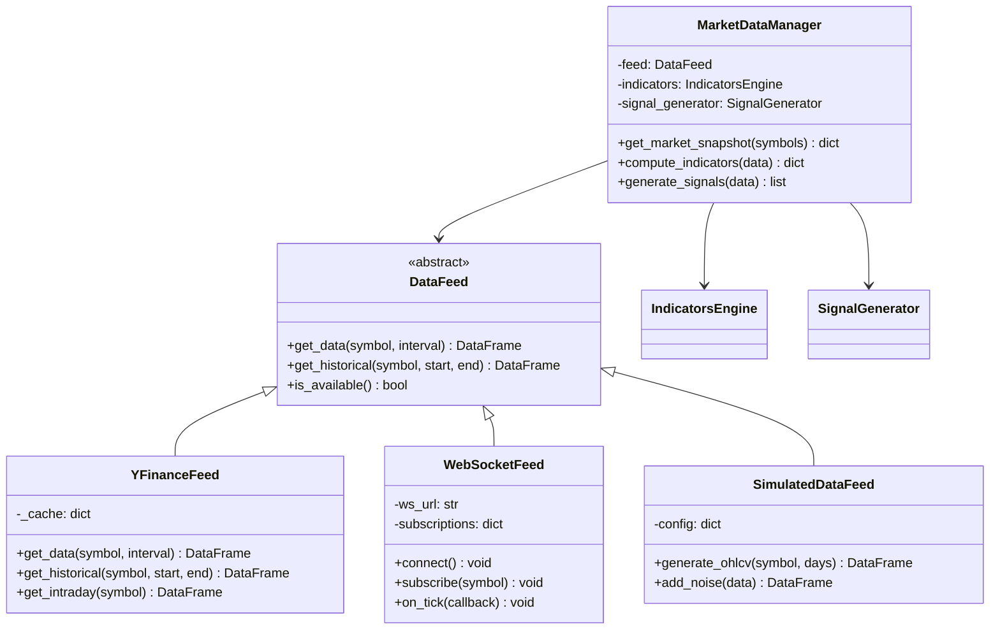
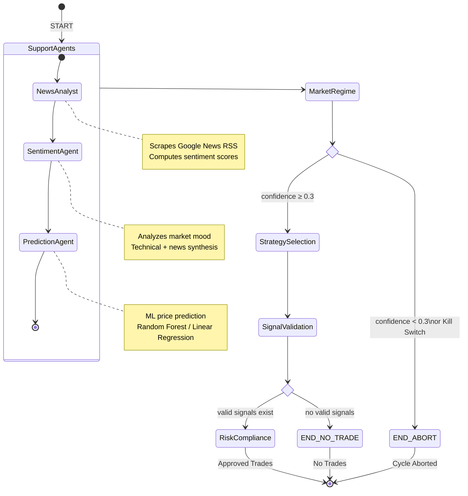
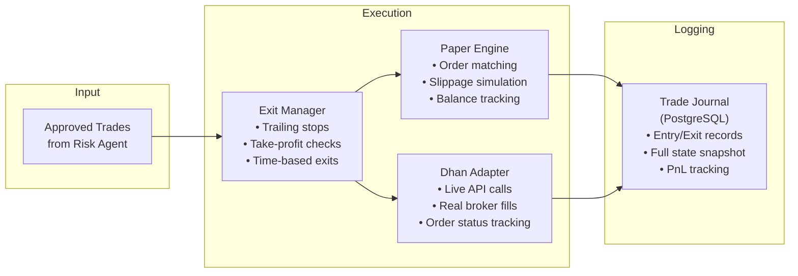
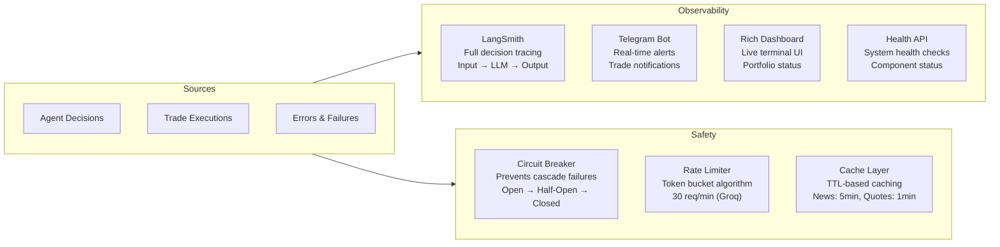
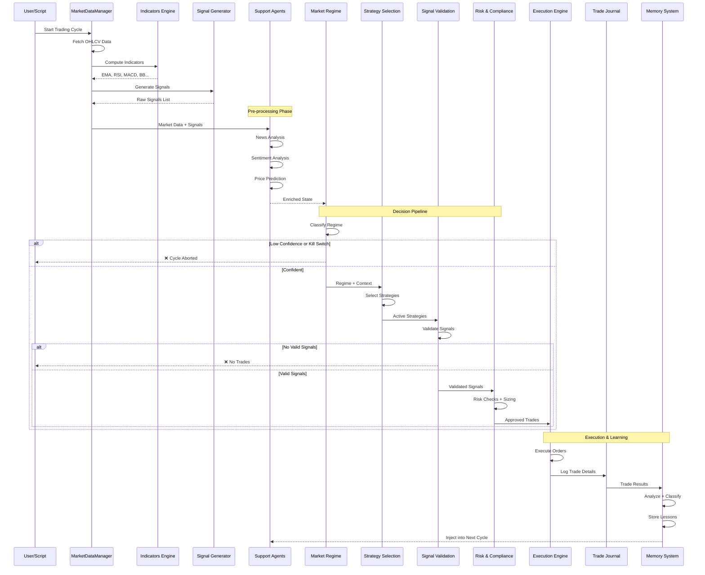
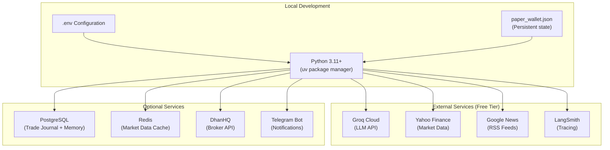

# 2. High-Level Design (HLD)

## Architecture Overview

The TradingAgent follows a **decoupled, layered micro-architecture** pattern orchestrating AI via LangGraph state machines. The system is organized into **six primary layers**, each with distinct responsibilities and well-defined interfaces.

```mermaid
graph TB
    subgraph Layer1["Layer 1: Data Ingestion & Market Layer"]
        direction LR
        YF["YFinance Feed<br/><code>yfinance_feed.py</code>"]
        WS["WebSocket Feed<br/><code>websocket_feed.py</code>"]
        SIM["Simulated Feed<br/><code>simulated_data.py</code>"]
        LIVE["Live Data<br/><code>live_data.py</code>"]
        DF["Data Feed<br/>(Abstract Interface)<br/><code>data_feed.py</code>"]
        YF & WS & SIM & LIVE --> DF
    end

    subgraph Layer2["Layer 2: Analysis & Signal Generation"]
        direction LR
        IND["Indicators Engine<br/><code>indicators.py</code>"]
        SIG["Signal Generator<br/><code>signals.py</code>"]
        SZ["Position Sizing<br/><code>sizing.py</code>"]
        SD["Stock Discovery<br/><code>stock_discovery.py</code>"]
        MDM["Market Data Manager<br/><code>manager.py</code>"]
        IND --> SIG
        MDM --- IND & SIG & SZ & SD
    end

    subgraph Layer3["Layer 3: Agentic Decision Layer (LangGraph)"]
        direction TB
        subgraph support["Support Agents (Parallel Pre-processing)"]
            NA["📰 News Analyst"]
            SA["🎭 Sentiment Agent"]
            PA["🔮 Prediction Agent"]
        end
        MR["🏔️ Market Regime Agent"]
        SS["📋 Strategy Selection Agent"]
        SV["✅ Signal Validation Agent"]
        RC["🛡️ Risk & Compliance Agent"]

        support --> MR --> SS --> SV --> RC
    end

    subgraph Layer4["Layer 4: Execution & Order Management"]
        direction LR
        PE["Paper Engine<br/><code>paper_engine.py</code>"]
        DA["Dhan Adapter<br/><code>adapter.py</code>"]
        EM["Exit Manager<br/><code>exit_manager.py</code>"]
        TJ["Trade Journal<br/><code>journal.py</code>"]
    end

    subgraph Layer5["Layer 5: Memory & Feedback Intelligence"]
        direction LR
        AN["Post-Trade Analyzer<br/><code>analyzer.py</code>"]
        CL["Mistake Classifier<br/><code>classifier.py</code>"]
        DB["Memory Database<br/><code>database.py</code>"]
        INJ["Memory Injection<br/><code>injection.py</code>"]
        PT["Performance Tracker<br/><code>performance_tracker.py</code>"]
        SCH["Memory Scheduler<br/><code>scheduler.py</code>"]
    end

    subgraph Layer6["Layer 6: Observability & Infrastructure"]
        direction LR
        LS["LangSmith Tracing<br/><code>tracing.py</code>"]
        TG["Telegram Alerts<br/><code>telegram.py</code>"]
        DASH["CLI Dashboard<br/><code>cli.py</code>"]
        HE["Health API<br/><code>health.py</code>"]
        CB["Circuit Breaker"]
        RL["Rate Limiter"]
        CA["Cache System"]
    end

    Layer1 -->|"OHLCV Data"| Layer2
    Layer2 -->|"Indicators + Signals"| Layer3
    Layer3 -->|"Approved Trades"| Layer4
    Layer4 -->|"Trade Results"| Layer5
    Layer5 -->|"Memory Lessons"| Layer3
    Layer3 & Layer4 --> Layer6

    style Layer1 fill:#0d1117,stroke:#58a6ff,stroke-width:2px,color:#c9d1d9
    style Layer2 fill:#0d1117,stroke:#3fb950,stroke-width:2px,color:#c9d1d9
    style Layer3 fill:#0d1117,stroke:#e94560,stroke-width:2px,color:#c9d1d9
    style Layer4 fill:#0d1117,stroke:#f0883e,stroke-width:2px,color:#c9d1d9
    style Layer5 fill:#0d1117,stroke:#d2a8ff,stroke-width:2px,color:#c9d1d9
    style Layer6 fill:#0d1117,stroke:#8b949e,stroke-width:2px,color:#c9d1d9
```

---

## Layer 1: Data Ingestion & Market Layer (Deterministic)

This layer is responsible for all market data acquisition. It implements the **Strategy Pattern** via an abstract `DataFeed` interface with multiple concrete providers:

| Provider | File | Purpose | Cost |
|---|---|---|---|
| `YFinanceFeed` | `yfinance_feed.py` | Historical & intraday NSE data via Yahoo Finance | Free |
| `WebSocketFeed` | `websocket_feed.py` | Real-time streaming via DhanHQ WebSocket | Requires account |
| `SimulatedDataFeed` | `simulated_data.py` | Synthetic data for testing (GBM model) | Free |
| `LiveDataProvider` | `live_data.py` | Live data polling with retry logic | Depends on source |
| `HistoryManager` | `history_manager.py` | Historical data caching & management | Free |

The `MarketDataManager` (`manager.py`) orchestrates all data providers, indicator computation, and signal generation in a single unified interface.

---

## Layer 2: Analysis & Signal Generation (Deterministic)

This layer transforms raw OHLCV data into actionable trading signals using quantitative analysis:

### Indicators Computed
| Indicator | Parameters | Purpose |
|---|---|---|
| EMA (Exponential Moving Average) | 9, 21 periods | Trend direction |
| RSI (Relative Strength Index) | 14 periods | Overbought/oversold detection |
| MACD | 12, 26, 9 | Momentum & trend changes |
| Bollinger Bands | 20, 2σ | Volatility & mean reversion |
| ATR (Average True Range) | 14 periods | Volatility measurement |
| VWAP | Intraday | Fair value benchmark |
| Stochastic | 14, 3, 3 | Momentum oscillator |
| ADX | 14 periods | Trend strength |

### Signal Types Generated
- **EMA Crossover** — EMA-9 crosses EMA-21 (Golden Cross / Death Cross)
- **RSI Extreme** — RSI enters overbought (>70) or oversold (<30) zones
- **MACD Signal** — MACD line crosses signal line
- **Bollinger Breakout** — Price breaks above/below Bollinger Bands
- **Volume Spike** — Unusual volume activity (>2× average)

---

## Layer 3: Agentic Decision Layer (LangGraph Orchestration)

This is the **core intelligence layer** powered by LangGraph. It maintains a global `TradingState` (TypedDict) that acts as a **blackboard** where specialized agents post their inferences.

### Agent Roles

| Agent | Role Analogy | Responsibility |
|---|---|---|
| News Analyst | Research Analyst | Scrapes news, computes sentiment |
| Sentiment Agent | Market Psychologist | Aggregates market mood indicators |
| Prediction Agent | Quantitative Analyst | ML-based price direction prediction |
| Market Regime | Chief Strategist | Classifies market environment |
| Strategy Selection | Portfolio Manager | Chooses trading strategies |
| Signal Validation | Senior Trader | Filters & validates signals |
| Risk & Compliance | Risk Manager | Final gatekeeper, position sizing |

---

## Layer 4: Execution & Order Management

This layer handles the actual execution of approved trades and maintains a complete audit trail.

### Execution Modes

| Mode | Engine | Description |
|---|---|---|
| `local_paper` | `PaperTradingEngine` | Fully offline simulation with slippage modeling |
| `dhan_paper` | `DhanAdapter` | DhanHQ sandbox (requires account) |
| `live` | `DhanAdapter` | Real money trading via DhanHQ |

---

## Layer 5: Memory & Feedback Intelligence

This is the **learning engine** that differentiates TradingAgent from traditional systems. It forms a closed feedback loop:

```mermaid
flowchart TB
    subgraph "Post-Trade Analysis Pipeline"
        T["Completed Trade<br/>(from Journal)"]
        A["📊 Trade Analyzer<br/>Computes MAE, MFE,<br/>win/loss ratio, duration"]
        C["🧩 Mistake Classifier<br/>LLM categorizes error:<br/>• regime_mismatch<br/>• overtrading<br/>• poor_timing<br/>• ignored_signal<br/>• wrong_sizing"]
        D["💾 Memory Database<br/>Stores lessons with:<br/>• Embeddings (vector)<br/>• Category & severity<br/>• Context metadata<br/>• Timestamp for decay"]
    end

    subgraph "Pre-Trade Injection Pipeline"
        Q["🔍 Semantic Query<br/>Current regime + strategy<br/>→ similarity search"]
        R["📋 Top-N Lessons<br/>Ranked by relevance<br/>(N=5 default)"]
        I["💉 State Injection<br/>Lessons inserted into<br/>TradingState.memory_lessons"]
    end

    T --> A --> C --> D
    D --> Q --> R --> I
    I -->|"Injected into next<br/>trading cycle"| AGENTS["🧠 Decision Agents"]

    style D fill:#1a1a2e,stroke:#d2a8ff,stroke-width:2px
```

---

## Layer 6: Observability & Infrastructure

### Observability Stack

### Infrastructure Components

| Component | File | Pattern | Purpose |
|---|---|---|---|
| Circuit Breaker | `circuit_breaker.py` | State Machine | Prevents API spam during outages |
| Rate Limiter | `rate_limiter.py` | Token Bucket | Controls request throughput |
| Cache | `cache.py` | TTL Cache | Deduplicates API calls |
| Event Bus | `events.py` | Pub/Sub | Decoupled component communication |
| Error Hierarchy | `errors.py` | Exception Chain | Structured error handling |

---

## Context Flow Diagram

This diagram shows how data flows through the entire system in a single trading cycle:

---

## Deployment Architecture

