# 3. Low-Level Design (LLD)

This document provides a deep-dive into the code-level architecture, class relationships, interface contracts, data structures, and module interactions of the TradingAgent system.

---

## Table of Contents

1. [Core State Architecture](#core-state-architecture)
2. [LangGraph Workflow Engine](#langgraph-workflow-engine)
3. [Agent Node Architecture](#agent-node-architecture)
4. [Market Data Pipeline](#market-data-pipeline)
5. [Signal Generation Engine](#signal-generation-engine)
6. [Execution Layer](#execution-layer)
7. [Memory & Learning Pipeline](#memory--learning-pipeline)
8. [Infrastructure Utilities](#infrastructure-utilities)

---

## Core State Architecture

The entire system revolves around the `TradingState` TypedDict — a shared blackboard pattern that all agents read from and write to.

### TradingState Schema

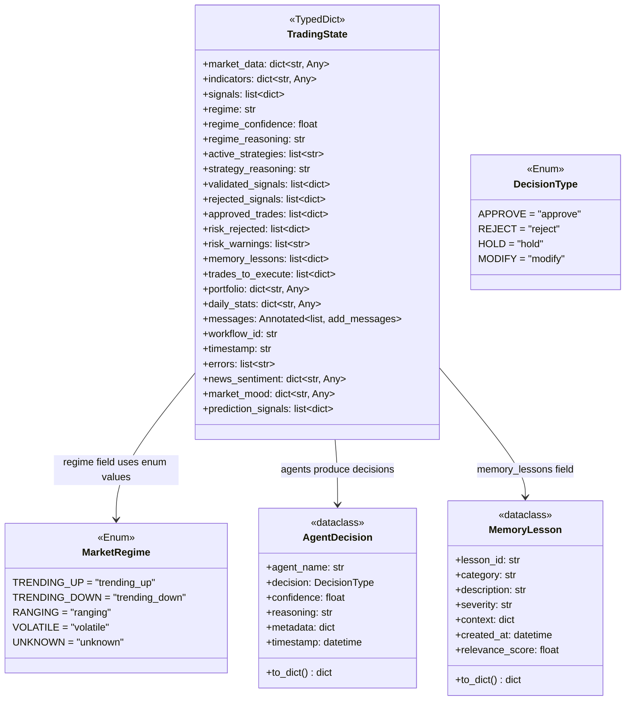
```mermaid
classDiagram
    class TradingState {
        <<TypedDict>>
        +market_data: dict~str, Any~
        +indicators: dict~str, Any~
        +signals: list~dict~
        +regime: str
        +regime_confidence: float
        +regime_reasoning: str
        +active_strategies: list~str~
        +strategy_reasoning: str
        +validated_signals: list~dict~
        +rejected_signals: list~dict~
        +approved_trades: list~dict~
        +risk_rejected: list~dict~
        +risk_warnings: list~str~
        +memory_lessons: list~dict~
        +trades_to_execute: list~dict~
        +portfolio: dict~str, Any~
        +daily_stats: dict~str, Any~
        +messages: Annotated~list, add_messages~
        +workflow_id: str
        +timestamp: str
        +errors: list~str~
        +news_sentiment: dict~str, Any~
        +market_mood: dict~str, Any~
        +prediction_signals: list~dict~
    }

    class MarketRegime {
        <<Enum>>
        TRENDING_UP = "trending_up"
        TRENDING_DOWN = "trending_down"
        RANGING = "ranging"
        VOLATILE = "volatile"
        UNKNOWN = "unknown"
    }

    class DecisionType {
        <<Enum>>
        APPROVE = "approve"
        REJECT = "reject"
        HOLD = "hold"
        MODIFY = "modify"
    }

    class AgentDecision {
        <<dataclass>>
        +agent_name: str
        +decision: DecisionType
        +confidence: float
        +reasoning: str
        +metadata: dict
        +timestamp: datetime
        +to_dict() dict
    }

    class MemoryLesson {
        <<dataclass>>
        +lesson_id: str
        +category: str
        +description: str
        +severity: str
        +context: dict
        +created_at: datetime
        +relevance_score: float
        +to_dict() dict
    }

    TradingState --> MarketRegime : regime field uses enum values
    TradingState --> AgentDecision : agents produce decisions
    TradingState --> MemoryLesson : memory_lessons field
```

### State Field Ownership

This diagram shows which agent writes to which state fields:

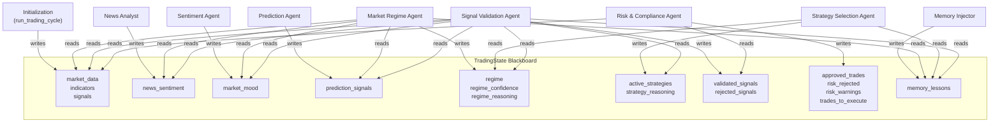
```mermaid
flowchart TD
    subgraph "TradingState Blackboard"
        direction TB
        MD["market_data<br/>indicators<br/>signals"]
        NS["news_sentiment"]
        MM["market_mood"]
        PS["prediction_signals"]
        REG["regime<br/>regime_confidence<br/>regime_reasoning"]
        STRAT["active_strategies<br/>strategy_reasoning"]
        VSIG["validated_signals<br/>rejected_signals"]
        RISK["approved_trades<br/>risk_rejected<br/>risk_warnings<br/>trades_to_execute"]
        MEM["memory_lessons"]
    end

    INIT["Initialization<br/>(run_trading_cycle)"] -->|writes| MD
    NEWS["News Analyst"] -->|writes| NS
    SENT["Sentiment Agent"] -->|writes| MM
    PRED["Prediction Agent"] -->|writes| PS
    REGIME["Market Regime Agent"] -->|writes| REG
    STRATEGY["Strategy Selection Agent"] -->|writes| STRAT
    SIGNAL["Signal Validation Agent"] -->|writes| VSIG
    RISKAG["Risk & Compliance Agent"] -->|writes| RISK
    MEMORY["Memory Injector"] -->|writes| MEM

    REGIME -->|reads| MD & NS & MM & PS & MEM
    STRATEGY -->|reads| REG & MEM
    SIGNAL -->|reads| MD & REG & STRAT & PS & NS & MM & MEM
    RISKAG -->|reads| VSIG & MD
```

### Initial State Factory

```python
# create_initial_state(workflow_id: str | None = None) -> TradingState
# Generates: "WF-{datetime}" as workflow_id if not provided
# Default portfolio capital: 1,000,000 INR
# All lists empty, all dicts empty, regime = "unknown"
```

---

## LangGraph Workflow Engine

The `graph.py` module compiles a LangGraph `StateGraph` that defines the agent pipeline with conditional branching.

### Graph Compilation


```mermaid
graph TD
    START((START))
    SA["support_agents_node<br/><i>Runs: news, sentiment, prediction</i><br/><i>Sequential with graceful failure</i>"]
    MR["market_regime_node<br/><i>LLM: Groq Llama-3.3-70B</i><br/><i>Fallback: rule-based</i>"]
    SS["strategy_selection_node<br/><i>LLM: Groq Llama-3.3-70B</i><br/><i>Fallback: regime-mapping</i>"]
    SV["signal_validation_node<br/><i>LLM: Groq Llama-3.3-70B</i><br/><i>Fallback: confidence threshold</i>"]
    RC["risk_compliance_node<br/><i>Purely deterministic</i><br/><i>12 risk rule checks</i>"]
    END_NODE((END))

    START --> SA
    SA --> MR
    MR -->|"should_continue_after_regime"| COND1{{"Confidence ≥ 0.3<br/>AND no Kill Switch?"}}
    COND1 -->|Yes| SS
    COND1 -->|No| END_NODE
    SS --> SV
    SV -->|"should_continue_after_validation"| COND2{{"Has validated<br/>signals?"}}
    COND2 -->|Yes| RC
    COND2 -->|No| END_NODE
    RC --> END_NODE

    style SA fill:#1a1a2e,stroke:#e94560
    style MR fill:#1a1a2e,stroke:#58a6ff
    style SS fill:#1a1a2e,stroke:#3fb950
    style SV fill:#1a1a2e,stroke:#f0883e
    style RC fill:#1a1a2e,stroke:#d2a8ff
```

### Key Functions in `graph.py`

| Function | Signature | Purpose |
|---|---|---|
| `_news_analyst_node` | `(state: dict) → dict` | Wrapper for class-based `NewsAnalyst`. Handles async/sync context detection. Returns `{news_sentiment, news_headlines}` |
| `support_agents_node` | `(state: TradingState) → TradingState` | Runs 3 support agents sequentially (news → sentiment → prediction) with `try/except` per agent |
| `should_continue_after_regime` | `(state) → "strategy_selection" \| "end"` | Checks `check_kill_switch()` and `regime_confidence ≥ 0.3` |
| `should_continue_after_validation` | `(state) → "risk_compliance" \| "end"` | Checks `len(validated_signals) > 0` |
| `create_trading_graph` | `(checkpointer, with_memory, include_support_agents) → StateGraph` | Main graph builder. Uses `MemorySaver` by default |
| `run_trading_cycle` | `async (graph, market_data, indicators, signals, ...) → TradingState` | Populates initial state, calls `graph.ainvoke()`, logs results |
| `get_graph_visualization` | `(graph) → str` | Returns Mermaid diagram of the compiled graph |

### Thread Configuration

```python
config = {
    "configurable": {
        "thread_id": thread_id,  # Default: "default"
    },
    "metadata": {
        "workflow_type": "trading_cycle",
        "signals_count": len(signals),
    },
}
```

---

## Agent Node Architecture

Every agent follows a consistent pattern with LLM + fallback:

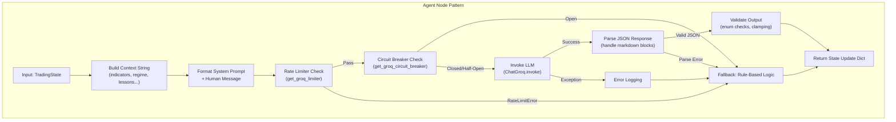
```mermaid
flowchart TD
    subgraph "Agent Node Pattern"
        IN["Input: TradingState"]
        CTX["Build Context String<br/>(indicators, regime, lessons...)"]
        PROMPT["Format System Prompt<br/>+ Human Message"]
        RL["Rate Limiter Check<br/>(get_groq_limiter)"]
        CB["Circuit Breaker Check<br/>(get_groq_circuit_breaker)"]
        LLM["Invoke LLM<br/>(ChatGroq.invoke)"]
        PARSE["Parse JSON Response<br/>(handle markdown blocks)"]
        VAL["Validate Output<br/>(enum checks, clamping)"]
        OUT["Return State Update Dict"]
        FB["Fallback: Rule-Based Logic"]
        ERR["Error Logging"]
    end

    IN --> CTX --> PROMPT --> RL
    RL -->|"Pass"| CB
    RL -->|"RateLimitError"| FB
    CB -->|"Open"| FB
    CB -->|"Closed/Half-Open"| LLM
    LLM -->|"Success"| PARSE
    LLM -->|"Exception"| ERR --> FB
    PARSE -->|"Valid JSON"| VAL --> OUT
    PARSE -->|"Parse Error"| FB
    FB --> OUT
```

### Agent Details

#### Market Regime Agent (`market_regime.py`)

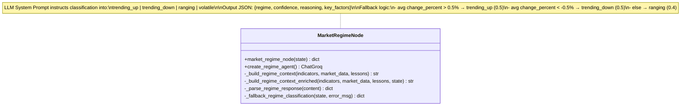
```mermaid
classDiagram
    class MarketRegimeNode {
        +market_regime_node(state) dict
        +create_regime_agent() ChatGroq
        -_build_regime_context(indicators, market_data, lessons) str
        -_build_regime_context_enriched(indicators, market_data, lessons, state) str
        -_parse_regime_response(content) dict
        -_fallback_regime_classification(state, error_msg) dict
    }

    note for MarketRegimeNode "LLM System Prompt instructs classification into:\ntrending_up | trending_down | ranging | volatile\n\nOutput JSON: {regime, confidence, reasoning, key_factors}\n\nFallback logic:\n- avg change_percent > 0.5% → trending_up (0.5)\n- avg change_percent < -0.5% → trending_down (0.5)\n- else → ranging (0.4)"
```

**Context String Components:**
- Technical indicators: ADX, +DI, -DI, RSI, SMA-20/50, ATR, Bollinger Bands
- Price summary: symbol, close, change_percent
- Memory lessons: top 3 `regime_mismatch` category lessons
- Enriched data: news sentiment score + headlines, market mood index + label, ML prediction consensus

**LLM Configuration:**
- Primary: `llama-3.3-70b-versatile`, temp=0.1, max_tokens=1024
- Fallback: `llama-3.1-8b-instant` (on rate limit, with 2s delay)

---

#### News Analyst Agent (`news_analyst.py`)

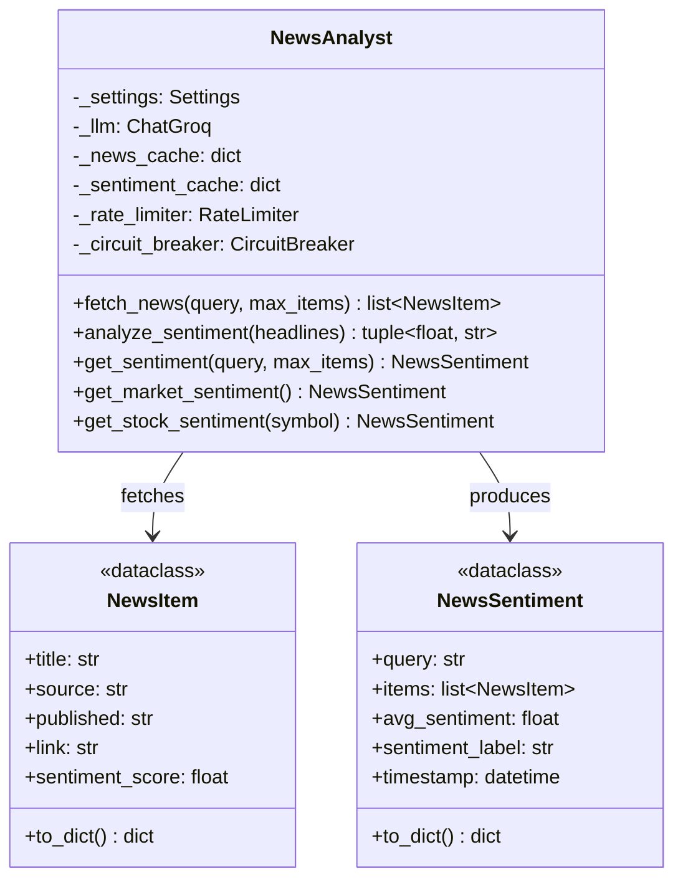
```mermaid
classDiagram
    class NewsItem {
        <<dataclass>>
        +title: str
        +source: str
        +published: str
        +link: str
        +sentiment_score: float
        +to_dict() dict
    }

    class NewsSentiment {
        <<dataclass>>
        +query: str
        +items: list~NewsItem~
        +avg_sentiment: float
        +sentiment_label: str
        +timestamp: datetime
        +to_dict() dict
    }

    class NewsAnalyst {
        -_settings: Settings
        -_llm: ChatGroq
        -_news_cache: dict
        -_sentiment_cache: dict
        -_rate_limiter: RateLimiter
        -_circuit_breaker: CircuitBreaker
        +fetch_news(query, max_items) list~NewsItem~
        +analyze_sentiment(headlines) tuple~float, str~
        +get_sentiment(query, max_items) NewsSentiment
        +get_market_sentiment() NewsSentiment
        +get_stock_sentiment(symbol) NewsSentiment
    }

    NewsAnalyst --> NewsItem : fetches
    NewsAnalyst --> NewsSentiment : produces
```

**Data Source:** Google News RSS (`https://news.google.com/rss/search?q={query}&hl=en-IN&gl=IN&ceid=IN:en`)

**Sentiment Classification:**
- Score ≥ +0.3 → `"bullish"`
- Score ≤ -0.3 → `"bearish"`
- Otherwise → `"neutral"`

---

#### Sentiment Agent (`sentiment.py`)

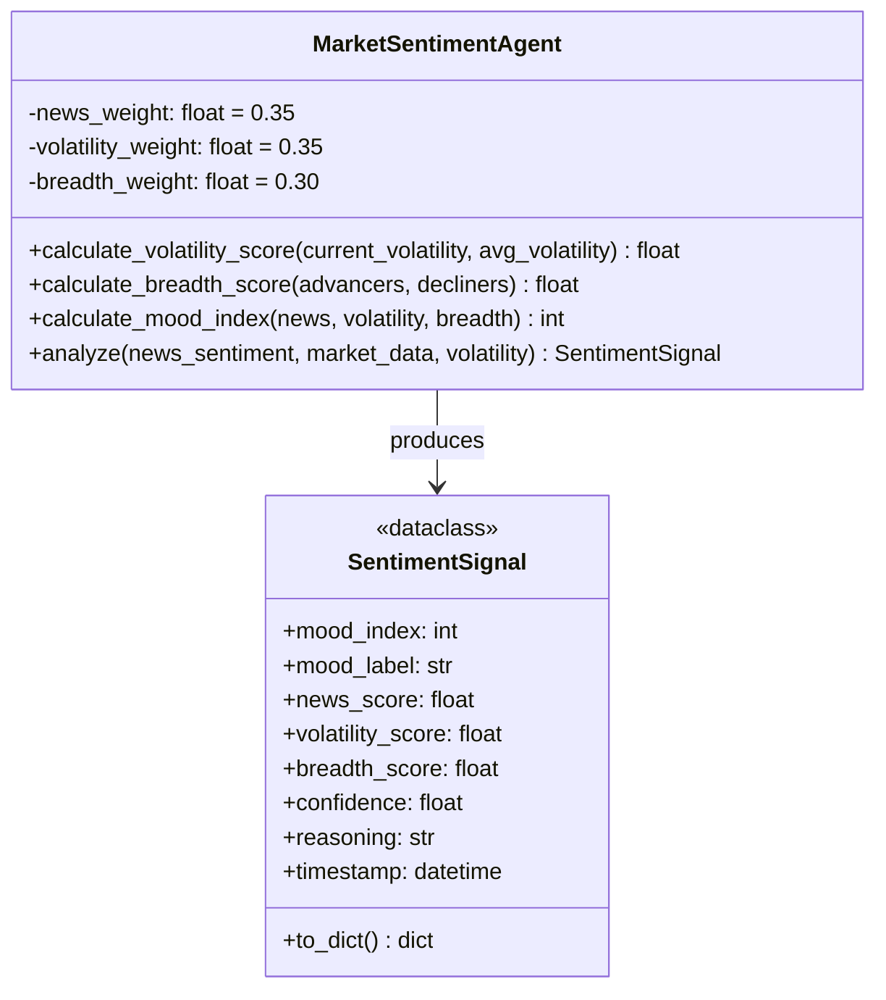
```mermaid
classDiagram
    class SentimentSignal {
        <<dataclass>>
        +mood_index: int
        +mood_label: str
        +news_score: float
        +volatility_score: float
        +breadth_score: float
        +confidence: float
        +reasoning: str
        +timestamp: datetime
        +to_dict() dict
    }

    class MarketSentimentAgent {
        -news_weight: float = 0.35
        -volatility_weight: float = 0.35
        -breadth_weight: float = 0.30
        +calculate_volatility_score(current_volatility, avg_volatility) float
        +calculate_breadth_score(advancers, decliners) float
        +calculate_mood_index(news, volatility, breadth) int
        +analyze(news_sentiment, market_data, volatility) SentimentSignal
    }

    MarketSentimentAgent --> SentimentSignal : produces
```

**Mood Index Formula:**
```
mood_index = (news_normalized × 0.35) + (volatility_score × 0.35) + (breadth_normalized × 0.30)
```

**Mood Labels:**
| Range | Label |
|---|---|
| 0–20 | `extreme_fear` |
| 21–40 | `fear` |
| 41–60 | `neutral` |
| 61–80 | `greed` |
| 81–100 | `extreme_greed` |

---

#### Prediction Agent (`prediction.py`)

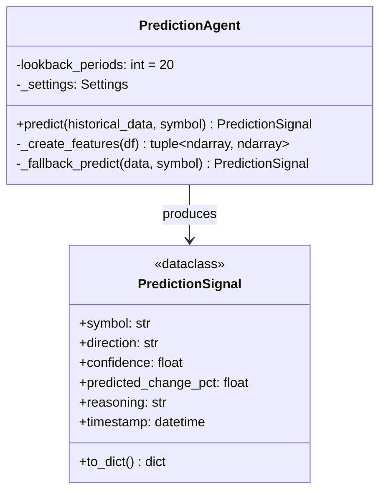
```mermaid
classDiagram
    class PredictionSignal {
        <<dataclass>>
        +symbol: str
        +direction: str
        +confidence: float
        +predicted_change_pct: float
        +reasoning: str
        +timestamp: datetime
        +to_dict() dict
    }

    class PredictionAgent {
        -lookback_periods: int = 20
        -_settings: Settings
        +predict(historical_data, symbol) PredictionSignal
        -_create_features(df) tuple~ndarray, ndarray~
        -_fallback_predict(data, symbol) PredictionSignal
    }

    PredictionAgent --> PredictionSignal : produces
```

**ML Feature Engineering (10 features):**

| Feature | Description |
|---|---|
| `returns_1d` | 1-day price return |
| `returns_2d` | 2-day price return |
| `returns_5d` | 5-day price return |
| `sma_ratio_5_10` | SMA(5) / SMA(10) |
| `sma_ratio_10_20` | SMA(10) / SMA(20) |
| `vol_change` | Volume percent change |
| `vol_ratio` | Volume / 20-day average volume |
| `high_low_range` | (High - Low) / Close |
| `close_position` | (Close - Low) / (High - Low) |
| `rsi_normalized` | RSI / 100 |

**Ensemble Model:**
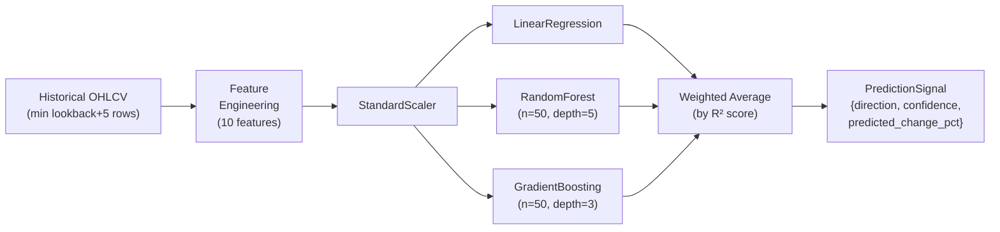
```mermaid
flowchart LR
    DATA["Historical OHLCV<br/>(min lookback+5 rows)"] --> FEAT["Feature<br/>Engineering<br/>(10 features)"]
    FEAT --> SCALE["StandardScaler"]
    SCALE --> LR["LinearRegression"]
    SCALE --> RF["RandomForest<br/>(n=50, depth=5)"]
    SCALE --> GB["GradientBoosting<br/>(n=50, depth=3)"]
    LR & RF & GB --> WEIGHT["Weighted Average<br/>(by R² score)"]
    WEIGHT --> SIG["PredictionSignal<br/>{direction, confidence,<br/>predicted_change_pct}"]
```

**Confidence Calculation:**
```
confidence = (model_agreement + avg_r2_score) / 2 + 0.2
# Clamped to [0.3, 0.9]
```

---

#### Strategy Selection Agent (`strategy_selection.py`)

**Available Strategies:**
| Strategy | Best Regime | Description |
|---|---|---|
| `momentum` | Trending markets | Follows price momentum |
| `mean_reversion` | Ranging markets | Bets on price reverting to mean |
| `breakout` | Low volatility → expanding | Captures volatility breakouts |
| `trend_following` | Established trends (high ADX) | Follows established trends |

**Fallback Regime → Strategy Mapping:**
```python
{
    "trending_up":   ["momentum", "trend_following"],
    "trending_down": ["trend_following"],
    "ranging":       ["mean_reversion"],
    "volatile":      ["breakout"],
    "unknown":       ["trend_following"],
}
```

---

#### Signal Validation Agent (`signal_validation.py`)

**Validation Criteria:**
- Signal alignment with active strategies
- Confidence threshold (≥ 0.6 in fallback)
- Risk:Reward ratio (≥ 1.5 in fallback)
- Regime consistency
- Prediction agreement/contradiction
- Memory lesson adherence

**Output per Signal:**
```json
{
    "signal_id": "SIG-001",
    "decision": "approve|reject",
    "confidence": 0.75,
    "reasoning": "...",
    "modifications": {
        "stop_loss": 1850.0,
        "target_price": 1950.0,
        "position_size_pct": 5.0
    }
}
```

---

#### Risk & Compliance Agent (`risk_compliance.py`)

**This agent is PURELY DETERMINISTIC — no LLM involved.**

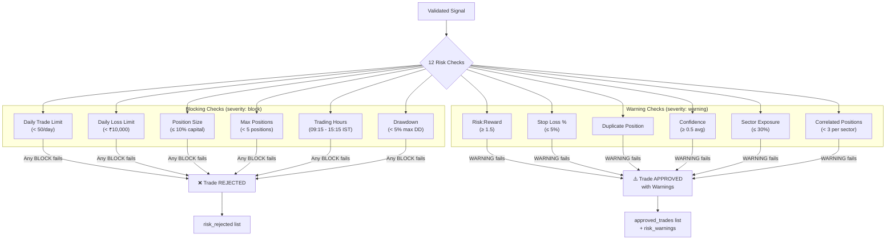
```mermaid
flowchart TD
    INPUT["Validated Signal"] --> CHECKS{"12 Risk Checks"}

    subgraph "Blocking Checks (severity: block)"
        C1["Daily Trade Limit<br/>(< 50/day)"]
        C2["Daily Loss Limit<br/>(< ₹10,000)"]
        C3["Position Size<br/>(≤ 10% capital)"]
        C6["Max Positions<br/>(< 5 positions)"]
        C7["Trading Hours<br/>(09:15 - 15:15 IST)"]
        C8["Drawdown<br/>(< 5% max DD)"]
    end

    subgraph "Warning Checks (severity: warning)"
        C4["Risk:Reward<br/>(≥ 1.5)"]
        C5["Stop Loss %<br/>(≤ 5%)"]
        C9["Duplicate Position"]
        C10["Confidence<br/>(≥ 0.5 avg)"]
        C11["Sector Exposure<br/>(≤ 30%)"]
        C12["Correlated Positions<br/>(< 3 per sector)"]
    end

    CHECKS --> C1 & C2 & C3 & C4 & C5 & C6 & C7 & C8 & C9 & C10 & C11 & C12

    C1 & C2 & C3 & C6 & C7 & C8 -->|"Any BLOCK fails"| REJECT["❌ Trade REJECTED"]
    C4 & C5 & C9 & C10 & C11 & C12 -->|"WARNING fails"| WARN["⚠️ Trade APPROVED<br/>with Warnings"]

    REJECT --> OUT["risk_rejected list"]
    WARN --> OUT2["approved_trades list<br/>+ risk_warnings"]
```

**Kill Switch Function:**
```python
def check_kill_switch(state, limits=None) -> bool:
    """Returns True if:
    - daily P&L loss >= daily_loss_limit
    - max drawdown >= max_drawdown_pct
    """
```

**Sector Mapping:** ~30 NSE stocks mapped to 10 sectors (Banking, IT, Pharma, Auto, Energy, Metals, FMCG, Telecom, Infrastructure, Financial Services)

---

## Market Data Pipeline

### Data Feed Hierarchy

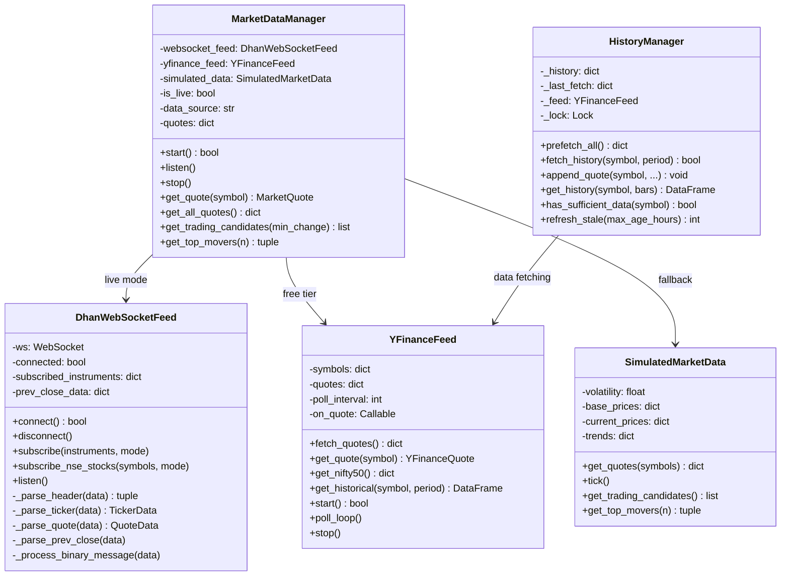
```mermaid
classDiagram
    class MarketDataManager {
        -websocket_feed: DhanWebSocketFeed
        -yfinance_feed: YFinanceFeed
        -simulated_data: SimulatedMarketData
        -is_live: bool
        -data_source: str
        -quotes: dict
        +start() bool
        +listen()
        +stop()
        +get_quote(symbol) MarketQuote
        +get_all_quotes() dict
        +get_trading_candidates(min_change) list
        +get_top_movers(n) tuple
    }

    class DhanWebSocketFeed {
        -ws: WebSocket
        -connected: bool
        -subscribed_instruments: dict
        -prev_close_data: dict
        +connect() bool
        +disconnect()
        +subscribe(instruments, mode)
        +subscribe_nse_stocks(symbols, mode)
        +listen()
        -_parse_header(data) tuple
        -_parse_ticker(data) TickerData
        -_parse_quote(data) QuoteData
        -_parse_prev_close(data)
        -_process_binary_message(data)
    }

    class YFinanceFeed {
        -symbols: dict
        -quotes: dict
        -poll_interval: int
        -on_quote: Callable
        +fetch_quotes() dict
        +get_quote(symbol) YFinanceQuote
        +get_nifty50() dict
        +get_historical(symbol, period) DataFrame
        +start() bool
        +poll_loop()
        +stop()
    }

    class SimulatedMarketData {
        -volatility: float
        -base_prices: dict
        -current_prices: dict
        -trends: dict
        +get_quotes(symbols) dict
        +tick()
        +get_trading_candidates() list
        +get_top_movers(n) tuple
    }

    class HistoryManager {
        -_history: dict
        -_last_fetch: dict
        -_feed: YFinanceFeed
        -_lock: Lock
        +prefetch_all() dict
        +fetch_history(symbol, period) bool
        +append_quote(symbol, ...) void
        +get_history(symbol, bars) DataFrame
        +has_sufficient_data(symbol) bool
        +refresh_stale(max_age_hours) int
    }

    MarketDataManager --> DhanWebSocketFeed : live mode
    MarketDataManager --> YFinanceFeed : free tier
    MarketDataManager --> SimulatedMarketData : fallback
    HistoryManager --> YFinanceFeed : data fetching
```

### Data Source Selection Logic

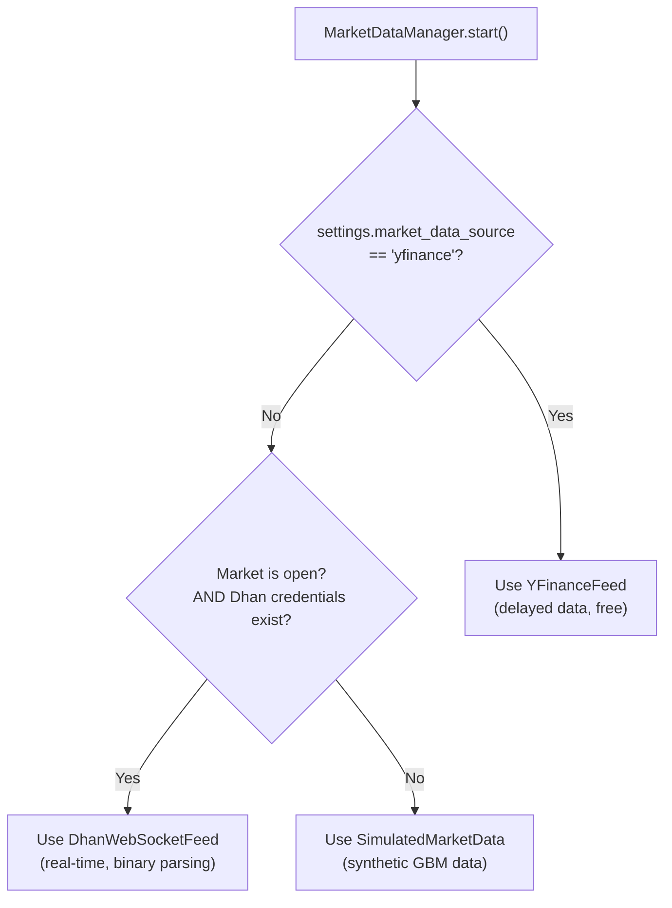
```mermaid
flowchart TD
    START["MarketDataManager.start()"]
    CHK1{"settings.market_data_source<br/>== 'yfinance'?"}
    CHK2{"Market is open?<br/>AND Dhan credentials exist?"}
    
    START --> CHK1
    CHK1 -->|Yes| YF["Use YFinanceFeed<br/>(delayed data, free)"]
    CHK1 -->|No| CHK2
    CHK2 -->|Yes| WS["Use DhanWebSocketFeed<br/>(real-time, binary parsing)"]
    CHK2 -->|No| SIM["Use SimulatedMarketData<br/>(synthetic GBM data)"]
```

### WebSocket Binary Packet Format

```
Header: 8 bytes
├── response_code: 2 bytes (uint16)
├── message_length: 2 bytes (uint16) 
├── exchange_segment: 2 bytes (uint16)
└── security_id: 2 bytes (uint16)

Ticker Data (response_code=2):
└── Payload: last_price (float32), last_trade_time (uint32)

Quote Data (response_code=4):
└── Payload: last_price, last_qty, LTT, avg_price,
             volume, sell_qty, buy_qty, OHLC (all float32/uint32)
```

---

## Signal Generation Engine

### Indicator Computation (`indicators.py`)

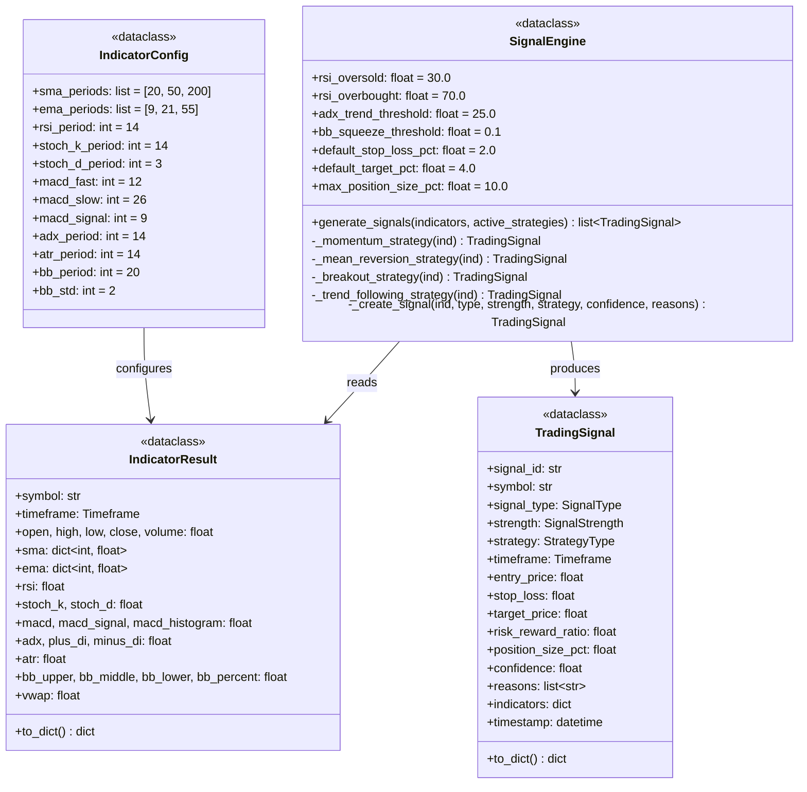
```mermaid
classDiagram
    class IndicatorConfig {
        <<dataclass>>
        +sma_periods: list = [20, 50, 200]
        +ema_periods: list = [9, 21, 55]
        +rsi_period: int = 14
        +stoch_k_period: int = 14
        +stoch_d_period: int = 3
        +macd_fast: int = 12
        +macd_slow: int = 26
        +macd_signal: int = 9
        +adx_period: int = 14
        +atr_period: int = 14
        +bb_period: int = 20
        +bb_std: int = 2
    }

    class IndicatorResult {
        <<dataclass>>
        +symbol: str
        +timeframe: Timeframe
        +open, high, low, close, volume: float
        +sma: dict~int, float~
        +ema: dict~int, float~
        +rsi: float
        +stoch_k, stoch_d: float
        +macd, macd_signal, macd_histogram: float
        +adx, plus_di, minus_di: float
        +atr: float
        +bb_upper, bb_middle, bb_lower, bb_percent: float
        +vwap: float
        +to_dict() dict
    }

    class SignalEngine {
        <<dataclass>>
        +rsi_oversold: float = 30.0
        +rsi_overbought: float = 70.0
        +adx_trend_threshold: float = 25.0
        +bb_squeeze_threshold: float = 0.1
        +default_stop_loss_pct: float = 2.0
        +default_target_pct: float = 4.0
        +max_position_size_pct: float = 10.0
        +generate_signals(indicators, active_strategies) list~TradingSignal~
        -_momentum_strategy(ind) TradingSignal
        -_mean_reversion_strategy(ind) TradingSignal
        -_breakout_strategy(ind) TradingSignal
        -_trend_following_strategy(ind) TradingSignal
        -_create_signal(ind, type, strength, strategy, confidence, reasons) TradingSignal
    }

    class TradingSignal {
        <<dataclass>>
        +signal_id: str
        +symbol: str
        +signal_type: SignalType
        +strength: SignalStrength
        +strategy: StrategyType
        +timeframe: Timeframe
        +entry_price: float
        +stop_loss: float
        +target_price: float
        +risk_reward_ratio: float
        +position_size_pct: float
        +confidence: float
        +reasons: list~str~
        +indicators: dict
        +timestamp: datetime
        +to_dict() dict
    }

    IndicatorConfig --> IndicatorResult : configures
    SignalEngine --> IndicatorResult : reads
    SignalEngine --> TradingSignal : produces
```

### Signal Generation Logic

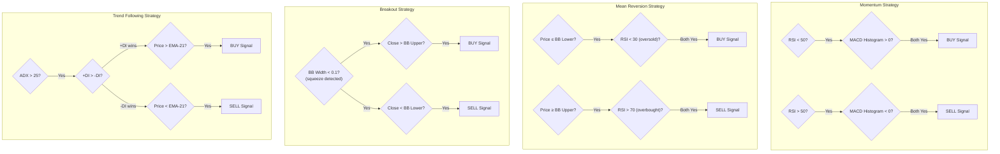
```mermaid
flowchart TD
    subgraph "Momentum Strategy"
        M1{"RSI < 50?"}
        M2{"MACD Histogram > 0?"}
        M1 -->|Yes| M2
        M2 -->|Both Yes| MBUY["BUY Signal"]
        M3{"RSI > 50?"}
        M4{"MACD Histogram < 0?"}
        M3 -->|Yes| M4
        M4 -->|Both Yes| MSELL["SELL Signal"]
    end

    subgraph "Mean Reversion Strategy"
        R1{"Price ≤ BB Lower?"}
        R2{"RSI < 30 (oversold)?"}
        R1 -->|Yes| R2
        R2 -->|Both Yes| RBUY["BUY Signal"]
        R3{"Price ≥ BB Upper?"}
        R4{"RSI > 70 (overbought)?"}
        R3 -->|Yes| R4
        R4 -->|Both Yes| RSELL["SELL Signal"]
    end

    subgraph "Breakout Strategy"
        B1{"BB Width < 0.1?<br/>(squeeze detected)"}
        B2{"Close > BB Upper?"}
        B1 -->|Yes| B2
        B2 -->|Yes| BBUY["BUY Signal"]
        B3{"Close < BB Lower?"}
        B1 -->|Yes| B3
        B3 -->|Yes| BSELL["SELL Signal"]
    end

    subgraph "Trend Following Strategy"
        T1{"ADX > 25?"}
        T2{"+DI > -DI?"}
        T3{"Price > EMA-21?"}
        T1 -->|Yes| T2
        T2 -->|"+DI wins"| T3
        T3 -->|Yes| TBUY["BUY Signal"]
        T2 -->|"-DI wins"| T4{"Price < EMA-21?"}
        T4 -->|Yes| TSELL["SELL Signal"]
    end
```

### Position Sizing by Signal Strength

| Strength | Position Size % |
|---|---|
| WEAK | 3% of capital |
| MODERATE | 5% of capital |
| STRONG | 8% of capital |

---

## Execution Layer

### Order Execution Flow

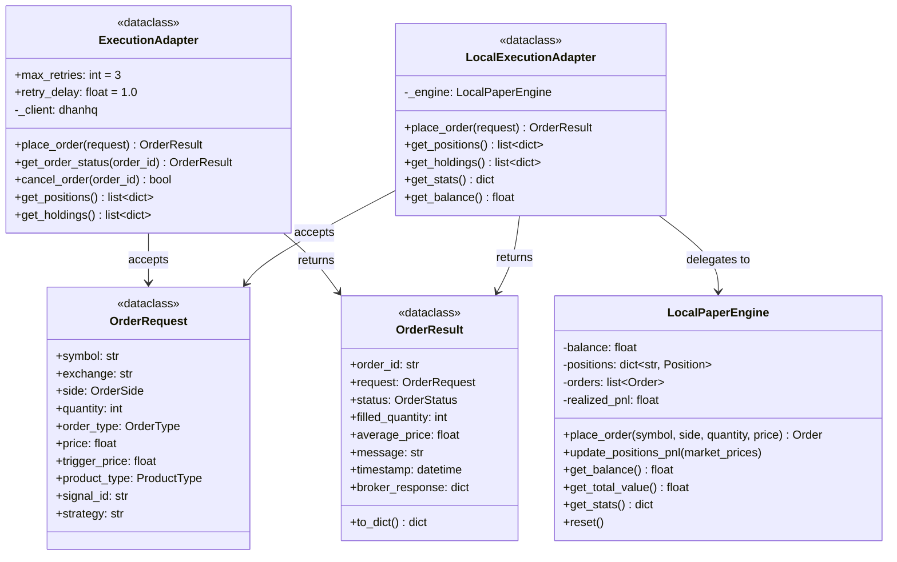
```mermaid
classDiagram
    class OrderRequest {
        <<dataclass>>
        +symbol: str
        +exchange: str
        +side: OrderSide
        +quantity: int
        +order_type: OrderType
        +price: float
        +trigger_price: float
        +product_type: ProductType
        +signal_id: str
        +strategy: str
    }

    class OrderResult {
        <<dataclass>>
        +order_id: str
        +request: OrderRequest
        +status: OrderStatus
        +filled_quantity: int
        +average_price: float
        +message: str
        +timestamp: datetime
        +broker_response: dict
        +to_dict() dict
    }

    class ExecutionAdapter {
        <<dataclass>>
        +max_retries: int = 3
        +retry_delay: float = 1.0
        -_client: dhanhq
        +place_order(request) OrderResult
        +get_order_status(order_id) OrderResult
        +cancel_order(order_id) bool
        +get_positions() list~dict~
        +get_holdings() list~dict~
    }

    class LocalExecutionAdapter {
        <<dataclass>>
        -_engine: LocalPaperEngine
        +place_order(request) OrderResult
        +get_positions() list~dict~
        +get_holdings() list~dict~
        +get_stats() dict
        +get_balance() float
    }

    class LocalPaperEngine {
        -balance: float
        -positions: dict~str, Position~
        -orders: list~Order~
        -realized_pnl: float
        +place_order(symbol, side, quantity, price) Order
        +update_positions_pnl(market_prices)
        +get_balance() float
        +get_total_value() float
        +get_stats() dict
        +reset()
    }

    ExecutionAdapter --> OrderRequest : accepts
    ExecutionAdapter --> OrderResult : returns
    LocalExecutionAdapter --> LocalPaperEngine : delegates to
    LocalExecutionAdapter --> OrderRequest : accepts
    LocalExecutionAdapter --> OrderResult : returns
```

### Exit Management

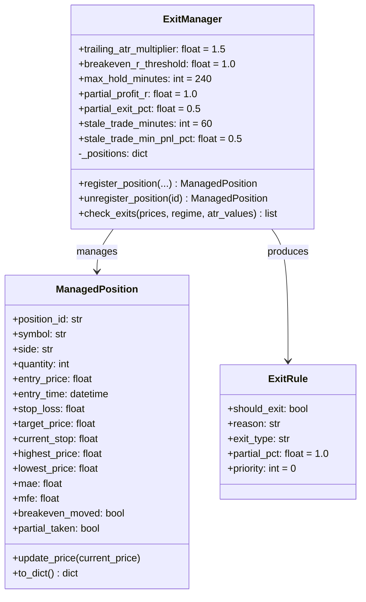
```mermaid
classDiagram
    class ExitManager {
        +trailing_atr_multiplier: float = 1.5
        +breakeven_r_threshold: float = 1.0
        +max_hold_minutes: int = 240
        +partial_profit_r: float = 1.0
        +partial_exit_pct: float = 0.5
        +stale_trade_minutes: int = 60
        +stale_trade_min_pnl_pct: float = 0.5
        -_positions: dict
        +register_position(...) ManagedPosition
        +unregister_position(id) ManagedPosition
        +check_exits(prices, regime, atr_values) list
    }

    class ManagedPosition {
        +position_id: str
        +symbol: str
        +side: str
        +quantity: int
        +entry_price: float
        +entry_time: datetime
        +stop_loss: float
        +target_price: float
        +current_stop: float
        +highest_price: float
        +lowest_price: float
        +mae: float
        +mfe: float
        +breakeven_moved: bool
        +partial_taken: bool
        +update_price(current_price)
        +to_dict() dict
    }

    class ExitRule {
        +should_exit: bool
        +reason: str
        +exit_type: str
        +partial_pct: float = 1.0
        +priority: int = 0
    }

    ExitManager --> ManagedPosition : manages
    ExitManager --> ExitRule : produces
```

**Exit Check Priority:**

| Priority | Check | Type | Condition |
|---|---|---|---|
| 100 | Stop Loss | Hard Exit | Price hits stop_loss |
| 90 | Target | Hard Exit | Price hits target_price |
| 85 | Trailing Stop | Dynamic Exit | ATR-based trailing stop triggered |
| 70 | Time Exit | Timed Exit | Hold > 240 minutes |
| 60 | Regime Change | Regime Exit | Adverse regime transition detected |
| 50 | Stale Trade | Cleanup Exit | Hold > 60 min + PnL < 0.5% |
| 40 | Partial Profit | Partial Exit | R-multiple ≥ 1.0 (exits 50%) |

### Trade Journal Schema

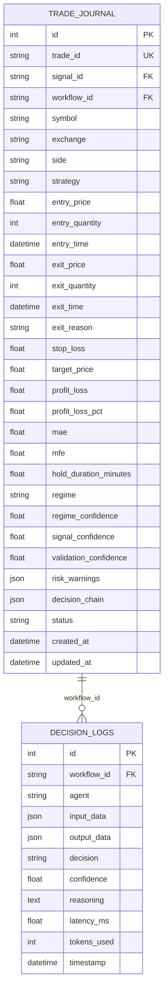
```mermaid
erDiagram
    TRADE_JOURNAL {
        int id PK
        string trade_id UK
        string signal_id FK
        string workflow_id FK
        string symbol
        string exchange
        string side
        string strategy
        float entry_price
        int entry_quantity
        datetime entry_time
        float exit_price
        int exit_quantity
        datetime exit_time
        string exit_reason
        float stop_loss
        float target_price
        float profit_loss
        float profit_loss_pct
        float mae
        float mfe
        float hold_duration_minutes
        string regime
        float regime_confidence
        float signal_confidence
        float validation_confidence
        json risk_warnings
        json decision_chain
        string status
        datetime created_at
        datetime updated_at
    }

    DECISION_LOGS {
        int id PK
        string workflow_id FK
        string agent
        json input_data
        json output_data
        string decision
        float confidence
        text reasoning
        float latency_ms
        int tokens_used
        datetime timestamp
    }

    TRADE_JOURNAL ||--o{ DECISION_LOGS : "workflow_id"
```

---

## Memory & Learning Pipeline

### Complete Feedback Loop

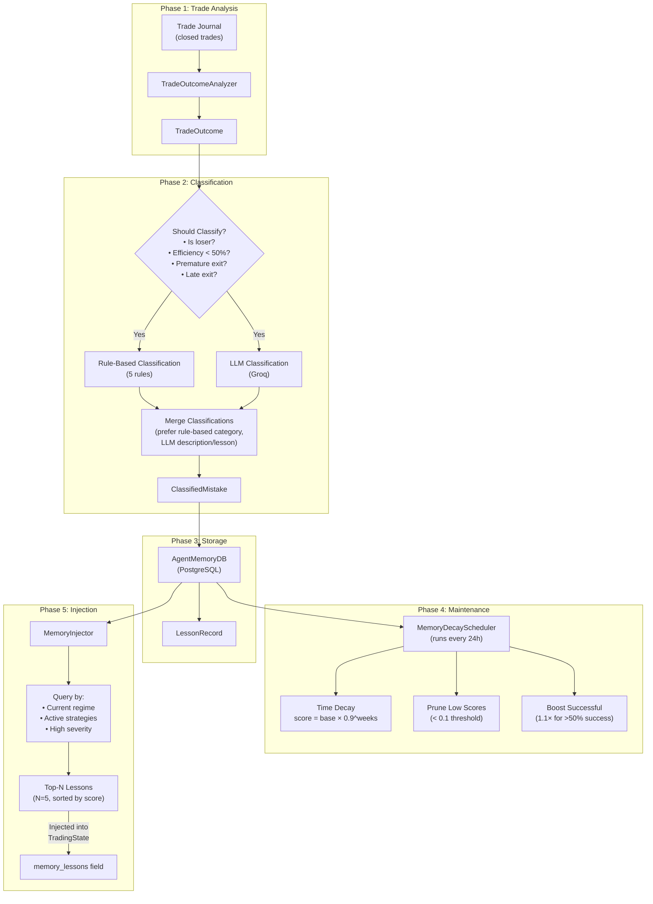
```mermaid
flowchart TD
    subgraph "Phase 1: Trade Analysis"
        TJ["Trade Journal<br/>(closed trades)"]
        AN["TradeOutcomeAnalyzer"]
        TO["TradeOutcome"]
        
        TJ --> AN
        AN --> TO
    end

    subgraph "Phase 2: Classification"
        SC{"Should Classify?<br/>• Is loser?<br/>• Efficiency < 50%?<br/>• Premature exit?<br/>• Late exit?"}
        RB["Rule-Based Classification<br/>(5 rules)"]
        LLM["LLM Classification<br/>(Groq)"]
        MERGE["Merge Classifications<br/>(prefer rule-based category,<br/>LLM description/lesson)"]
        CM["ClassifiedMistake"]

        TO --> SC
        SC -->|Yes| RB & LLM
        RB & LLM --> MERGE --> CM
    end

    subgraph "Phase 3: Storage"
        DB["AgentMemoryDB<br/>(PostgreSQL)"]
        LR["LessonRecord"]
        
        CM --> DB --> LR
    end

    subgraph "Phase 4: Maintenance"
        SCHED["MemoryDecayScheduler<br/>(runs every 24h)"]
        DECAY["Time Decay<br/>score = base × 0.9^weeks"]
        PRUNE["Prune Low Scores<br/>(< 0.1 threshold)"]
        BOOST["Boost Successful<br/>(1.1× for >50% success)"]
        
        DB --> SCHED --> DECAY & PRUNE & BOOST
    end

    subgraph "Phase 5: Injection"
        INJ["MemoryInjector"]
        QUERY["Query by:<br/>• Current regime<br/>• Active strategies<br/>• High severity"]
        TOPN["Top-N Lessons<br/>(N=5, sorted by score)"]

        DB --> INJ --> QUERY --> TOPN
        TOPN -->|"Injected into<br/>TradingState"| STATE["memory_lessons field"]
    end
```

### Memory Database Schema

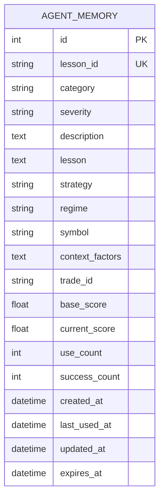
```mermaid
erDiagram
    AGENT_MEMORY {
        int id PK
        string lesson_id UK
        string category
        string severity
        text description
        text lesson
        string strategy
        string regime
        string symbol
        text context_factors
        string trade_id
        float base_score
        float current_score
        int use_count
        int success_count
        datetime created_at
        datetime last_used_at
        datetime updated_at
        datetime expires_at
    }
```

### Mistake Categories

| Category | Severity | Example |
|---|---|---|
| `regime_mismatch` | High | "Went long in downtrend regime" |
| `strategy_mismatch` | Medium | "Used momentum in ranging market" |
| `poor_timing` | Medium | "Entered during choppy period" |
| `overtrading` | Medium | "10+ trades with <40% win rate" |
| `position_sizing` | High | "Oversized position caused large loss" |
| `stop_loss_too_tight` | High | "Stopped out within 10 minutes" |
| `stop_loss_too_loose` | High | ">3% loss without hitting stop" |
| `premature_exit` | Medium | "Exited winning trade too early" |
| `late_exit` | High | "Had MFE but ended with a loss" |
| `chasing` | Medium | "Entered after move already happened" |
| `signal_quality` | Medium | "Low-confidence signal admitted" |

### Score Decay Formula

```
# After decay_days (30 by default), score decays exponentially:
excess_days = (now - created_at).days - decay_days
excess_weeks = excess_days / 7
current_score = base_score × (0.9 ^ excess_weeks)
# Minimum: 0.01
```

---

## Infrastructure Utilities

### Circuit Breaker State Machine

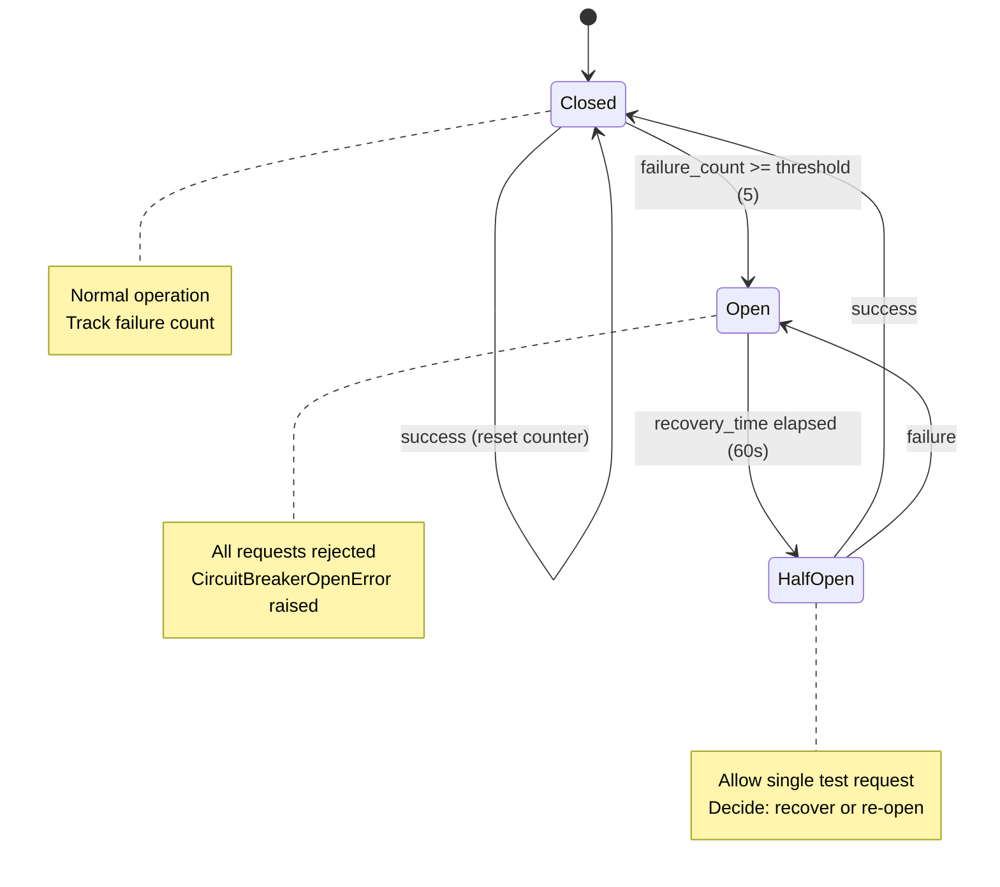
```mermaid
stateDiagram-v2
    [*] --> Closed

    Closed --> Open : failure_count >= threshold (5)
    Closed --> Closed : success (reset counter)
    
    Open --> HalfOpen : recovery_time elapsed (60s)
    
    HalfOpen --> Closed : success
    HalfOpen --> Open : failure
    
    note right of Closed
        Normal operation
        Track failure count
    end note
    
    note right of Open
        All requests rejected
        CircuitBreakerOpenError raised
    end note
    
    note right of HalfOpen
        Allow single test request
        Decide: recover or re-open
    end note
```

### Rate Limiter (Token Bucket)

```mermaid
flowchart LR
    REQ["API Request"] --> CHECK{"Tokens<br/>available?"}
    CHECK -->|"Yes"| CONSUME["Consume token<br/>Allow request"]
    CHECK -->|"No"| WAIT["Wait until<br/>token refills"]
    WAIT --> CHECK
    REFILL["Token Refill<br/>(30 tokens/min)"] -.->|"Continuous"| CHECK
```

### Event Bus System

```mermaid
classDiagram
    class EventBus {
        -_subscribers: dict~str, list~Callable~~
        -_lock: Lock
        +subscribe(event_type, callback)
        +unsubscribe(event_type, callback)
        +publish(event_type, data)
        +publish_async(event_type, data)
    }

    class TradingEvent {
        <<constants>>
        TRADE_EXECUTED
        TRADE_CLOSED
        SIGNAL_GENERATED
        REGIME_CHANGED
        KILL_SWITCH_TRIGGERED
        POSITION_OPENED
        POSITION_CLOSED
        ERROR_OCCURRED
    }

    EventBus --> TradingEvent : uses event types
```

### Cache System

| Cache | TTL | Purpose |
|---|---|---|
| News Cache | 300s (5 min) | Avoid re-fetching same news headlines |
| Quotes Cache | 60s (1 min) | Prevent redundant market data calls |
| Sentiment Cache | 600s (10 min) | Cache sentiment analysis results |

### Error Hierarchy

```mermaid
classDiagram
    class TradingAgentError {
        <<base>>
        +message: str
        +code: str
    }

    class ConfigurationError {
        Missing or invalid config
    }
    class BrokerError {
        Broker API failures
    }
    class DataFeedError {
        Market data issues
    }
    class LLMResponseError {
        LLM parsing failures
    }
    class RateLimitError {
        API rate limit hit
    }
    class CircuitBreakerOpenError {
        Circuit breaker is open
    }
    class InsufficientFundsError {
        Not enough capital
    }
    class RiskViolationError {
        Risk rule violated
    }

    TradingAgentError <|-- ConfigurationError
    TradingAgentError <|-- BrokerError
    TradingAgentError <|-- DataFeedError
    TradingAgentError <|-- LLMResponseError
    TradingAgentError <|-- RateLimitError
    TradingAgentError <|-- CircuitBreakerOpenError
    TradingAgentError <|-- InsufficientFundsError
    TradingAgentError <|-- RiskViolationError
```
