# 4. System Design & Patterns

> **📌 v2.1 hardening note.** Beyond the cognitive patterns described here, the system now closes its learn-from-losses loop at runtime, derives **evidence-based** signal confidence and **risk-based** position sizing, tracks LLM cost against daily budgets (FinOps), and runs all execution through a unified `ExecutionService` with order idempotency and a safe **shadow mode** (real broker orders only with `ALLOW_LIVE_ORDERS=true`). See README "What's New (v2.1)".

## How It Thinks: Agent Cognitive Strategy

The TradingAgent leverages **Multi-Agent Orchestration (Ensemble AI)** to decompose complex trading decisions into specialized, bounded subtasks. Instead of one large prompt attempting to evaluate news, regime, risk, and math in one go, the work is divided among focused agents:

### Separation of Concerns

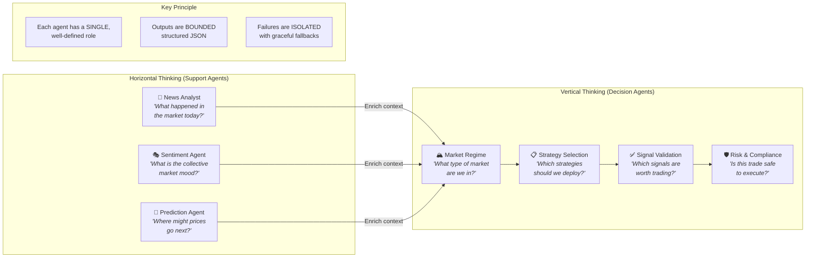

**Support Agents** think **horizontally** — they only care about summarizing raw real-world data points effectively. They gather information without making trading decisions.

**Decision Agents** think **vertically** — each is asked to play a specific role:
- **Strategy Selection** acts as a **Portfolio Manager** choosing strategies
- **Signal Validation** acts as a **Senior Trader** filtering signals
- **Risk Compliance** acts as a **Risk Manager** enforcing rules

This restriction forces the LLM to output highly bounded, confident outputs structured strictly as JSON.

---

## Design Patterns Used

### 1. State Machine / Blackboard Pattern

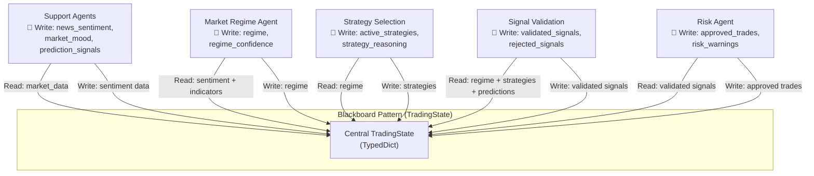

Implemented via **LangGraph**. The `TradingState` acts as a **Central Blackboard** where specialized agents post their inferences for others to read. This pattern ensures:
- **Decoupled communication** — agents don't know about each other, only the shared state
- **Incremental enrichment** — each agent adds to the state
- **Traceable decisions** — the full state is captured for every workflow

---

### 2. Strategy Pattern

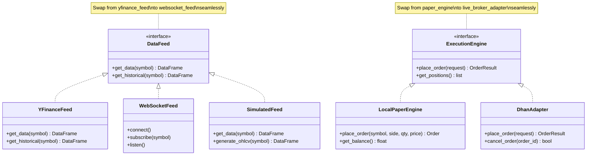

The `Execution Adapter` and `Data Feed` conform to strict interface boundaries, allowing seamless swapping:
- `yfinance_feed` ↔ `websocket_feed` ↔ `simulated_data` (for market data)
- `paper_engine` ↔ `dhan_adapter` (for order execution)

---

### 3. Circuit Breaker Pattern

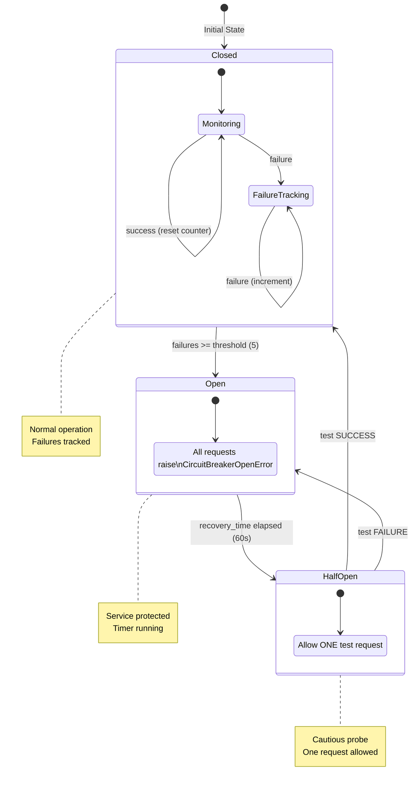

Found in `utils/circuit_breaker.py`. Three dedicated circuit breakers protect different external services:

| Circuit Breaker | Threshold | Recovery | Protects |
|---|---|---|---|
| `groq_circuit_breaker` | 3 failures | 30 seconds | LLM endpoint (Groq API) |
| `broker_circuit_breaker` | 5 failures | 60 seconds | DhanHQ broker API |
| `market_data_circuit_breaker` | 5 failures | 30 seconds | Market data feeds |

---

### 4. Token Bucket Rate Limiter

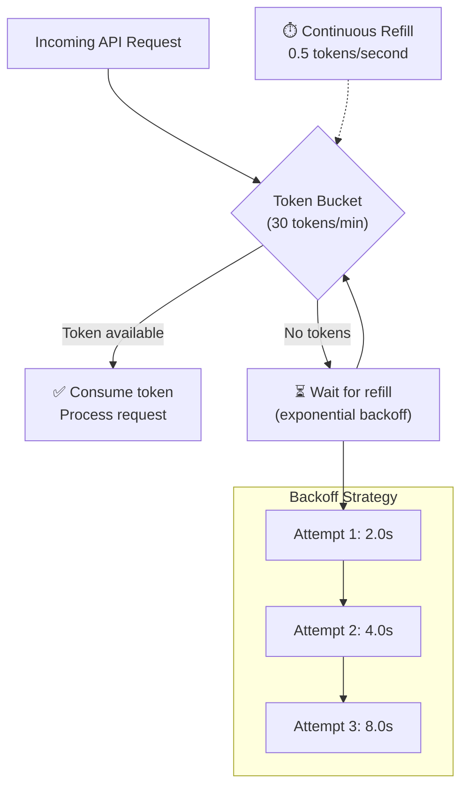

Controls request throughput matching Groq free tier constraints (30 RPM). Uses exponential backoff with jitter on rate limit errors.

---

### 5. Event-Driven Architecture (Pub/Sub)

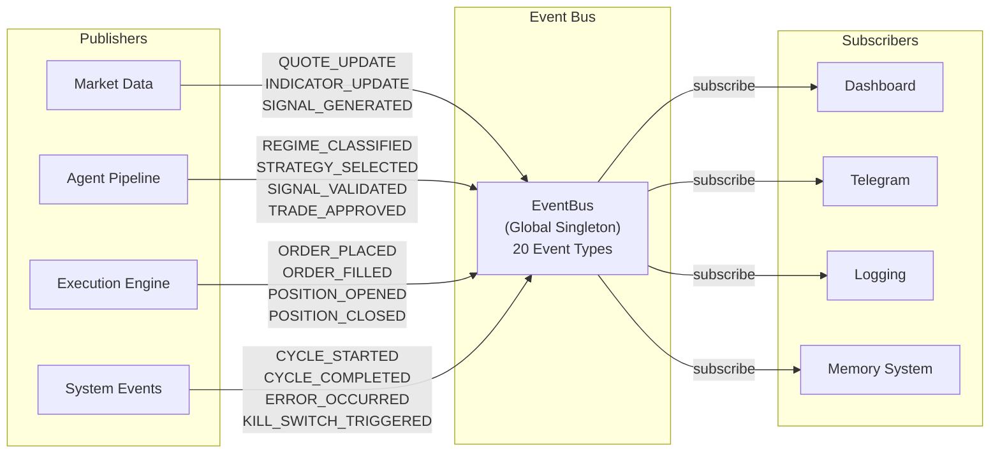

### 6. Repository & Singleton Patterns

Used extensively to manage connections and stateful resources:

| Singleton | Access Function | Purpose |
|---|---|---|
| `Settings` | `get_settings()` | Application configuration (LRU cached) |
| `RateLimiter` | `get_groq_limiter()` | Groq API rate limiting |
| `CircuitBreaker` | `get_groq_circuit_breaker()` | LLM circuit breaker |
| `EventBus` | `get_event_bus()` | Global event bus |
| `PerformanceTracker` | `get_performance_tracker()` | Strategy performance tracking |
| `MemoryDecayScheduler` | `get_memory_scheduler()` | Memory maintenance scheduler |
| `TelegramNotifier` | `get_notifier()` | Telegram notification service |

---

## Fault Tolerance & Safety

### LLM Output Safety

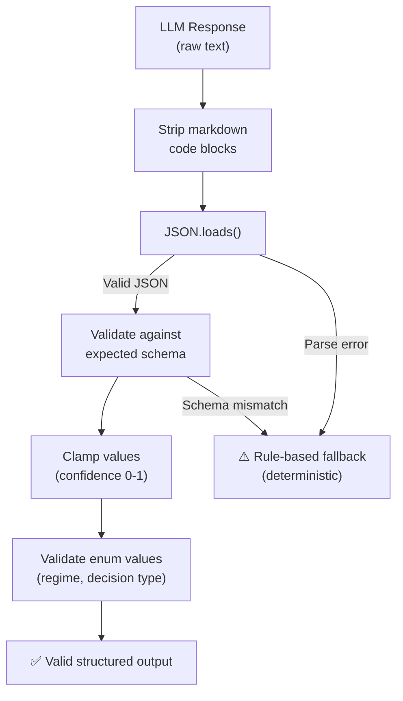

The use of structured prompts and response parsing ensures LLM outputs match exactly the schema required. Every agent has a **deterministic fallback** that activates on:
- JSON parse errors
- Schema validation failures
- Rate limit errors
- Circuit breaker open state
- Network timeouts

### Graceful Degradation Hierarchy

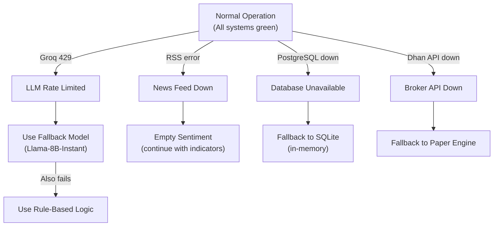

As observed in `graph.py`, if a Support Agent fails (e.g., news website changed layout, API down), it gracefully logs a **non-fatal warning** and returns empty dictionaries, allowing the rest of the pipeline to execute safely on mathematical indicators.

---

### Kill Switches & Safety Mechanisms

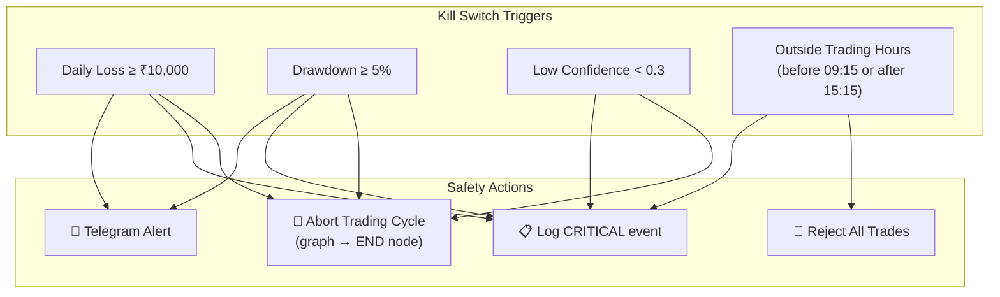

**Built permanently into Risk Control:**
- `check_kill_switch(state)` ensures anomalous market conditions instantly route the state to the `END` node
- Daily loss caps guarantee capital preservation
- Trading hours enforcement prevents off-market trades
- Maximum position count prevents over-diversification

### No LLM in Hot Path

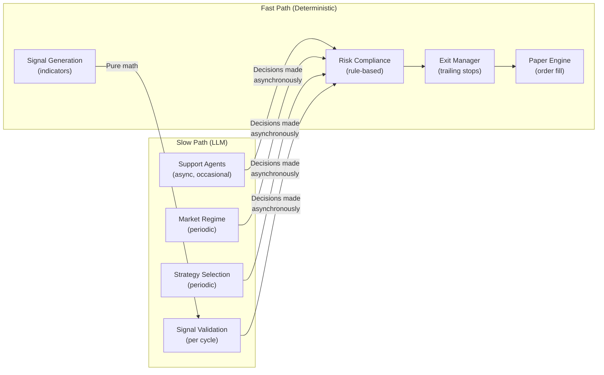

Time-critical trading operations (order execution, stop-loss checks, position sizing) are executed via deterministic rules once authorized. LLMs run asynchronously and occasionally, limiting latency constraints.

---

## Configuration Architecture

### Environment Variable Flow

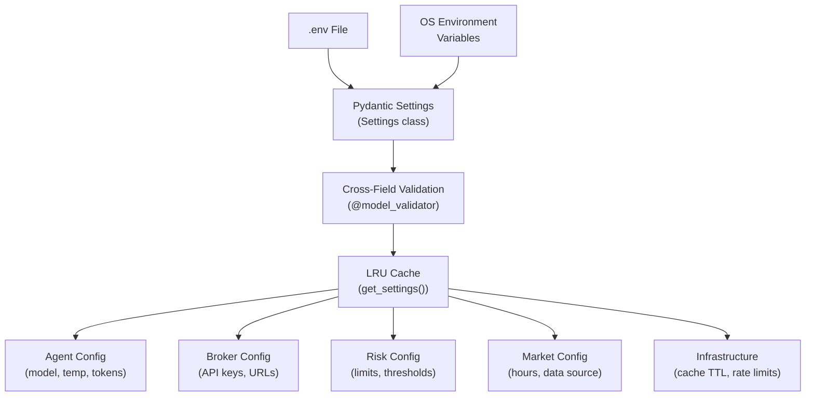

### Configuration Groups

| Group | Key Settings | Default |
|---|---|---|
| **LLM** | `groq_model_primary`, `groq_temperature` | `llama-3.3-70b-versatile`, `0.1` |
| **Broker** | `dhan_client_id`, `execution_mode` | None, `local_paper` |
| **Trading** | `max_daily_trades`, `daily_loss_limit` | 50, ₹10,000 |
| **Position** | `max_position_pct`, `risk_per_trade` | 10%, 2% |
| **Memory** | `memory_top_n_lessons`, `memory_decay_days` | 5, 30 |
| **Market** | `market_open_time`, `market_close_time` | 09:15, 15:30 |
| **Rate Limit** | `groq_requests_per_minute` | 30 |
| **Cache** | `cache_news_ttl`, `cache_quotes_ttl` | 300s, 60s |

### Validation Rules

| Rule | Check | Action |
|---|---|---|
| Live trading | Requires Dhan credentials | Warning logged |
| Dhan execution | Should use Dhan data source | Warning logged |
| Risk parameters | `risk_per_trade ≤ max_position_pct` | Warning logged |
| Total risk | `max_total_risk ≥ risk_per_trade` | Warning logged |
| Market hours | `open_time < close_time` | Warning logged |
| Trading window | `no_trading_before < no_trading_after` | Warning logged |
| Telegram | Both token and chat_id required | Warning logged |

---

## Observability Architecture

### LangSmith Integration

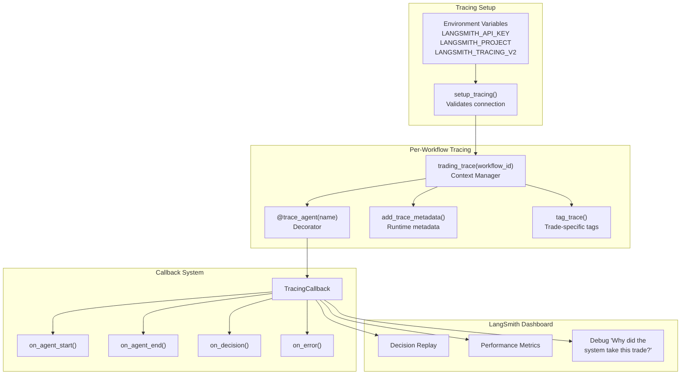

Every agent invocation, input context, LLM output, and graph transition is recorded with metadata tags. This allows:
- **Playback** — replay any trading cycle step by step
- **Deep introspection** — answer "Why did the system take this trade?"
- **Performance monitoring** — track latency, token usage, decision quality
- **Error debugging** — trace failures through the full call chain

### Notification System

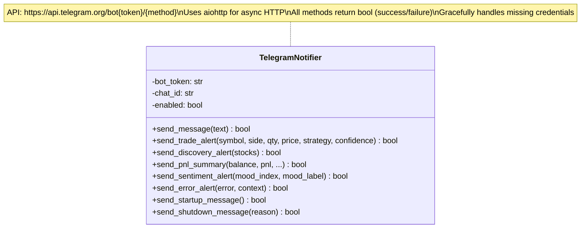

---

## Health Check Architecture

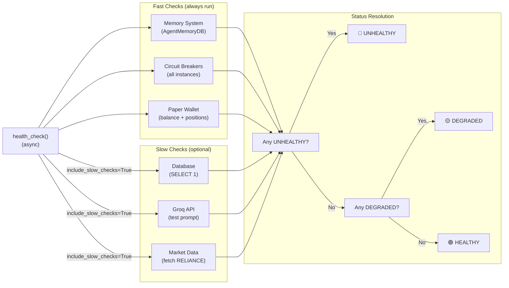

---

## Dashboard Architecture

### Rich CLI Terminal Dashboard

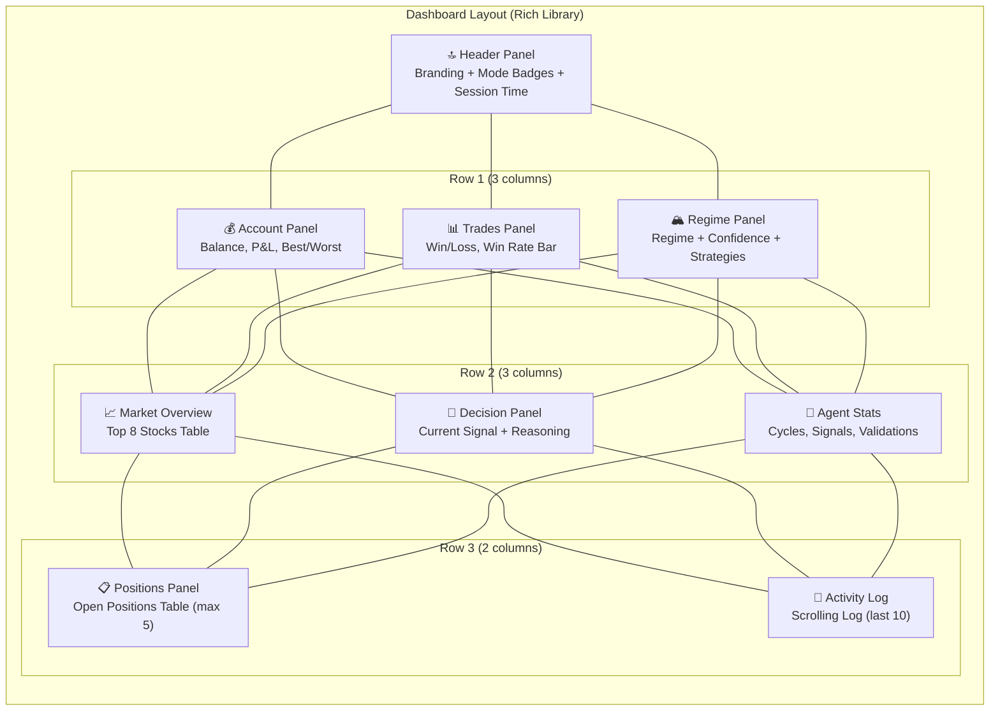

**Regime Color Coding:**

| Regime | Color | Icon |
|---|---|---|
| `trending_up` | Green | 📈 |
| `trending_down` | Red | 📉 |
| `ranging` | Yellow | ↔️ |
| `volatile` | Magenta | ⚡ |
| `unknown` | Grey | ❓ |
