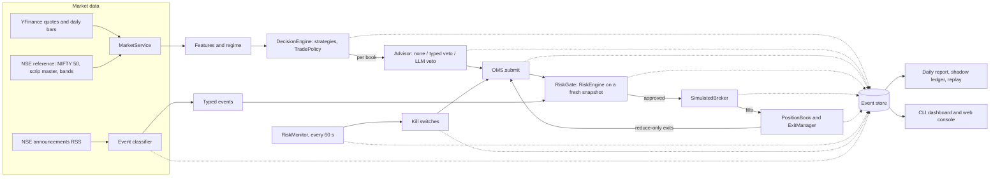

# Architecture

RakshaQuant is a paper-trading platform for NSE cash equities, built to answer one question
with a controlled experiment: **does an AI advisor improve a deterministic trading system, net
of its cost?** A deterministic engine trades three paired books on the same signals. Book A
trades every signal. Book B lets a local typed decision model veto entries, and book C lets an
LLM veto them. The engine records everything as events, so every number is traceable to the
decision that produced it.

It is **paper only**: the engine has no broker path, and every order fills on a simulated
broker that models latency, spread, impact, liquidity and NSE charges.

This page explains how the parts fit together. The reference pages list the details and are
generated from the code: [events](reference/events.md), [settings](reference/settings.md),
[risk limits and reason codes](reference/risk.md), [HTTP API and stream](reference/api.md),
[packages](reference/packages.md), [scripts](reference/scripts.md). Operating the system is
covered by the [runbooks](runbooks/daily-ops.md).

## The flow

Everything runs in one asyncio process per environment (`dev`, `paper`, `demo`, `test`). The
process holds a lock on its state directory, `var/<env>/`, so a second instance exits with
code 3.

## A trading day

The session lifecycle (`src/engine/lifecycle.py`) walks a fixed schedule taken from the NSE
calendar (`src/config/nse_calendar.json`). All times are IST. A holiday or weekend exits at
once with code 0. A late start runs pre-open and then joins the current state.

| State | From | What happens |
| --- | --- | --- |
| `PRE_OPEN` | start (09:00) | Reference data refreshed (NIFTY 50 pinned to a snapshot date, scrip master, price bands); a year of daily bars for the universe, every held symbol and NIFTY; features; the regime (`RegimeComputed`); each book's risk day and reconciliation; announcement backfill; shadow alpha settled. |
| `OPEN` | 09:15 | Quotes every 60 s, risk monitor every 60 s, reconciler every 15 min, heartbeat; each book's protective stops re-placed for the day. |
| `ENTRY_WINDOW` | 09:20 | **One decision cycle** (the experiment's window is 09:20-09:45): signals on settled bars, one fresh re-quote, per-book proposals, advisors, risk, orders. |
| `MONITOR` | 09:45 | Exits only: stops, targets, trailing stops, time exits, kill-switch flattens. No new entries. |
| `CLOSE` | 15:30 | Loops stop, DAY orders expire, a last risk tick. |
| `REPORT` | 15:45 | `MarkToMarket` per book, the daily report (`var/reports/<date>.md` and `.json`), the Telegram summary, then the nightly review if its role is configured. |
| `EXIT` | 15:50 | The process exits with code 0. |

Positions are CNC, long only, so they carry across days and processes. A restart rebuilds
the books from their events.

## Books

The experiment (`src/config/experiment.yaml`) defines the books, capital (₹10 lakh each), the
universe, the strategies, the trade policy and the entry window. `src/evaluation/books.py`
builds the books from it.

- **Shared** across books: market data, features, signals, the regime, announcements and the
  lifecycle. One `decision_id` per instrument evaluation links the same signal in every book.
- **Per book**: the simulated broker's state, the position book and OMS, the RiskGate,
  ExitManager, daily risk tracker, kill switches, flattener and monitor. Every event carries
  its `book_id`.
- The only difference between books is the advisor. Advisors can **veto only**: they never
  size, price or add orders. A failing or unavailable advisor abstains, so the decision stands
  and the book trades like A (`AdvisorFallback`, `AbstainAdvisor`).
- Each (signal, book) outcome is a `SignalDisposition`: shadow strategy, regime-gated,
  policy-skipped, vetoed, risk-rejected, submitted, broker-rejected or unknown.

The **shadow ledger** (`src/evaluation/shadow_ledger.py`) gives every BUY signal a
counterfactual trade, whatever the books did with it. The counterfactual is net of the same
costs and settled against NIFTY, so a veto can be scored by what it avoided.

## One decision, end to end

1. **Signal.** `compute_features` runs on settled, dividend-adjusted daily bars (the forming
   bar is never used). Each strategy (`src/strategies/`) emits a `Signal` with structured
   reasons and an agreement score. Momentum and mean reversion trade; breakout and trend
   following are shadow only.
2. **Proposal.** The `TradePolicy` turns a BUY signal into an **unsized** `OPEN` intent with a
   stop and target in ATRs (2 and 3), anchored to the fresh arrival quote. SELL signals,
   shadow signals and missing ATRs never become orders.
3. **Advisor.** The book's advisor approves, vetoes or abstains, with evidence (`AdvisorVerdict`).
4. **Risk.** `OMS.submit` hands the intent to the `RiskGate`. The gate builds a fresh
   `RiskSnapshot` (marks, positions, resting stops, today's risk state, kill switches,
   session flags, event-calendar blocks) and runs every check (`src/risk/checks/`). Entries
   **fail closed**: a check that throws blocks. Sizing is a check too: the approved quantity is
   the smallest cap (risk per trade over the stop distance, notional, ADV), rounded down to the
   lot. The `RiskDecision` is recorded before the order.
5. **Order and fill.** `OrderSubmitted` is recorded **before** the broker call, and the
   submission is shielded, so even a cancelled process never leaves an order the OMS doesn't
   know. The simulated broker fills on the first quote received after its latency. Fills
   change positions; nothing else does.
6. **Exits.** The ExitManager re-anchors stop and target to the **fill** price, places a
   broker-side SL-M stop, and manages the target, trailing stop and time exit. Every exit is
   a reduce-only intent through the same `OMS.submit`, so it can never oversell or flip a
   position.

The inspector in the web console (`/decisions/<id>`) shows this whole chain for any decision.
It draws on the decision price (the signal bar's close), the arrival price (the fresh quote)
and the fill price, along with slippage and charges.

## Risk and kill switches

- **Limits** (`src/config/limits.py`, `RISK_*` variables) are bounded; out-of-range values fail
  startup. Their hash is recorded on every risk decision.
- **Daily risk state** (`src/risk/state.py`) is persisted per IST day: start-of-day equity,
  peak, entries, per-strategy P&L and loss streaks. A restart never resets it.
- **The monitor** (`src/risk/monitor.py`) marks to market every 60 s and raises breaches once a
  day each:
  - daily loss vs start of day: FLATTEN by default;
  - drawdown vs peak: FLATTEN;
  - a reject storm: HALT_NEW;
  - a strategy's daily loss or loss streak: that strategy HALT_NEW.
- **Kill switches** (`src/risk/kill_switch.py`) exist per book at three scopes: global, broker
  and per strategy. Each moves through `ARMED < HALT_NEW < FLATTEN`. They are persisted and
  **latching**: only an operator's resume re-arms them. A `HALT` file in the state directory
  trips every book's global switch on the next check. FLATTEN closes positions with
  reduce-only market orders through the OMS. See the
  [kill-switch runbook](runbooks/kill-switch.md).

## Data you can trust

- **Quotes** (`src/marketdata/yfinance_source.py`) arrive in one batched download per minute,
  run off the event loop. Failed polls back off. A quote that is non-finite, outside the
  instrument's band, or shows cumulative volume going down is rejected (`QuoteRejected`).
  Stale feeds raise `FeedStale`.
- **Simulated or synthetic prices can never create orders** outside the `demo` environment
  (`SYS_DATA_SIMULATED`). The demo has its own state directory and store.
- **The calendar fails closed**: a year it doesn't cover raises an error instead of guessing.
  It covers 2026; add 2027 before the year ends.
- **Corporate announcements** (`src/marketdata/announcements.py`) come from NSE's RSS feed. The
  decision models classify them into `TypedEvent`s, and the event gate blocks entries around
  results and after major adverse news (`EVT_*` codes). Exits are never blocked.

## AI

- **LLM layer** (`src/llm/`): any role can run on any provider via `LLM_ROLE_<ROLE>=provider:model`,
  with fallbacks, per-model circuit breakers, rate-limit pauses, INR budgets and a reply cache.
  The supported providers are OpenAI, OpenRouter, Groq, Anthropic, Ollama, and any
  OpenAI-compatible endpoint. Every attempt is an `LLMCall` event with tokens, latency and
  cost. The router never raises, so a failure is an abstention. All roles are off until
  configured.
- **Decision models** (`src/decision_models/`): Laya runs locally on CPU first. Questions it is
  unsure of (calibrated confidence inside the escalation band) go to Jev (TypeSafe) when that
  is configured; otherwise they abstain. Every answer is cached, so a replay never calls a
  model.
- **No portfolio data reaches a model.** Prompts carry public facts only (the signal, features,
  typed events), as JSON inside data blocks. Extra fields in an answer are ignored, so a model
  cannot smuggle in a quantity or a price.
- **Nightly review** (`src/evaluation/review.py`) writes structured lessons per closed trade.
  They are stored for humans and **never fed back** into any book during the experiment.

## The event store

`src/store/` is the system of record: SQLite in WAL mode with numbered migrations.

- `EventStore.append` writes an event and updates its projections (orders, fills, positions,
  trades, decisions, kill switches, LLM calls, ...) in **one transaction**. A rebuild from the
  events gives identical projections (a property test proves it).
- Component state that is not an event (broker state, exit manager, daily risk, caches) lives
  in `kv_state` in the same database.
- The **tape** (`var/tape/<date>/`, Parquet) keeps every accepted quote and bar. Replaying a
  recorded day (`scripts/replay_day.py`) rebuilds it from the tape, the stored announcements
  and cached AI answers only. A golden test pins the result.

## Processes, files and front ends

- `scripts/run_live_trading.py` is the entry point:
  - `--mode cli` (default) runs the Rich dashboard (`src/dashboard/cli.py`).
  - `--mode web` serves the browser console (`src/web/`, React app in `frontend/`).
  - `--demo` replays the bundled tape in the `demo` environment.
- Both front ends read the **same projections** (`src/web/queries.py`); the web layer never
  re-implements trading logic. The web console is local only:
  - a per-launch token, printed once as a `#token=` URL;
  - trusted hosts and an origin allowlist;
  - typed confirmations for resume and flatten.
- Exit codes: 0 normal (Ctrl-C too), 1 crash, 2 configuration error, 3 already running.
- Runtime files live under `var/` (gitignored):
  - `var/<env>/rakshaquant.db`: the event store;
  - `var/<env>/HALT`: the halt file;
  - `var/logs/`: JSON-lines logs, secrets redacted;
  - `var/reports/`, `var/tape/`, `var/reference/`, `var/models/`;
  - `var/backtests/`, `var/datasets/`, `var/archive/`.

## Research

`src/backtesting/` runs **the paper engine itself** over daily bars. Each bar becomes a quote
path: the open, the next-open fill for 09:20 decisions, then the adverse extreme first. Lifecycle,
risk, OMS, simulated broker and exits are all the live code. `src/backtesting/edge.py` applies
the go/no-go gate: at least 200 closed trades and a 95% bootstrap CI of the mean net return
per trade above zero. `scripts/validate_strategy.py` runs it on YFinance history or on the
point-in-time NSE bhavcopy dataset (`src/marketdata/bhavcopy.py`).

## Further reading

- [docs/plan/2026-10-01-platform-v2-plan.md](plan/2026-10-01-platform-v2-plan.md): the plan
  (source of truth) and [PROGRESS.md](plan/PROGRESS.md), with every design decision and
  verified fact.
- [docs/audit/2026-10-01-platform-audit.md](audit/2026-10-01-platform-audit.md): the audit of
  the earlier system that motivated v2.
- [docs/experiments/2026-10-month1-preregistration.md](experiments/2026-10-month1-preregistration.md):
  the month-run hypotheses and decision rules.
