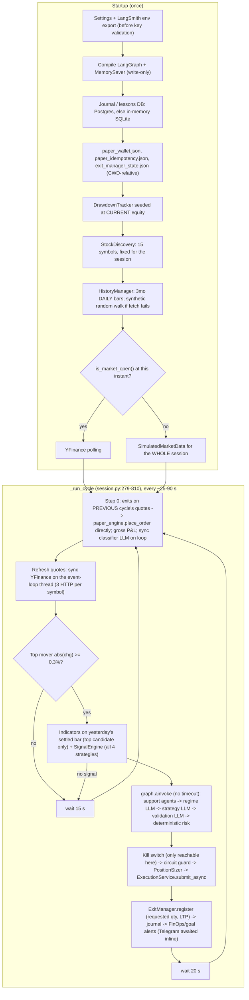
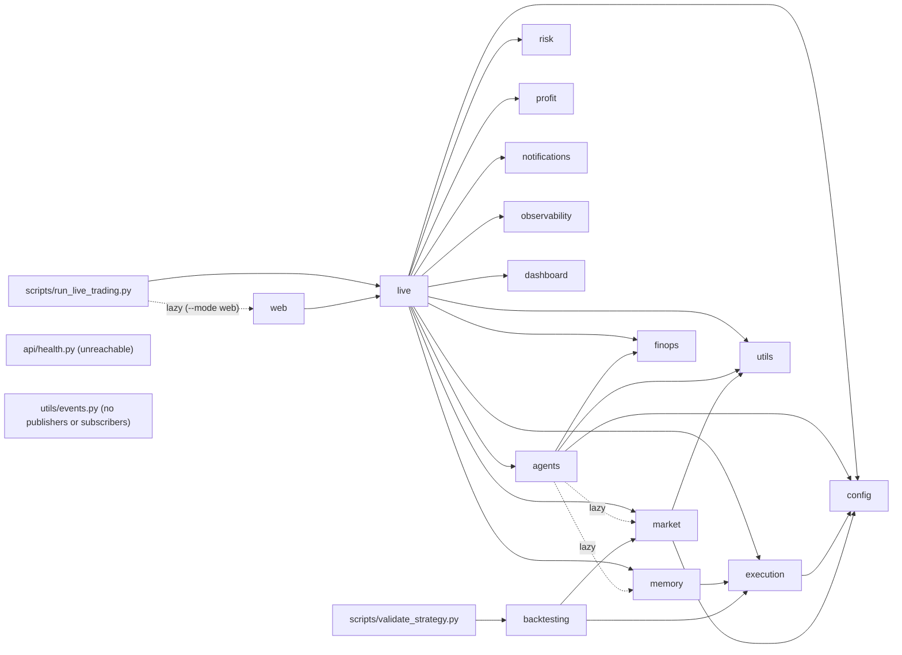
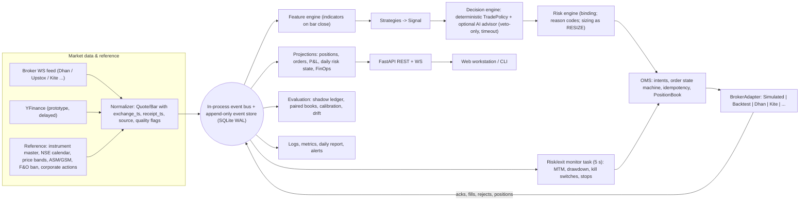
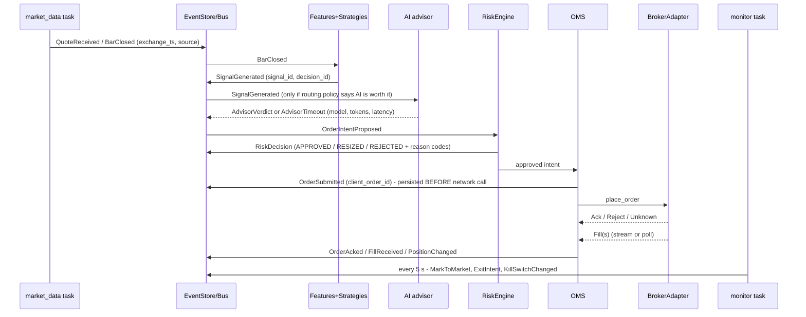
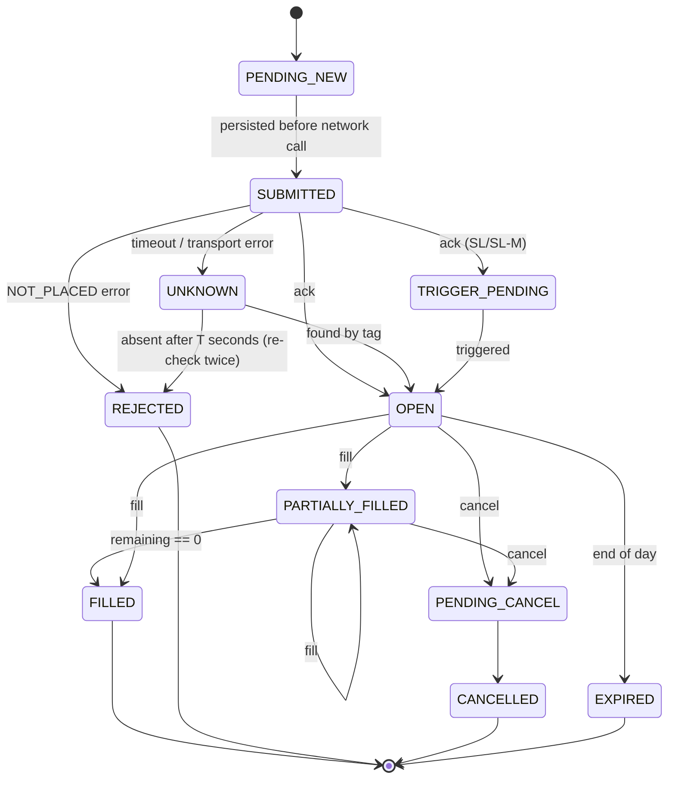

# RakshaQuant — Platform Audit & Target Architecture

| | |
|---|---|
| **Date** | 2026-10-01 |
| **Code audited** | branch `claude/cli-web-mode-migration-032455` @ `877c4ac`. This is the PR #22 head, which is `main` plus 3 commits. |
| **Method** | Nine specialist reviews ran independently. Each one read the code and ran probes or benchmarks against the real classes: AI/agents, quant, market-data/latency, trading infrastructure, risk, architecture/SRE, security, frontend/PR #22, and the TradingAgents reference study. Their findings were cross-checked and conflicts were settled by an "architecture council" (§F.0). The most consequential claims were independently re-verified; see §Z. |
| **Evidence convention** | Code references are `path:line` in this repo. External facts (NSE schedules and charges, broker API field names, vendor pricing and limits, SEBI rules) are marked **(verify)**. They are stated as best understood at the time of writing and must be checked against the primary source before you rely on them. |
| **Suggested reading paths** | One section only: **A**. Before starting the one-month run: **A → C → U (Immediate) → Y**. Implementers: **F → L → H → V**. |

---

## A. Executive Assessment

### A.1 The short version

1. **RakshaQuant is a well-intentioned, unusually safety-conscious prototype, but its numbers cannot be trusted yet.** It already has things most open-source "AI trading" projects lack, TradingAgents included:
   - a deterministic risk node;
   - a kill switch re-checked at execution;
   - a default-off live gate;
   - a shadow mode;
   - a cost model;
   - a walk-forward gate;
   - LLM spend tracking.

   The paths *between* these components are broken in ways that silently corrupt P&L, risk and attribution (§C).

2. **Do not start the month-long run yet.** Run as-is, a month of paper trading would mostly measure the following:
   - a P&L ledger that over-reports a winning trade by up to **66%** after partial exits, and leaves behind an untracked short;
   - fills at *pre-move* prices for stocks chosen *because* they moved;
   - possibly random-walk **simulated** prices written into the real wallet, because the data source is chosen once at startup;
   - a deterministic fallback presented as AI.

   Two more problems already apply today:
   - The real `paper_wallet.json` currently holds **13 AAPL test positions** (written by the test suite). `max_positions=5` therefore rejects every entry.
   - Tomorrow, **Fri 2 Oct 2026 (Gandhi Jayanti), is an NSE holiday (verify)**. The system would treat it as a trading day.

3. **The deterministic edge question has already been answered, and the answer is no.**
   - The project's own gate (`scripts/validate_strategy.py`) returns **NOT VALIDATED**: 196 out-of-sample trades, expectancy **−₹8.55/trade**, 3 of 10 symbols positive.
   - Breakout (t = −2.24) and trend-following (t = −1.88) are significantly negative.
   - An intraday proxy of the same signals loses **−16 bps/trade** after costs.

   So the month is a **systems test plus a measurement of the LLM's value**, not a test of edge.

4. **The "agentic" layer contributes far less than it appears to.**
   - The news agent **never runs** in the live loop (verified).
   - The ML predictor never trains; it is always on its fallback.
   - "Market mood" is arithmetic on the same price changes the signals already use.
   - Strategy "selection" only labels signals; all strategies always run.
   - On the Groq free tier, the 70B model's daily token budget runs out after roughly **40 cycles (~30–60 min) (verify limits)**. After that, about **95%** of validation decisions are made by the deterministic fallback, and nothing records that.

5. **Performance is not the problem, and no language migration is justified.**
   - Python compute per cycle is µs–ms. LangGraph's own overhead is **~5 ms**.
   - The measured hot spots are all design issues:
     - A new `ChatGroq` client is built per LLM call (≈480 ms CPU each). Caching it takes the graph from **1,573 ms to 4.6 ms**.
     - YFinance is polled one symbol at a time, with 3 HTTP calls per symbol, on the event loop.
     - Paper state is persisted with O(N) JSON rewrites.

   Rust, Go or C++ would buy nothing measurable (§D, §E).

6. **The live path is unsafe for real money**, even though it is gated off:
   - Exits and kill-switch flattening go to a *local paper book*, never to the broker.
   - The `dhan_paper` "sandbox" mode actually targets the **production** Dhan API (verified).
   - Placement retries can double-submit an order.
   - The ticker string is sent where a numeric security ID is required.
   - Partial or unconfirmed fills become unmanaged positions.

   Your local `.env` contains Dhan credentials, so two config flags are all that stand between this code and real orders.

7. **Direction: evolve the system; do not rewrite it.**
   - Keep a single-process Python modular monolith for at least 6 months.
   - Today's spine is "a 532-line cycle closure wrapped around a LangGraph call". Replace it with a **deterministic, clock-driven core plus an append-only event log**.
   - Add an **OMS** behind a **broker-adapter interface**, and a **binding risk engine at the point of order submission**.
   - LangGraph becomes a timeout-bounded *advisor*, consulted only when there is a fresh candidate.

### A.2 PR #22: adopt it, or build our own?

**Verdict: merge after a short list of fixes. Do not rebuild.** Details are in §N.

**Why keep it**
- The loop extraction into `src/live/session.py` is genuinely mechanical. A whitespace-insensitive diff against `main:scripts/run_live_trading.py` shows only three kinds of change: view substitutions, trace hooks, and `stop_event`/`max_cycles`/`CancelledError` handling.
- CLI behaviour is unchanged.
- The branch fast-forwards cleanly, and all of these pass:
  - 12 web tests;
  - `tsc` and `vite build`;
  - ruff;
  - strict mypy on the new modules.
- The SPA is lean: 56 KB of gzipped JS, with React as the only runtime dependency.
- A rebuild would recreate the same seam, transport and shell.

**Must fix before merge** (all verified)
1. **The control plane is unauthenticated.**
   - A cross-origin `POST /api/run/start` with no body starts a real run.
   - `/ws` accepts any Origin.
   - There is no Host validation, so DNS rebinding works.
   - `confirmLive` is coerced with `bool()`, so the string `"false"` counts as confirmed (`src/web/server.py:112-140`, `:117-118`).
2. **`dhan_paper` is mislabelled.** It is badged SHADOW and starts without confirmation, but it hits production (`src/live/recorder.py:49-55`).
3. **Positions and P&L are wrong in real mode.** The panels read an append-only `TradingStats` list and gross P&L (`src/dashboard/cli.py:636-665`). Demo mode hides this.
4. **Traces overstate what they know.** They claim per-span latency and support-agent tokens they do not have (`src/live/recorder.py:41-46,174`).
5. **Stop hard-cancels mid-cycle** (`src/web/run_manager.py:163-165`).

**Strategic caveat.** The PR's data model renders snapshots of a mutable stats object. That is the wrong foundation for a trading workstation. Merge it as a v0 "cycle console" and freeze that contract. Build later screens on the event log (§G, §N).

### A.3 Today vs. what it needs to become

| Dimension | Today | Needs to become |
|---|---|---|
| Spine | One sequential closure, `_run_cycle` (`src/live/session.py:279-810`): exits → refresh → LLM graph → orders. A slow LLM call freezes exits and the kill switch. | A clock-driven deterministic core. An append-only event log. Separate tasks for market data, exit/risk monitoring, the decision advisor and the OMS. |
| Data | YFinance daily bars, roughly 15 minutes delayed, polled. Quote timestamp is when the code wrapped it. Silent random-walk fallback. | Canonical `Quote`/`Bar` carrying `exchange_ts`. A broker real-time feed. Holiday calendar. Instrument master. A recorded tape for replay. |
| Signals | 4 textbook strategies on settled daily bars. NOT VALIDATED. Backtest is a different system from live. | One trade policy shared by backtest, paper and live. A strategy is enabled only after it passes the gate. |
| AI | 3 LLM calls per cycle plus 3 "support agents" that are façades. No measure of value. | At most one LLM gate in the trading path, veto-only, measured by a paired A/B. Research agents run offline. Regime is deterministic. |
| Risk | Checks *signals*, not *orders*. Most limits are warnings. Kill switch only fires on cycles with signals, and resets on restart. | A binding RiskEngine at the OMS for every order, including exits. Reason codes. Persisted, latching global, strategy and broker kill switches. |
| Execution | Paper engine with accounting bugs. Exits bypass `ExecutionService`. Dhan adapter unusable. | An OMS state machine. A `BrokerAdapter` protocol. A `SimulatedBroker` with a realistic NSE fill model. One `PositionBook`. |
| Observability | No logging config in the main entry point. A 12-line activity log. LangSmith (a SaaS) is the only full record. | A decision-ID lineage. Append-only events. Structured logs. A daily experiment report. |
| Ops | No CI. No single-instance lock. Exit code always 0. State relative to the working directory. Started by hand. | CI with dependency audits. Scheduled start and stop. Heartbeat. Absolute state directory. Single-instance lock. |
| UI | PR #22 cycle console. | A trading workstation built on event projections (§N). |

### A.4 Ten numbers that matter (measured in this audit)

| # | Measurement | Reviewer / probe |
|---|---|---|
| 1 | Own edge gate: **NOT VALIDATED**. n = 196 out-of-sample trades, expectancy −₹8.55/trade. Bootstrap 95% CI on per-trade return: **[−1.03%, +0.09%]**. | Quant: ran `validate_strategy.py` (44 s) |
| 2 | Breakout **−2.64%/trade (t = −2.24)**. Trend-following **−3.01%/trade (t = −1.88)**. | Quant |
| 3 | A daily 2·ATR stop is reached intraday on **0.86%** of symbol-days, and a 3·ATR target on **0.00%**. So almost every exit is a time or stale exit. | Quant: 4,870 symbol-days |
| 4 | Partial exit, then full exit: dashboard **+₹5,150** vs engine **+₹3,100** (**+66%**), plus an untracked 50-share short. | Architecture, infrastructure and risk probes (three independent reproductions) |
| 5 | Risk probe on a **Saturday**, 36% sector exposure, stop 99% away, R:R 0.2: **8 of 8 signals approved**. | Risk probe |
| 6 | LLM-edited stops can push per-trade risk to **9.9% of capital** against 2% configured. | Risk probe |
| 7 | Agent graph with LLM stubbed: **1,573 ms → 4.6 ms** just by caching the `ChatGroq` client. | Performance (cProfile) |
| 8 | At 22:22 IST, Yahoo's `regularMarketTime` read **15:15 IST**. The code measures that quote's age as about 0 s. | Performance |
| 9 | The 70B free-tier tokens-per-day limit is used up after **~39 cycles**; after that about 95% of validations are fallback. | AI/agents: assumes Groq's published limits **(verify)** |
| 10 | **375 of 376** tests pass. **0** tests run `run_trading_session`. **374** strict-mypy errors. **67** dependency advisories across 20 packages. | My test run; architecture; security (pip-audit) |

### A.5 What should stay exactly as it is

- **Risk path:**
  - The deterministic `risk_compliance` node, never an LLM (`src/agents/risk_compliance.py`).
  - Deterministic `_fallback_*` results on every LLM failure. In effect the system *already has a rule-based core*.
  - The kill switch re-checked at execution time, with exits still allowed (`src/live/session.py:603-617`).
- **Live gating:** `allow_live_orders` defaults to off (`src/config/settings.py:150`). `_resolve_mode` never silently downgrades, so live and broker modes resolve to SHADOW (`src/execution/service.py:181-202`). The principle that **PLACED ≠ filled** (`src/execution/live_executor.py:42-77`).
- **Paper engine durability:** atomic temp-file + fsync + `os.replace` persistence, and quarantine of corrupt state files (`src/execution/paper_engine.py:199-242`).
- **Cost model:** `CostModel` as an injectable frozen dataclass with a `zero()` constructor. Extend it; don't replace it.
- **Backtest hygiene:**
  - Strictly-prior bars in the backtest.
  - NaN sanitisation via `_safe_float`.
  - The walk-forward gate's fixed universe and blunt verdict.
- **Time:** the `market_time` IST helpers.
- **FinOps:** `CostTracker` is pure, thread-safe and rolls over on the IST day.
- **Front ends:** one loop, two renderers (`SessionView`).
- **LLM output containment:**
  - The `signal_id` whitelist: the LLM cannot invent symbols or sides (`src/agents/signal_validation.py:348-356`).
  - Enum and clamp validation of LLM output.
- **Code hygiene:**
  - Ruff-clean codebase.
  - Strict mypy on new modules.
  - `SecretStr` for the main keys.
  - No pickle, `eval` or subprocess.
  - SQL goes through the ORM.

---

## B. Current Architecture (as it actually runs)

### B.1 Runtime

One process, one asyncio loop (`asyncio.run` in CLI mode, the uvicorn loop in web mode). The real spine is neither LangGraph nor an event bus. It is a 532-line closure.



**Cadence.** The loop waits 20 s after a full cycle. It waits 15 s when quotes are stale, there are no candidates, there are no signals, or the spend budget is hit; and 10 s when there is no history (`session.py:426,434,452,489,505,808`). Add the YFinance refresh (2–5 s) and three sequential LLM calls, and an effective cycle runs about **25–45 s** typically. It is **unbounded** if Groq hangs, because no timeout is set anywhere: verified, the effective httpx timeout is `None`.

**Concurrency.** Under `ainvoke`, sync graph nodes run in executor threads (`langgraph/_internal/_runnable.py:519-524`), so LLM calls do not block the loop. These do block it:
- YFinance calls (`src/market/yfinance_feed.py:122-193`);
- SQLAlchemy;
- JSON fsyncs;
- the `MistakeClassifier` LLM call (`src/memory/classifier.py:275`);
- the Dhan REST client inside `async def` (`src/execution/adapter.py:172`);
- the CLI's `time.sleep` wait (`src/live/views.py:119-123`).

### B.2 Module dependencies (AST import graph over `src/`)



Structural smells:
- The *deterministic* risk engine lives in the *LLM* `agents/` package, while `src/risk/` holds only a 52-line guards module.
- `memory` depends on `execution`.
- `live` fans out to 13 packages.
- About **2,000 lines (~10%)** are dead or legacy (§C.6).

### B.3 State & persistence

All JSON state files, and `.env`, are resolved **relative to the current working directory** (`paper_engine.py:29`, `session.py:150,192`, `performance_tracker.py:19`, `settings.py:19`).

| State | Store | Survives restart? | Notes |
|---|---|---|---|
| Cash, positions, orders, lifetime realised P&L | `paper_wallet.json` | Yes | Net of costs. Full rewrite and fsync on every fill: 2.4 ms empty, **102 ms at 5,000 orders**. |
| Managed exits (stops, trailing, partial flag) | `exit_manager_state.json` | Yes | **Never reconciled** with the wallet. |
| Idempotency keys | `paper_idempotency.json` | Yes | Useless across restarts: the key embeds a timestamp and cycle number (`session.py:518,711`), so it never recurs. |
| Strategy win-rates (feed Kelly sizing and LLM priors) | `performance_history.json` | Yes | Contaminated by gross P&L, and by partial exits counted as separate wins. |
| Trade journal, lessons | `DATABASE_URL` or `sqlite:///:memory:` | Only if Postgres is reachable | The fallback is logged at ERROR, but the dashboard still says "ready" (`session.py:119`). |
| **Daily realised P&L and trade count** (daily-loss limit, trade cap) | `TradingStats`, the UI view model | **No: resets** | Gross. Counts *closes*, including partials (`dashboard/cli.py:648-651`). |
| Intraday drawdown peak | `DrawdownTracker` | **No: re-seeded** | Seeded from current equity (`session.py:220-224`). |
| LLM spend and budget | `CostTracker` | **No: budget resets** | Budgets default to 0, which means unlimited (`settings.py:284-291`). |
| `open_trades` (order → journal row), `active_lessons`, alert de-dupe | Memory | No | Journal rows stay "open" forever after a restart. |
| Trading universe | `StockDiscovery` | Recomputed | May differ after a restart. Positions outside the new universe are **never priced or exited** (`exit_manager.py:206-209`). |

**Restart at 11:00 IST with open positions:**
1. Stops survive only for symbols that happen to be rediscovered.
2. The daily-loss allowance, trade cap, drawdown peak and LLM budget all reset. After a −₹9,000 morning, a restart grants a fresh −₹10,000.
3. The same settled daily-bar signal regenerates under a new idempotency key. The duplicate-position rule is only a *warning*, so the system adds to the existing position.

---

## C. Critical Gaps

### C.0 Looks real, but isn't connected end to end

This answers your central question directly.

| Component | Presented as | What it actually does | Evidence |
|---|---|---|---|
| News analyst | LLM news sentiment that enriches regime and validation | Under `graph.ainvoke` the node runs in an executor thread. There, `asyncio.get_event_loop()` raises `RuntimeError`; the error is swallowed and the node returns `{}` **every cycle**. Tests pass only because they call it on the main thread. | `src/agents/graph.py:37,62-64`; re-verified with a LangGraph probe |
| ML prediction agent | ML ensemble "consensus" | Fetches `1mo` of data (~21 bars) but needs ≥25–28, so it always uses a 3-day momentum sign at confidence 0.40. Even when trained, it predicts from the *previous* bar. | `src/agents/prediction.py:94,125-130,224,340` |
| Market mood | Sentiment signal | Arithmetic on the change% of the 15 self-selected movers, with news = 0. Confidences are hardcoded. | `src/agents/sentiment.py:195-231` |
| Strategy selection (LLM) | Picks the active strategies | All 4 strategies always run. "Selection" only labels signals and picks a Kelly prior. | `session.py:456`; `signals.py:130-131` |
| Market regime | Market-wide regime | Built from the *single top mover's* indicators. Uses no index data. "BB Width" actually prints %B. | `src/agents/market_regime.py:276,284-286` |
| "Historical win rates" | Learned performance | Hardcoded priors (0.35–0.60) until there are ≥5 trades per strategy × regime. | `src/memory/performance_tracker.py:56-83` |
| Risk node "position sizing" | Risk decides the size | Size is computed *after* the graph. The risk check tests an advisory `position_size_pct` that sizing ignores. | `risk_compliance.py:254-263` vs `session.py:689-702` |
| Restart-proof idempotency | Prevents order replays | Keys are unique per cycle. The client order ID is Python's per-process-salted `hash()` and is never sent to the broker. | `session.py:518,711`; `service.py:204-209` |
| `dhan_paper` sandbox | Sandbox orders | `dhanhq` hardcodes `https://api.dhan.co/v2` and the adapter never overrides it, so these are **production** orders. | `.venv/.../dhanhq/dhanhq.py:71`; `adapter.py:143-146` (re-verified) |
| Live reconciliation | Broker is the source of truth | Reads a `symbol` field, but Dhan returns `tradingSymbol`/`securityId`. It sees nothing, and a failure only logs. | `live_executor.py:102-119`; `session.py:163-183` |
| Dhan WebSocket feed | Live ticks | Connects and subscribes. `listen()` is never called, there is no reconnect, and on error quotes freeze. | `src/market/manager.py:134-138,178-193,267-270` |
| Staleness gate | Blocks stale quotes | Off by default. It measures the time since the *code wrapped* the quote, not exchange time. | `settings.py:329-333`; `manager.py:51` |
| Durable journal | Audit trail | In-memory SQLite unless Postgres is reachable. No fill price, charges or model. Timestamps are naive. | `src/execution/journal.py:135-157,177-197` |
| Learning loop | Lessons improve prompts | Rule-based lesson categories never match what the prompts read. Prompts inject `description`, never the `lesson` text. Nothing measures efficacy. | `classifier.py:311` vs `market_regime.py:100`, `strategy_selection.py:98-102` |
| FinOps hard budget | Spend kill switch | Defaults to unlimited. Held in memory, so it resets on restart. | `settings.py:284-291` |
| Event bus, health API, memory-decay scheduler | Architecture components (per `docs/`) | Dead code: re-exported, never used or served. | `utils/__init__.py:33-36`; `memory/__init__.py:15`; `web/server.py:89` |
| Web traces | Per-span latency and tokens | `latency_ms` is never set. The support span always shows 0 tokens (it reads the wrong key). A trace ends before execution. | `src/live/recorder.py:41-46,174`; `session.py:552-559` |
| Telegram trade alerts | Trade notifications | Never called by the loop. | `src/notifications/telegram.py:313` |
| `--mode web --demo` | Demo of the real system | A separate, fabricated generator. | `src/web/run_manager.py:184-240` |
| `scripts/run_with_dashboard.py` | Dashboard | P&L is `random.uniform(-500, 1500)`. | `:195-197` |

### C.1 Results integrity (all P0: required before any paper result is trusted)

**F-01 · Partial exits create phantom shorts and inflate P&L · P0**
- **Observation:** A partial exit sells `int(qty × 0.5)` and sets `partial_taken`, but never reduces `ManagedPosition.quantity`. The final exit sells the *original* quantity, so the engine closes the remainder and opens a new short with the rest.
- **Problem:** That short is unmanaged: no stop, and it is not tracked by the exit manager. Dashboard P&L, which feeds the daily-loss limit, Kelly win-rates and the learning loop, is overstated. `int(1 × 0.5) = 0` also sends a zero-quantity order that "fills" and counts as a trade.
- **Evidence:** `src/live/session.py:307-316,331-332,389`; `src/execution/paper_engine.py:336-356`; `src/execution/exit_manager.py:188-191,340-359`. Reproduced by three reviewers: BUY 100 @1000, then 1021, then 1041 → engine holds `SELL 50` untracked; dashboard +₹5,150 vs engine +₹3,100.
- **Recommendation:**
  - Make exits **reduce-only**: quantity = min(managed qty, engine net qty).
  - Decrement on partial exits.
  - Reject qty ≤ 0 in the engine and the service.
  - Take all P&L from the engine's net realised delta.
- **Impact:** Correct P&L, and no unmanaged exposure. **Trade-offs:** none.

**F-02 · Gross P&L everywhere except the engine · P0**
- **Observation:** On exit, the session recomputes `pnl = (exit − entry) × qty` from raw quotes, before slippage and charges (`session.py:314-316`).
- **Problem:** That gross figure feeds:
  - dashboard realised P&L (`cli.py:648-652`);
  - the daily-loss check;
  - the goal engine;
  - `perf_tracker` win-rates, which feed Kelly (`session.py:324-330`);
  - the journal, which labels it "net" (`:373-385`);
  - the learning loop.

  The model's round-trip cost is about 15–19 bps at ₹1L, so many gross "wins" are net losses.
- **Recommendation:** Have `place_order` return `filled_qty` and `realized_net`, and use those everywhere. **Impact:** This decides which number you read at month end. **Trade-offs:** none.

**F-03 · Fills at stale, pre-move prices · P0**
- **Observation:** `market_prices` is captured *before* the cycle's refresh and the LLM pipeline. It is then reused for the entry fill, mark-to-market and kill-switch equity (`session.py:288-289` vs `:394-397,522,682,758`).
- **Problem:** Candidates are selected *because* they just moved (sorted by |change|), then filled at the pre-move price. That is a systematic favourable bias for momentum entries, close to look-ahead.
- **Recommendation:**
  - Re-quote immediately before submission.
  - Record `decision_price` and `arrival_price` separately.
  - Reject if the quote is older than the source-specific threshold.
- **Impact:** Paper P&L stops flattering entries. **Trade-offs:** none.

**F-04 · Simulated or synthetic prices can produce real paper trades · P0**
- **Observation:** The data source is chosen once, from `is_market_open()` at startup (`src/market/manager.py:140-205`). Starting before 09:15, at a weekend, or after a YFinance failure means `simulated` prices all day. Failed history prefetches silently seed random-walk history (`history_manager.py:74-81`). Exits have no market-hours gate.
- **Problem:** Simulated RELIANCE is ₹2,450 against a real ~₹1,168 (`simulated_data.py:21`). Fills go into the real wallet, journal and `performance_history.json`, so they change future Kelly sizes.
- **Evidence:** The performance reviewer's harness, with the risk clock at 11:00 IST and source `simulated`, produced **2 FILLED trades on simulated prices**.
- **Recommendation:**
  - Block entries *and* exits unless the source is real, history is real, and the calendar says the market is open.
  - Re-evaluate the source every cycle.
  - Allow simulation only with `--demo` and a separate wallet.
  - Tag every record with `data_source`.
- **Trade-offs:** The demo needs an explicit flag.

**F-05 · No holiday calendar, no weekday check in risk, and a staleness gate that cannot see vendor delay · P0**
- **Observation:**
  - `is_market_hours` checks weekdays only (`src/utils/market_time.py:29-42`).
  - The risk engine's hours rule compares `HH:MM` only, with no weekday at all (`risk_compliance.py:301-303`, re-verified).
  - `append_quote` adds phantom daily bars on non-trading days (`session.py:401-409`).
  - Quote age is measured from the wrap time (`manager.py:51`), and the gate is off by default.
- **Problem:**
  - The 8-of-8 risk approval probe ran on a Saturday.
  - On 2 Oct (a holiday, verify) the system would trade frozen 1 Oct quotes, with yesterday's change% treated as today's move.
  - YFinance NSE data stopped at 15:15 IST (inferred ~15-minute delay), yet its age reads ~0 s.
- **Recommendation:**
  - Add an NSE holiday table, including Muhurat sessions, refreshed yearly from NSE.
  - Add a weekday + calendar check to *both* `is_market_hours` and the risk rule.
  - Give `MarketQuote` `exchange_ts`, `receipt_ts` and `source`.
  - Set staleness thresholds per source (§F.0).
- **Trade-offs:** Fewer tradable minutes on YFinance. That is the honest outcome.

**F-06 · Stops and targets anchored to yesterday's close; fills at the live price · P0**
- **Observation:** Signals set entry to the prior settled close, stop at ±2·ATR and target at ±3·ATR (`src/market/signals.py:403-419`), so R:R is always exactly 1.5. The session fills at the live price but keeps the close-based stop and target (`session.py:682-700`).
- **Problem:** Realised R:R ≠ 1.5. After a gap, the stop or target can sit on the wrong side of the entry, causing an immediate stop-out or "target hit". The LLM can also move the stop to the wrong side (§F-12).
- **Recommendation:** Re-anchor stop and target to the **fill** price using the ATR distance. Reject if inverted. Recompute R:R after any edit.
- **Trade-offs:** none.

**F-07 · Paper-engine accounting edge cases · P0**
- **Observation:** The probes found:
  - Two BUY lots of 10, then SELL 20, leaves **long 10 and short 10 simultaneously**. Closing matches only the first lot, so it is not FIFO, despite what CLAUDE.md claims.
  - If the close succeeds but the open remainder is rejected, the order reports FILLED for 30 when only 10 filled.
  - Qty 0 returns FILLED. Price 0 opens a position at ₹0.
  - LIMIT returns PENDING and is never stored or worked.
- **Evidence:** `src/execution/paper_engine.py:267-278,296-370`; infrastructure probe `probe_paper.py`.
- **Recommendation:**
  - Keep one net position per (symbol, product).
  - Validate inputs.
  - Return `filled_qty`.
  - Reject LIMIT and SL loudly until implemented (§M).

**F-08 · The backtest measures a different system from the one that trades live · P0**
- **Observation:**

  | | Backtest (`src/backtesting/engine.py:38,239-293`; `strategies.py:54-71`) | Live |
  |---|---|---|
  | Size | **1 share** | 10% notional, risk-sized |
  | Direction | Long-only; SELL is treated as an exit | SELL opens shorts |
  | Exits | Next opposite signal, ~10-day median hold | ExitManager: 60-min stale, 240-min time, trailing, partials |
  | Stops/targets | None | Yes |
  | Fill | Close of bar *i* | Live quote |
  | Filtering | None | LLM filter |
  | Selection | Every bar, fixed universe | "Today's movers" |
  | Entries per symbol | One position at a time | Can stack up to 5 in one symbol |
- **Problem:**
  - A walk-forward verdict says nothing about the traded system, and vice versa.
  - Percentage metrics are meaningless at 1 share. TCS drawdown was reported as 2.0% while the stock fell 43%.
  - Drawdown is divided by the *global* peak (`engine.py:362`).
- **Recommendation:**
  - One `TradePolicy` (entry, stops from fill, sizing, exits) used by backtest, paper and live.
  - Backtest fills at the next open, with stops checked on high/low and gap-through fills at the open.
  - The real `PositionSizer`.
  - A running-peak drawdown.
- **Trade-offs:** The LLM layer still can't be backtested cheaply. Measure it with paired shadow books (§Y).

**F-09 · Product semantics are incoherent: daily swing signals traded with intraday exits, overnight shorts, no square-off · P0**
- **Observation:**
  - Signals are daily-bar and backtest holds are ~10 days (delivery-like).
  - Live exits run 1–4 hours (intraday-like) with no 15:15–15:20 square-off.
  - Overnight shorts are allowed in the cash segment, where delivery shorts are not permitted for retail.
  - The live adapter defaults to INTRADAY/MIS (`adapter.py:77`), so the broker would square off positions the local book still thinks are open.
  - The cost model has no product concept.
  - Time exits use naive wall-clock time *including overnight*.
- **Problem:** Daily-ATR stops are almost never reached intraday (A.4 #3), so the "R:R" that sizing and Kelly assume never happens. Nearly every exit is a 60- or 240-minute timeout.
- **Recommendation:** Choose one product per strategy (council ruling §F.0: **CNC swing, long-only** for month 1) and align costs, exits and shorting rules to it.

**F-10 · Tests write to the real wallet; state depends on the working directory; tests read the real `.env` · P0**
- **Observation:**
  - `tests/test_execution.py:412-425` calls `execute_trades` → `LocalPaperEngine()` with the default `./paper_wallet.json`.
  - `tests/test_durability.py:123` writes `dummy_journal.db` to the repo root.
  - There is no `conftest.py`.
  - `tests/test_execution_service.py:60-63` fails on your machine because it reads the real `.env` (which has Dhan credentials) instead of isolated settings. This was observed in this audit's full run: 375 passed, 1 failed.
- **Problem:** The wallet now holds 13 AAPL test positions, dating from Jan–Jun 2026 and today. 3 were added by this audit's own test runs before the cause was understood. AAPL is never quoted, so these positions are never exited. With `max_positions=5` hardcoded, **every entry is risk-blocked.**
- **Recommendation:**
  - Add an autouse fixture that does `monkeypatch.chdir(tmp_path)` and builds settings with `_env_file=None`.
  - Use an absolute `STATE_DIR` (`var/<env>/`).
  - Add a PID lock.
  - **Reset the wallet before the run.**

**F-11 · The signal layer has no validated edge · P0 (framing)**
- **Evidence:** A.4 #1–2. The intraday proxy (enter at open, exit at the same day's close, n = 2,294) is **+5.1 bps gross** and **−16 bps after modelled costs**. It stays negative at a true MIS cost of ~8 bps + 4 bps slippage.
- **Confidence is uncalibrated:**
  - Spearman correlation of confidence with 5-day forward return is 0.018.
  - The top confidence quartile has the *worst* intraday hit rate (45.3%).
  - The RSI vote is contrarian while the MACD and MA votes are trend-following (`signals.py:366-386,437`).
  - 20.4% of symbol-days produce BUY and SELL at the same time.
- **Recommendation:**
  - For the month, disable breakout and trend-following entries.
  - Rename `confidence` to `agreement_score` until it is calibrated (isotonic on out-of-sample data; report Brier score).
  - Treat the month as a systems and LLM-value test (§Y).

### C.2 Risk (P0)

**F-12 · Risk approves *signals*, not *orders*; LLM-modifiable stops drive sizing · P0**
- **Observation:**
  - The validator's `modifications` are written into the signal unchecked (`signal_validation.py:359-367`).
  - Quantity is computed *after* approval and never re-checked.
  - The Kelly path is always taken, because priors exceed the 0.3 threshold. It caps notional, not risk (`sizing.py:192-198,358`).
  - `quantity = max(1, shares)` overrides every cap (`session.py:700`).
- **Problem:** Verified by probe:
  - An LLM stop of ₹1 on a ₹100 entry puts **9.9% of capital at risk**, against 2% configured.
  - A wrong-side stop (101 on a BUY at 100) is approved; R:R is not recomputed.
  - A string `stop_loss` raises `TypeError` and crashes the cycle.
  - One share of a ₹1.3L stock is 13% of a ₹10L account, against a 10% cap.
- **Recommendation:**
  - Move sizing *into* the risk engine as a RESIZE step: min(Kelly-on-risk, `risk_per_trade` / stop distance, `max_position_pct` × equity, INR cap, % of ADV).
  - LLM edits may only *tighten* risk, must be on the correct side, and must stay within 0.5–3×ATR. Otherwise ignore them.
  - Zero shares means a reject.
  - Any exception in risk means a reject.

**F-13 · Most limits are warnings; no incremental accounting · P0**
- **Observation:**
  - Stop width ≤5%, R:R ≥1.5, confidence ≥0.5, duplicate position, sector 30% and same-sector count are all *warnings* (`risk_compliance.py:265-375`).
  - `max_total_exposure_pct` is defined but never checked (`:90,119`).
  - `calculate_portfolio_heat` is never called (`sizing.py:420`).
  - Every signal in a cycle is checked against the same snapshot.
  - The sector map covers about 40 symbols; discovered stocks fall into "Unknown".
- **Problem:** The Saturday probe approved 8 of 8 signals. Repeated identical daily-bar signals can stack 5 × 10% into one name, about **41% of cash**.
- **Recommendation:**
  - Make these checks blocking.
  - Reserve capacity per approval within a cycle.
  - Enforce exposure and portfolio heat.
  - Add a "no re-entry in a held symbol / after an exit today" rule.

**F-14 · The kill switch runs only on signal cycles, resets on restart, and measures the wrong P&L · P0**
- **Observation:**
  - Five early returns come *before* the mark-to-market / drawdown / kill-switch block: stale data, no candidates, no history, no signals, and the spend budget (`session.py:415-506` vs `520-664`).
  - Daily loss is *realised, gross, session-scoped* and is not reset at the IST day boundary.
  - The drawdown peak is re-seeded on restart.
  - The graph uses cash as the drawdown denominator (`:531`) while the execution check uses peak equity (`:607`).
- **Problem:** On a quiet or stale-data day, a deep drawdown never flattens. A restart clears the switch.
- **Recommendation:**
  - Run a `risk_tick()` at the **top of every cycle**.
  - Persist `DailyRiskState` per IST day: start-of-day equity, peak, net realised P&L, entries, kill state.
  - Measure daily loss mark-to-market against start-of-day equity.
  - Latch HALTED until a manual reset.

**F-15 · Config has no bounds; the validator only warns · P0**
- **Evidence (risk probe):** A `Settings` object with all of the following constructed with **one** warning, about the data source:
  - `risk_per_trade=0.5`
  - `max_position_pct=5.0`
  - `daily_loss_limit=1e12`
  - `max_daily_trades=1e9`
  - trading window 00:00–23:59
  - `paper_slippage_bps=-50` (fills *better* than market)
  - `execution_mode=live` with `allow_live_orders=True`
  - (`settings.py:108-119,203-235,371-439`)
- **Also:** `daily_loss_limit ≤ 0` fires the kill switch on every cycle. Drawdown %, max positions, max exposure, min R:R and max stop are hardcoded.
- **Recommendation:**
  - Add `Field(gt=…, le=…)` bounds, e.g. `0 < risk_per_trade ≤ 0.05`, `max_position_pct ≤ 0.25`, slippage ≥ 0.
  - Raise on risk violations.
  - Move the hardcoded limits into settings.

**F-16 · Held positions can fall out of the universe and go unmonitored · P0**
- **Observation:** The universe is today's discovery list. `check_exits` and marking skip unpriced symbols (`exit_manager.py:206-209`; `paper_engine.py:396-398`). Flatten fills at stale prices (`session.py:626`).
- **Recommendation:** Universe = discovery ∪ held symbols. At startup, reconcile wallet against managed exits: adopt with an ATR stop or flatten, and alert either way.

### C.3 AI layer

**F-17 · The LLM layer is mostly inert or running on fallback, and this is not labelled · P0**
- **Observation:** The support agents are façades (§C.0). On the free tier the 70B budget is exhausted early (A.4 #9). Fallback provenance survives only as a free-text prefix in `regime_reasoning`. The `errors` list is not persisted, and journal rows don't record which source decided (`journal.py:177-196`).
- **Problem:** Paper results can't be attributed to the AI, the rules, or a mix. The "agentic" claim is untested.
- **Recommendation:**
  - Add `decision_source ∈ {llm:<model>, fallback:<reason>, cache}` per node, persisted.
  - Show a fallback-rate KPI.
  - Remove news, mood and prediction from the live graph for month 1.
  - Measure the LLM's value with paired books (§Y).

**F-18 · No LLM timeouts; exits serialized behind the LLM; a new client per call · P0**
- **Observation:**
  - `ChatGroq` is constructed inside every call (`market_regime.py:128-137` re-verified; `strategy_selection.py:121`; `signal_validation.py:146`; `classifier.py:122`), at about 480 ms CPU plus a ~209 ms TLS handshake each.
  - No `timeout`; `max_retries=2`. The SDK honours `retry-after` up to 60 s.
  - `CircuitBreaker.timeout` applies only in `call_async`, which nothing uses (`circuit_breaker.py:59,118-145`).
  - Exits run once per cycle, at its start.
- **Problem:** A hung Groq call freezes stops, exits and the kill switch indefinitely.
- **Recommendation:**
  - A single `call_llm` helper:
    - a cached client per (model, temperature, max_tokens);
    - `timeout≈8–20 s` and `max_retries=0`;
    - per-model breakers;
    - FinOps recording with latency.
  - `asyncio.wait_for` around the graph.
  - Later, run exits as a separate task (§G).

**F-19 · Noise in the regime label drives exits and sizing · P0**
- **Observation:**
  - The regime is re-sampled about every 25 s from whichever stock is the top mover, with no hysteresis.
  - An adverse flip triggers a **full exit** (`exit_manager.py:324-338`).
  - The label picks the win-rate prior that feeds Kelly.
  - After the 70B quota is gone, the breaker can flap between 8B and the heuristic. The heuristic cannot output "volatile" (`market_regime.py:216-225`), so the label churns. *(Inferred from code, not observed live.)*
- **Recommendation:**
  - A deterministic NIFTY-based regime (ADX, realised-volatility percentile) with 2-confirmation hysteresis, refreshed every ≥15 minutes.
  - The LLM may write commentary only.

**F-20 · The learning loop is closed in name only · P2**
- **Observation:**
  - Lesson categories don't match what prompts consume.
  - `description` is injected, not the `lesson` text.
  - Retrieval hardcodes regime and strategies (`session.py:512-516`).
  - `mark_used` boosts a lesson whenever an *unrelated* trade wins (`database.py:330-333`).
  - Postgres failure silently falls back to `:memory:`.
  - Flattens skip learning, and partial exits count as separate wins.
  - The CLAUDE.md note about "divergent decay formulas" is stale: they were unified in `decayed_score` (`database.py:24-36`). `_apply_decay` still overwrites boosts, and neither pruning routine is ever called.
- **Recommendation:** Disable injection in the AI-gated book during month 1, so there is one variable at a time. Fix the mapping. Later, run a randomised 50/50 injection test to measure whether lessons help.

### C.4 Execution and the live path (P1 now; P0 before `allow_live_orders` is ever enabled)

**F-21 · Exits and flatten bypass `ExecutionService`; live risk reads a phantom book**
- **Observation:**
  - Exits and the kill-switch flatten call `paper_engine.place_order` directly (`session.py:307,627`, re-verified).
  - `_submit_live` never books fills locally (`service.py:355-390`).
  - Sizing, the risk portfolio, the drawdown tracker and the kill switch all read the paper wallet (`session.py:220-224,530-533,692`).
- **Problem:** In live mode, real positions are never closed. Flatten is a silent no-op. The risk engine can't see live positions, so a persistent signal would re-enter with real money every cycle.
- **Recommendation:** Every order, including exits, goes through one OMS with a reason tag. In live modes the broker is the book.

**F-22 · `dhan_paper` targets production**
- **Evidence:** §C.0 (re-verified).
- **Recommendation:** Remove the mode, or require an explicit sandbox base URL and assert its host. Badge every broker-touching mode LIVE. Require typed confirmation. Never auto-start a broker mode from the web.

**F-23 · Live submission is not idempotent, and unknown or partial fills are orphaned**
- **Observation:**
  - `place_order` is retried on any exception (`adapter.py:166-208`). `test_execution.py:281-297` codifies this.
  - `dhanhq 2.0.2` swallows exceptions and returns `{'status':'failure'}` (`dhanhq.py:316-321`), so a timeout is classified as REJECTED even though the order may be live.
  - An order still pending after 5×1 s of polling is mapped to REJECTED and never registered (`live_executor.py:71-77`; `service.py:375-379`).
  - `PARTIALLY_FILLED` is treated as terminal.
  - The status map uses `PARTIALLY_TRADED`; Dhan v2 is believed to use `PART_TRADED`, plus `EXPIRED` and `TRIGGERED` **(verify)**.
  - It reads `avgPrice`; v2 is believed to use `averageTradedPrice` **(verify)**.
  - It sends `security_id = "RELIANCE"` where a numeric ID is required (`adapter.py:292-302`).
  - The sync `requests` call (60 s timeout) runs inside `async def`.
  - The unused `get_order_by_corelationID` and order-update WebSocket already exist in the SDK.
- **Recommendation:** §H (an UNKNOWN state resolved by tag lookup; never retry writes).

**F-24 · Idempotency is cosmetic**
- **Observation:**
  - The key is `LIVE-{ts}-{cycle}:{symbol}:{side}`, unique per cycle.
  - The client order ID is `abs(hash(key)) % 1e7`. It is salted per process (two runs gave different IDs), and the 1e7 space reaches a 50% collision chance at about 3.7k orders.
  - It is not sent to the broker.
- **Recommendation:** Derive `intent_id = strategy:instrument:signal_bar_ts:leg` and `client_order_id = sha256(intent_id)[:16]`, sent as the broker tag.

### C.5 Observability, operations, security

**F-25 · Cannot answer "why did it do this?" · P0 for trusting results**
- **Observation:**
  - `run_live_trading.py` never configures logging. INFO is dropped, and WARNING goes to the last-resort stderr handler underneath the Rich alternate screen.
  - There is no file, no rotation and no structure. `workflow_id` exists but is not attached to log records.
  - The journal stores regime and strategy reasoning, but not:
    - signal reasons;
    - per-signal validation reasoning;
    - which model decided;
    - the sizing inputs;
    - the fill price or charges.
- **Recommendation:** §O: a decision-ID lineage, an append-only events table, and rotating structured logs with `cycle_id`/`decision_id` context variables.

**F-26 · The web control plane is unauthenticated (PR #22) · P0 before merge**
- **Evidence:** §A.2 and §P (probes run with TestClient against FastAPI 0.140.11 / Starlette 1.3.1).
- **Recommendation:** §N must-fix list.

**F-27 · LangSmith tracing is on by default, the key is mandatory, and data leaves the machine · P1**
- **Observation:**
  - `langsmith_api_key: SecretStr = Field(...)` is required, and `langsmith_tracing_v2` defaults to `True` (`settings.py:75-83`, re-verified).
  - Env vars are exported *before* the key is validated (`tracing.py:38-46`).
- **Problem:** Full trading state goes to a US SaaS: capital, positions, P&L, lessons and reasoning.
- **Recommendation:** Make tracing opt-in with an optional key, and redact the portfolio.

**F-28 · Dependency vulnerabilities and no CI · P1**
- **Observation:**
  - pip-audit over `uv.lock` reports **67 advisories across 20 packages**. The main ones are aiohttp 3.13.3 (24), cryptography (7), langsmith (5), urllib3 (5) and langchain-core (4).
  - npm audit reports vite (high, direct), nanoid (high) and esbuild (moderate, dev server).
  - There is no `.github/` directory, so no CI and no Dependabot.
- **Recommendation:** `uv lock --upgrade`; pin `fastapi>=0.140`; upgrade vite; add CI (§Q).

**F-29 · Process lifecycle isn't production-shaped · P0 for unattended runs**
- **Observation:**
  - The exit code is always 0 (`finally: sys.exit(0)`, `run_live_trading.py:111-119`).
  - No single-instance lock: CLI and web can run at once and overwrite each other's JSON.
  - No scheduler, auto-start, auto-stop or holiday skip.
  - Off-hours, the full LLM pipeline still runs every cycle, because only the risk node checks the time. That burns quota all night.
  - Telegram alerts are awaited inline with aiohttp's 300 s default timeout.
- **Recommendation:**
  - Lifecycle states PRE_OPEN → OPEN → ENTRY_CUTOFF → CLOSE → EXIT.
  - Non-zero exit codes.
  - A PID lock.
  - A Windows Task Scheduler job (or cron) at 09:05 IST with a fixed working directory.
  - A heartbeat / dead-man alert.

**F-30 · Dead code and stale docs · P2**
- **Dead or legacy, about 2,000 LoC:**
  - `utils/events.py` (352)
  - `api/health.py` (359)
  - `memory/scheduler.py` (321)
  - `market/data_feed.py` (282, broken against websockets 15)
  - `market/live_data.py` (262)
  - `adapter.execute_trades` / `LocalExecutionAdapter`
  - `scripts/run_with_dashboard.py` (fake P&L)
  - `scripts/run_trading.py`
  - `MemorySaver`: write-only, about 55–76 KB per cycle, and the root cause of crash #18
- **Unused:**
  - 9 settings fields: `groq_max_tokens`, `redis_url`, `telegram_enabled`, `market_open_time`, `market_close_time`, `groq_requests_per_minute`, `circuit_breaker_*` ×2, `cache_quotes_ttl`.
  - The `redis` and `beautifulsoup4` dependencies.
- **Stale CLAUDE.md claims:**

  | CLAUDE.md says | Reality |
  |---|---|
  | 210 tests | 376 |
  | Divergent decay formulas | Unified |
  | Pre-existing ruff debt | Ruff is clean |
  | Tz-aware UTC DB timestamps | The journal uses naive local time |
  | FIFO accounting | Not FIFO (F-07) |
  | ExecutionService is the single entry point | Exits bypass it (F-21) |

- **Also:** `AGENTS.md` (untracked) is a copy of CLAUDE.md and will drift.

---

## D. Performance Analysis

All figures were measured on the owner's Windows laptop with the project venv: Python 3.12.1, pandas 2.3.3, numpy 2.4.0, langgraph 1.0.5, yfinance 1.0. Benchmarks were written against the real classes. Groq inference latency was **not** measured, to avoid spending your key or quota.

### D.1 Measurements

| Path | Measured | Notes |
|---|---|---|
| `import src.live.session` | **2.95–3.08 s** | `src.agents.prediction` 1,520 ms, of which `sklearn.ensemble` is 1,163 ms. `langgraph.checkpoint.memory` 557 ms, of which `langsmith` is 360 ms. pandas 356 ms; yfinance 227 ms. |
| `calculate_indicators` per symbol | 62 bars **5.5 ms**; 250 bars 8.5 ms; 1,000 bars 14.7 ms | Cache hit 21.5 µs. Real cache-hit path 166 µs. |
| Indicators, 50 symbols × 1,000 bars | 814 ms (loop) vs **47 ms** vectorised wide-pandas (16×) | Only matters at ≥200 symbols on 1-minute bars. |
| `SignalEngine.generate_signals` | **12.6 µs** per symbol | |
| Risk node | **0.2 ms** | |
| Agent graph, LLM stubbed | **1,573 ms** median: regime 479, strategy 489, validation 514 | `ChatGroq(...)` construction is 470–484 ms each. Almost all of it is `ssl.load_verify_locations`, called twice per client. |
| Same graph, cached client | **4.6 ms** median | LangGraph overhead ≈ 5 ms. |
| TLS handshake to `api.groq.com` | ~209 ms | Paid on every call today, because each client has its own pool. |
| YFinance `fetch_quotes`, 10 NSE symbols | **4.99 s cold** (31 HTTP calls), 2.03 s warm | `fast_info.last_price` downloads a **full year** of daily history just to get the last price. |
| Batched `yf.download(..., threads=True)` | **0.29–0.39 s** (2d/1d, 1d/1m) | About a 10× improvement. |
| Startup discovery | 4.90 s (32 calls) + 2.93 s RSS | Declared `async` but makes blocking calls. |
| Paper `place_order` (full JSON rewrite + fsync) | 2.4 ms empty → 11.7 ms at 500 orders → **102 ms at 5,000** | O(N). `IdempotencyStore.record` reaches 34.8 ms at 5,000 entries. |
| `ExecutionService.submit_async` end to end | 6.0 ms | Duplicate check 47 µs. |
| `MemorySaver` growth | **55–76 KB per cycle**, never read | About 50–85 MB per session-day. |
| Real `run_trading_session`, 6 cycles, network stubbed | 5.5 s wall; **69%** in `ChatGroq` construction | Includes `MistakeClassifier` init at 1.57 s. |
| Dhan binary packet parse | **3.7 µs** median, 6.5 µs p99 | About 270k packets/s on one core. |

### D.2 Latency budget (NSE equities, ≤50 symbols, swing or intraday)

| Path | Required | Today | Bottleneck? | Action |
|---|---|---|---|---|
| Quote freshness (vendor) | ≤60 s for daily-bar logic; ≤2–5 s for intraday | YFinance ~15 min *(inferred)*; reported age ~0 s | **Yes: correctness** | Carry `exchange_ts` and gate on it. Use a broker WebSocket for anything intraday. |
| Quote poll I/O | <1 s, never on the event loop | 2–5 s per 10 symbols, blocking the loop | **Yes** | Batched download in `asyncio.to_thread` with a timeout. |
| Stop/exit reaction | ≤5–10 s on a live feed | One check per cycle (25–90 s); unbounded if the LLM hangs | **Yes** | Separate exit/risk monitor task (§G). Resting SL-M orders in live mode. |
| Agent framework overhead | <100 ms | 1,573 ms → 4.6 ms | **Yes** (client construction) | Cache clients. |
| LLM inference | Seconds are fine (advisory, off the critical path) | Not measured; no timeout | **Yes** (no bound) | 8–20 s timeout; fall back to the deterministic decision. |
| Indicators / signals / risk | <10 ms | µs–ms | No | Keep. |
| Paper submit + persist | <50 ms | 2.4 → 102 ms, growing | Grows O(N) | Append-only event store (SQLite WAL). |
| Tick parse | <100 µs at 1–2k ticks/s | 3.7 µs | No | Keep Python. |
| Startup | <60 s, once a day | ~13 s | No | Lazy-import sklearn (−1.2 s). |
| Decision → order (deterministic) | <100 ms | ~ms once the LLM is out of the path | No | Keep. |

### D.3 Instrumentation and benchmarks to add

- **Per-stage timers.** Emit `perf_counter` spans for refresh, features, signals, advisor, risk, OMS and persist as events carrying the `cycle_id`/`decision_id` context variables. Wrap graph nodes to record real per-node latency; this also fixes the PR #22 trace gap.
- **Event-loop lag monitor.** An `asyncio` heartbeat task that records the lag between expected and actual wake-up. Alert if p99 exceeds 250 ms.
- **Quote age.** Record `receipt_ts − exchange_ts` p50/p95 per source and per symbol, plus the gap rate.
- **LLM calls.** Record latency, tokens, retries, outcome and fallback reason for every call.
- **CI micro-benchmarks** (pytest-benchmark, with a regression threshold):
  - graph with a stubbed LLM, which must stay ≤20 ms;
  - `calculate_indicators` on 250 bars;
  - `place_order` at 5,000 orders, which must stay ≤5 ms;
  - one session cycle with a fake feed.
- **Production sampling.** Run `py-spy record` for 10 minutes during a live session each week and keep the flame graphs.

### D.4 What would justify a non-Python runtime

Record a peak-session Dhan full-depth WebSocket feed and replay it at 10× into the Python handler and bar builder.

- **Port the feed handler to Rust (pyo3)** only if *both* hold: p99 end-to-end exceeds 1 ms or queues grow, *and* moving the handler into its own process did not fix it.
- **Nothing else qualifies.** At retail scale on NSE via broker REST APIs, an order round-trip is tens to hundreds of milliseconds. Python's compute is three orders of magnitude below that.

---

## E. Language & Technology Decisions

### E.1 Per subsystem

| Subsystem | Decision | Justification |
|---|---|---|
| Feed handler / tick parsing | **Keep (Python)** | 3.7 µs/packet; about 100× headroom at plausible tick rates. |
| YFinance poller | **Optimise** | The I/O pattern is the problem (sequential, a 1-year download per quote, on the loop), not the language. |
| History / bars | **Keep; fix the schema** | Sub-millisecond. The index degrades to `object` dtype after `append_quote`, so define a canonical `Bar`. |
| Indicators (`ta` library) | **Keep**; vectorise only past 200 symbols on 1-minute bars | Rust would save under 0.5 s per bar close even at 500 symbols. |
| Signal engine | **Keep** | 12.6 µs. Correctness issues, not speed. |
| LangGraph | **Keep, but demote** to an advisor with a hard timeout | Overhead is ~5 ms. The coupling is the problem, not the library. Re-evaluate after the A/B (§Y). Drop it if a plain function call does the same job. |
| Groq via `langchain-groq` | **Keep**; add a thin provider interface (OpenAI-compatible) | Enables OpenRouter or local models without a rewrite (§R). |
| Risk engine | **Keep (Python); restructure** (§L) | 0.2 ms. |
| Paper engine | **Replace** with a `SimulatedBroker` behind the adapter interface | It needs order types, partial fills and per-product semantics. Port the accounting core and keep the atomic-persistence patterns. |
| Persistence (JSON files) | **Replace** with an append-only SQLite (WAL) event store plus projections | O(N) rewrites, divergent sources of truth, no replay. SQLite fits a single process with zero ops. |
| Postgres (memory/journal) | **Optional, not the default** | A silent `:memory:` fallback loses data. Default to a SQLite file; keep Postgres as an option for later multi-process use. |
| Redis | **Remove** the dependency | Unused (`redis_url` is never read). |
| Message broker (Kafka / NATS / Redis Streams) | **No** (see the §G.6 thresholds) | Load is 2–3 orders of magnitude below single-process capacity. |
| Kubernetes / microservices | **No** | One operator, one process, one machine. |
| FastAPI + uvicorn | **Keep** | Adequate. Harden auth (§N). |
| React + Vite + TS + Tailwind | **Keep** (PR #22 stack) | Lean, strict TypeScript, and a good token system. |
| Research storage | **Add** Parquet + DuckDB | For the Bhavcopy archive, recorded tapes, and walk-forward runs. |
| Observability | **Add** structured logging + events table now; Prometheus client optional; OpenTelemetry later | Avoid running a Grafana stack before a single month of data exists. |

### E.2 The rewrite question, answered against the brief's seven tests

The question here is whether to rewrite the hot paths in Rust, Go or C++.

1. **What is wrong with the current implementation?** Correctness and coupling (§C), not compute speed.
2. **Is speed actually a bottleneck?** No. Every measured hot spot is I/O or design: client construction, sequential HTTP calls, O(N) JSON rewrites.
3. **What evidence would prove it is?** The §D.4 replay benchmark, plus an event-loop lag above 250 ms p99 *after* the I/O fixes.
4. **What would migration gain?** Under 1 second per day of CPU.
5. **What would it cost?** Weeks of work, a second toolchain, cross-language types and FFI build complexity on Windows.
6. **What new operational complexity would it add?** Two build systems, wheel distribution, and harder debugging across the boundary.
7. **Can the same improvement be had without a rewrite?** Yes. Cache clients, batch and thread the I/O, and replace JSON rewrites with an append-only store. Together these give about 340× on the graph and about 10× on polling.

**Verdict: a rewrite would be wasted effort.** Revisit only if the system moves to tick-level, full-depth, multi-hundred-instrument strategies with sub-millisecond decisions. That is a different business.

---

## F. Proposed Architecture

### F.0 Architecture Council: conflicts between reviewers, and rulings

| Topic | Positions raised | Ruling | Why |
|---|---|---|---|
| **Spine** | Arch: a deterministic core with LangGraph as an advisor. AI: the validator is the only LLM node worth keeping. | A **deterministic, clock-driven core with an event log**. LangGraph stays only as an advisor wrapper with a hard timeout. | The coupling is the problem, not the library. Replacing LangGraph buys nothing now. |
| **Product for month 1** | Quant: choose MIS or CNC. Infra: model both. | **CNC swing, long-only, daily-bar decisions.** Decide pre-open from settled bars, enter after the open on a fresh quote, and monitor stops intraday. Intraday (MIS) becomes a separate track once a real-time broker feed exists. | The signals are daily-bar. The intraday proxy loses 16 bps/trade. YFinance is delayed, so credible intraday trading is impossible on it. Overnight shorts are not allowed in cash equity. The backtest already models next-day fills. |
| **LLM in the trading path** | AI: veto-only validator. TradingAgents study: a gated bear-veto for Tier 3. | **Month 1: a veto-only validator, in the AI book only (paired against the deterministic book).** No bear-veto, no learning-loop injection, no support agents. | Change one variable at a time, or nothing can be attributed. |
| **Event transport** | None vs. Redis/NATS | **An in-process asyncio bus plus an append-only SQLite (WAL) `events` table.** No external broker until the §G.6 thresholds are met. | Single-process load is tiny. Durability comes from the store, not from a queue. |
| **Staleness threshold** | Arch: 120 s. Performance: 1,200 s for YFinance. | **Per source, measured on `exchange_ts`:** YFinance ≤1,200 s (and only for daily-bar swing logic); broker WebSocket ≤10 s. | 120 s would reject every YFinance quote, because of the 15-minute delay. |
| **`dhan_paper`** | PR reviewer: sandbox. Security/infra: production. | **Production.** Verified at `dhanhq.py:71`. Treat it as LIVE. Remove the mode, or require an explicit, asserted sandbox URL. | Evidence. |
| **PR #22** | Frontend: merge after fixes. Security: block until authenticated. | **Merge after the must-fix list, which includes auth, Origin and Host checks.** | Binding to 127.0.0.1 is not enough: CSRF and DNS rebinding were demonstrated. |
| **Default DB** | Postgres | **A SQLite file by default; Postgres optional.** | Today's silent `:memory:` fallback loses the audit trail. |
| **Support agents** | Fix vs. delete | **Remove them from the live graph for month 1.** Rebuild news later as an *offline*, per-symbol event extractor working from exchange filings. | They add no information today, only failure surface. |
| **Learning loop** | Keep vs. remove | **Keep the code, disable injection during month 1.** Run a randomised efficacy test afterwards. | Attribution. |

### F.1 Principles

1. **The deterministic core decides.** AI may *propose*, *veto* or *explain*. It never sizes an order, never sets a price, and never bypasses risk.
2. **One book.** A single fill-driven `PositionBook` is the source of truth. Everything else is a projection of it. In live modes the broker is reconciled into that book.
3. **Every order passes through one OMS and one binding risk check.** This includes exits, flattens and operator actions.
4. **Everything is an event.** Every quote, signal, advisor verdict, risk decision, order transition and fill is appended to the event log with a `decision_id`. Replay must be deterministic, using cached LLM responses keyed by prompt hash.
5. **Fail closed for anything that increases risk; fail open, with logging, for anything that reduces it.**
6. **Time comes from the exchange calendar.** A `Clock` abstraction (wall or replay) drives the session lifecycle.
7. **One strategy object runs unchanged against the BacktestBroker, the SimulatedBroker and live brokers.**
8. **Measure before adding intelligence.** A component stays in the trading path only if paired A/B data shows it adds net value.

### F.2 Target component architecture



### F.3 Responsibilities and interfaces

| Component | Owns | Interface (inputs → outputs) | Must never |
|---|---|---|---|
| Normalizer | Canonical `Quote`/`Bar`, quality flags | raw vendor data → `QuoteReceived`, `BarClosed` | Invent prices, or fill gaps silently |
| Feature engine | Indicators per (symbol, timeframe, bar) | `BarClosed` → `FeaturesComputed` (cached) | Use a forming bar for decisions |
| Strategy | Entry logic | features → `Signal{signal_id, side, strategy, stop_atr_mult, target_atr_mult, agreement_score}` | Set quantity |
| Decision engine | `TradePolicy` and the advisor call | `Signal` + portfolio → `OrderIntentProposed` | Size an order, or bypass risk |
| AI advisor | Veto/approve with evidence | signal + context → `AdvisorVerdict{verdict, confidence, evidence_refs[], model, tokens, latency}` | Change side, symbol, quantity or prices |
| Risk engine | Every pre-trade decision | intent + `RiskSnapshot` → `RiskDecision{APPROVED/RESIZED/REJECTED, reason_codes}` | Raise; on error it rejects |
| OMS | Order lifecycle, idempotency, `PositionBook` | approved intent → orders → fills → `PositionChanged` | Retry a write blindly |
| BrokerAdapter | Transport, auth, rate limits, mapping | canonical ↔ broker | Contain business logic |
| Monitor | MTM, stops, kill switches | quotes + book → exit intents, `KillSwitchChanged` | Wait for the LLM |
| Projections | Read models | events → tables / API | Be written to directly |

### F.4 Process and task model

There is one process. Inside it, `asyncio` tasks communicate via the bus:

| Task | What it does |
|---|---|
| `market_data` | Broker WebSocket or poller, with reconnect and watchdog. |
| `bar_builder` | Turns quotes into bars. |
| `monitor` | Every 5 s: MTM, stops, kill switches, square-off. |
| `decision` | Runs on bar close or a fresh candidate. It is the only task that may call the LLM, under `asyncio.wait_for`. |
| `oms` | Serialises submissions; polls or streams order updates. |
| `reconciler` | At startup, every 60 s, and after every reconnect. |
| `lifecycle` | Clock-driven: PRE_OPEN → OPEN → ENTRY_CUTOFF → CLOSE → EXIT. |
| `api` | Web mode only. |

Any blocking library call (YFinance, SQLAlchemy, the Dhan SDK) runs via `asyncio.to_thread` with a timeout.

---

## G. Real-Time Architecture

### G.1 Live event pipeline



### G.2 Event catalogue

Every event carries the envelope `{seq, ts_utc, ist_date, type, schema_version, decision_id?, cycle_id?, symbol?, source, payload}`.

| Group | Events |
|---|---|
| Market | `QuoteReceived`, `BarClosed`, `DataSourceChanged`, `FeedStale`, `FeedRecovered` |
| Session | `SessionStateChanged` (PRE_OPEN / OPEN / ENTRY_CUTOFF / CLOSED), `HolidaySkipped` |
| Decision | `SignalGenerated`, `AdvisorRequested`, `AdvisorVerdict`, `AdvisorFallback`, `OrderIntentProposed` |
| Risk | `RiskDecision`, `KillSwitchChanged`, `LimitBreached`, `DailyRiskStateRolled` |
| Orders | `OrderSubmitted`, `OrderAcked`, `OrderRejected`, `OrderUnknown`, `OrderCancelled`, `OrderExpired`, `FillReceived` |
| Portfolio | `PositionChanged`, `MarkToMarket`, `ReconciliationResult` |
| Economics | `LLMCall` (tokens, cost, latency, outcome), `BudgetThresholdCrossed` |
| Ops | `Heartbeat`, `LoopLag`, `Alert`, `ProcessStarted`, `ProcessStopped` (with exit reason) |

### G.3 Cadences

| Activity | Cadence (month 1: CNC swing on YFinance) | Cadence (later: intraday on a broker WebSocket) |
|---|---|---|
| Quote ingestion | Batched poll every 60 s, in a thread | Streaming; conflated to 1 s for the UI |
| Monitor (MTM, stops, kill) | 60 s, matching data freshness | 1–5 s |
| Entry decisions | Once, at a fixed time after the open (e.g. 09:20 IST) on settled daily bars | On every 5-minute bar close |
| Reconciliation | Startup + every 15 min | Startup + every 60 s + on reconnect |
| LLM advisor | At most once per new (symbol, strategy, side, bar date), cached | Same, plus the reasoning budget (§R) |
| Daily report | 15:45 IST | Same |

### G.4 Event store and replay

**The store**
- An `events` table in SQLite (WAL mode, `synchronous=NORMAL`), with a monotonically increasing `seq`.
- Projections (`positions`, `orders`, `fills`, `daily_risk_state`) are updated in the same transaction.
- Raw quotes go to daily Parquet files instead of SQLite (`var/tape/YYYY-MM-DD/*.parquet`), keeping the event table small.

**Replay**
1. `ReplayClock` + `TapeFeed` re-emit the recorded quotes.
2. The same strategy, risk and OMS code runs against the `SimulatedBroker`.
3. The LLM advisor is replaced by a `PromptCache` keyed by `sha256(prompt_version + rendered_prompt)`.
4. **Acceptance:** replaying a recorded day reproduces identical signals, risk decisions and fills.

**Uses**
- Debugging: "why did it do this?"
- Regression tests: golden days.
- Live-vs-backtest drift checks (§X).

### G.5 Backpressure and failure semantics

- **Quotes are latest-wins per symbol.** A slow consumer never queues stale quotes.
- **Order and fill events are never dropped.** The OMS processes them serially.
- **UI WebSocket subscribers** get a latest-wins snapshot slot plus a bounded event queue. On overflow the server sends `resync`. PR #22 currently drops the *newest* events, which is the wrong policy.
- **A slow or stuck task** cannot block the monitor. Every external call has a timeout.
- **A stuck feed** raises `FeedStale`, which blocks entries for that symbol. Exits continue on the last price and an alert fires.

### G.6 When to introduce an external broker (NATS JetStream or Redis Streams; not Kafka)

Introduce one only when at least one of these holds:
1. You need *separate OS processes* for fault isolation (OMS/monitor separate from LLM/learning), **after** in-process tasks with timeouts have proven insufficient.
2. Sustained ingestion exceeds about 200–500 msgs/s, e.g. full-depth quotes for 100+ instruments.
3. Multiple strategies or accounts must run concurrently with independent lifecycles.
4. You need cross-process durable replay that the SQLite/Parquet store can't serve.

Kafka's operational cost is unjustified at any foreseeable scale of this project.

---

## H. Broker Abstraction

### H.1 Layering

```text
Strategy / ExitManager → OrderIntent → OMS (state machine, risk, idempotency, PositionBook, ledger) → BrokerAdapter
BrokerAdapter impls: SimulatedBroker (paper) · BacktestBroker (Simulated + ReplayClock) · DhanAdapter · KiteAdapter · UpstoxAdapter · ...
```

Strategies never import adapters. Adding a broker means implementing `BrokerAdapter` and passing the conformance suite (§H.7). The core does not change.

### H.2 Canonical types and the interface

```python
# src/brokers/types.py
class Side(StrEnum): BUY = "BUY"; SELL = "SELL"
class OrderType(StrEnum): MARKET = "MARKET"; LIMIT = "LIMIT"; SL = "SL"; SL_M = "SL_M"
class Product(StrEnum): MIS = "MIS"; CNC = "CNC"; NRML = "NRML"; MTF = "MTF"
class Validity(StrEnum): DAY = "DAY"; IOC = "IOC"
class OrderStatus(StrEnum):
    PENDING_NEW = "PENDING_NEW"; SUBMITTED = "SUBMITTED"; UNKNOWN = "UNKNOWN"
    OPEN = "OPEN"; TRIGGER_PENDING = "TRIGGER_PENDING"; PARTIALLY_FILLED = "PARTIALLY_FILLED"
    PENDING_CANCEL = "PENDING_CANCEL"; PENDING_MODIFY = "PENDING_MODIFY"
    FILLED = "FILLED"; CANCELLED = "CANCELLED"; REJECTED = "REJECTED"; EXPIRED = "EXPIRED"

@dataclass(frozen=True)
class Instrument:
    key: str                              # "NSE:EQ:RELIANCE"
    exchange: str; segment: str; symbol: str; series: str   # EQ / BE / T2T ...
    isin: str; tick_size: Decimal; lot_size: int
    broker_tokens: Mapping[str, str]      # {"dhan": "2885", "kite": "738561"}
    mis_allowed: bool; band_pct: float | None

@dataclass(frozen=True)
class OrderIntent:
    intent_id: str                        # f"{strategy}:{instrument.key}:{signal_bar_ts}:{leg}" (deterministic)
    instrument: Instrument; side: Side; quantity: int
    order_type: OrderType; product: Product; validity: Validity
    limit_price: Decimal | None; trigger_price: Decimal | None
    reduce_only: bool                     # exits can never open/flip a position
    decision_price: Decimal; decision_ts: datetime
    reason: Literal["entry", "stop", "target", "trail", "partial", "time", "square_off", "flatten", "operator"]
    decision_id: str

@dataclass
class Order:                              # OMS-owned, event-sourced
    client_order_id: str                  # sha256(intent_id)[:16]; sent as broker tag/correlationId
    intent: OrderIntent; status: OrderStatus
    broker_order_id: str | None = None; filled_qty: int = 0
    avg_fill_price: Decimal | None = None; arrival_price: Decimal | None = None
    version: int = 0

class BrokerAdapter(Protocol):
    name: str
    def capabilities(self) -> BrokerCapabilities: ...
    async def authenticate(self) -> None: ...
    async def ensure_session(self) -> None: ...                    # renew before expiry
    async def load_instruments(self) -> list[Instrument]: ...
    async def subscribe_market_data(self, insts: Sequence[Instrument],
                                    on_quote: Callable[[Quote], None],
                                    mode: Literal["ltp", "quote", "depth"]) -> Subscription: ...
    async def get_quote(self, insts: Sequence[Instrument]) -> dict[str, Quote]: ...
    async def place_order(self, order: Order) -> BrokerAck: ...    # MUST send client_order_id; MUST NOT retry
    async def modify_order(self, broker_order_id: str, *, qty: int | None = None,
                           price: Decimal | None = None, trigger: Decimal | None = None) -> BrokerAck: ...
    async def cancel_order(self, broker_order_id: str) -> BrokerAck: ...
    async def get_order(self, broker_order_id: str) -> BrokerOrderSnapshot: ...
    async def find_order_by_tag(self, client_order_id: str) -> BrokerOrderSnapshot | None: ...
    async def get_orders(self) -> list[BrokerOrderSnapshot]: ...
    async def get_trades(self, since: datetime | None = None) -> list[Fill]: ...
    async def subscribe_order_updates(self, on_update: Callable[[BrokerOrderSnapshot], None]) -> Subscription: ...
    async def get_positions(self) -> list[Position]: ...
    async def get_holdings(self) -> list[Holding]: ...
    async def get_funds(self) -> Funds: ...
    async def get_margin_required(self, intents: Sequence[OrderIntent]) -> MarginQuote: ...
```

### H.3 Capability discovery

`BrokerCapabilities` declares:
- supported order types, products and validities;
- `supports_modify`, `supports_bracket`, `supports_gtt`;
- `tag_max_len` and `lookup_by_tag`;
- `order_stream` (whether an order-update WebSocket exists);
- `rate_limits`: a `RateSpec` per class (orders, data, portfolio);
- `session_ttl` (token lifetime);
- `mis_square_off` time.

The OMS adapts to these. If SL-M isn't supported, the monitor task simulates stops. If lookup-by-tag isn't available, an UNKNOWN order is resolved by matching the day's order book. The `SimulatedBroker` takes the *target* broker's capabilities, so paper trading runs under the same constraints.

### H.4 Error normalisation

```python
class BrokerError(Exception):
    retryable: bool
    outcome: Literal["NOT_PLACED", "UNKNOWN", "N/A"]     # drives the OMS
    broker_code: str; raw: Mapping[str, Any]
class AuthError(BrokerError): ...          # token expired → ensure_session(); NOT_PLACED
class RateLimited(BrokerError): retry_after: float      # NOT_PLACED
class TransportError(BrokerError): ...     # timeout/reset: writes → UNKNOWN; reads → retryable
class BrokerUnavailable(BrokerError): ...  # 5xx / breaker open: writes → UNKNOWN
class OrderRejected(BrokerError):
    reason: Literal["INSUFFICIENT_FUNDS", "PRICE_BAND", "TICK_SIZE", "QTY_VALUE_LIMIT", "MARKET_CLOSED",
                    "PRODUCT_NOT_ALLOWED", "SHORT_NOT_ALLOWED", "INSTRUMENT_RESTRICTED", "RMS_OTHER"]
class InvalidRequest(BrokerError): ...     # local validation; NOT_PLACED
```

### H.5 OMS order state machine



**Rules**
- `PositionBook` is changed **only** by `FillReceived` events, de-duplicated by `fill_id`.
- An order in UNKNOWN blocks new entries in that symbol until it is resolved.
- A resubmit after REJECTED uses a *new* intent leg.

### H.6 What an adapter is responsible for

- **Rate limits.** A token bucket per endpoint class (reuse `utils/rate_limiter`), set from `capabilities().rate_limits`.
- **Circuit breaker.** One per broker (`get_broker_circuit_breaker` already exists but is unused).
- **Session renewal.** Decode the token expiry at startup; refuse to start or alert if it expires within the session. For example, the local Dhan token's `exp` was **2026-02-09**, so it is already expired.
- **WebSocket lifecycle.** Exponential backoff, resubscribe on reconnect, a per-instrument watchdog, and a heartbeat.
- **Retries.** Reads may retry. Writes never retry; on an UNKNOWN-outcome error the OMS resolves the order by tag lookup.
- **Error mapping.** Map broker errors to the §H.4 taxonomy.
- **Failover.** Market-data failover (broker WS → secondary broker → YFinance, flagged `degraded`) is reasonable. **Order-routing failover between brokers is not:** positions live at one broker. Build it only for a multi-broker book, and not before P3.

### H.7 Adding a broker: conformance suite

A broker is "supported" only when its adapter passes a shared contract-test suite (`tests/contract/test_broker_adapter.py`). The suite is parametrised over adapters, using recorded HTTP fixtures or a stateful fake. It covers:
- place, ack, fill;
- ack lost but the order is live (resolved by tag);
- a delayed fill;
- partial fill, then cancel;
- the reject taxonomy;
- duplicate-tag resubmit;
- token expiry, then renewal;
- WebSocket drop, then resubscribe;
- rate-limit handling;
- instrument mapping round-trip;
- positions and funds mapping;
- reconciliation diff.

### H.8 Indian compliance note (verify)

SEBI's framework for retail algorithmic trading via APIs (circular dated Feb 2025, phased implementation) requires:
- broker-mediated API access;
- static-IP whitelisting;
- algo-order tagging and identification;
- registration of algorithms above an order-rate threshold (reported as about 10 orders/second).

**Check its current status with your broker before any live connection.** The OMS should already carry an `algo_id` and a `client_order_id` tag on every order, and a global order-rate limiter well under the threshold.

---

## I. Deterministic vs. AI Responsibilities

### I.1 Classification

| Component | Class | Why |
|---|---|---|
| Market-data processing, normalisation, calendar, instrument master | **Deterministic** | Facts. Errors here are correctness bugs. |
| Indicators, features, regime (index-based, with hysteresis) | **Deterministic** | Reproducible, cheap and testable. Today's LLM regime re-derives the same numbers, with noise. |
| Signal generation, `TradePolicy`, stop/target from ATR at the fill | **Deterministic** | Must be backtestable; the LLM can't be backtested cheaply. |
| Position sizing, exposure, P&L, accounting, reconciliation | **Deterministic** | Money arithmetic. The probes show LLM influence here causes 5× risk blow-ups. |
| Risk limits, kill switches, square-off, exchange rules | **Deterministic** | Must hold when every LLM provider is down. |
| Order management, execution, idempotency | **Deterministic** | Safety-critical state machine. |
| Signal veto ("is there a reason *not* to take this?") | **Hybrid** | The LLM can see qualitative context. Its output is constrained to veto/approve with evidence. Deterministic rules decide what a veto can do (only reduce risk), and a fallback exists. Kept only if the A/B shows value. |
| Event extraction from filings and news (results, guidance, litigation, management change) | **Hybrid** | The LLM parses text into a typed event. A deterministic gate decides the consequence, e.g. a blackout window. |
| News interpretation, research synthesis, hypothesis generation | **AI (offline)** | Useful for research, not as real-time gating. |
| Post-trade review, anomaly explanation, incident narrative | **AI (offline)** | Explains; never acts. |
| Trade thesis text, UI explanations | **AI (presentation)** | Shown to humans and stored with the decision. Never fed back into sizing. |
| Scenario generation / stress narratives | **AI (offline)** | Feeds human review and test-case design. |

### I.2 Hard rules (enforced in code and checked by tests)

1. The LLM may not output, or influence, **quantity, price, stop or target**. Any such field in LLM output is ignored. *Today the validator's `modifications` can rewrite all of them.*
2. The LLM may only **veto or approve** a deterministic proposal. "Approve" can never relax a deterministic rejection.
3. Every LLM call has a **timeout, a budget and a deterministic fallback**. The fallback is never more permissive than the LLM path. *Today the validation fallback is stricter than the LLM path (`signal_validation.py:196`), so the LLM path has no deterministic floor.*
4. Untrusted text (news, filings) enters prompts only inside delimited data blocks, with an explicit instruction to treat it as data. LLM output is schema-validated (Pydantic), and a parse failure means REVIEW, which means no trade.
5. The system trades **identically with all LLM providers down**, with only the AI-gated book's veto missing. This is tested in CI with a provider that always raises.

---

## J. Agent Architecture

### J.1 Current agents: what to keep, change or drop

| Agent | Today | Value | Action |
|---|---|---|---|
| `news_analyst` | Dead in the live loop | None | **Remove from the live graph.** Rebuild as an offline per-symbol event extractor (P3). |
| `sentiment` (mood) | Arithmetic on mover change% | None beyond the inputs | **Delete**, or demote to a deterministic breadth feature. |
| `prediction` | Always the momentum fallback | None | **Remove from live.** Research only, with walk-forward validation. |
| `market_regime` | LLM on one stock's indicators; noisy; drives exits | Negative (churn) | **Replace** with a deterministic NIFTY regime with hysteresis. The LLM may write commentary only. |
| `strategy_selection` | LLM that labels signals | None; its fallback table *is* the policy | **Delete the LLM call.** |
| `signal_validation` | LLM approve/reject/modify, batched | Unknown, never measured | **Keep as the only online LLM node: veto-only, schema-validated, A/B-measured.** |
| `risk_compliance` | Deterministic | High | **Keep and harden.** Move it to `src/risk/` (§L). |
| `MistakeClassifier` | Sync LLM on the loop; categories mismatched | Low | **Demote to rules.** The LLM only writes offline summaries. |

### J.2 Target agent design

**Do we need many agents?** No. For a daily-bar NSE swing system, the roles that add *measurable* value are mostly deterministic:
- an **event/calendar gate**: results dates, ex-dates, F&O ban, ASM/GSM, circuit bands;
- a **portfolio/exposure manager**: sector, beta to NIFTY, concentration;
- a **liquidity/spread check**;
- **offline post-trade attribution**.

LLM roles are justified only where text must be read.

**Online, in the trading path**
- **Validator (Tier 2), veto-only.**
  - **Input:** a compact JSON of the signal, deterministic features, portfolio exposure, and *typed* events for the symbol.
  - **Output schema:** `{verdict: APPROVE|VETO|ABSTAIN, confidence: 0..1, reasons: [{claim, evidence_ref}], schema_version}`.
  - Each `evidence_ref` must point at a key in the input (e.g. `features.rsi_14`, `events[2]`).
  - A claim citing a non-existent ref, or a number contradicting the input, causes a deterministic reject of the verdict, which becomes ABSTAIN. This is the **hallucination check**.
- **Pre-mortem (Tier 3, gated, optional).** A single bear-only "devil's advocate" call. It runs only when *all* of these are true:
  - notional is in the top decile;
  - the event calendar flags a pending catalyst;
  - the validator approved with confidence in the middle band;
  - budget remains.

  It may only veto or reduce size. Its value must be measured before it is enabled broadly.

**Offline, outside the trading path**
- **Filings/event extractor (Tier 1–2).** NSE/BSE announcements in, typed events out (`results_date`, `dividend`, `pledge`, `litigation`, `management_change`...). Each event is stamped with `published_at` and `resolved_at` for point-in-time correctness.
- **Post-trade reviewer (Tier 2).** Runs nightly over the day's closed trades and produces structured lessons. Lessons are injected only in a randomised arm (§X).
- **Research analyst (Tier 3).** Weekly. Writes strategy-hypothesis memos for a human. It never changes live configuration.

### J.3 Disagreement, consensus and confidence

- **No agent-to-agent debate loops in the trading path.** The only "disagreement" that matters is between the **deterministic baseline and the LLM verdict**. It is recorded on every decision and resolved by rule: a veto wins only in the AI book. The paired books measure who was right.
- **Calibrated confidence.**
  - Deterministic `agreement_score` and LLM `confidence` are both mapped to probabilities by isotonic regression on out-of-sample outcomes.
  - Reliability diagrams and a Brier score are reported daily (§O).
  - Uncalibrated scores are labelled as scores, not as "confidence".
- **Escalation.** These go to an alert, never to an auto-action:
  - an ABSTAIN rate above X%;
  - repeated schema failures;
  - a disagreement spike;
  - a provider outage.

### J.4 Termination and safeguards

| Safeguard | Rule |
|---|---|
| Calls per decision | Hard cap: 1 (validator) + 1 (pre-mortem, gated). No tool loops in the online path. |
| Timeout | Per call 8–20 s; per decision 30 s, enforced with `asyncio.wait_for`. On timeout, the deterministic decision stands and is logged as `fallback:timeout`. |
| Budget | Daily token and ₹ caps (persisted). A per-decision reasoning budget proportional to the amount at risk (§R). |
| Breakers | Per-model circuit breakers, token-aware, fed from Groq's `x-ratelimit-*` headers. |
| Determinism | Temperature 0–0.1, pinned model versions, prompt version hash, and a response cache keyed by prompt hash. |
| Memory | Point-in-time filter (`resolved_at ≤ decision_ts`). Lesson injection only in the randomised arm. |

---

## K. Data Architecture

### K.1 Data sources

Costs and licensing change often; **verify all pricing and terms**. "Prototype" means acceptable for research and paper trading. "Production" means acceptable when capital depends on it.

| Category | Need | Prototype source | Production-grade source | Latency / depth | Cost / licensing |
|---|---|---|---|---|---|
| Market | EOD OHLCV, survivorship-free | YFinance (current listings only; adjusted; unofficial API) | **NSE CM Bhavcopy archive.** Official, free, daily, including delisted names *if archived daily*. The full bhavcopy includes delivery quantity. | EOD; years of history | Free; check NSE terms of use for redistribution |
| Market | Corporate actions (adjustments, ex-dates) | YFinance actions | NSE/BSE corporate-actions files | Daily | Free |
| Market | Intraday 1-minute history | YFinance 1m (short lookback; delayed) | Broker historical APIs (Dhan, Upstox, Fyers; Kite as an add-on), or NSE-authorised vendors (e.g. Global Datafeeds, TrueData) | Months to years, depending on the broker | Broker data plans or vendor subscription |
| Market | Real-time quotes / ticks | — (YFinance is ~15 min delayed) | **Broker WebSocket feeds:** Dhan, Upstox, Fyers, Angel SmartAPI, Kite | 100s of ms | Some brokers charge for data APIs, e.g. a Dhan Data API plan or a Kite Connect subscription. Per-connection instrument limits apply. |
| Market | Order book / depth | — | Broker 5-level depth; some brokers offer 20-level | Real-time | Needed only for slippage modelling |
| Market | Options chain, OI, IV | NSE website JSON (unofficial, rate-limited, terms-of-use risk) | Broker option-chain APIs or a vendor; compute IV yourself | Real-time / EOD | Defer until F&O |
| Market | Futures + OI history | NSE F&O bhavcopy | Same, plus vendor intraday | EOD | Free |
| Market | Indices, India VIX | niftyindices.com, YFinance `^NSEI` | Broker index feeds | Real-time / EOD | Free / broker |
| Reference | Instrument master (security IDs, tick size, lot size, ISIN) | **Broker scrip-master CSV** (Dhan, Kite) | Same, refreshed daily | Daily | Free |
| Reference | Price bands, ASM/GSM lists, F&O ban list, T2T/BE series | NSE daily files | Same | Daily | Free |
| Reference | Trading holidays, special sessions (Muhurat) | NSE circulars | Same, as a versioned `calendar.json` | Yearly / ad hoc | Free |
| Fundamental | Financial statements | yfinance `.NS` fundamentals (sparse); Screener.in (no API; scraping its terms is risky) | **NSE/BSE XBRL filings** (official, timestamped; parsing effort), or a paid vendor (Trendlyne, Tijori, Capitaline; CMIE Prowess at the institutional end) | Quarterly | Free (filings) or paid |
| Fundamental | Earnings dates / board meetings | NSE board-meeting announcements | Same | Event | Free |
| Fundamental | Shareholding, pledges, insider trades (PIT disclosures) | NSE/BSE filings | Same | Event / quarterly | Free |
| Macro | Policy rates, liquidity | RBI press releases, RBI DBIE | Same | Event / daily | Free |
| Macro | CPI, IIP, GDP | MOSPI releases | Same | Monthly / quarterly | Free |
| Macro | G-sec yields, reference FX | CCIL, FBIL | Same; vendor for intraday | Daily | Free |
| Macro | FII/DII flows | NSE daily provisional data | Same | Daily | Free |
| Macro | Commodities, global indices | YFinance | Broker (MCX) or vendor | Delayed / real-time | — |
| News | Exchange announcements | **NSE/BSE corporate announcements.** Official, timestamped, the best signal-to-noise ratio, and legally clean. | Same | Minutes | Free; this should be the **primary event source** |
| News | Business news | Google News RSS (the current implementation; terms of use limit automated use); publisher RSS feeds | Licensed wires (Reuters/LSEG, Bloomberg, PTI) | Minutes | Licensed feeds are expensive; low priority for daily-bar swing |
| Alternative | Bulk/block deals, delivery %, insider disclosures | NSE files | Same | Daily | Free; legal and useful |
| Alternative | Social sentiment | — | — | — | **Do not build** (§W): noisy, US-centric tools, terms-of-use risk |

### K.2 NSE readiness checklist

Every item below is to be encoded in the calendar, instrument master and simulator, with tests. All are **(verify)** against current NSE and broker documentation.

| Area | Requirement | Today |
|---|---|---|
| Sessions | Pre-open 09:00–09:15 (order entry ~09:00–09:08, then matching); normal market 09:15–15:30; closing session after 15:30. No entries in pre-open for this system. | Weekday + time window only |
| Holidays | NSE trading-holiday list, refreshed yearly; special sessions such as Muhurat | **Missing** |
| MIS square-off | Brokers auto square-off intraday positions around 15:15–15:25 (broker-specific). Internal cut-off before that. | **Missing** |
| Tick size | ₹0.05 for most equities; NSE revised tick sizes in 2025 (₹0.01 for some lower-priced stocks) | **Missing** (no rounding) |
| Price bands / circuits | Per-scrip 2/5/10/20% bands; F&O stocks have dynamic bands | One global 10% band |
| Series restrictions | T2T/BE series are delivery-only (no intraday); ASM/GSM restrictions | **Missing** |
| Short selling | Retail cash-segment shorts are intraday only; delivery shorts need SLB | Overnight shorts allowed |
| Settlement | T+1. Buying power from CNC sale proceeds follows broker rules. | Not modelled |
| Charges | STT intraday 0.025% on sells; delivery 0.1% on both legs. Exchange transaction ~0.00297%. SEBI ₹10/crore. Stamp duty 0.003% (intraday buy) / 0.015% (delivery buy). GST 18% on brokerage + exchange + SEBI fees. DP charge per scrip-day on delivery sells. | Flat 5 bps per leg; GST on brokerage only; no product distinction |
| Corporate actions | Adjust history; ex-date blackout; dividend in P&L for held CNC | **Missing** |
| F&O (later) | Lot sizes, expiry calendar (weekly/monthly per SEBI rules), margin (SPAN + exposure), physical settlement of stock F&O | Not supported (out of scope for now) |
| Broker API limits | Order rate limits (about 10/s per broker), data subscription instrument caps, daily token expiry | Not modelled |
| Algo compliance | SEBI retail algo framework (§H.8) | Not addressed |

### K.3 Storage design

| Data | Store | Why |
|---|---|---|
| Events, orders, fills, positions, daily risk state, decisions, LLM calls, lessons | **SQLite file in WAL mode**, one per environment (`var/<env>/rakshaquant.db`) | Single process, transactional, zero operational overhead, thousands of inserts/s. Replaces 5 JSON files and the silent `:memory:` fallback. |
| Recorded quote tape, bars | Daily **Parquet** files (`var/tape/<date>/`) | Cheap, columnar, replayable. |
| Bhavcopy archive, research datasets | Parquet + **DuckDB** | Fast analytical SQL with no server. |
| Reference data | Daily snapshot Parquet (`instruments`), `calendar.json` (versioned in git) | Point-in-time reference. |
| Postgres | Optional | Only once multi-process or multi-host access is needed. |

**Do not name a package or directory `data/` inside `src`.** The root `.gitignore` ignores `data/`, and its `*.json` / `lib/` rules have already silently dropped source files (PR #22's missing `package.json`). Narrow those rules to explicit state paths, e.g. `var/`.

### K.4 Canonical schemas and point-in-time rules

- **`Quote`:** `{instrument_key, ltp, bid?, ask?, volume_cum, exchange_ts (tz-aware), receipt_ts (UTC), source, is_delayed, quality_flags}`.
- **`Bar`:** `{instrument_key, timeframe, session_date, open, high, low, close, volume, is_settled, adjusted: bool, source}`. The index is UTC, keyed by session date.
- **Validation:** price must be finite and > 0; within band ± tolerance of the previous close; volume non-decreasing within a day; no duplicate bars; non-trading-day bars rejected.
- **Adjustments:** do not mix adjusted and unadjusted prices in one computation. Today `prev_close` (adjusted) and `last_price` (unadjusted) are mixed, which creates phantom movers on ex-dividend days. Store raw prices plus adjustment factors; derive adjusted series on read.
- **Point-in-time:** every non-price datum (news, filings, lessons, fundamentals) carries `published_at`/`resolved_at`. Backtests and replays filter on `≤ decision_ts`. Adopt TradingAgents' "unavailable ≠ absent" markers for feed coverage gaps.

### K.5 Data quality and source reliability scoring

For each source and day, compute:
- freshness: p50/p95 of `exchange_ts` lag;
- gap rate;
- reject rate (validation failures);
- disagreement versus a second source, for symbols covered by both.

Publish these in the daily report. When a source degrades past a threshold, demote it automatically, e.g. switch to the secondary source and flag `degraded`, which blocks new entries (§X).

---

## L. Risk Architecture

### L.1 Principle

Agents and strategies produce `OrderIntent`s, which are *proposals*. A single `RiskEngine` is called **inside the OMS, immediately before routing**, and decides on *every* order: opens, increases, reductions, closes, flattens and operator orders.

- **Orders that increase risk fail closed.** A check that throws, or a missing snapshot field, means BLOCK.
- **Orders that reduce risk fail open**, and the failure is logged.
- **Every decision is persisted with reason codes** before routing.
- **The graph's `risk_compliance` node becomes a *preview*** of the same engine, used for UI explanations. Only the OMS decision is binding.

### L.2 Control inventory: today → target

| Control | Level | Today | Target |
|---|---|---|---|
| Max order quantity / value (INR) | Order | Missing in the loop (`max_position_size` is used only by dead code) | Block / RESIZE |
| Risk per trade (`risk_per_trade` ÷ stop distance) | Order | Kelly path ignores it; `max(1, …)` overrides | RESIZE: min of all caps; 0 shares → REJECT |
| Stop side and distance (0.5–3×ATR), min R:R recomputed from the fill | Order | Warnings; LLM can invert the stop | **Block** |
| Price collar vs. a fresh LTP (fat-finger) | Order | Missing | Block |
| % of ADV | Order | Missing | RESIZE (e.g. ≤1% of 20-day ADV) |
| Circuit band (per scrip) | Order | One global 10% band; entries only | Per-scrip band from reference data; on fills too |
| Tick-size validity | Order | Missing | Round adversely, or reject |
| Short-sale rule (no CNC shorts) | Order | Overnight shorts allowed | Block |
| Reduce-only for exits | Order | Missing (phantom shorts) | Enforced in the OMS |
| Strategy enabled + walk-forward VALIDATED | Strategy | Missing | Block outside shadow |
| Strategy capital allocation, daily loss, consecutive losses | Strategy | Missing | Block + strategy kill switch |
| Max positions (incremental within a cycle) | Portfolio | Hardcoded 5; same snapshot for all signals | Configurable; reserved capacity |
| Duplicate / no re-entry the same day | Portfolio | Warning | Block |
| Gross / net exposure | Portfolio | Defined, never checked | Block |
| Sector concentration (real sector master) | Portfolio | Warning; ~40-symbol map | Block; "Unknown" treated as one bucket |
| Portfolio heat (Σ open risk) | Portfolio | Never called | Block |
| Daily loss (mark-to-market vs. start-of-day equity) | Portfolio | Realised, gross, session-scoped, resets on restart | Block + HALT; persisted per IST day |
| Drawdown | Portfolio | 5% hardcoded; session peak; only on signal cycles | Configurable; persisted; evaluated every monitor tick |
| Session / holiday / entry window / square-off window | System | HH:MM only, no weekday | Calendar-driven; block |
| Data stale / data simulated / synthetic history | System | Off by default; wrong timestamp | Block entries per symbol |
| Max open orders, order-rate throttle | System | Missing | Block (below SEBI and broker thresholds) |
| Reject storm (N rejects in M minutes) | System | Missing | HALT_NEW + alert |
| Broker disconnect / reconciliation drift / UNKNOWN orders | System | Missing; reconciliation failure → keep trading | Broker kill switch |
| LLM degraded | System | Silent fallback | `SYS_LLM_DEGRADED` recorded; AI book continues on the deterministic decision |
| Journal not durable | System | Silent `:memory:` | Refuse to start in paper-run and live modes |
| Runaway strategy (order-rate or exposure spike) | System | Missing | Strategy kill switch |
| VaR/ES | Portfolio | Missing | **P3.** With ≤5 long-only positions, sector/heat/drawdown limits carry most of the value. Add a simple historical-simulation VaR later. |

### L.3 Interfaces

```python
class IntentKind(StrEnum): OPEN = "open"; INCREASE = "increase"; REDUCE = "reduce"; CLOSE = "close"; FLATTEN = "flatten"
class Level(StrEnum): ORDER = "order"; STRATEGY = "strategy"; PORTFOLIO = "portfolio"; SYSTEM = "system"
class Outcome(StrEnum): ALLOW = "allow"; RESIZE = "resize"; BLOCK = "block"

@dataclass(frozen=True)
class CheckResult:
    code: ReasonCode; level: Level; outcome: Outcome
    observed: float | str | None; limit: float | str | None; message: str
    max_qty: int | None = None            # for RESIZE

class RiskCheck(Protocol):
    code: ReasonCode
    level: Level
    applies_to: frozenset[IntentKind]     # entry checks never apply to REDUCE/CLOSE/FLATTEN
    def evaluate(self, intent: OrderIntent, snap: RiskSnapshot, limits: RiskLimits) -> CheckResult: ...
```

**`RiskDecision` record** (one per intent, persisted before routing):

```text
decision_id, ts_utc, ist_date, intent_id, client_order_id, strategy, signal_id
intent{symbol, side, product, kind, qty_requested, ref_price(fresh LTP), stop, target,
       source(signal_engine|exit_manager|kill_switch|operator), advisor_verdict, advisor_source}
outcome APPROVED|RESIZED|REJECTED|HALTED, qty_approved, notional, risk_amount, risk_pct_equity
reasons[{code, level, outcome, observed, limit, message}], checks_run[], limits_hash
snapshot{equity, sod_equity, day_pnl_mtm, peak_equity, gross, net, heat, open_positions,
         open_orders, quote_age_s, data_source}
kill_state{global, strategy[name], broker}, engine_version
```

**Reason codes**

| Level | Codes |
|---|---|
| Order | `ORD_QTY_NONPOS`, `ORD_NOTIONAL_MAX`, `ORD_RISK_PER_TRADE`, `ORD_STOP_WRONG_SIDE`, `ORD_STOP_TOO_WIDE`, `ORD_STOP_TOO_TIGHT`, `ORD_RR_MIN`, `ORD_PRICE_COLLAR`, `ORD_ADV_PCT`, `ORD_CIRCUIT_BAND`, `ORD_TICK`, `ORD_SHORT_NOT_ALLOWED`, `ORD_REDUCE_EXCEEDS_POS` |
| Strategy | `STR_HALTED`, `STR_NOT_VALIDATED`, `STR_CAPITAL_ALLOC`, `STR_DAILY_LOSS`, `STR_CONSEC_LOSSES`, `STR_ORDER_RATE` |
| Portfolio | `PF_MAX_POSITIONS`, `PF_DUPLICATE`, `PF_REENTRY_SAME_DAY`, `PF_GROSS`, `PF_NET`, `PF_SECTOR`, `PF_HEAT`, `PF_CASH`, `PF_DAILY_LOSS_MTM`, `PF_DRAWDOWN` |
| System | `SYS_KILL_GLOBAL`, `SYS_KILL_BROKER`, `SYS_SESSION_CLOSED`, `SYS_HOLIDAY`, `SYS_ENTRY_CUTOFF`, `SYS_DATA_STALE`, `SYS_DATA_SIMULATED`, `SYS_MAX_OPEN_ORDERS`, `SYS_ORDER_RATE`, `SYS_REJECT_STORM`, `SYS_UNKNOWN_ORDER`, `SYS_LLM_DEGRADED`, `SYS_JOURNAL_NOT_DURABLE`, `SYS_RECON_DRIFT`, `SYS_CHECK_ERROR` |

### L.4 Kill switches

All three are persisted in `daily_risk_state` / `kill_switches` as `{state: ARMED|HALT_NEW|FLATTEN, reason, actor, ts}`. Every change emits `KillSwitchChanged`.

| Switch | Tripped by | Effect | Reset |
|---|---|---|---|
| **Global** | Monitor tick (daily loss, drawdown); a `var/HALT` file; `POST /api/risk/halt` (allowed even in read-only mode); a Telegram command (later, authenticated) | HALT_NEW blocks all opens. FLATTEN sends reduce-only intents through the OMS, retried and escalated until filled. | **Manual only.** Optionally, a daily-loss trip auto-re-arms at the next session open, if configured. |
| **Strategy** | Strategy daily loss, consecutive losses, order-rate or exposure spike, degradation detector (§X) | Blocks that strategy's opens. | Manual |
| **Broker** | WebSocket errors above N per window, API errors, an unresolved UNKNOWN order, reconciliation drift, token expiry | Blocks new orders to that broker. Exits continue while the broker is reachable. CRITICAL alert. | Manual after reconciliation is clean |

`DailyRiskState` is keyed by IST date and holds start-of-day equity, peak, net realised P&L, entries, per-strategy P&L and streaks, order timestamps, reject counts and kill states. It is seeded at startup from the store, so **a restart never clears a breach**.

---

## M. Paper-Trading Architecture

### M.1 One strategy, three brokers

`SimulatedBroker(quotes, fill_model, costs, margin, instruments, clock, store)` implements `BrokerAdapter`, using the capabilities of the *target* broker.

- **`BacktestBroker`** is the same class driven by `HistoricalReplay` and a `ReplayClock`. In bar mode, a signal on a settled bar fills at the next bar's open. Stops are checked on the next bar's high/low; if the bar gaps through the stop, the fill is at the open.
- **`LiveBroker`** is a real adapter.

The strategy, `TradePolicy`, `ExitManager`, sizing and `RiskEngine` code is identical in all three. A golden test runs one strategy on a recorded tape through the BacktestBroker and the SimulatedBroker and requires identical fills.

### M.2 Fill model

| Aspect | Model |
|---|---|
| Latency | An order becomes eligible at `submit_ts + latency`, where latency is lognormal with a median of about 150–300 ms on a live feed, or the next bar in backtest. It fills against the first quote *after* that moment, never against the decision snapshot. |
| Spread | Use bid/ask when available (cross the spread). Otherwise use a half-spread tiered by 20-day ADV turnover, illustratively ~1 bp for >₹500 cr, 3 bps for ₹50–500 cr, 8 bps for ₹5–50 cr, and 20+ bps below; or a Corwin–Schultz estimate. The floor is one tick. **Calibrate against real fills once live.** |
| Impact | `k · σ_daily · sqrt(Q / ADV)` with k ≈ 0.7 (square-root law), applied adversely. Prices are rounded adversely to the tick. |
| Partial fills | Per-quote fill capped at ~10% participation of the volume traded since the last quote. MARKET orders keep filling for up to N quotes, then cancel the remainder. IOC cancels immediately. DAY LIMIT orders rest. |
| LIMIT | Fills on trade-through only. A fill on a touch is optional and probabilistic. |
| SL / SL-M | Trigger on LTP crossing. SL-M fills at the worse of the trigger and the first post-trigger price, plus slippage. SL (limit) may not fill on a gap. |
| Rejections | Insufficient funds or margin; price outside band; locked circuit (MARKET orders stay unfilled and expire); off-tick price; quantity/value limits; `MARKET_CLOSED`; `SHORT_NOT_ALLOWED` (CNC sell beyond holdings); MIS on T2T/BE series; new MIS orders after the cut-off. |
| Square-off | MIS force-close at the configured cut-off (default 15:15 internal, before the broker's ~15:20), with an optional broker fee. No MIS short is ever carried overnight. |
| Gaps | Stops evaluated against the next available price. Overnight gaps fill at the open (CNC). |
| Determinism | Seeded RNG per (`client_order_id`, date), so paper runs are replayable. |
| Capital | Cash vs. margin. CNC needs 100% cash. MIS uses broker margin (configurable). T+1 settlement of sale proceeds is configurable. |

### M.3 Product-aware cost schedule

Rates are approximate and must be **verified against current NSE, SEBI and broker schedules** before use.

| Component | Intraday (MIS) | Delivery (CNC) |
|---|---|---|
| Brokerage | e.g. min(₹20, 0.03%) per order (broker-specific) | Often ₹0 (broker-specific) |
| STT | 0.025% on the sell side | 0.1% on both sides |
| Exchange transaction (NSE) | ~0.00297% of turnover | ~0.00297% |
| SEBI fee | ₹10 per crore | ₹10 per crore |
| Stamp duty | 0.003% on the buy side | 0.015% on the buy side |
| GST | 18% on (brokerage + exchange + SEBI) | 18% on (brokerage + exchange + SEBI) |
| DP charge | — | ~₹13–16 + GST per scrip per sell day |
| Slippage | Fill model (§M.2) | Fill model (§M.2) |

**Reference round trip at ₹1L** (quant reviewer): MIS ≈ ₹82 (~8.2 bps); CNC ≈ ₹238 (~23.8 bps) plus DP. Today's flat model charges 14.7 bps for both. That overstates intraday and **understates delivery by about 9 bps**, which is exactly the product the backtest simulates.

### M.4 Reconciliation, for paper too

The `SimulatedBroker` keeps its own exchange-side state. The OMS reconciles orders, trades, positions and funds against it at startup and periodically, exactly as it would with a real broker. Any drift raises `SYS_RECON_DRIFT`. This exercises the live code path every paper day.

---

## N. Frontend Architecture (and PR #22)

### N.1 PR #22 verdict and must-fix list

**Verdict: merge after the fixes below. Do not rebuild.** Rationale is in §A.2.

| # | Fix | Evidence | Acceptance |
|---|---|---|---|
| 1 | **Authenticate the control plane.** A per-launch token (`secrets.token_urlsafe(32)`) is required on `/api/*` and `/ws`, passed via header or WebSocket subprotocol. `TrustedHostMiddleware(["127.0.0.1", "localhost"])`. An Origin allowlist on the WebSocket and on POSTs. A Pydantic body with `StrictBool` plus a typed `"LIVE"` phrase. Refuse a non-loopback `--host` without an explicit flag. Cap WebSocket connections. Pin `fastapi>=0.140`. | `server.py:73-151`; `:117-118`; `scripts/run_live_trading.py:75` | Cross-origin POST → 401/403. Bad Origin on WebSocket → close 1008. `Host: attacker.example` → 400. `"confirmLive":"false"` → 422. |
| 2 | **Honest broker modes.** Any broker-touching mode (`live`, `dhan_paper`) gets a LIVE (or BROKER) badge, requires confirmation, and never auto-starts. Demo gets its own DEMO badge, with no `[SHADOW]` strings. | `recorder.py:49-55`; `run_manager.py:138,154,251,295` | Starting `dhan_paper` without confirmation → 409. |
| 3 | **Truthful portfolio.** Set `stats.open_positions`, unrealised P&L and realised P&L from `paper_engine` (net) after exits and fills. | `cli.py:636-665`; `recorder.py:138-147`; `session.py:314` | A closed position disappears. Total P&L equals the engine's net P&L. |
| 4 | **Honest traces.** Either instrument node latency (a graph node wrapper with `perf_counter` and a FinOps delta per node) or remove the latency claims. Fix the `news_analyst` → `support_agents` key. Mark skipped nodes `skipped`. Add execution spans (kill switch, circuit, sizing, submit). | `recorder.py:41-46,174,267,283`; `session.py:552-559` | Span token sum equals the cycle's FinOps delta. Regime confidence <0.3 shows 3 skipped spans. |
| 5 | **Cooperative stop.** `wait` races `stop_event`; a 30 s grace period before cancelling; shield submit-and-register. | `run_manager.py:163-165`; `views.py:169-172` | A stop issued mid-submit leaves no unregistered fill. |
| 6 | **One session integration test** with fakes (`run_trading_session(..., max_cycles=2)`). | none exists today | Emits snapshots and a trace. The kill switch blocks entries. |

Follow-ups (P1/P2):
- Wrap sync I/O in `asyncio.to_thread` so `/api/health` p99 stays under 100 ms during a refresh.
- A latest-wins snapshot slot plus resync, instead of drop-newest.
- Show everything in IST: today there are three timezones on one screen.
- Make the "WCAG 2.2 AA" claim true: single-key shortcuts need a toggle (WCAG 2.1.4); fix contrast below 4.5:1; add focus traps; add `aria-live`.

### N.2 Screen coverage today

| Screen | Status | Gap |
|---|---|---|
| Command Center | Partial | Market open/closed and data source are serialised but not rendered. No broker state, exposure or alert centre. P&L is wrong in real mode. |
| Trading Activity | Weak | No orders, fills, rejects or trade history. The journal is not exposed. |
| Agent Intelligence | Partial | No per-signal validation reasons, no risk-rule failures (counts only), no evidence, no baseline-vs-LLM disagreement. |
| Market View | Missing | Top-6 movers only. |
| Risk Center | Missing | A "risk-blocked" count only. `DrawdownTracker` is not serialised. |
| System Observatory | Partial | Only agent → risk, reconstructed after the fact. No market event → order → fill. |
| AI Economics | Partial | No per-span latency, cost per trade, or AI cost vs. P&L. |

### N.3 Target UI architecture

- **Frontend**
  - Keep: React, Vite, strict TS, the Tailwind design tokens and the primitives.
  - Add react-router for screens and `/decision/:id` deep links.
  - Add TanStack Query for REST projections.
  - Add a small normalised store (Zustand) fed by a seq-ordered stream reducer.
  - Add TanStack Table with virtualisation for blotters, and lightweight-charts for OHLC and indicators.
  - Test with Vitest, Testing Library, and Playwright against **a recorded real tape replayed through the real loop** (replacing the fabricated demo).
  - Add ESLint with react-hooks.
- **Backend API**
  - Projections over the event store: `GET /api/positions|orders|fills|trades|risk|kill-switches`, `GET /api/finops?group_by=agent|strategy|day|decision`, `GET /api/decisions/{decision_id}` (full lineage), and `GET /api/reports/daily/{date}`.
  - Control: `POST /api/runs`, `POST /api/runs/{id}/stop`, `POST /api/risk/halt|resume`. All are authenticated and audit-logged as events.
- **Streaming**
  - WebSocket envelope `{v, seq, type, ts, decision_id?, data}`.
  - The client subscribes with `{topics, since_seq}`; the server replays from the store, then tails.
  - Quotes are conflated to ≤1 Hz; heartbeat every 15 s; `resync` on overflow.
  - Types are generated: Pydantic → OpenAPI → `openapi-typescript`, with a CI drift check. This replaces the hand-written `types.ts`.
- **Build order:**
  1. Command Center with a risk strip and kill-switch controls;
  2. **Decision Inspector** (`/decision/:id`: market event → signal → advisor verdict + evidence → risk reasons → order → fills → P&L);
  3. Blotter (orders, fills, rejects);
  4. Risk Center;
  5. AI Economics;
  6. Experiment dashboard (paired books, §Y);
  7. Market View (charts, signals). Options chain only in the F&O phase.

---

## O. Observability

### O.1 Decision lineage

- A `decision_id` (ULID) is minted when a signal is generated, and propagates through `AdvisorVerdict`, `RiskDecision`, `OrderIntent` (`intent_id`), `Order` (`client_order_id`), `Fill`, `PositionChanged` and the eventual exit.
- Exits carry `parent_decision_id`.
- A `cycle_id` groups everything emitted in one decision cycle.
- Both are held in `contextvars` and attached to every log record and event.

**The question "why did the system do this?" becomes one query:**

```sql
SELECT seq, ts_utc, type, payload FROM events WHERE decision_id = ? ORDER BY seq;
```

The Decision Inspector screen renders exactly that.

### O.2 Logs

- `logging.config` is set in every entry point: a rotating file `var/logs/rakshaquant-YYYYMMDD.log` (JSON lines) plus a console handler.
- Every record carries `cycle_id`, `decision_id`, `symbol`, `component`.
- A redacting filter strips Telegram bot tokens (`bot\d+:[\w-]+`), `access-token`/`token=` values, and `://user:pass@` credentials.
- **Logs are for humans. Events are the system of record.**

### O.3 Metrics

Use the Prometheus client (optional in month 1; the daily report already covers most needs). Names, grouped by area:

| Area | Metrics |
|---|---|
| Market data | `rq_quote_age_seconds{source,symbol}` (histogram) · `rq_feed_gaps_total` |
| Loop health | `rq_loop_lag_seconds` · `rq_cycle_duration_seconds{stage}` |
| Decisions | `rq_signals_total{strategy,side}` · `rq_advisor_calls_total{model,outcome}` · `rq_advisor_latency_seconds{model}` |
| LLM spend | `rq_llm_tokens_total{model,direction}` · `rq_llm_cost_usd_total{agent}` |
| Risk | `rq_risk_decisions_total{outcome,reason_code}` · `rq_kill_switch_state{scope}` |
| Orders and book | `rq_orders_total{status}` · `rq_fill_slippage_bps` (histogram) · `rq_positions_open` · `rq_equity_inr` · `rq_day_pnl_inr` |
| Reliability | `rq_recon_drift_total` · `rq_process_restarts_total` |

### O.4 Traces

- The in-process span model already exists in PR #22. Make it *real*: instrument the graph node wrapper and the OMS stages.
- OpenTelemetry export is optional (P2). Do it only if a backend such as Grafana Tempo is actually run.
- LangSmith becomes **opt-in** and is not a system of record.

### O.5 Dashboards and alerts

**Daily report** (§Y), generated at 15:45 IST as Markdown + JSON and sent to Telegram. This is the primary "dashboard" for month 1.

**Alerts** go through the existing `AlertManager`, de-duplicated per IST day:

| Severity | Conditions |
|---|---|
| CRITICAL | Kill switch tripped; broker kill switch; reconciliation drift; UNKNOWN order >60 s; process crash or non-zero exit; heartbeat missing >3 min during market hours |
| WARNING | Feed stale >N s; LLM fallback rate >50% over 30 min; budget 80%; loop lag p99 >1 s; reject storm; journal not durable; start-of-day equity mismatch |
| INFO | Session state changes; daily report ready |

A **dead-man's switch**: a scheduled job checks the last heartbeat event and alerts if the process is silent during market hours.

---

## P. Security Review

### P.1 Findings

All evidence comes from the security reviewer's code reading and TestClient probes. Secret values were never printed.

| Sev | Finding | Evidence | Fix | Pri |
|---|---|---|---|---|
| Critical | In live modes, risk management and exits act on a phantom paper book | F-21 | One book; every order goes through the OMS; broker-side SL-M orders | P0 before live |
| Critical | `dhan_paper` sends production orders, badged SHADOW, with no confirmation | F-22 | §N.1 #2; sandbox host asserted | P0 |
| Critical | Live placement can duplicate orders and orphan fills | F-23, F-24 | §H | P0 before live |
| High | Unauthenticated web control plane: CSRF, cross-site WebSocket hijacking, DNS rebinding; `confirmLive` coerced with `bool()` | `server.py:73-151` | §N.1 #1 | P0 before merge |
| High | Kill switch and daily limits reset on restart or web stop/start; web stop doesn't flatten | F-14 | §L.4 | P0 |
| High | LangSmith on by default with a mandatory key; full state leaves the machine; env exported before validation | F-27 | Opt-in; redact | P1 |
| High | 67 Python advisories (20 packages); npm high-severity (vite, nanoid); no CI audit | F-28 | Upgrade; CI audits; Dependabot | P1 |
| Medium | Validator can rewrite stops and sizing fields; headlines enter prompts verbatim (prompt-injection surface, dormant while news is dead) | `signal_validation.py:353-367`; `market_regime.py:324-332` | §I.2 rules | P1 |
| Medium | Secret leakage paths: aiohttp `ContentTypeError` string includes `bot<TOKEN>`; `telegram_bot_token` and `database_url` are plain `str`; default DB URL `postgres:postgres`; LangSmith key copied into `os.environ` | `telegram.py:33,64,76,84`; `settings.py:88-91,167` | `SecretStr`; `response.json(content_type=None)`; redacting log filter | P2 |
| Medium | State and `.env` resolved relative to the working directory. Broad filesystem ACLs (Authenticated Users have Modify on `D:\`, inherited) | `settings.py:19`; `paper_engine.py:29` | Absolute `STATE_DIR`; tighten ACLs; permission check at startup | P1 |
| Medium | Dhan token: no expiry detection or renewal. The local token expired 2026-02-09. The token is in the WebSocket URL query string. | `websocket_feed.py:177-181` | Decode `exp` at startup; redact URLs | P2 |
| Medium | The npm registry on this machine is configured as plain `http://` | `npm config get registry` | `npm config set registry https://registry.npmjs.org/` | P2 |
| Low | Raw `str(exc)` broadcast to WebSocket clients; no connection cap or rate limit on start/stop | `run_manager.py:88,181,193` | Generic errors; caps | P3 |
| Low | Root `.gitignore` uses blunt `*.json` and `lib/` patterns that silently drop sources | `.gitignore:18,68` | Explicit state paths | P3 |
| Low | All dependencies are `>=` ranges; `pip install '.[web]'` bypasses `uv.lock` | `pyproject.toml` | Document uv-only, or provide constraints | P2 |

**Done well (keep):**
- Git history is clean: all 115 commits were scanned for key patterns and only placeholders were found.
- `.env` is ignored, and no state files are tracked.
- Main keys are `SecretStr`, and `/api/config` is secret-free.
- No endpoint can flip `allow_live_orders`.
- The server binds to 127.0.0.1 by default, and CORS is enabled only with `--dev`.
- No pickle, `eval` or subprocess; SQL goes through the ORM.
- `StaticFiles` is traversal-safe (verified 404).
- Telegram is outbound-only.
- Lockfiles carry hashes.

### P.2 Unacceptable before any real capital

- [ ] One book. Every order (entries, exits, flatten) goes through the OMS. In live mode the broker is the book. Broker-side stop orders exist.
- [ ] No blind write retries. A deterministic correlation ID is sent to the broker. UNKNOWN and partial states are handled. Security IDs are mapped from the scrip master. Reconciliation actually works and fails closed.
- [ ] Persistent, latching kill switches (global, strategy, broker), with external halt (file + authenticated API) and a stop that flattens.
- [ ] Web control plane authenticated, with Host and Origin checks and typed confirmation. No auto-start of broker modes.
- [ ] Dependencies upgraded; CI runs audits.
- [ ] Token-expiry check; tracing opt-in and redacted; state-directory ACLs tightened.
- [ ] SEBI retail-algo requirements confirmed with the broker (static IP, tagging, order-rate limits) **(verify)**.
- [ ] A full **sandbox** day (place → fill → exit → flatten → reconcile) passes on the broker's sandbox environment.
- [ ] At least one month of paper results with paired-book attribution (§Y), and a walk-forward VALIDATED verdict on point-in-time data, for every strategy given capital.

---

## Q. Testing Strategy

### Q.1 Pyramid

| Layer | Scope | What to add or change |
|---|---|---|
| Unit (fast, hermetic) | Pure functions: costs, sizing, indicators, risk checks, calendar, schema parsing | **`tests/conftest.py`** with autouse `monkeypatch.chdir(tmp_path)` and settings built with `_env_file=None`. One parametrised test per risk reason code. Property tests (Hypothesis) for accounting invariants: cash + MTM = equity; positions only change on fills; a reduce-only order never flips sign. |
| Component | Paper engine / SimulatedBroker, OMS state machine, exit manager | Partial → full exit; hedged-book netting; partial reject reports the right `filled_qty`; zero quantity rejected; MIS square-off at cut-off; CNC short rejected. |
| Contract | `BrokerAdapter` conformance (§H.7), against a **stateful `FakeBroker`** (not MagicMock) plus recorded HTTP fixtures per real broker | Ack lost but order live; delayed fill; partial then cancel; reject taxonomy; token expiry; WebSocket drop and resubscribe. |
| Agent / LLM | Schema and fuzz tests for every parser. Adversarial outputs: string stops, wrong-side stops, unknown IDs, prose, huge numbers, injected instructions in headlines. "All providers down" test. `graph.ainvoke` under a running loop (the case that hid the dead news node). | No crash and no invalid approval. The fallback is never more permissive than the LLM path. |
| Session integration | `run_trading_session(view, max_cycles=N)` with a fake feed, fake graph and fake clock | Kill switch fires on a no-signal cycle; restart keeps the breach latched; holiday start exits cleanly; simulated data produces no entries; CLI and web views produce the same events. |
| Replay / golden | Recorded tape days through BacktestBroker and SimulatedBroker | Identical signals, risk decisions and fills. Any diff fails CI. |
| Backtest correctness | Synthetic series with known answers | A pure-noise series gives NOT VALIDATED; a planted edge gives VALIDATED; a gap-through stop fills at the open; no look-ahead (shift test). |
| Latency | pytest-benchmark (§D.3) | Thresholds in CI. |
| Chaos (paper, scheduled) | Fault injection: kill the feed, inject NaN or zero prices, hang the LLM (sleeping fake), drop the DB, kill the process mid-submit, skew the clock | Safe behaviour: entries blocked, exits continue, alerts fire, no orphan orders. |
| End to end | Web: Playwright against a recorded-tape replay | Decision Inspector shows the full lineage. Kill switch round-trip. |

### Q.2 CI (`.github/workflows/ci.yml`)

- **Jobs:**
  - ruff;
  - pytest on Python 3.11 (the target version; the local venv is 3.12.1) with **one job in a non-UTC TZ** (`TZ=America/New_York`) to catch host-time bugs;
  - mypy on the strict-clean modules, with a ratchet on the global error count (374 today);
  - `pip-audit`;
  - `npm ci && npm run build && npm audit --omit=dev`;
  - generated-type drift check.
- **Dependabot** for `uv` and npm.
- A CI step asserts that `git status` is clean after the tests run, so the suite can never write to the repo again.

---

## R. Token & Model Economics

### R.1 Today

| Item | Value |
|---|---|
| LLM calls per full cycle | ~3: regime (70B, retries on 8B), strategy (70B), validation (70B, batched). The classifier adds one 8B call per losing close. News would be 0 calls even if it were enabled, because the node is dead. |
| Tokens per cycle | ~2.2–2.9K (prompts: regime 670–820, strategy 420–510, validation 670–810 + ~170 per extra signal) |
| Cycles per session | ~700–900 at 25–32 s per cycle |
| Tokens per day | **~2.0M** (1.5M in / 0.5M out) |
| Paid-tier equivalent | **~$1.3/day (~$27/month)**, using the repo's own price table (`src/finops/cost_tracker.py:30`) |
| Free tier (Groq published limits, **verify**: 70B ≈ 100K tokens/day, 12K TPM; 8B ≈ 500K tokens/day) | 70B exhausted after ~39 cycles. After that, ~95% of validations are fallback. |
| Wasted work | Same inputs every ~25 s (settled daily bars), no response cache, LLM pipeline running off-hours |

**Cost is not the problem. Value and attribution are.** Today nothing can say whether ₹1 of AI spend produced any P&L.

### R.2 What to record per LLM call

Record an `LLMCall` event: `{ts, decision_id, cycle_id, agent, task, provider, model, prompt_version, prompt_sha, input_tokens, output_tokens, latency_ms, cost_usd, cost_inr, cache_hit, outcome (parsed|fallback:<reason>|error), verdict, strategy, symbol}`.

### R.3 Economic metrics

All metrics are computed per day and cumulatively from events:

| Metric | Formula |
|---|---|
| **AI spend per trading day** | Σ `cost_inr` over LLM calls that day |
| **AI spend per decision** | AI spend ÷ number of `decision_id`s that requested the advisor |
| **AI spend per executed trade** | AI spend ÷ number of executed entries in the AI book |
| **AI spend per ₹ P&L** | AI spend ÷ \|net P&L of the AI book\|. Reported, but **not** the decision metric. |
| **Net AI value (the decision metric)** | (net P&L of the AI book − net P&L of the deterministic book) − AI spend. Both books run on the same tape and capital (§Y). |
| **Veto value** | Σ over vetoed signals of −(counterfactual net P&L under the same exit policy). Veto precision = share of vetoes whose counterfactual was a loss, with a bootstrap CI. |
| **Calibration** | Brier score and reliability bins for LLM confidence vs. realised outcome |

### R.4 Model tiers

| Tier | What | Use in RakshaQuant | Never |
|---|---|---|---|
| **0: no LLM** | Deterministic code | *Everything in the trading path by default*: data, features, signals, regime, sizing, risk, OMS | — |
| **1: small, cheap or local** | e.g. Llama-3.1-8B on Groq, or a local 7–8B model via Ollama | Classifying filings and headlines into typed events; extraction; summarisation for the UI | Gating trades (unless validated) |
| **2: strong general** | e.g. 70B-class open models (Groq, OpenRouter) or mid-tier commercial models | The single veto-only validator; nightly post-trade review | Sizing or pricing |
| **3: frontier reasoning** | The strongest available model (price per the provider's list, **verify**) | Offline weekly research memos, incident analysis; the gated pre-mortem on top-decile notional, *only if* the A/B shows the validator adds value | Routine per-cycle calls |

### R.5 Routing policy (expected value)

Call tier *k* for a decision only if `E[value_k] > cost_k`, where:

- `E[value] ≈ P(verdict changes the outcome) × E[|loss avoided|]`
- `P(...)` and the loss avoided are estimated from the shadow ledger's veto history. Start with conservative priors, which means Tier 0 until data exists.
- **Per-decision reasoning budget:** at most X% (e.g. 0.5%) of the trade's *risk amount*. Small trades never justify Tier 3.
- **Daily hard cap**, persisted. When exhausted, the AI book uses the deterministic decision and records `SYS_LLM_DEGRADED`. It never relaxes risk.
- **Cache** on `(prompt_version, symbol, strategy, side, bar_date)`. A daily-bar swing system needs **≤ tens of calls per day**, which fits the free tier with a wide margin.

### R.6 OpenRouter, "free" models and specialised models

- **OpenRouter** is useful as a provider abstraction and for comparing models, *behind the same interface and evaluation harness*. Free endpoints come with:
  - tight rate limits;
  - variable availability;
  - no SLA;
  - on some free endpoints, prompt logging or training-use terms **(verify per model)**.

  Never send portfolio or P&L data to an endpoint whose data terms you haven't read. Never put a free endpoint in the synchronous trading path.
- **TypeSafe Jev / RLCD.** *(Corrected after the first draft. RLCD here means TypeSafe's "Reinforcement Learning for Calibrated Decisions", not the older alignment technique of the same name.)*
  - **What it is.** Jev (`jev-1.13.0`, early access since 2026-09-15) is a "System One" model. It answers *typed* questions (yes/no probability, choice with up to 255 options, score with 2–10 levels) and returns calibrated probabilities instead of text.
  - **Vendor claims (verify):** 70–500 ms latency; about $0.042 per 1M input tokens with free output; 64K context; ~40 req/s; not trained on customer data. Zero data retention is enterprise-only, and none of this is independently audited.
  - **Documented weaknesses:** maths and counting, date comparison, adversarial content, and context rot.
  - **Fit for RakshaQuant:**
    1. Classifying NSE/BSE announcements and headlines (relevance, event type, direction, severity) to feed the deterministic event-calendar gate (§X.10).
    2. Screening news relevance, which replaces the buggy substring matching in `StockDiscovery`.
    3. As a typed **veto** arm in the paired-book experiment (§Y), alongside or instead of the Groq 70B validator. Typed outputs cannot rewrite stops or sizes, and there is no JSON to parse.
  - **Not a fit:** anything numeric (indicators, R:R, sizing) or price-direction prediction. Its calibration was learned on TradingAgents-style tasks, not on your P&L, so it must be re-verified with a Brier score on the shadow ledger.
  - **Data:** send only public text and the instrument name, never portfolio data.
  - TradingAgents already uses Jev for social-post screening (`tradingagents/agents/post_screen.py`).
- **Other specialised models** (e.g. "Lilia"/"Laya", which I could not find as a published model; other RL-trained or finance-tuned LLMs):
  - **Adopt nothing on reputation.** Every candidate model, Jev included, passes the same **model admission test**:
    1. Schema-valid output ≥99% on the recorded decision set.
    2. Replay on ≥60 recorded decision days with a cached-prompt harness.
    3. Positive net AI value against the deterministic baseline, with a bootstrap CI that excludes 0, on ≥30 vetoes.
    4. Calibration (Brier score) no worse than the incumbent.
    5. Latency p95 within budget.
    6. Data terms acceptable.
- **RL trading agents** (FinRL-style) are a research track (P3). They need a point-in-time dataset, a realistic simulator (§M) and the same paired-book evaluation first.

---

## S. TradingAgents Comparison

**Reference studied:** TauricResearch/TradingAgents @ `8b22d43` (2026-09-29), v0.5.2, Apache-2.0.

It is a research tool that produces **one rating per ticker per date** via:

```text
4 parallel analysts → bull/bear debate → research manager → trader → 3-way risk debate → portfolio manager
```

It runs about 18–27 LLM calls and ~150–250K input tokens per decision, takes 2–6 minutes per ticker, and its own code states it is "not a portfolio simulator, and must not grow one" (`backtest.py:9-14`). Its paper (arXiv 2412.20138) reports Sharpe 5.6–8.2 on 3 US mega-caps over ~60 days, from a single non-deterministic run with no costs. The authors call the Sharpe figure higher than expected. **Do not use it as a benchmark.**

| Capability | RakshaQuant | TradingAgents | Recommended direction |
|---|---|---|---|
| Agent roles | 3 LLM nodes + 3 façade support agents + deterministic risk | 12 roles, debate-heavy | Lean: ≤1 online LLM gate; offline research agents |
| Adversarial reasoning | None | Bull/bear and 3-way risk debate | Only a gated Tier-3 bear-only pre-mortem that can only veto or reduce |
| Analyst tooling | Precomputed context | ReAct tool loops with round caps | Keep deterministic prefetch; copy round caps if tools are ever added |
| Fundamentals | None | SEC EDGAR + Yahoo; nothing for Indian stocks on past dates | NSE/BSE XBRL with filing timestamps, offline |
| News | Google News RSS (dead in loop); not point-in-time | Window-trimmed; gap markers | NSE/BSE announcements as the primary source; adopt point-in-time windows and gap markers |
| Sentiment | Arithmetic "mood" | StockTwits/Reddit | Drop. No India-relevant, legal, high-signal source. |
| Macro | None | FRED with pinned vintages, Polymarket | Deterministic RBI/MOSPI event calendar → blackout rules |
| Memory / reflection | Classified lessons, decay, (broken) injection | Markdown log settled vs 5-day alpha; point-in-time `resolved:` | Adopt outcome settlement vs NIFTY alpha + point-in-time filter + randomised injection |
| Provider abstraction | Groq only | ~20 providers | Thin OpenAI-compatible interface; no sprawl |
| Model tiering | Primary/fallback chosen by rate limit | Deep vs quick, chosen by role | Tier by task and expected value (§R) |
| Deterministic risk | 11 rules (mostly warnings) | None | **RakshaQuant is right.** Make the rules binding at the OMS. |
| Position sizing | `PositionSizer` (flawed caps) | Free-text LLM field | Never let an LLM size |
| OMS / execution | `ExecutionService`, shadow mode, idempotency (partial) | None | RakshaQuant is ahead; finish the OMS |
| Broker integration | DhanHQ (not yet working end to end) | None | Adapter interface + conformance suite |
| Portfolio state | Real ledger (with bugs) | Prompt-only context | One fill-driven book |
| Paper realism / costs | Cost model; slippage | None | RakshaQuant is ahead; make costs product-aware and add the fill model |
| Backtest / walk-forward | Out-of-sample, net-of-cost gate (deterministic layer only) | Ticker × date hit-rate / alpha grid | Keep walk-forward; **add** a paired LLM-value ledger |
| Point-in-time correctness | Prices only | Systematic at the tool boundary (since v0.4–0.5) | Adopt `as_of` / withhold / gap rules and point-in-time regression tests |
| FinOps | Per-agent tokens, IST-day budgets | Token counter | RakshaQuant is ahead; add value attribution |
| Observability | LangSmith + reconstructed web traces | Full-state JSON + config digest | Event log + decision ID + config/prompt hash |
| Failure fallbacks | Deterministic fallbacks; never raises | Structured → free-text fallback; REVIEW sentinel; some unprotected `invoke` calls | Keep; adopt "unparseable = REVIEW = no trade" |
| Determinism | Temperature 0.1 | Temperature `None`, non-reproducible | Pin models, hash prompts, cache responses for replay |
| Cadence | Intraday loop | One daily decision; cannot do intraday | Keep the loop; move to clock-driven cadence |
| Cost per decision | ~3 calls per cycle for the whole universe | ~20 calls / ~200K tokens per ticker | Keep batching and caching |
| India coverage | Native (IST, NSE costs, Dhan) | Suffix + benchmark map only | RakshaQuant is ahead; add calendar, instrument master, bands |
| Testing | 376 tests; loop untested; no CI | 834 tests; CI on 3.11–3.14 + non-UTC TZ; point-in-time leak tests | Adopt the CI matrix and point-in-time regression tests |
| UI | Rich CLI + React console | Rich CLI | Even; RakshaQuant's web console is ahead once fixed |

**Adopt, adapted:**
1. An LLM decision ledger settled against forward returns. RakshaQuant can go further, because it has a deterministic baseline and can score *rejected* signals.
2. Point-in-time rules at the data boundary, with tests.
3. The REVIEW sentinel.
4. Deterministic numbers are authoritative; the LLM is forbidden from emitting prices.
5. Config and prompt provenance hashes, plus a response cache for replay.
6. A compact portfolio block in prompts (context only).

**Do not copy:**
- LLM risk debate as the final authority. Its "aggressive" persona is *told* to push risk.
- LLM-written sizing or stops.
- A 20-call graph per ticker.
- Replaying long prose reports into 5+ prompts.
- A 5-tier rating with no quantity.
- Unpinned reasoning models at temperature `None`.
- US-centric data defaults.
- The paper's Sharpe as an expectation.

---

## T. Proposed Repository Structure

These are moves, not rewrites. Old import paths re-export during the transition (one PR per package). The `src` import root is kept to avoid churn; a rename to `rakshaquant` can be a single mechanical PR later if wanted.

```text
src/
├── domain/            # pure types: Instrument, Quote, Bar, Signal, OrderIntent, Order, Fill, Position,
│                      #   RiskDecision, events.py (envelope + catalogue), clock.py, calendar.py (NSE holidays)
├── marketdata/        # ← market/{manager,yfinance_feed,history_manager,websocket_feed}; normalizer; tape recorder
├── reference/         # instrument master, price bands, ASM/GSM, F&O ban, corporate actions loaders
├── features/          # ← market/indicators.py (+ cache)
├── strategies/        # ← market/signals.py split per strategy; policy.py (TradePolicy shared by all brokers)
├── decision/          # advisor.py (LLM gate, schemas, prompt registry, cache) ← agents/* minus risk
├── risk/              # engine.py, checks/{order,strategy,portfolio,system}.py, state.py, kill_switch.py,
│                      #   sizing.py (← market/sizing.py), ← agents/risk_compliance.py, ← risk/guards.py
├── oms/               # oms.py (state machine), idempotency.py, position_book.py, exit_manager.py
├── brokers/           # base.py (Protocol, types, errors, capabilities), simulated/ (fill model, costs),
│                      #   backtest/, dhan/, (kite/, upstox/ later)
├── engine/            # lifecycle.py, tasks.py (market_data, monitor, decision, oms, reconciler), views.py
├── store/             # sqlite event store, projections, parquet tape, migrations
├── evaluation/        # walk_forward.py, shadow_ledger.py, paired_books.py, calibration.py, daily_report.py
├── learning/          # ← memory/* (lessons, outcome settlement, randomised injection)
├── ops/               # logging_config.py, finops/, alerts.py, notifications/, heartbeat.py, tracing.py (opt-in)
├── apps/              # cli/ (← dashboard/cli.py), web/ (← src/web), entrypoints
└── config/            # settings.py (bounded), limits.py, nse_calendar.json
frontend/              # PR #22 SPA → workstation (§N)
scripts/               # run_live_trading.py, validate_strategy.py, replay_day.py, daily_report.py, check_config.py
tests/                 # conftest.py; unit/; component/; contract/; integration/; replay/ (golden days); bench/
var/                   # gitignored runtime: <env>/rakshaquant.db, tape/, logs/, HALT
docs/                  # architecture (regenerated from code), runbooks (daily ops, incident, kill switch)
```

**Delete:**
- `utils/events.py`
- `api/health.py`
- `memory/scheduler.py`, or wire it in
- `market/data_feed.py`
- `market/live_data.py`
- `market/simulated_data.py`, except as a demo-only `TapeFeed` fixture
- `scripts/run_with_dashboard.py`
- `scripts/run_trading.py`
- `adapter.execute_trades` / `LocalExecutionAdapter`
- the `prediction`, `sentiment` and `news_analyst` live nodes
- the `redis` and `beautifulsoup4` dependencies
- the 9 unused settings

---

## U. Migration Roadmap

**Rule for the experiment:** once the month-long run starts, **freeze the trading-path code** (`strategies`, `risk`, `oms`, `brokers/simulated`, `decision`). Only observability, UI, research and bug fixes for P0 incidents may change, and each such fix is logged as an event. Otherwise the month's data can't be compared with itself.

### U.1 Immediate (≈ 1–2 weeks; this is the gate for starting the run)

| Item | Impact | Complexity | Dependencies | Migration risk |
|---|---|---|---|---|
| Reset the wallet; hermetic tests; absolute `STATE_DIR`; PID lock | High | S | – | Low |
| Exit accounting (reduce-only, partial decrement) + one net-P&L source | Critical | M | – | Med (touches the loop) |
| Market-data trust gate + NSE calendar + lifecycle states | Critical | M | – | Low |
| Fresh quote at submit; re-anchor stop/target to the fill | High | S | – | Low |
| Persisted `DailyRiskState`; risk tick at the top of every cycle; latching kill switch; `HALT` file | Critical | M | Net P&L | Med |
| Binding risk rules; bounded LLM edits; sizing caps; config bounds | Critical | M | – | Med (fewer trades, as intended) |
| Product decision (CNC swing, long-only); product-aware costs; disable breakout/trend | High | S–M | – | Low |
| LLM helper (cached client, timeouts, provenance); `with_memory=False`; remove support agents from the live graph | High | M | – | Low |
| Logging config; `cycle_id`/`decision_id`; non-zero exit codes | High | S | – | Low |
| Events table v0 + paired deterministic/AI books + shadow ledger + daily report | High | M | The above | Low |
| PR #22 must-fixes, then merge | Med | S–M | – | Low |
| LangSmith opt-in; dependency upgrade; CI | Med | S | – | Low–Med (dependency upgrades) |
| Batched, non-blocking YFinance poller | Med | S | – | Low |
| One full **dry-run day on replay**, then one paper day observed manually | Gate | S | All above | – |

### U.2 Short term (2–4 weeks; runs alongside the month without touching the trading path)

| Item | Impact | Complexity | Dependencies | Risk |
|---|---|---|---|---|
| Session-loop integration harness; CLI/web parity test; chaos drills on replay | High | M | Immediate | Low |
| Backtest parity: shared `TradePolicy`, next-open fills, high/low stops with gaps, real sizer; statistical gate (bootstrap CI, n ≥200, NIFTY benchmark) | High | M | – | Low (research path) |
| Bhavcopy archive → point-in-time, survivorship-free universe; adjustment factors | High | M | – | Low |
| Dead-code purge (~2K LoC); CLAUDE.md and docs corrected | Med | S | – | Low |
| Web: event-store projections; Decision Inspector; Risk Center; experiment dashboard | Med | M | Events table | Low |
| Exit/risk monitor as its own `asyncio` task | High | M | Events table | Med (to be applied **after** the month, or before it starts) |

### U.3 Medium term (1–3 months)

| Item | Impact | Complexity | Dependencies | Risk |
|---|---|---|---|---|
| OMS state machine + `BrokerAdapter` protocol + `SimulatedBroker` fill model + `BacktestBroker`; golden test | Critical | L | Short-term items | Med |
| `RiskEngine` at the OMS with reason codes; kill-switch registry + API | Critical | M–L | OMS | Med |
| Dhan adapter correctness (scrip master, correlation ID, UNKNOWN state, order-update WebSocket, partials, reconciliation, sandbox URL); stateful `FakeBroker` conformance suite | High | M–L | OMS | Med |
| Real-time broker WebSocket feed (listener, reconnect, watchdog) | High | M | Adapter | Med |
| Deterministic NIFTY regime with hysteresis; event-calendar gate (results, ex-dates, F&O ban, ASM/GSM, bands) | High | M | Reference data | Low |
| Decision on the LLM gate based on the month's paired-book results (keep, change or remove) | High | S | Month data | – |

### U.4 Long term (3+ months)

| Item | Impact | Complexity | Dependencies | Risk |
|---|---|---|---|---|
| Intraday (MIS) track on 5-minute bars with a real-time feed; vectorised features | Med–High | L | Feed, OMS | Med |
| Second broker adapter (e.g. Upstox, Fyers or Kite) via the conformance suite | Med | M | Adapter protocol | Low |
| Offline research agents: filings event extractor; post-trade reviewer with randomised lesson injection | Med | M | Point-in-time store | Low |
| Strategy tournament and capital allocation on deflated-Sharpe-adjusted shadow results | Med | M | Months of shadow data | Low |
| **Small live pilot** (tiny capital, one broker, CNC, long-only), only after every §P.2 item is done | – | M | Everything | High; gated |
| F&O support (lots, expiry, margin, options chain, Greeks) | ? | XL | All of the above | High |

---

## V. Concrete Engineering Tasks

Format: **ID · title · priority**. Then objective / files / change / acceptance / tests / dependencies. IDs are suggested issue titles.

**RQ-01 · Hermetic tests and an absolute state directory · P0**
- *Objective:* Tests can never touch real state; state no longer depends on the working directory.
- *Files:* new `tests/conftest.py`; `tests/test_execution.py:412-425`; `tests/test_durability.py:123`; `tests/test_execution_service.py:60-63`; `src/config/settings.py`; `src/execution/paper_engine.py:29`; `src/live/session.py:150,192`; `src/memory/performance_tracker.py:19`.
- *Change:*
  - Autouse `monkeypatch.chdir(tmp_path)`.
  - A `settings` fixture with `_env_file=None`.
  - A `state_dir: Path` setting defaulting to `<repo>/var/<env>`; `env_file` resolved from the repo root.
  - A PID lock file.
  - Narrow the root `.gitignore`.
  - **Quarantine the current `paper_wallet.json`.**
- *Acceptance:* Repo-root file hashes are unchanged after `pytest`. The suite passes on a machine whose `.env` has Dhan credentials. A second instance refuses to start.
- *Tests:* A CI step asserting a clean `git status`. A lock contention test.
- *Deps:* none.

**RQ-02 · Reduce-only exits and a single net-P&L source · P0**
- *Objective:* No phantom positions; one P&L truth.
- *Files:* `src/execution/exit_manager.py`, `src/execution/paper_engine.py`, `src/live/session.py:307-389`.
- *Change:*
  - `ExitManager.apply_fill(id, qty)` decrements quantity.
  - Exit quantity = min(managed qty, engine net qty).
  - `place_order` returns `filled_qty` and `realized_net`; rejects qty ≤ 0 and price ≤ 0.
  - Net position per (symbol, product).
  - The dashboard, `perf_tracker`, journal and learning loop consume `realized_net`.
  - Register stops at `fill_price`.
- *Acceptance:* The F-01 repro leaves zero positions, and dashboard P&L equals engine P&L.
- *Tests:* partial → target; partial → stop; short side; two-lot netting; qty 0.
- *Deps:* RQ-01.

**RQ-03 · Market-data trust gate, NSE calendar and session lifecycle · P0**
- *Files:* `src/utils/market_time.py`, new `src/config/nse_calendar.json`, `src/market/manager.py`, `src/market/yfinance_feed.py`, `src/agents/risk_compliance.py:301-303`, `src/live/session.py`, `settings.py`.
- *Change:*
  - `MarketQuote` gains `exchange_ts`, `receipt_ts` and `source` (from `regularMarketTime` / last 1-minute bar).
  - Holiday and weekday checks in both `is_market_hours` and the risk rule.
  - Lifecycle: PRE_OPEN (wait; no simulation) → OPEN → ENTRY_CUTOFF → CLOSE → EXIT.
  - Re-select the data source each cycle.
  - No entries or exits on `simulated` data or synthetic history outside `--demo`, which uses a separate wallet.
  - Per-source staleness on `exchange_ts`.
  - Skip the graph outside the entry window.
  - No `append_quote` on non-trading days.
- *Acceptance:*
  - `is_market_hours(2026-10-02 10:00 IST)` is False (if NSE confirms the holiday).
  - A 09:00 start begins trading at 09:15 on real data.
  - The simulated-source harness produces 0 entries.
  - No LLM calls after the cut-off.
- *Tests:* frozen-clock cases for pre-open, holiday, weekend, cut-off and close; a simulated-source session test.
- *Deps:* RQ-01.

**RQ-04 · Fresh price at submission; stops re-anchored to the fill · P0**
- *Files:* `src/live/session.py:288-289,682-702`, `src/market/signals.py:403-419`.
- *Change:*
  - Re-quote immediately before submit.
  - Record `decision_price` and `arrival_price`.
  - Stop/target = fill ∓ k·ATR; reject if inverted.
  - Recompute R:R.
- *Acceptance:* Fills never use the pre-refresh snapshot. A gap-up BUY whose signal target sits below the fill is re-anchored or rejected.
- *Tests:* mocked refresh changes the price; inverted-stop rejection.
- *Deps:* RQ-03.

**RQ-05 · Persisted daily risk state and an always-on, latching kill switch · P0**
- *Files:* new `src/risk/state.py`; `src/risk/guards.py`; `src/live/session.py:220-224,415-664`; `src/finops/cost_tracker.py` (persist).
- *Change:*
  - `DailyRiskState` per IST day: start-of-day equity, peak, net realised P&L, entries, LLM spend, kill state.
  - `risk_tick()` runs immediately after exits, before any early return.
  - Daily loss is mark-to-market vs start-of-day equity.
  - Count *entries*.
  - HALTED latches.
  - A `var/HALT` file flag.
  - Universe = discovery ∪ held symbols.
  - Startup reconciliation of wallet vs exit manager (adopt or flatten, plus alert).
- *Acceptance:* A breach on a no-signal cycle flattens. A restart keeps the halt. The next IST day re-arms (if configured). No position goes unpriced.
- *Tests:* restart simulation; day roll; early-return cycles; orphan adoption.
- *Deps:* RQ-02.

**RQ-06 · Binding risk rules, bounded LLM edits, sizing caps, config bounds · P0**
- *Files:* `src/agents/risk_compliance.py`, `src/agents/signal_validation.py:353-367`, `src/market/sizing.py:192-198,358`, `src/live/session.py:689-702`, `src/config/settings.py`.
- *Change:*
  - These become blocking: stop side and distance, R:R from the fill, duplicate / same-day re-entry, sector, exposure, heat.
  - Reserve capacity per approval.
  - The LLM may only *tighten* stops, within 0.5–3×ATR on the correct side; everything else is ignored.
  - Remove `max(1, …)`.
  - Kelly applies to the *risk budget*, capped at `risk_per_trade`, and only after ≥30 real net trades per strategy.
  - Any exception in risk → reject.
  - `Field(gt/le)` bounds; raise on risk violations; hardcoded limits moved to settings.
- *Acceptance:* The Saturday 8/8 probe → all rejected. The 9.9%-risk probe → resized to ≤2%. Malformed LLM output never crashes and never approves.
- *Tests:* one parametrised test per reason code; LLM adversarial fixtures; a settings-bounds test.
- *Deps:* RQ-04.

**RQ-07 · Product alignment: CNC swing, long-only, product-aware costs · P0**
- *Files:* `src/execution/costs.py:66-79`, `settings.py:300-319`, `src/execution/exit_manager.py`, `src/live/session.py`, `src/market/signals.py`.
- *Change:*
  - `NSECostSchedule(product)` using the §M.3 rates (configurable).
  - Day-based holds for CNC; no stale or time exit in minutes.
  - Block shorts.
  - Disable breakout and trend-following entries.
  - Decisions once per day after the open on settled bars.
- *Acceptance:* ₹1L CNC round trip ≈ ₹238 + DP (±2%). No SELL opens a position.
- *Tests:* cost schedule against hand-computed cases; short rejected.
- *Deps:* RQ-06.

**RQ-08 · LLM call helper and graph hygiene · P0**
- *Files:* new `src/agents/llm.py`; `market_regime.py:121-159`, `strategy_selection.py:120-125`, `signal_validation.py:145-150`, `memory/classifier.py:122-127,275`, `graph.py:31-66,205-206,271`, `utils/circuit_breaker.py`, `utils/rate_limiter.py`.
- *Change:*
  - `call_llm(agent, messages, models)`: cached `ChatGroq` per (model, temperature, max_tokens); `timeout=settings.llm_timeout_s`; `max_retries=0`; per-model breaker from settings; token-aware limiter; FinOps recording with latency; returns `decision_source`.
  - `asyncio.wait_for` around `run_trading_cycle`.
  - Classifier called via `asyncio.to_thread`.
  - `with_memory=False`.
  - Remove news, sentiment and prediction from the live graph.
  - Pydantic schemas plus `response_format=json_object`.
- *Acceptance:* `bench_graph` (stubbed) ≤20 ms. A hung fake LLM returns the fallback within timeout + 1 s, and exits still run. Memory is flat over 1,000 stubbed cycles. `decision_source` is persisted.
- *Tests:* sleeping fake LLM; breaker per model; schema fuzz; all-providers-down test.
- *Deps:* none.

**RQ-09 · Logging, decision IDs, exit codes · P0**
- *Files:* new `src/ops/logging_config.py`; `scripts/run_live_trading.py:111-119`; `src/live/session.py:518`.
- *Change:*
  - Rotating JSON-lines log with a redacting filter.
  - `cycle_id` and `decision_id` context variables.
  - Non-zero exit code on crash.
  - A `ProcessStarted` / `ProcessStopped(reason)` event.
- *Acceptance:* Any trade's rationale can be reconstructed from the log plus events alone. A crash returns a non-zero code.
- *Tests:* exit code; redaction; context propagation across `to_thread`.
- *Deps:* none.

**RQ-10 · Event store v0 and the execution ledger · P0**
- *Files:* new `src/store/` (SQLite WAL, `events` + projections); `src/execution/journal.py`; hooks in `session.py`.
- *Change:* Append these events:
  - `SignalGenerated`
  - `AdvisorVerdict` / `AdvisorFallback`
  - `RiskDecision`
  - `OrderSubmitted`
  - `FillReceived`, with decision / arrival / fill price, charges breakdown, mode and `client_order_id`
  - `PositionChanged`
  - `KillSwitchChanged`
  - `LLMCall`

  Implementation-shortfall view. UTC-aware timestamps.
- *Acceptance:* Every closed trade joins to ≥1 signal, 1 risk decision and 2 fills. Per-trade implementation shortfall reconciles to engine net P&L within ₹0.01.
- *Tests:* join tests; replay of the event log rebuilds the projections.
- *Deps:* RQ-02, RQ-09.

**RQ-11 · Paired books, shadow ledger and daily report · P0**
- *Files:* new `src/evaluation/{paired_books,shadow_ledger,daily_report}.py`; `scripts/daily_report.py`.
- *Change:*
  - Run two isolated `SimulatedBroker` books on the same tape: **A = deterministic**, **B = deterministic + LLM veto**.
  - For every signal (approved, vetoed or risk-rejected), record the counterfactual net outcome under the same exit policy.
  - Daily report per §Y.2, as Markdown + JSON + Telegram.
- *Acceptance:* The report computes net AI value, veto precision with CI, fallback rate, and all §Y.2 fields.
- *Tests:* synthetic tape where A and B differ by a known veto.
- *Deps:* RQ-10.

**RQ-12 · PR #22 must-fixes · P0 (before merge)**
- *Files:* `src/web/server.py`, `src/web/run_manager.py`, `src/live/recorder.py`, `src/live/views.py`, `src/dashboard/cli.py`, `frontend/src/lib/{api,useLiveState}.ts`, `frontend/src/components/CommandBar.tsx`, new `tests/test_web_security.py`, new `tests/test_live_session.py`.
- *Change:* §N.1 items 1–6.
- *Acceptance and tests:* as listed in §N.1.
- *Deps:* none. It can proceed in parallel.

**RQ-13 · Privacy and secret hygiene · P1**
- *Files:* `settings.py:75-91,167`, `src/observability/tracing.py:38-46`, `src/notifications/telegram.py`.
- *Change:*
  - LangSmith opt-in, key optional; export env vars only after validation; redact state.
  - `SecretStr` for the Telegram token and `database_url`.
  - `response.json(content_type=None)`.
  - Telegram `ClientTimeout(total=5)`, sent via `create_task`.
  - Dhan token `exp` check at startup.
- *Acceptance:* No outbound tracing by default. The redaction test passes. An expired token blocks broker modes with a clear message.
- *Deps:* RQ-09.

**RQ-14 · Dependency upgrade and CI · P1**
- *Files:* `uv.lock`, `pyproject.toml`, `frontend/package*.json`, new `.github/workflows/ci.yml`, `.github/dependabot.yml`.
- *Change:*
  - `uv lock --upgrade` (aiohttp ≥3.14.3, etc.).
  - `fastapi>=0.140`.
  - Upgrade vite.
  - CI per §Q.2.
- *Acceptance:* pip-audit and npm audit are clean, or have documented exceptions. CI is green.
- *Deps:* RQ-01.

**RQ-15 · Batched, non-blocking market-data poller · P1**
- *Files:* `src/market/yfinance_feed.py:122-193`, `src/market/manager.py:254-270`, `src/market/stock_discovery.py:204-260`, `src/market/history_manager.py:63-92`.
- *Change:*
  - One `yf.download(period="1d", interval="1m", threads=True)` in `asyncio.to_thread` with a timeout.
  - `auto_adjust=False` on both legs.
  - Discovery and prefetch moved off the event loop.
  - No silent synthetic history: fail loudly and exclude the symbol.
- *Acceptance:* 15 symbols in ≤1 s. Loop-lag probe <50 ms during a refresh.
- *Tests:* mocked `yf.download`; loop-lag test.
- *Deps:* RQ-03.

**RQ-16 · Session integration harness and chaos drills · P1**
- *Files:* new `tests/integration/test_session_loop.py`, `tests/chaos/`.
- *Change:* Fake feed, graph, clock and broker. Run `run_trading_session(view, max_cycles=N)`. Inject NaN/zero prices, a hung LLM, a DB drop, and a crash mid-submit.
- *Acceptance:* All §Q.1 integration and chaos expectations pass.
- *Deps:* RQ-02 to RQ-08.

**RQ-17 · Backtest parity and statistical gate · P1**
- *Files:* `src/backtesting/{engine,strategies,walk_forward}.py`, new `src/strategies/policy.py`, `scripts/validate_strategy.py`.
- *Change:*
  - A shared `TradePolicy`.
  - Next-open fills; high/low stops with gap-through fills.
  - `PositionSizer`; product-aware costs.
  - Running-peak drawdown; Sortino.
  - Bootstrap CI and t-stat on per-trade net return.
  - Require CI lower bound > 0 and n ≥ 200.
  - NIFTY and same-symbol buy-and-hold benchmarks.
  - Monte Carlo drawdown.
  - Long/short and regime splits.
  - A `--help`/argparse interface.
- *Acceptance:* A pure-noise synthetic series gives NOT VALIDATED; a planted edge gives VALIDATED. Live and backtest call the same policy functions.
- *Deps:* RQ-07.

**RQ-18 · Point-in-time, survivorship-free data store · P1**
- *Files:* new `src/reference/`, `scripts/fetch_bhavcopy.py`, `src/store/parquet.py`.
- *Change:* Daily Bhavcopy + corporate-actions archive. Adjustment factors. A point-in-time universe per date. Instrument master with tick, lot, band and security IDs.
- *Acceptance:* `validate_strategy.py --universe pit` runs on archived constituents, including delisted names.
- *Deps:* none.

**RQ-19 · Dead-code purge and documentation truth · P2**
- *Files:* see the §T delete list; `CLAUDE.md`; `docs/*.md`; `AGENTS.md`.
- *Change:* Delete about 2K LoC and the unused settings and dependencies. Correct the stale CLAUDE.md claims (§F-30). Generate the architecture diagrams from the import graph.
- *Acceptance:* CI is green; docs match the code.
- *Deps:* RQ-14.

**RQ-20 · OMS, `BrokerAdapter` and `SimulatedBroker` / `BacktestBroker` · P1 (medium term)**
- *Files:* new `src/brokers/`, `src/oms/`; port `paper_engine.py`; `src/execution/service.py`.
- *Change:* §H and §M in full. Every order site goes through the OMS. `grep paper_engine.place_order src/` returns nothing.
- *Acceptance:* Golden test: one strategy on a recorded tape gives identical fills in backtest and paper.
- *Deps:* RQ-10, RQ-17.

**RQ-21 · `RiskEngine` at the OMS and the kill-switch registry · P1 (medium term)**
- *Files:* `src/risk/{engine,checks/*,kill_switch,audit,snapshot}.py`; `src/web/server.py` (`/api/risk/halt|resume`).
- *Change:* §L in full. The graph node becomes a preview.
- *Acceptance:* Every order has a persisted `RiskDecision`. The HALT file blocks within one monitor tick. Read-only mode can halt but cannot resume.
- *Deps:* RQ-20.

**RQ-22 · Dhan adapter correctness and the conformance suite · P1 (medium term; P0 before live)**
- *Files:* `src/brokers/dhan/`, `src/execution/{adapter,live_executor}.py`, `tests/contract/`.
- *Change:*
  - Scrip-master security IDs.
  - `sha256` correlation ID sent as the tag.
  - No write retries.
  - UNKNOWN resolved via `get_order_by_corelationID`.
  - Order-update WebSocket.
  - `PART_TRADED` / `EXPIRED` / `TRIGGERED` and `averageTradedPrice` **(verify against current DhanHQ v2 docs)**.
  - Reconciliation mapping on `securityId`.
  - SDK calls via `asyncio.to_thread` with a 5–10 s timeout.
  - Explicit sandbox base URL asserted for `dhan_paper`, or the mode removed.
- *Acceptance:* The §H.7 suite passes against a stateful `FakeBroker` and recorded fixtures. A full sandbox day completes.
- *Deps:* RQ-20.

**RQ-23 · Real-time feed listener · P1 (medium term)**
- *Files:* `src/market/websocket_feed.py`, `src/market/manager.py`, `src/live/views.py:119-123`.
- *Change:* A listener task with backoff, resubscribe, a per-instrument watchdog, tz-aware LTT, and the CLI `wait` changed to `asyncio.sleep`. Delete the dormant duplicates.
- *Acceptance:* A fake WebSocket server that drops connections → reconnect, resubscribe, and a stale alert.
- *Deps:* RQ-22.

**RQ-24 · Deterministic regime and event-calendar gate · P1 (medium term)**
- *Files:* new `src/features/regime.py`, `src/reference/events.py`, `src/risk/checks/system.py`.
- *Change:*
  - NIFTY ADX plus a realised-volatility percentile, with 2-confirmation hysteresis and a ≥15-minute refresh.
  - Blackouts around results dates and ex-dates, plus the F&O ban, ASM/GSM and band checks.
- *Acceptance:* No regime flip within 15 minutes. Entries are blocked inside blackout windows, with a reason code.
- *Deps:* RQ-18.

**RQ-25 · Workstation screens on the event store · P2**
- *Files:* `frontend/`, `src/web/` (projections, generated types).
- *Change:* §N.3 build order.
- *Acceptance:* The Decision Inspector renders the full lineage for any `decision_id`. The experiment dashboard shows the paired-book comparison.
- *Deps:* RQ-10, RQ-12.

**RQ-26 · Learning-loop repair with randomised efficacy · P2**
- *Files:* `src/memory/*`, `src/agents/*` prompt builders.
- *Change:*
  - Map categories to the ones prompts consume.
  - Inject the `lesson` text.
  - Point-in-time `resolved_at`.
  - Retrieve by the actual regime and strategy.
  - Stop boosting lessons on unrelated outcomes.
  - 50/50 randomised injection per decision, with outcome attribution.
- *Acceptance:* After N decisions the report shows lesson-arm vs control-arm expectancy with a CI.
- *Deps:* RQ-11.

---

## W. "Do Not Build" List

| Idea | Why not |
|---|---|
| Rewriting any subsystem in Rust, Go or C++ | §E.2. Every bottleneck is I/O, design or correctness. A rewrite would gain under 1 s of CPU per day. |
| Kafka, Kubernetes, microservices | One operator, one process, ~15 symbols. The §G.6 thresholds are far away. |
| More LLM agents in the trading path (per-cycle bull/bear or risk debates, an LLM portfolio manager, LLM sizing or stops) | 3–10× the tokens, minutes of latency, and no evidence of value. They amplify the very risk the deterministic core exists to bound. |
| Restoring the news, mood or ML prediction agents as they are | They add no information beyond the price data, and add failure surface. Rebuild news only as an offline, filing-based event extractor. |
| RL trading agents or fine-tuned finance LLMs now | No point-in-time data, no realistic simulator and no evaluation harness yet. Results would be unfalsifiable. |
| Options / F&O trading | Needs lot sizes, expiry, margin, Greeks and an options data feed. Do it only after cash equity is trustworthy end to end. |
| Sub-minute intraday strategies on YFinance | The data is ~15 minutes delayed. That would be fiction. |
| Order-book / L2 strategies | No data, no edge evidence, and retail latency. |
| Multi-broker order failover | Positions live at one broker. Get one broker working end to end first. |
| Social-media sentiment (Reddit, StockTwits, X) | Noisy, US-centric tools, terms-of-use and legal risk, and no validated signal for NSE. |
| Redis caching | Unused today and unnecessary in a single process. |
| A Grafana/Tempo/OTel stack in month 1 | A daily report plus SQLite events answer every month-1 question. Add these later if needed. |
| More dashboard screens on `TradingStats` snapshots | Wrong data model. Build on the event store. |
| Enhancing the profit-target goal engine | With default settings it is always "infeasible" (`10000 // 20000 = 0` trades fit the loss limit, `goal_engine.py:106-111`). It is advisory, and a distraction. Disable it for the month. |
| LangSmith as the system of record | Third-party, egresses data, and isn't queryable alongside fills. |
| A "self-improving" memory loop in the live path before a randomised efficacy test | It can't be distinguished from noise, and it currently injects mismatched categories. |
| Treating TradingAgents' published Sharpe of 5–8 as a target | A single run over ~60 days, no costs, 3 mega-caps. |

---

## X. Novel Ideas Worth Building

Ordered by expected value relative to effort.

1. **Paired shadow books, giving "net AI alpha".**
   - Run the deterministic book and the AI-gated book on the same tape and capital, every day.
   - The difference, net of AI spend, is the only honest measure of whether intelligence pays.
   - It is cheap because the `SimulatedBroker` is deterministic. Few systems, TradingAgents included, can compute this, because they have no deterministic twin.
2. **A counterfactual ledger for every rejection.**
   - Score every vetoed or risk-rejected signal as if it had been taken, under the same exit policy.
   - This yields veto precision, the cost of each risk rule (₹ of P&L foregone per reason code), and evidence for tuning limits *down or up* from data rather than intuition.
3. **Decision replay with a prompt-hash cache.**
   - Replay any day bit-for-bit, including LLM verdicts.
   - It turns production incidents into regression tests.
   - It catches **model drift**: if a provider silently updates weights, the same prompts give different verdicts on the golden set, and an alert fires.
4. **An expected-value reasoning budget.**
   - Spend tokens in proportion to (risk amount × historical veto value × uncertainty).
   - A ₹2,000-risk trade never gets a Tier-3 call; a top-decile trade near a results date might.
   - AI spend becomes an investment decision with a measured return.
5. **Live-vs-backtest drift detection.**
   - Each evening, run the `BacktestBroker` over the day's recorded tape and compare signals, fills, costs and P&L with the paper book.
   - Divergence flags simulator bugs, data issues or code-path differences early. This is exactly the class of bug this audit found (F-08).
6. **Execution-quality scoring.**
   - Implementation shortfall per order, broken down by time of day, liquidity bucket and (later) broker.
   - In paper it calibrates the fill model; live, it drives order-type choices and broker evaluation.
7. **Data-source reliability scoring with automatic demotion** (§K.5).
   - Freshness, gap rate and cross-source disagreement per source per day.
   - Degraded sources lose the right to trigger entries. This prevents "frozen holiday quotes" class failures.
8. **Strategy degradation detection.**
   - CUSUM or SPRT on per-strategy net expectancy against its validated baseline.
   - It trips the strategy kill switch automatically when live behaviour diverges significantly from the backtest.
9. **A calibration layer as a first-class KPI.**
   - Map every confidence-like number, deterministic or LLM, to probabilities with isotonic regression.
   - Publish reliability diagrams.
   - "Confidence 0.8" then means an 80% hit rate, or it gets renamed.
10. **A deterministic, India-specific event-calendar gate.**
    - Results dates, ex-dates, F&O ban, ASM/GSM, band changes, RBI/MPC dates, budget day.
    - Cheap, legally clean, high-value, and absent from generic agent frameworks.
11. **Kill-switch drills ("chaos Fridays") in paper.**
    - Scheduled fault injection during paper sessions: feed drop, LLM hang, DB loss, crash mid-submit.
    - The pass/fail result goes into the daily report.
    - Operational readiness becomes a measured property, not a belief.
12. **An "explain this trade" button.**
    - `decision_id` → full lineage → a one-paragraph narrative generated *offline* from the event chain by a Tier-1/2 model.
    - It is built only from recorded facts, with every claim citing an event `seq`.
    - Useful for reviews, and it doubles as a hallucination check.
13. **Pre-registered experiments.**
    - Every experiment (the month run, a new strategy, a model swap) gets a short pre-registration: hypothesis, metric, minimum sample, decision rule, stored in `docs/experiments/`.
    - This keeps the project honest as data accumulates.
14. **A strategy tournament on shadow capital** (later).
    - Every candidate strategy trades in shadow on the live tape.
    - Real capital allocation follows deflated-Sharpe-adjusted, cost-net shadow performance over a minimum horizon.

---

## Y. One-Month Paper-Trading Experiment Design

### Y.1 Design

- **Preconditions:** every Immediate item in §U.1 is complete; the wallet is reset; one replay dry-run day and one supervised paper day are clean.
- **Product and universe:**
  - CNC swing, long-only.
  - A fixed universe: e.g. NIFTY 50 constituents as of the start date. A rerun against the Bhavcopy point-in-time list can follow.
  - Strategies: momentum and mean-reversion only. Breakout and trend-following are disabled (F-11).
- **Books**, all at ₹10,00,000 starting capital and all isolated:
  - **A, Deterministic:** signals → binding risk → `SimulatedBroker`.
  - **B, AI-gated:** identical to A, plus the veto-only LLM validator. No learning injection, no support agents.
  - **Shadow ledger:** the counterfactual of every signal.
  - **Benchmarks:** NIFTY 50 (TRI if available) buy-and-hold, equal-weight universe buy-and-hold, and cash.
- **Freeze:** trading-path code and config are frozen for the month (§U). Every change, if forced by a P0 incident, is logged as an event and noted in the report.
- **Schedule:**
  - Auto-start at 09:05 IST via Task Scheduler or cron (skipping holidays, using the calendar).
  - Decisions at a fixed post-open time.
  - Monitor through the close.
  - Report at 15:45; auto-exit at 15:50.
  - About **20 trading sessions** (check the Oct–Nov 2026 NSE holiday list).

### Y.2 Recorded every day (per book, generated automatically from events)

| Group | Fields |
|---|---|
| Capital | Starting equity, ending equity, cash, gross and net exposure, max intraday drawdown |
| P&L | Realised (net), unrealised (MTM at the close), day return %, cumulative return %, benchmark returns (NIFTY, equal-weight), excess return |
| Trades | Entries, exits, by strategy; win rate; average gain; average loss; expectancy (₹ and %); profit factor; average holding period |
| Risk-adjusted (cumulative, with bootstrap CIs) | Sharpe (daily, √252), Sortino, max drawdown, Calmar. *With about 20 observations the CIs will be wide; report them.* |
| Costs | Brokerage, STT, exchange, SEBI, stamp duty, GST, DP, total, as bps of turnover; turnover |
| Execution | Slippage vs decision price and vs arrival price (bps); implementation shortfall; decision → order latency (p50/p95); order → fill latency (simulated) |
| Rejections | Risk rejects by reason code; LLM vetoes; orders rejected by the broker (simulated) by reason; **missed signals**, i.e. generated but not acted on, by reason (data stale, cut-off, budget, kill switch...) |
| AI | LLM calls, tokens, ₹ spend, fallback rate, timeouts, schema failures; vetoes; veto precision to date (with CI); **net AI value to date**; spend per decision, per executed trade, and per ₹ of P&L |
| Infrastructure | Infra cost (power, data subscriptions, API plans), process uptime during market hours, downtime minutes, restarts, loop lag p99, quote-age p95 by source, feed gaps, reconciliation drift count, alerts by severity, kill-switch events |
| Integrity | Every closed trade explainable from a `decision_id` (yes/no count); event-store vs engine reconciliation |

### Y.3 Month-end decision rules (pre-registered)

1. **Systems test, pass/fail.** All of these must hold:
   - zero unresolved P0 incidents;
   - ≥99% of scheduled cycles completed during market hours;
   - zero reconciliation drift;
   - modelled costs within ±5% of a hand-computed contract-note equivalent for a sample of trades;
   - 100% of trades explainable from their `decision_id`.

   **Failing this is the most likely and most useful outcome of month 1.** Fix and rerun.
2. **AI value.** Keep the LLM gate in the trading path only if *net AI value > 0* **and** the veto-precision bootstrap CI lower bound is above 50% with ≥30 vetoes. Otherwise remove it from the path; it can remain an offline explainer. With insufficient vetoes, extend the experiment rather than conclude.
3. **Edge.** One month cannot validate an edge: about 200 correlated trades, against costs of roughly ₹190 per trade. Expect **−1.5% to −4%** of capital if the signals have no edge. The month can only show:
   - (a) strategies whose shadow expectancy is *significantly negative*, which should be retired;
   - (b) whether paper behaviour matches the backtest (drift, §X.5).

   Capital-worthiness still needs the walk-forward gate on point-in-time data (n ≥200, CI lower bound > 0) **and** a matching live-paper track record.
4. **Write it up.** A month-end report against the pre-registration, kept in `docs/experiments/2026-10-month1.md`.

---

## Z. Appendix: Method and Verification Status

**Reviewers.** Nine independent reviews, each with read access to the repo, a scratch area outside it, and permission to run probes:

| Review | What it ran or read |
|---|---|
| AI/Agent | Stubbed-LLM probes; token estimates from real prompt builders |
| Quant | `validate_strategy.py`; 2-year evaluations; calibration and reach-rate analyses |
| Market data / latency | Import-time, indicator, graph, YFinance, persistence and session benchmarks |
| Trading infrastructure | Paper-engine and exit probes |
| Risk | Approval, sizing and config probes |
| Architecture / SRE | Import graph; partial-exit and news-node reproductions; ruff/mypy totals |
| Security | Git-history secret scan; TestClient attack probes; pip-audit and npm audit |
| Frontend / PR #22 | `npm ci`/build/`tsc`; demo-server probes; slow-consumer probe; extraction diff |
| TradingAgents | Cloned @ `8b22d43`; code and paper review |

None of them modified repository files. Exception: the test suite's existing side effect on `paper_wallet.json` (F-10).

**Independently re-verified during synthesis:**
- Exits and flatten call `paper_engine.place_order` directly (`session.py:307,627`).
- `dhanhq` hardcodes the production base URL and the adapter doesn't override it.
- `env_badge` maps `dhan_paper` to SHADOW.
- `confirmLive` uses `bool()`.
- The news node raises `RuntimeError` under `ainvoke` (LangGraph probe).
- `ChatGroq` is constructed inside each call.
- LangSmith key is required and tracing defaults to on.
- The risk hours rule has no weekday check.
- The full test suite: 375 passed / 1 failed. The failure is env-dependent.
- The wallet holds 13 AAPL test positions.

**Reported by reviewers with probe evidence, not re-run during synthesis:** the quant statistics, the performance benchmarks, the risk-probe approvals and sizing, the paper-engine accounting edge cases, and the web security probes.

**External facts to verify before acting:**

| Area | Items |
|---|---|
| NSE | 2026 holiday list (including 2 Oct); session timings; tick-size revisions; price bands; charges (STT, exchange, stamp, SEBI, GST, DP) |
| Brokers | Broker MIS square-off times; DhanHQ v2 status names and fields (`PART_TRADED`, `EXPIRED`, `TRIGGERED`, `averageTradedPrice`); exchange segment codes; data-API pricing for Dhan and Kite |
| Groq | Free-tier limits |
| OpenRouter | Free-endpoint data terms |
| SEBI | Retail algo framework requirements and status |

