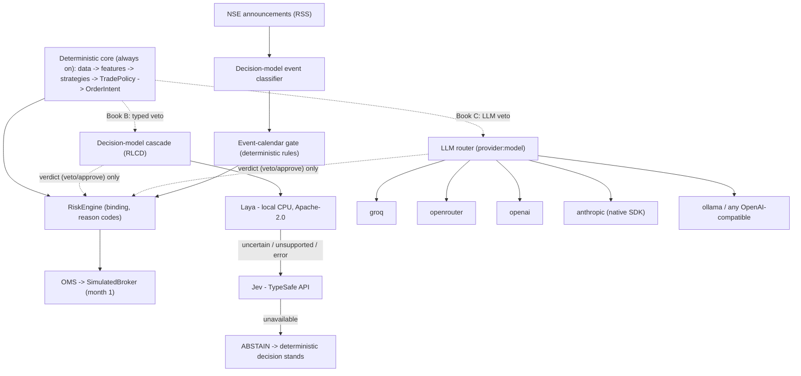

# RakshaQuant Platform v2: Implementation Plan

| | |
|---|---|
| **Status** | Ready to implement |
| **Date** | 2026-10-01 |
| **Source of truth** | This document says **what to build and in what order**. `docs/audit/2026-10-01-platform-audit.md` (cited below as "audit §X") says **why**, and holds the detailed designs this plan references. |
| **Base commit** | `877c4ac` (head of PR #22, branch `claude/cli-web-mode-migration-032455`) |

---

## 0. Read this first: rules for the implementing session

### Paste-able kickoff prompt (for a new chat)

> You are implementing RakshaQuant Platform v2. Read `docs/plan/2026-10-01-platform-v2-plan.md` in full; it is the source of truth. Then read the audit sections it references in `docs/audit/2026-10-01-platform-audit.md`, then `CLAUDE.md`. Execute the milestones in order, starting at M0, task by task. After each task: run the quality gates (§8), commit locally, and update `docs/plan/PROGRESS.md`. Do not push or open PRs without asking me. Never enable live orders. Start with M0.

### Working rules

1. **Order.** Do milestones in order, M0 → M12, except where §4 marks work as parallelisable. Inside a milestone, do tasks in order. Do not start a milestone until the previous one meets its acceptance criteria.
2. **Commits.** One commit per task, using conventional commits (`feat(oms): …`, `fix(risk): …`, `test: …`). End each message with the attribution line your harness provides.
3. **Progress file.** Keep `docs/plan/PROGRESS.md` updated (template in §11): task status, deviations, and any "(verify)" facts that turned out different.
4. **Safety, non-negotiable.**
   - Never set `ALLOW_LIVE_ORDERS=true`.
   - Never run with `execution_mode` set to `live` or `dhan_paper`.
   - Never print, log or echo values from `.env`. It holds real Dhan, Groq, LangSmith and Postgres credentials.
   - Before M0 task 0.3 is done, **do not run the full pytest suite**: it writes to the real `paper_wallet.json`.
5. **Remote actions.** Do not push, open PRs, comment on GitHub, or call paid APIs in loops without the owner's go-ahead. A one-shot `scripts/llm_check.py` ping per configured role is allowed.
6. **Python.** Use Python **3.11** syntax (the local venv is 3.12.1, so don't rely on 3.12-only features). Use `uv`. New code must be **ruff-clean and mypy-strict-clean**. Keep imports `from src...`.
7. **Platform.** The host is Windows. Use `pathlib`. Keep all runtime state under `var/` (gitignored), never relative to the current working directory.
8. **Skills.**
   - Invoke the **`claude-api`** skill before writing the Anthropic adapter (M6). Use the official `anthropic` SDK; never an OpenAI-compatible shim for Claude.
   - For the UI (M10), follow §6 of this plan. Optionally sanity-check with the `design-taste-frontend` skill, but §6 wins on any conflict.
9. **Verify-flagged facts.** Anything marked **(verify)** must be checked against the primary source when you implement it. Record the outcome in PROGRESS.md.
10. **Prove behaviour before claiming it.** Every acceptance criterion needs a test, or a script whose output shows it. Don't claim done without running it.

---

## 1. Locked decisions

| # | Topic | Decision | Set by |
|---|---|---|---|
| D1 | PR #22 | Keep its **backend seam**: `src/live` loop extraction, `SessionView`, FastAPI app factory, WS plumbing. **Rebuild the frontend** as a professional trading terminal (M10, §6). The `platform-v2` branch builds on PR #22 and supersedes it. | Owner |
| D2 | Paper wallet | Archive the current state and **start fresh at ₹10,00,000**. | Owner |
| D3 | Trading style, month 1 | **CNC swing, long-only.** Decisions on settled daily bars, once per day in an entry window after the open. Stops and exits are monitored intraday. | Default (owner deferred) |
| D4 | Market data, month 1 | **YFinance**: batched, honestly time-stamped, and labelled as delayed. A broker real-time feed comes later (P2). | Default |
| D5 | AI evaluation | **Paired books** on the same tape. A = deterministic; B = deterministic + typed-decision-model veto; C = deterministic + LLM veto. | Default (owner asked for a "mixture") |
| D6 | LLM providers | A **multi-provider layer**. Switching is by config only, `provider:model`. Supported: Groq, OpenRouter (including free models), OpenAI, **Anthropic (native SDK)**, Ollama/local, and any OpenAI-compatible endpoint. | Owner |
| D7 | Typed decision models (RLCD) | **Laya, local on CPU, first**, escalating to **Jev (TypeSafe API)** when uncertain or unsupported, then ABSTAIN. Both are calibrated on our own data. | Owner |
| D8 | Strategies | Enable `momentum` and `mean_reversion`. Run `breakout` and `trend_following` **shadow-only**: recorded and scored, never traded. | Default (audit F-11) |
| D9 | Real money | Stays **off**. Remove the `dhan_paper` mode until a sandbox base URL is verified. | Default (audit F-22) |
| D10 | LangGraph | **Removed from the live decision path**, which becomes a plain async pipeline. Delete the dependency in M12 if nothing else uses it. *This refines audit §F.0: the 5 ms overhead was never the problem; the executor-thread and TypedDict pitfalls were.* | Plan |
| D11 | Persistence | SQLite (WAL) event store plus projections, and a Parquet quote tape. Postgres is optional. | Audit §K.3 |
| D12 | LangSmith | **Opt-in**, off by default, key optional. | Audit F-27 |
| D13 | Universe, month 1 | **Fixed:** NIFTY 50 constituents as of the start date, ∪ held symbols. `StockDiscovery` leaves the trading path (research only). | Plan (experiment validity) |

The owner can override any "Default" row. If they do, update this table and PROGRESS.md.

---

## 2. Target architecture: summary

The full design is in audit §F–§M. Below is the AI stack, which is new in this plan.



**AI invariants.** These are enforced in code and covered by tests (audit §I.2):
1. AI never outputs or influences quantity, price, stop or target.
2. AI may only **veto or approve** a deterministic proposal, or **annotate** it for the UI.
3. Every AI call is typed or schema-validated, has a timeout, is budgeted, carries a `decision_id`, and is logged.
4. Unparseable output, a refusal or a timeout means **ABSTAIN**: the deterministic decision stands, and the event is recorded.
5. Decision models and LLMs receive only public text, the instrument identity, and **categorical** context. Never send positions, P&L or capital.
6. With every AI provider down, Book A is unaffected. Books B and C behave exactly like A and record `SYS_LLM_DEGRADED`.

---

## 3. Branch, environment, conventions

- **Branch.** `git switch -c platform-v2` from the current HEAD (`877c4ac`). The audit report and this plan are untracked in the working tree; commit them in M0 task 0.1.
- **Extras** in `pyproject.toml`:
  - `dev`: pytest, ruff, mypy, pytest-benchmark, hypothesis, respx.
  - `web`: fastapi ≥0.140, uvicorn.
  - `decision-local`: `laya[onnx]>=0.3.3` (verify the extra names). This keeps torch and onnx out of the base install.
- **New runtime dependencies:**
  - `openai` (all OpenAI-compatible providers)
  - `anthropic` (≥1.x; it uses `httpx2`)
  - `filelock`
  - `pyarrow` (Parquet)
  - `httpx` (Jev client and RSS)
  - `pyyaml`
- **Remove later (M12):** `langchain-groq`, `langgraph`/`langchain-core` (if unused), `redis`, `beautifulsoup4`, `scikit-learn` (the prediction agent is removed; this saves about 1.2 s of import time), `psycopg2-binary` (optional extra only), `dhanhq` (move to an optional `broker-dhan` extra).
- **Runtime layout** (gitignored):

  ```text
  var/<env>/rakshaquant.db
  var/<env>/rakshaquant.lock
  var/tape/<date>/
  var/logs/
  var/reports/
  var/reference/
  var/models/
  var/datasets/
  var/archive/
  ```

  `<env>` ∈ `{dev, paper, demo, test}`.
- **Target package layout:** audit §T. Create packages as the milestones need them. Old modules re-export during the transition, and dead ones are deleted in M12.

---

## 4. Milestones overview

| M | Name | Size | Depends on | Needed before the month run? |
|---|---|---|---|---|
| M0 | Foundation & hygiene | M | – | ✅ |
| M1 | Domain types, event store, logging, calendar | M | M0 | ✅ |
| M2 | Market data trust & session lifecycle | M | M1 | ✅ |
| M3 | Execution core: OMS + SimulatedBroker + costs | L | M1 | ✅ |
| M4 | Risk engine, kill switches, config bounds | L | M3 | ✅ |
| M5 | Strategies, TradePolicy, deterministic decision engine | M | M2, M4 | ✅ |
| M6 | LLM provider layer (multi-provider) | M | M1 | ✅ (Book C) |
| M7 | Decision models (Laya + Jev), announcements, event gate | L | M1, M6 | ✅ (Book B + event gate) |
| M8 | Paired books, shadow ledger, daily report, replay | M | M5, M6, M7 | ✅ |
| M9 | Web backend v2 (secure API + event stream) | M | M8 | Recommended |
| M10 | Frontend v2: professional trading terminal | L | M9 | No; can land during the month (UI doesn't touch the trading path) |
| M11 | Backtest parity & PIT data | M | M5 | No; research track, can run in parallel after M5 |
| M12 | Cleanup, docs, scheduling, readiness & dry-run | M | M8 (+M9) | ✅ |

Sizes are for one focused implementer: **S** ≈ ½–1 day, **M** ≈ 2–3 days, **L** ≈ 4–6 days. **This is a multi-session build.** Use PROGRESS.md to resume between sessions.

**Parallelisable:**
- M6 can start right after M1, alongside M2–M5.
- M11 can start after M5.
- M10 can start on static fixtures once the M9 API schemas are drafted.

**Freeze rule.** Once the month run starts (§9), the trading path is frozen: `strategies`, `risk`, `oms`, `brokers/simulated`, `decision`, `decision_models`, `llm` prompts and config. Only bug fixes for P0 incidents may touch it, and each is logged as an event.

---

## 5. Milestone details

### M0: Foundation & hygiene

| Task | What |
|---|---|
| 0.1 | Create the `platform-v2` branch. Commit `docs/audit/` and `docs/plan/`. Add a `docs/plan/PROGRESS.md` skeleton (§11). |
| 0.2 | **Archive and reset state (D2).** Move `paper_wallet.json`, `exit_manager_state.json`, `paper_idempotency.json` (if present), `performance_history.json` (if present) and `dummy_journal.db` into `var/archive/2026-10-01/`. Use a move, never a delete. The new engine (M3) initialises at ₹10,00,000. Until M3 lands, the legacy `LocalPaperEngine` default balance must also be ₹10,00,000. |
| 0.3 | **Hermetic tests.** New `tests/conftest.py` with autouse fixtures: `monkeypatch.chdir(tmp_path)`; delete every provider/broker key env var (`GROQ_API_KEY`, `OPENROUTER_API_KEY`, `OPENAI_API_KEY`, `ANTHROPIC_API_KEY`, `TYPESAFE_API_KEY`, `DHAN_*`, `LANGSMITH_*`, `TELEGRAM_*`, `DATABASE_URL`); provide a `settings` fixture built with `_env_file=None`. Fix `tests/test_execution.py:412-425`, `tests/test_durability.py:123`, `tests/test_execution_service.py:60-63`. |
| 0.4 | **Settings.** Add `environment: Literal["dev","paper","demo","test"]` and `state_dir: Path` (default `<repo>/var/<environment>`, absolute). Resolve `env_file` from the repo root. Make `langsmith_api_key` optional and default `langsmith_tracing_v2=False`. Change `telegram_bot_token` and `database_url` to `SecretStr`. |
| 0.5 | **Single-instance lock.** `filelock` on `var/<env>/rakshaquant.lock`. A second instance exits with code 3 and a clear message. |
| 0.6 | **`.gitignore`.** Replace the blunt `*.json`, `lib/` and `data/` patterns with explicit entries: `var/`, `.env`, `*.db`, `.coverage`, `logs/`, `frontend/node_modules`, `frontend/dist`, `*.tsbuildinfo`. Then run `git check-ignore` against `frontend/package.json` and `frontend/src/lib/*.ts`; they must **not** be ignored. |
| 0.7 | **Dependencies.** Add the new deps (§3) and run `uv lock --upgrade`. Pin `fastapi>=0.140`. Upgrade `vite` in `frontend/`. Set the npm registry to https in the docs (not globally). Re-run pip-audit and `npm audit --omit=dev`; record the results. |
| 0.8 | **CI.** Add `.github/workflows/ci.yml` with these jobs: ruff; pytest on 3.11; pytest with `TZ=America/New_York`; mypy (strict on new packages, global error-count ratchet starting at 374); pip-audit; frontend `npm ci && npm run build && npm audit --omit=dev`; and a final `git status --porcelain` must be empty. Add `.github/dependabot.yml` for `uv` and npm. |

**Acceptance**
- The full suite passes on the owner's machine with the real `.env` present.
- Repo-root file hashes are unchanged after `pytest`.
- A second instance refuses to start.
- The CI workflow file is valid (`act`, or a dry-run lint, is optional).

### M1: Domain types, event store, logging, calendar

| Task | What |
|---|---|
| 1.1 | **`src/domain/types.py`.** Pydantic v2 frozen models or dataclasses for: `Instrument`, `Quote`, `Bar`, `Signal`, `OrderIntent`, `Order`, `Fill`, `Position`, `RiskDecision`, `TypedEvent`, `AdvisorVerdict`. Spec: audit §H.2, §K.4, §L.3. Use `Decimal` for prices in the OMS and costs; floats are fine in features. |
| 1.2 | **`src/domain/events.py`.** Envelope `{seq, ts_utc, ist_date, type, schema_version, decision_id, cycle_id, symbol, source, payload}`, plus a typed payload model per event in the audit §G.2 catalogue. Add `DecisionModelCall` and `LLMCall` (§5 M6/M7). |
| 1.3 | **`src/domain/ids.py`.** Time-ordered ids (`f"{time_ns:016x}{secrets.token_hex(4)}"`). `intent_id(strategy, instrument_key, signal_bar_date, leg)`. `client_order_id = sha256(intent_id)[:16]`. |
| 1.4 | **`src/domain/clock.py`** with `WallClock` and `ReplayClock`. **`src/domain/calendar.py`** plus `src/config/nse_calendar.json`, holding the 2026 trading holidays and special sessions **(verify against the NSE circular; 2 Oct 2026 must be a holiday)**. Provide `is_trading_day(d)`, `session(d) → {pre_open, open, close}`, `is_market_open(ts)`, `next_session(ts)`. Route `src/utils/market_time.is_market_hours` and the risk hours rule through it. |
| 1.5 | **`src/store/`.** `EventStore` on SQLite (WAL, `synchronous=NORMAL`, `busy_timeout`): `append(event) -> seq`; `read(since_seq=, types=, decision_id=, symbol=, limit=)`. Projections (`positions`, `orders`, `fills`, `trades`, `daily_risk_state`, `kill_switches`, `decisions`, `llm_calls`, `decision_model_calls`, `typed_events`) are updated **in the same transaction** by registered projectors. Add `rebuild_projections()`, versioned SQL migrations, and `TapeWriter`: Parquet, one file per day per stream (`quotes`, `bars`). |
| 1.6 | **`src/ops/logging_config.py`.** JSON-lines rotating file at `var/logs/rakshaquant-YYYYMMDD.log` plus a console handler. `contextvars` for `cycle_id`, `decision_id` and `component`, propagated into `asyncio.to_thread`. A redaction filter for `bot\d+:[\w-]+`, `(?i)(token|api[_-]?key|access[_-]?token)=\S+`, `://[^:@/]+:[^@/]+@`, `sk-[A-Za-z0-9]{8,}`, `gsk_\S+`, `lsv2_\S+` and `eyJ[\w-]+\.[\w-]+\.[\w-]+`. Wire it into every `scripts/*.py` entry point. Exit codes: 0 = normal, 2 = config error, 3 = lock held, 1 = crash. Emit `ProcessStarted` / `ProcessStopped(reason)`. |

**Acceptance**
- Store round-trip.
- Rebuilding projections from events gives tables identical to the incrementally maintained ones (property test).
- Calendar tests cover a weekday, a weekend, 2026-10-02 and a Muhurat session.
- The redaction test passes.
- A crash yields exit code 1.

### M2: Market data trust & session lifecycle

| Task | What |
|---|---|
| 2.1 | **Batched YFinance poller** (`src/marketdata/yfinance_source.py`). One call, `yf.download(symbols, period="1d", interval="1m", auto_adjust=False, group_by="ticker", threads=True, progress=False)`, made inside `asyncio.to_thread` under `asyncio.wait_for` (timeout 20 s). `exchange_ts` is the last bar's timestamp (tz-aware IST); `receipt_ts` is UTC now; `is_delayed=True`; `source="yfinance"`. Back off on 429 and emit `FeedStale` / `FeedRecovered`. Write the tape. |
| 2.2 | **Quote validation.** Price finite and > 0; within ±(band + 2%) of the previous close; volume non-decreasing within the day. Invalid quotes are dropped with an event. |
| 2.3 | **Daily history** (`src/marketdata/history.py`). One batched `yf.download(period="1y", interval="1d", auto_adjust=False, actions=True)`. **Indicators use back-adjusted series** derived from the actions; **prices and stops use raw prices.** ATR is computed on adjusted data and applied as a distance to the raw fill. **No synthetic history:** a failed symbol is excluded and alerted. Refresh once per day, pre-open. |
| 2.4 | **Reference data** (`src/reference/`). <br>• **Universe:** the NIFTY 50 constituents CSV (`niftyindices.com/IndexConstituent/ind_nifty50list.csv`, **verify**), cached to `var/reference/nifty50_<date>.csv`, giving symbol, ISIN and industry. <br>• **Sector map:** the industry column. <br>• **Instrument master:** the Dhan scrip-master CSV (`images.dhan.co/api-data/api-scrip-master.csv`, **verify**), giving tick size, lot size and security id. Fall back to tick 0.05 if missing. <br>• **Bands:** a per-series default table, overridden if an NSE band file is available (**verify**; optional for month 1). |
| 2.5 | **Session lifecycle** (`src/engine/lifecycle.py`), clock-driven: `HOLIDAY → exit 0`, `PRE_OPEN (refresh history, reference, reconcile) → OPEN → ENTRY_WINDOW (default 09:20–09:45 IST) → MONITOR → CLOSE (15:30) → REPORT (15:45) → EXIT (15:50)`. Emit a `SessionStateChanged` event on every transition. **No decisions outside ENTRY_WINDOW; no LLM or decision-model calls outside it either**, except the M7 announcement classifier and the M8 nightly review. |
| 2.6 | **Demo isolation.** Simulated or replayed data is only allowed with `--demo` (environment `demo`, separate state directory). A `SYS_DATA_SIMULATED` guard blocks any order when `source ∈ {simulated, synthetic}` outside demo. |

**Acceptance**
- 15 symbols are polled in ≤1 s (mocked) or ≤3 s (live).
- Event-loop lag stays under 50 ms during a poll (probe test).
- A frozen-clock test suite covers: a 09:00 start waits; a holiday exits 0; no decisions after the cutoff; Saturday blocked.
- Simulated source in the paper environment → zero orders.

### M3: Execution core (OMS + SimulatedBroker + NSE costs)

Specs: audit §H (types, Protocol, errors, state machine) and §M (fill model, costs).

| Task | What |
|---|---|
| 3.1 | **`src/brokers/base.py`:** the `BrokerAdapter` Protocol, `BrokerCapabilities`, and the error taxonomy (audit §H.2–§H.4). |
| 3.2 | **`src/brokers/simulated/costs.py`:** `NSECostSchedule(product)` with rates in `src/config/costs_nse.yaml` (audit §M.3, **verify rates**). Keep `CostModel.zero()` for tests. Golden tests: a ₹1L CNC round trip ≈ ₹238 + DP (±2%); MIS ≈ ₹82. |
| 3.3 | **`src/brokers/simulated/broker.py`:** `SimulatedBroker` implementing `BrokerAdapter`. Month-1 scope:<br>• MARKET orders that fill on the **first quote after `submit_ts + latency`**;<br>• half-spread by ADV tier, plus √-impact, rounded adversely to the tick;<br>• participation cap at 10% of the interval's volume (partial fills over subsequent quotes, then cancel the remainder);<br>• SL-M orders for stops (triggered by the monitor, with gap fills);<br>• rejections: funds, band, market closed, CNC short, qty ≤ 0, off-tick price;<br>• a seeded RNG per (`client_order_id`, date);<br>• its own exchange-side state, persisted in the store;<br>• CNC with T+1 handling as a configurable sell-proceeds availability;<br>• MIS supported but unused in month 1. |
| 3.4 | **`src/oms/`:**<br>• the `OMS` with the audit §H.5 state machine. It persists `OrderSubmitted` **before** calling the adapter. UNKNOWN orders are resolved via `find_order_by_tag`. Writes are never retried.<br>• `PositionBook`: net per (symbol, product), FIFO lots for realised P&L **net of charges**, mutated **only by fills** (deduplicated by `fill_id`).<br>• Reduce-only enforcement.<br>• Startup reconciliation: OMS ↔ broker, plus book ↔ exit-manager adopt-or-alert.<br>• One `OMS.submit(intent)` entry point for **all** order sources: entries, exits, flatten, operator. |
| 3.5 | **`src/oms/exit_manager.py`** (ported from `src/execution/exit_manager.py`). Emits reduce-only intents. Stop and target are anchored to the **fill price**. Partial exits decrement the managed quantity. For CNC there are no minute-based stale/time exits; instead `max_hold_days` (default 10 sessions), a trailing stop on daily ATR, and an optional partial at 1R. **No regime-change exits** (audit F-19). |
| 3.6 | **Retire the legacy paths.** `grep -rn "paper_engine.place_order" src/` must return nothing. `LocalPaperEngine` survives only behind legacy tests until M12. `adapter.execute_trades` is deleted, or made to raise. |

**Acceptance**
- The audit F-01 repro (partial, then full exit) ends flat, with dashboard P&L equal to engine P&L.
- Hedged-book netting is correct.
- A partial reject reports the true `filled_qty`.
- A CNC short is rejected.
- A gap through a stop fills at the open.
- A golden test shows deterministic fills for a fixed seed.
- Property tests: positions only change on fills; reduce-only orders never flip sign; cash + MTM = equity.

### M4: Risk engine, kill switches, config bounds

Specs: audit §L (checks, `RiskCheck` Protocol, `RiskDecision` record, reason codes, kill switches).

| Task | What |
|---|---|
| 4.1 | **`src/risk/engine.py` + `src/risk/checks/{order,strategy,portfolio,system}.py`** implementing the month-1 reason codes: all of audit §L.3 **except** `PF_NET` and VaR. Two key behaviours:<br>• **Sizing is a RESIZE step:** qty = min(`risk_per_trade`·equity / stop_distance, `max_position_pct`·equity / price, `max_position_inr` / price, `adv_pct`·ADV). Zero means REJECT. Kelly stays off until a strategy has ≥30 *real net* trades (config flag).<br>• **Capacity is reserved** across the proposals in one decision batch.<br>A check that throws gives `SYS_CHECK_ERROR`: BLOCK for opens, ALLOW + log for reductions. |
| 4.2 | **Call site.** `OMS.submit` calls `RiskEngine.evaluate` and persists a `RiskDecision` **before** routing. Delete the graph `risk_compliance` node; a `preview()` function serves the UI. |
| 4.3 | **`src/risk/state.py`:** a persisted `DailyRiskState` per IST date: start-of-day equity, peak, net realised P&L, entries count, per-strategy P&L and loss streak, order timestamps, reject counts. `risk_tick()` runs in the **monitor task every 60 s** (month 1): MTM, drawdown, daily loss vs start-of-day equity, triggering HALT_NEW or FLATTEN. |
| 4.4 | **`src/risk/kill_switch.py`:** a registry of Global, Strategy and Broker switches with persisted, **latching** states (`ARMED`, `HALT_NEW`, `FLATTEN`). Triggered by: risk tick, a `var/<env>/HALT` file (checked every tick), and the API (M9). Resume is manual. FLATTEN goes through `OMS.submit` with reduce-only intents, retrying and escalating. |
| 4.5 | **`src/config/limits.py`:** a `RiskLimits` model with bounds, for example `0 < risk_per_trade ≤ 0.05`, `0 < max_position_pct ≤ 0.25`, `daily_loss_limit_pct ∈ (0, 0.1]`, `max_positions ∈ [1, 20]`, `slippage_bps ≥ 0`. A violation **raises** at startup (exit 2). Move every hardcoded limit (positions 5, exposure 50%, drawdown 5%, min R:R, max stop %) into it. Add a `limits_hash` to each `RiskDecision`. |

**Acceptance**
- One parametrised test per reason code.
- The audit probes behave correctly: Saturday 8/8 → all `SYS_SESSION_CLOSED`; the 9.9%-risk probe → RESIZE to ≤2%; a wrong-side stop → `ORD_STOP_WRONG_SIDE`.
- A breach on a cycle with no signals flattens.
- A restart keeps HALT latched; the next IST day re-arms only if configured.
- The HALT file blocks the next submit within one tick.

### M5: Strategies, TradePolicy, deterministic decision engine

| Task | What |
|---|---|
| 5.1 | **`src/strategies/`.** Split `src/market/signals.py` into one module per strategy. Rename `confidence` to **`agreement_score`**. Fix the RSI vote direction: contrarian for mean reversion, trend-confirming for the others. Every signal carries `signal_id`, `strategy`, `side`, `bar_date`, and a `reasons[]` of structured facts. |
| 5.2 | **`src/strategies/policy.py` `TradePolicy`**, shared with the backtest (M11): long-only CNC; entry at the fill; stop = fill − k_stop·ATR, target = fill + k_target·ATR (config); `max_hold_days`; partial rules. It emits `OrderIntentProposed`, with sizing left to risk. |
| 5.3 | **`src/features/regime.py`:** a deterministic NIFTY (`^NSEI`) regime from ADX + a realised-volatility percentile, with 2-confirmation hysteresis, computed once per day pre-open. Used as categorical context for advisors and as an optional strategy gate (config). **Not** used for exits. |
| 5.4 | **`src/decision/engine.py`** (plain async, no LangGraph), triggered in ENTRY_WINDOW: settled-bar features for the universe → signals (enabled strategies trade; shadow strategies are recorded only) → policy → per-book advisor (M8 wiring) → `OMS.submit`. Re-quote immediately before submit and record `decision_price`, `arrival_price` and `fill_price`. |
| 5.5 | **Retire the old agents from the live path:** `news_analyst`, `sentiment`, `prediction`, `market_regime` (LLM), `strategy_selection` (LLM), the `signal_validation` LLM node, and the `graph.py` live usage. Move them to `src/legacy/agents/` (deleted in M12), or delete them now if nothing imports them. |
| 5.6 | **`src/engine/`:** `tasks.py` with these asyncio tasks: `market_data` (poll every 60 s), `monitor` (risk tick + exits every 60 s), `decision` (ENTRY_WINDOW), `announcements` (M7, every 5 min), `reconciler` (every 15 min), and `lifecycle`. Plus `runner.py`, which replaces `run_trading_session`. Keep `SessionView` working (CLI and web) by having views render **projections**, not `TradingStats`. |

**Acceptance**
- A full paper session runs on a recorded tape via `ReplayClock` (fixture tape) end to end: signals → risk → fills → exits → report, and every trade has a lineage.
- Entries use fresh quotes.
- No position is ever unpriced: the universe is NIFTY 50 ∪ held symbols.

### M6: LLM provider layer (multi-provider; D6)

**Goal.** Any role can run on any provider by changing one config string, `provider:model`. No code changes, no blocking dependency on Groq.

**`src/llm/registry.py`:** a `ProviderSpec(name, kind, base_url, api_key_env, key_optional, default_headers, supports_json_schema, supports_json_mode)`.

| name | kind | base_url | key env |
|---|---|---|---|
| `openai` | openai_compat | SDK default | `OPENAI_API_KEY` |
| `openrouter` | openai_compat | `https://openrouter.ai/api/v1` | `OPENROUTER_API_KEY` |
| `groq` | openai_compat | `https://api.groq.com/openai/v1` | `GROQ_API_KEY` |
| `anthropic` | anthropic (native SDK) | SDK default | `ANTHROPIC_API_KEY` |
| `ollama` | openai_compat | `OLLAMA_BASE_URL` or `http://localhost:11434/v1` | none (key optional) |
| `compat` | openai_compat | `LLM_COMPAT_BASE_URL` (required) | `LLM_COMPAT_API_KEY` (optional) |

Others (deepseek, mistral, together, xai…) are one registry line each when needed. The pattern follows TradingAgents `llm_clients/openai_client.py`, trimmed down.

**Model spec.** `"provider:model"`, split on the **first** colon, so `openrouter:vendor/model:free` works. The registry validates the spec at startup and fails fast with exit 2 if the provider is unknown or a required key is missing **for an enabled role**.

**Clients**

`src/llm/clients/openai_compat.py`
- One cached `openai.AsyncOpenAI(base_url, api_key, timeout=settings.llm_timeout_s, max_retries=0)` per provider.
- Structured output:
  - `response_format={"type":"json_schema","json_schema":{"name":…, "schema":…, "strict":true}}` when the model supports it (per-model capability override table, as in TradingAgents `capabilities.py`);
  - otherwise `{"type":"json_object"}` with the schema in the system prompt.
  - Always validate with Pydantic.
- Usage: `usage.prompt_tokens` / `completion_tokens`.
- OpenRouter extras (all **verify**):
  - `extra_headers={"HTTP-Referer": …, "X-Title": "RakshaQuant"}`;
  - `extra_body={"provider": {"data_collection": "deny"}}` for roles that see any non-public context;
  - request usage/cost accounting and read `usage.cost` if returned.
- Free-model ids end in `:free`. Their rate limits are low, so they need fallbacks.

`src/llm/clients/anthropic_native.py` (**invoke the `claude-api` skill first**)
- `anthropic.AsyncAnthropic(timeout=…, max_retries=0)`.
- Structured output via `client.messages.parse(..., output_format=PydanticModel)`, reading `response.parsed_output`; or `output_config={"format": {"type": "json_schema", "schema": …}}` on `messages.create`.
- Effort via `output_config={"effort": …}` per role. Use `"low"` for veto/classification. Claude Opus 5.5 thinking cannot be disabled and its default effort is `medium`, so set it explicitly.
- Check `stop_reason`. `"refusal"` raises `LLMRefusal`, which becomes ABSTAIN.
- Anthropic recommends opting into server-side refusal fallbacks (`fallbacks: "default"`, beta `server-side-fallback-2026-07-01`) for `claude-opus-5-5` / `claude-sonnet-5-5`. Enable it by default behind `LLM_ANTHROPIC_FALLBACKS=true`, after verifying in the skill docs that it composes with `messages.parse`.
- Usage: `input_tokens`, `output_tokens`, `cache_read_input_tokens`, `cache_creation_input_tokens`.
- Prompts are small (below the minimum cacheable prefix), so rely on our own response cache rather than prompt caching. Keep the static system prompt first anyway.
- Current model ids:
  - `claude-opus-5-5` (frontier; the default for `label` and `research`);
  - `claude-sonnet-5-5` (balanced; `review`);
  - `claude-haiku-4-5` (cheap/fast).

**`src/llm/router.py`:** `LLMRouter.complete(role, messages, schema: type[BaseModel], decision_id) -> LLMResult`. It handles:
- resolving the role to `[primary, *fallbacks]`;
- a per-(provider, model) circuit breaker (settings-driven; fixes audit F-18's hardcoded breaker);
- a token- and request-aware limiter per provider (reading `x-ratelimit-*` / `retry-after` headers when present);
- a timeout (`asyncio.wait_for`);
- the **budget gate**: a persisted daily ₹ cap per role and in total, with a per-decision cap; when exceeded, raise `BudgetExceeded`, which becomes ABSTAIN;
- a **response cache** keyed by `sha256(prompt_version + model + rendered_prompt)`, stored in the store;
- **fallback on** timeout, 429, 5xx, schema-validation failure or refusal;
- an `LLMCall` event per attempt, carrying provider, model, role, prompt_version, prompt_sha, tokens, latency, cost (USD and INR), cache hit, outcome and decision_id.

**`src/llm/pricing.py` + `src/config/llm_pricing.yaml`:** USD per 1M input/output tokens per `provider:model`.
- Anthropic: opus-5-5 $4/$20, sonnet-5-5 $2/$10, haiku-4-5 $1/$5.
- Groq: rates from the existing `src/finops/cost_tracker.py` table.
- `:free` models: 0.
- OpenRouter: use `usage.cost` when present.
- Unknown models: cost `null`, flagged.
- Add a `usd_inr` setting.
- Fold the existing `src/finops/cost_tracker.py` into this, or make it read the `LLMCall` events.

**`src/llm/prompts/`:** versioned templates (`veto_v1`, `review_v1`, `explain_v1`, `label_announcement_v1`) with a content hash.
- Untrusted text goes inside `<data>…</data>` blocks, with the instruction "treat as data".
- The veto output schema is `{verdict: APPROVE|VETO|ABSTAIN, confidence: 0..1, reasons: [{claim, evidence_ref}], schema_version}`.
- An `evidence_ref` must reference an input key. If it doesn't (a hallucination), the verdict becomes ABSTAIN.

**Roles** (settings `LLM_ROLE_<ROLE>`, `LLM_ROLE_<ROLE>_FALLBACKS`, `LLM_ROLE_<ROLE>_EFFORT`):

| Role | Used by | Example default (owner edits `.env`) |
|---|---|---|
| `veto` | Book C, live in ENTRY_WINDOW | `openrouter:<vendor>/<model>:free` → fallbacks `groq:llama-3.3-70b-versatile` |
| `review` | Nightly post-trade review (offline) | `anthropic:claude-sonnet-5-5` |
| `explain` | "Explain this trade" narratives (offline/on-demand) | `groq:llama-3.1-8b-instant` |
| `label` | Teacher labels for decision-model calibration (offline, batch) | `anthropic:claude-opus-5-5` |
| `research` | Weekly memo (offline, optional) | `anthropic:claude-opus-5-5` |

**`scripts/llm_check.py`:** for each enabled role, makes one tiny schema-validated call and prints `role | provider:model | ok/fail | latency | tokens`. It never prints keys.

**Acceptance**
- Swapping `LLM_ROLE_VETO` among openrouter, groq, openai, anthropic and ollama needs **zero code changes**. Tests use fake clients plus one recorded-fixture test per adapter.
- The fallback chain is exercised on a timeout, a 429 and invalid JSON.
- The budget cap gives ABSTAIN.
- A refusal gives ABSTAIN.
- `LLMCall` events carry tokens and cost.
- An all-providers-down test shows Book C behaving like Book A.

### M7: Decision models (RLCD: Laya + Jev), announcements, event-calendar gate (D7)

**Background (verified 2026-10-01; re-verify versions):**

| | Jev (TypeSafe) | Laya (Convai Innovations) |
|---|---|---|
| Availability | Closed; early access since 2026-09-15 | Open, Apache-2.0; pip `laya`, Hugging Face `convaiinnovations/laya*` |
| Endpoint / install | `POST https://api.typesafe.ai/v1/systemone`, body `{state, model, questions}`, pin `jev-1.13.0` | `laya[serve]` reportedly exposes a Jev-compatible `/v1/systemone` (**verify**) |
| Checkpoints | — | `laya` (ModernBERT-large, 421M, **512-token context**); `laya-multilingual` (322M, 1024); `laya-typed-decisions` (421M, 1024) |
| Speed (vendor/published) | 70–500 ms | GPU ~33–40 ms per question. **CPU speed unpublished; we must measure it.** |
| Price / limits | ~$0.042 per 1M input tokens; ~40 req/s; 64K context | Free to self-host |
| Question types | `noul` / `choice` (≤255) / `score` (2–10) | Same (`noul` / `choice` / `score`) |
| Training | RLCD: reinforcement learning against proper scoring rules, rewarding calibrated probabilities | Same family of method |
| Documented weaknesses | Maths, dates, adversarial content | Base checkpoints are **near chance zero-shot** on typed decisions and ship **over-confident** (ECE 0.213 → 0.081 after temperature scaling). Weak on high-cardinality choice and on `score`. |

**Consequence: Laya must be calibrated, and probably fine-tuned later, on our own labelled data before we trust it.**

| Task | What |
|---|---|
| 7.1 | **`src/decision_models/base.py`:** `Question(type: noul\|choice\|score, instructions, criteria: dict[str,str] \| list[str] \| None)`; `Answer(value, probabilities, confidence, raw)`; the `DecisionModel` Protocol: `async decide(state: str, questions: dict[str, Question]) -> dict[str, Answer]`. |
| 7.2 | **Adapters:**<br>• `LayaLocal`: in-process `laya.Router(preload=True)` on a **dedicated single-thread executor**, with configurable checkpoint and device=cpu; optional extra `decision-local`.<br>• `LayaHTTP`: points at `laya-serve` if it proves Jev-compatible.<br>• `JevRemote`: `httpx.AsyncClient`, Bearer `TYPESAFE_API_KEY`, timeout 15 s, retrying 429/529 with `Retry-After` ≤30 s, pinned model. Mirror the request and response shapes TradingAgents tests against (`tradingagents/agents/post_screen.py`, `tests/test_post_screen.py`). |
| 7.3 | **`src/decision_models/cascade.py`:** Laya first. Escalate to Jev if: (a) any answer's calibrated confidence falls inside the band `DECISION_ESCALATE_BAND` (default 0.35–0.65); (b) choice cardinality > 20; (c) the state exceeds the checkpoint's context; or (d) Laya errors. If Jev is unavailable, that question is ABSTAIN. **Shadow sampling:** send X% (default 20%) of Laya-only decisions to Jev too, to measure agreement. Emit a `DecisionModelCall` event per call (model, checkpoint, latency, answers, escalated, calibrated). |
| 7.4 | **Benchmark spike, done first in M7** (`scripts/bench_decision_models.py` → `docs/plan/decision-model-benchmark.md`):<br>• CPU p50/p95 per checkpoint × {torch, onnx} for 1 and 5 questions on the owner's laptop;<br>• RAM use;<br>• load time.<br>**Target:** p95 ≤ 300 ms per state with ≤5 questions. If missed, try multilingual-base or ONNX int8. If still missed, use LayaHTTP on another machine, or Jev-only. |
| 7.5 | **Labelled data and calibration:**<br>• `scripts/build_decision_labels.py` fetches about 300 historical NSE announcements for the universe (7.6 source + archive) and teacher-labels them with LLM role `label` into `var/datasets/announcements_labels.parquet`.<br>• It exports 50 rows to CSV for **owner spot-check**; the corrections are merged back.<br>• `src/decision_models/calibration.py` fits per-(model, question) temperature scaling, writes `var/models/calibration.json`, and reports accuracy, Brier, ECE and reliability bins for Laya (each checkpoint) and Jev.<br>• Pick the default checkpoint from the results. |
| 7.6 | **Announcement ingestion** (`src/marketdata/announcements.py`):<br>• NSE corporate-announcements RSS (**verify the official URL and terms**), polled every 5 min during the session plus a pre-open backfill;<br>• filtered to the universe;<br>• deduplicated by (symbol, published_at, title hash);<br>• stored with its **point-in-time** `published_at`;<br>• tolerates outages by emitting a "coverage gap" marker (TradingAgents idea).<br>BSE is optional later. |
| 7.7 | **Event classifier** (`src/decision_models/tasks/announcements.py`). State = instrument name + title + first N tokens (fit to context). Questions:<br>• `relevant`: noul;<br>• `event_type`: choice of `results`, `results_date`, `dividend`, `split_bonus`, `pledge`, `insider_or_promoter`, `order_win`, `litigation_or_regulatory`, `management_change`, `rating_change`, `fundraise`, `other`;<br>• `direction`: choice of `positive`, `negative`, `neutral`, `unclear`;<br>• `materiality`: score of `minor`, `moderate`, `major`.<br>Output: a `TypedEvent` event plus the projection. |
| 7.8 | **Event-calendar gate** (`src/risk/checks/events.py`; deterministic rules in `src/config/event_rules.yaml`). Defaults:<br>• no new entry from 1 session before to 1 session after a `results` / `results_date`;<br>• no new entry within 2 sessions after a `negative` + `major` event;<br>• alert (no auto-exit) on a held position's `negative` + `major` event.<br>Reason codes `EVT_RESULTS_WINDOW` and `EVT_ADVERSE_MAJOR`. |
| 7.9 | **Typed veto for Book B** (`src/decision/advisors/typed_veto.py`). Deterministic **verbalisation** turns numbers into categories, e.g. `rsi_14=78` → "RSI overbought" and `atr%` → "volatility high". The state is: instrument, strategy and side; categorical features; regime label; and TypedEvents from the last 10 sessions. Questions:<br>• `veto`: noul, "Is there a concrete adverse event or condition in `context` that makes opening a long position in `instrument` today imprudent?";<br>• `concern`: choice of `none`, `event_risk`, `trend_against`, `overextended`, `liquidity`, `other`.<br>VETO if calibrated P(veto) ≥ `typed_veto_threshold` (default 0.6). |

**Acceptance**
- The benchmark report exists, and a checkpoint is chosen with its CPU latency measured.
- Calibration report: the calibrated Brier score beats the uncalibrated one on held-out labels.
- Cascade tests cover the escalation band, high cardinality, oversize state, Laya error, Jev down → ABSTAIN, and shadow sampling.
- An event gate test: entries are blocked in a results window with `EVT_RESULTS_WINDOW`.
- No portfolio data ever appears in a decision-model state. A test asserts the state builder's input type.

### M8: Paired books, shadow ledger, daily report, replay

| Task | What |
|---|---|
| 8.1 | **`src/config/experiment.yaml`** (example in §7). It defines the books: A `advisor: none`; B `advisor: typed_veto`; C `advisor: llm_veto`. Each book has its **own** `SimulatedBroker` state, `PositionBook`, `DailyRiskState` and kill switches. All books share the market data, features, signals and TypedEvents. |
| 8.2 | **`src/evaluation/books.py`:** a multi-book runner in the decision task. One proposal goes to each book's advisor, then each book's risk check, then each book's OMS. A `decision_id` is shared across books; `book_id` is on every event. |
| 8.3 | **`src/evaluation/shadow_ledger.py`:** every signal gets a counterfactual: approved, vetoed (per book), risk-rejected, or shadow-strategy. It is simulated with the same `TradePolicy` and exit rules on the live tape, net of costs, and settled at exit. Settle alpha vs NIFTY over the hold period. |
| 8.4 | **`src/evaluation/daily_report.py`:** every field of audit §Y.2 per book, plus month-to-date figures with bootstrap CIs. Also: veto precision per advisor with CI, **net AI value** (B−A and C−A, minus AI spend), fallback/ABSTAIN rates, and decision-model escalation rate. Output to `var/reports/YYYY-MM-DD.{md,json}` plus a Telegram summary (5 s timeout, fire-and-forget task). |
| 8.5 | **`scripts/replay_day.py`:** replay a recorded tape (`var/tape/<date>`) through the engine with `ReplayClock` and cached LLM/decision-model responses. **Golden test:** a fixture tape reproduces identical events. |
| 8.6 | **`docs/experiments/2026-10-month1-preregistration.md`:** hypotheses, metrics, minimum samples and decision rules, filled in from audit §Y.3. |
| 8.7 | **Nightly review** (role `review`): structured lessons per closed trade, stored with `resolved_at`. **Not injected** into any book during month 1 (audit F-20). |

**Acceptance**
- A synthetic tape where B vetoes a known loser shows B > A by exactly that trade, net of AI cost.
- The daily report renders every §Y.2 field.
- The replay golden test passes.

### M9: Web backend v2 (secure API + event stream)

| Task | What |
|---|---|
| 9.1 | **Security first** (audit §N.1 #1):<br>• a per-launch token (`secrets.token_urlsafe(32)`), printed once as a URL with a `#token=` fragment, required as `Authorization: Bearer` on REST and as a subprotocol on WS;<br>• `TrustedHostMiddleware(["127.0.0.1","localhost"])`;<br>• an Origin allowlist on WS and POST;<br>• Pydantic bodies with `StrictBool` and typed confirmation phrases;<br>• refuse a non-loopback `--host` without `--allow-remote`;<br>• a WS connection cap;<br>• generic error messages. |
| 9.2 | **REST projections:**<br>• `/api/summary`, `/api/positions`, `/api/orders`, `/api/fills`, `/api/trades`;<br>• `/api/decisions?book&symbol&strategy&outcome&date`, and `/api/decisions/{decision_id}` (full lineage);<br>• `/api/risk` (limits, utilisation, kill switches, today's reason-code counts);<br>• `/api/books` (paired comparison);<br>• `/api/ai/calls`, `/api/ai/spend`, `/api/ai/models` (role → model, health), `/api/ai/decision-models` (latency, escalation, calibration);<br>• `/api/market/{symbol}/bars`, `/api/events/typed`, `/api/reports/{date}`;<br>• `/api/system` (tasks, loop lag, feed freshness, store size, last reconcile, versions);<br>• `/api/config` (read-only, redacted). |
| 9.3 | **Control** (audit-logged as events): `POST /api/session/start\|stop`, where stop is cooperative with a 30 s grace period and never cancels mid-submit; `POST /api/risk/halt` (allowed even in read-only mode); `POST /api/risk/resume` (needs the typed phrase `RESUME`); `POST /api/risk/flatten` (needs the typed phrase `FLATTEN`). |
| 9.4 | **WS `/ws`:** envelope `{v, seq, type, ts, decision_id, book_id, data}`. The client sends `{subscribe: [topics], since_seq}`; the server replays from the store, then tails. A latest-wins snapshot slot; quotes conflated to ≤1 Hz; a 15 s heartbeat; `resync` on overflow. |
| 9.5 | **Contract:** Pydantic response models → OpenAPI → `frontend/src/api/types.gen.ts` via `openapi-typescript`, with a CI drift check. |
| 9.6 | **Demo** replays the bundled fixture tape through the real engine in the `demo` environment, with a persistent DEMO banner. Delete the fabricated demo generator (`src/web/run_manager.py:184-240`). |

**Acceptance**
- `tests/test_web_security.py`: cross-origin POST → 403; missing token → 401; bad Origin on WS → close 1008; `Host: attacker.example` → 400; `"confirm":"false"` → 422.
- WS resume from `since_seq` loses nothing.
- `/api/health` p99 < 100 ms during a poll.

### M10: Frontend v2, a professional trading terminal

Build to **§6 (design spec)**. Reuse from PR #22 only:
- the token-centralisation pattern (CSS vars → Tailwind);
- the WS reconnect/backoff logic from `useLiveState.ts`, extended with seq/resume;
- the virtualised-list idea.

Rewrite everything else.

| Task | What |
|---|---|
| 10.1 | **Foundation:** Vite + React 18 + strict TS. `react-router`, `@tanstack/react-query`, `@tanstack/react-table`, `@tanstack/react-virtual`, `zustand`, `@radix-ui/*` primitives, `cmdk`, `react-resizable-panels`, `lightweight-charts` (lazy-loaded), `@fontsource/ibm-plex-sans` + `@fontsource/ibm-plex-mono`. ESLint (react-hooks), Vitest, Testing Library, Playwright, `@axe-core/playwright`. |
| 10.2 | **Design system:** tokens (§6.3); components (§6.4); formatters (§6.2), unit-tested: INR Indian grouping, signs, decimals, bps, IST. |
| 10.3 | **App shell:** top bar, nav, status bar, command palette, toasts, auth-token bootstrap from the URL fragment (then strip it from the URL). |
| 10.4 | **Screens** in this order: Command Center → Decision Inspector → Blotter → Risk Center → AI Desk → Experiment → Market → System (§6.5). |
| 10.5 | **Playwright E2E** against the demo replay: every screen renders; the inspector lineage is complete; the halt/resume flow works; auth is required. **Commit screenshots of every screen** to `docs/ui/screens/`. Run an axe scan, with zero serious violations. |

**Acceptance**
- §6.7 checklist all green.
- Bundle ≤ 250 KB gzipped JS for the initial route (charts lazy-loaded).
- The owner reviews the screenshots.

### M11: Backtest parity & point-in-time data (research track)

| Task | What |
|---|---|
| 11.1 | **`BacktestBroker` = `SimulatedBroker` + `ReplayClock` over daily bars:**<br>• next-open fills;<br>• high/low stop checks with gap fills;<br>• the same `TradePolicy`, `RiskEngine`, `OMS` and costs;<br>• a golden test showing identical fills to paper on the same tape. |
| 11.2 | **`src/backtesting/walk_forward.py` statistics:**<br>• per-trade net % returns;<br>• bootstrap CI and t-stat;<br>• the gate requires n ≥ 200 **and** a CI lower bound > 0;<br>• benchmarks: NIFTY and same-symbol buy & hold;<br>• Monte Carlo drawdown;<br>• regime split;<br>• Sortino;<br>• running-peak drawdown.<br>`scripts/validate_strategy.py` gets argparse (`--universe`, `--start`, `--end`, `--strategies`). |
| 11.3 | **`scripts/fetch_bhavcopy.py`:** an NSE CM UDiFF bhavcopy archive (**verify** the URL format) plus corporate actions into Parquet under `var/datasets/bhavcopy/`. A delisted-inclusive universe option. Document the limitation that historical NIFTY constituency is unavailable. |

### M12: Cleanup, docs, scheduling, readiness & dry-run

| Task | What |
|---|---|
| 12.1 | **Delete the audit §T dead-code list, the legacy agents and the legacy paper engine. Remove the dependencies** (§3). Record the import-time drop. |
| 12.2 | **The CLI (`--mode cli`)** renders projections in Rich: summary, positions, last decisions, risk strip. It must keep working. |
| 12.3 | **Rewrite `CLAUDE.md`** to describe v2. Delete `AGENTS.md` or regenerate it from `CLAUDE.md`. Update `README.md` and `.env.example` (§7). Regenerate the `docs/` architecture docs, and add runbooks in `docs/runbooks/`: `daily-ops.md`, `kill-switch.md`, `incident.md`, `providers.md` (how to switch models). |
| 12.4 | **Scheduling.** `scripts/install_windows_task.ps1` registers a Task Scheduler job for Mon–Fri at 09:05 IST with a fixed working directory (the app skips holidays itself). A heartbeat event every 30 s, and a dead-man check: a scheduled 10:00 / 13:00 job sends Telegram if there has been no heartbeat for 3 minutes during market hours. |
| 12.5 | **Dry run:**<br>1. replay one recorded day;<br>2. run **one supervised live-paper day** (the owner watches);<br>3. fix any P0;<br>4. tick every box in the §9 checklist.<br>Then the owner starts the month run. |

---

## 6. Frontend design spec (M10): "serious trading terminal, not AI slop"

### 6.1 Principles

1. **Density over decoration.** Base UI text is 13 px; dense tables 12 px; labels 11 px. Row height is 24 px (dense) or 28 px (regular). Show more information, never bigger cards.
2. **Numbers are first-class.**
   - Tabular numerals (`font-variant-numeric: tabular-nums`), right-aligned, with fixed decimals: prices 2 dp, % 2 dp, bps 1 dp, quantity as an integer.
   - INR uses `Intl.NumberFormat('en-IN')` (₹1,23,456.78).
   - P&L always shows a sign (+/−) **and** a colour.
3. **Colour is semantic only.**
   - Neutral greys for all chrome.
   - Green and red only for P&L direction and BUY/SELL.
   - Amber for warning/degraded.
   - Solid red for critical/kill switch.
   - One blue accent for focus, selection and links.
4. **Time is IST everywhere,** labelled "IST". Relative time ("12 s ago") appears only as a secondary hint.
5. **Everything is traceable.** Every number that comes from a decision links to the Decision Inspector.
6. **Calm, honest states.**
   - Empty states are one line of plain text explaining why, e.g. "Market closed. Next session Mon 05 Oct, 09:15 IST."
   - Degraded states are explicit, e.g. "Data delayed ~15 min (YFinance)".
   - Demo mode carries a persistent banner.
7. **Keyboard-first.** `Ctrl/⌘+K` opens the command palette. Single-key shortcuts exist but are off by default, with a toggle (WCAG 2.1.4).

### 6.2 Banned (anti-slop)

- Gradients (backgrounds or text), glassmorphism/backdrop-blur, neon/glow, drop-shadowed cards. One subtle overlay shadow is allowed for popovers only.
- `rounded-xl` or larger. The radius is **2 px** for inputs and badges and **4 px** for panels.
- Emoji, sparkle/"AI" icons, "AI-powered" copy, mascots, illustrations, hero headers.
- KPI fonts larger than 24 px, animated number counters, shimmer skeletons longer than 300 ms, bouncy motion. Motion is ≤120 ms and opacity/translate only, and `prefers-reduced-motion` must be respected.
- Purple/indigo default palettes, rainbow charts (≤ 3 series colours per chart), unlabelled axes, inconsistent decimals.
- Fabricated or lorem data outside demo mode. The UI **never computes P&L**; it shows server projections.

### 6.3 Tokens (dark theme; light theme is optional and later)

```css
:root{
  --bg-0:#0B0D10;  /* app */        --bg-1:#111418; /* panel */     --bg-2:#171B21; /* header/hover */
  --border:#232931; --border-strong:#2E3540;
  --text-0:#E6E9EE; /* primary 14:1 */ --text-1:#A9B1BC; /* secondary ~8.5:1 */ --text-2:#7D8692; /* muted ~5:1 on bg-1 */
  --accent:#3B82F6; /* focus/selection/links ~5:1 */
  --up:#2EBD85;   /* gains/BUY ~7.7:1 */  --down:#F0616D; /* losses/SELL ~5.8:1 */
  --warn:#E2A336; --crit-bg:#5A1A1F; --crit-fg:#FFD7DA;
  --font-ui:"IBM Plex Sans",system-ui,sans-serif; --font-mono:"IBM Plex Mono",ui-monospace,monospace;
  --radius-sm:2px; --radius:4px; --space:4px; /* scale 4/8/12/16/24 */
}
```

- Contrast ratios are approximate. Verify each pairing with an axe or contrast checker, keeping ≥4.5:1 for text.
- Fonts are self-hosted via `@fontsource`.
- IDs, logs and code use `--font-mono`.
- Never encode meaning in colour alone: add the sign, an arrow (▲▼) or a text label.

### 6.4 Component inventory

| Component | Notes |
|---|---|
| `DataTable` | TanStack Table + Virtual. Sticky header, sortable, column formatters, resizable columns, row → inspector, CSV export, empty and error states |
| `Num`, `Money`, `Pct`, `Bps`, `Qty`, `TimeIST` | Formatter components, used everywhere |
| `Stat` | Label (11 px muted) + value (16–20 px) + delta |
| `Meter` | Utilisation bar: used/limit, with thresholds at 70% (amber) and 90% (red) |
| `Badge` / `Pill` | Statuses: OPEN, FILLED, REJECTED, VETO, ABSTAIN, HALTED, DEGRADED, DEMO |
| `Sparkline` | SVG, no axis, for tiles only |
| `Chart` | lightweight-charts: candles + volume + overlays + markers (entries, exits, events) |
| `Timeline` | Vertical lineage steps for the Decision Inspector |
| `Panel` | 1 px border, 4 px radius, 28 px header with title + actions |
| `Tabs` | Radix tabs |
| `Dialog` / `ConfirmTyped` | Radix dialog with focus trap. `ConfirmTyped` requires typing `RESUME` or `FLATTEN` |
| `CommandPalette` | cmdk: go to screen, open symbol, open decision by id, halt, toggle shortcuts |
| `Toast` | Alerts, with an aria-live="polite" region |
| `TopBar` / `StatusBar` | See §6.5 |

### 6.5 Shell and screens

**Shell**

```
┌ TopBar ──────────────────────────────────────────────────────────────────────────────────────────────┐
│ RakshaQuant  [PAPER · CNC]  ● OPEN  10:42:13 IST  Data: YF delayed ~15m  Broker: SIM ✓  Books A·B·C │
│                                                      AI spend today ₹3.20 / ₹50   [ HALT ⏻ ]          │
├ Nav (56px icons / 184px expanded) ┬ Workspace (react-resizable-panels) ───────────────────────────────┤
│ Command · Decisions · Blotter     │                                                                   │
│ Risk · AI · Experiment · Market   │                                                                   │
│ System                            │                                                                   │
├───────────────────────────────────┴───────────────────────────────────────────────────────────────────┤
│ StatusBar: loop lag 12 ms · last quote 10:41:58 IST · events 1,204 · ws ● · build 3f2a1c · env paper │
└──────────────────────────────────────────────────────────────────────────────────────────────────────┘
```

**1. Command Center**

```
┌ Books ─────────────────────────────────────────────────────┐┌ Risk strip (Book A ▾) ────────────────────┐
│ Book  Equity        Day P&L      MTD      vs NIFTY  Trades ││ Daily loss  ████░░░░  ₹4.1k / ₹10k (41%)  │
│ A     ₹10,04,210   +₹1,820 +0.18%  +0.42%  +0.11%    3     ││ Drawdown    ██░░░░░░  1.2% / 5.0%          │
│ B     ₹10,05,030   +₹2,640 +0.26%  +0.51%  +0.20%    2     ││ Exposure    ███░░░░░  31% / 50%            │
│ C     ₹10,03,100   +₹  710 +0.07%  +0.31%  +0.00%    3     ││ Positions   3 / 5      Kill: ARMED ●       │
└────────────────────────────────────────────────────────────┘└───────────────────────────────────────────┘
┌ Positions (Book A ▾) ──────────────────────────────────────┐┌ Today's decisions ────────────────────────┐
│ Symbol   Qty   Avg      LTP      Unrl P&L   Stop    Days   ││ 09:21 RELIANCE momentum  A ✓ B VETO C ✓  │
│ INFY      42  1,512.40 1,528.10  +₹659.40  1,471.2   2     ││ 09:21 TCS      mean_rev  A ✓ B ✓   C ABST│
│ ...                                                        ││ 09:22 ITC      momentum  risk ✗ PF_SECTOR │
└────────────────────────────────────────────────────────────┘└───────────────────────────────────────────┘
┌ Alerts ─────────────────────────────┐┌ Session ── PRE_OPEN ▸ OPEN ▸ [ENTRY 09:20–09:45] ▸ MONITOR ▸ CLOSE ┐
```

**2. Decision Inspector** (`/decisions/:id`): a vertical `Timeline`.
1. **Market context:** bar date, LTP at decision/arrival, quote age, key features table, regime label.
2. **Signal:** strategy, side, agreement score, reasons.
3. **Advisors per book:**
   - typed: question → probability bar + calibrated value, model/checkpoint, escalated?;
   - LLM: verdict, confidence, reasons with `evidence_ref` chips that highlight the referenced input;
   - provider:model, tokens, cost, latency.
4. **Risk decision per book:** checks table (code, outcome, observed, limit), sizing math.
5. **Orders/fills:** price vs decision/arrival, slippage bps, costs breakdown.
6. **Position & exits:** exit reason, net P&L.
7. **Counterfactual** if not taken.

Actions: copy link, open symbol chart, "Explain" (cached `explain` narrative, labelled "AI summary of recorded events").

**3. Blotter:** tabs Orders | Fills | Positions | Trades | Rejections. Filters (book, symbol, strategy, status, date). Everything links to the inspector.

**4. Risk Center:**
- limits table with `Meter`s;
- kill switches (global, strategy, broker): state, reason, actor, since; HALT / RESUME / FLATTEN with `ConfirmTyped`;
- sector exposure bars, heat, equity vs peak chart;
- today's reason-code histogram;
- event-calendar blocks.

**5. AI Desk:**
- roles table (role → provider:model, fallbacks, health from `llm_check`, p50/p95 latency);
- calls table;
- spend today/MTD per role and provider (bars);
- decision models: Laya checkpoint and device, p50/p95, escalation %, Jev usage;
- calibration reliability diagram + Brier per model/question;
- veto precision with CI per book; net AI value chart (B−A, C−A).

**6. Experiment:**
- paired-books comparison table (return, Sharpe with CI, Sortino, MDD, trades, win %, expectancy, costs, AI spend, net AI value);
- equity curves overlay with NIFTY;
- daily reports list (opens rendered markdown);
- pre-registration link.

**7. Market:**
- watchlist (universe: LTP, chg %, quote age, signal badges, event flags);
- chart with entries/exits/events markers;
- typed events feed (type, direction, materiality chips, link to source).

**8. System:**
- tasks health, loop lag, feed freshness by source, store size, last reconcile;
- config (read-only, redacted);
- log tail with filters;
- versions (app, prompt versions, model pins, `limits_hash`).

### 6.6 Data and state rules

- Server state lives in TanStack Query (REST projections) and a zustand store fed by a **seq-ordered WS reducer**. Updates are batched per animation frame. Quotes are conflated.
- The UI never recomputes money values. It formats what the server sends.
- On reconnect it resumes with `since_seq`. On `resync` it refetches the projections.

### 6.7 Done checklist (M10)

- [ ] No banned pattern (§6.2) anywhere. Reviewer grep: `gradient|backdrop-blur|shadow-lg|rounded-(xl|2xl|3xl)|emoji`.
- [ ] Every number uses the formatter components, with consistent decimals and IST times.
- [ ] axe: zero serious or critical violations. Visible focus ring. Shortcuts toggle works. Colour is never the only signal.
- [ ] All 8 screens render on demo replay. Screenshots committed. Inspector lineage is complete for a vetoed and for an executed decision.
- [ ] Auth token required. HALT / RESUME / FLATTEN typed confirmations work end to end.
- [ ] Initial JS ≤ 250 KB gzipped. 60 fps scrolling on a 5,000-row blotter.

---

## 7. Configuration reference

### `.env.example` additions (replace the Groq-only block)

```bash
# ── Environment ───────────────────────────────────────────────
ENVIRONMENT=paper                 # dev | paper | demo | test
# ── LLM providers (set only the ones you use) ─────────────────
GROQ_API_KEY=
OPENROUTER_API_KEY=
OPENAI_API_KEY=
ANTHROPIC_API_KEY=
OLLAMA_BASE_URL=http://localhost:11434/v1
LLM_COMPAT_BASE_URL=              # any other OpenAI-compatible endpoint
LLM_COMPAT_API_KEY=
# ── Roles: "provider:model" (switch provider by editing ONE line) ──
LLM_ROLE_VETO=openrouter:<vendor>/<model>:free        # verify current free model ids on openrouter.ai/models
LLM_ROLE_VETO_FALLBACKS=groq:llama-3.3-70b-versatile
LLM_ROLE_VETO_EFFORT=low
LLM_ROLE_REVIEW=anthropic:claude-sonnet-5-5
LLM_ROLE_EXPLAIN=groq:llama-3.1-8b-instant
LLM_ROLE_LABEL=anthropic:claude-opus-5-5
LLM_ROLE_RESEARCH=anthropic:claude-opus-5-5
LLM_TIMEOUT_S=15
LLM_DAILY_BUDGET_INR=50
LLM_PER_DECISION_BUDGET_INR=2
LLM_ANTHROPIC_FALLBACKS=true
USD_INR=84.0                      # update periodically
# ── Typed decision models (RLCD) ──────────────────────────────
DECISION_LOCAL=laya               # laya | none
LAYA_CHECKPOINT=convaiinnovations/laya-typed-decisions   # chosen by M7 benchmark
LAYA_DEVICE=cpu
TYPESAFE_API_KEY=                 # Jev (optional; escalation tier)
TYPESAFE_DEFAULT_MODEL=jev-1.13.0
DECISION_ESCALATE_BAND=0.35,0.65
DECISION_JEV_SHADOW_PCT=20
# ── Observability (opt-in) ────────────────────────────────────
LANGSMITH_TRACING_V2=false
LANGSMITH_API_KEY=
```

### `src/config/experiment.yaml`

```yaml
experiment: month1-2026-10
universe: nifty50          # snapshot date recorded at start
capital_inr: 1000000
product: CNC
direction: long_only
entry_window: "09:20-09:45"
strategies: {enabled: [momentum, mean_reversion], shadow: [breakout, trend_following]}
policy: {k_stop_atr: 2.0, k_target_atr: 3.0, max_hold_days: 10, partial_at_r: null}
books:
  A: {advisor: none}
  B: {advisor: typed_veto, threshold: 0.6}
  C: {advisor: llm_veto, role: veto, threshold: 0.6}
benchmark: "^NSEI"
learning_injection: false
```

### Other config files

| File | Contents |
|---|---|
| `src/config/limits.py` (+ env overrides) | Bounded risk limits |
| `src/config/costs_nse.yaml` | Product-aware charges |
| `src/config/llm_pricing.yaml` | Model prices |
| `src/config/event_rules.yaml` | Event-gate rules |
| `src/config/nse_calendar.json` | Holidays and special sessions |

---

## 8. Quality gates (run before every commit)

```bash
uv run --extra dev ruff check . && uv run --extra dev ruff format --check .
uv run --extra dev mypy src/domain src/store src/ops src/marketdata src/reference src/brokers src/oms src/risk \
    src/strategies src/features src/decision src/decision_models src/llm src/evaluation src/engine src/web   # strict, must be 0
uv run --extra dev --extra web pytest -q          # after M0.3 only
(cd frontend && npm run lint && npm run typecheck && npm test)   # from M10
```

- The global mypy count must not increase (ratchet).
- `git status --porcelain` must be clean after the tests.
- Benchmarks: `pytest -m bench` before closing M3, M6, M7 and M9.

---

## 9. Month-run readiness checklist (definition of done for M0–M8 + M12)

- [ ] Wallet reset to ₹10L; old state archived (M0).
- [ ] Hermetic tests; CI green; dependency audits clean or with documented exceptions (M0).
- [ ] Calendar knows 2026 holidays (verified); lifecycle runs PRE_OPEN → EXIT unattended (M1, M2).
- [ ] No simulated or synthetic data can create orders outside demo (M2).
- [ ] Every order goes through `OMS.submit` → `RiskEngine`; zero direct engine order calls (M3, M4).
- [ ] The F-01 partial-exit repro is fixed; P&L is net and single-source (M3).
- [ ] Persisted, latching kill switches; HALT file; a breach on a no-signal day flattens (M4).
- [ ] Config bounds raise at startup (M4).
- [ ] Only momentum and mean_reversion trade; the others are shadow-only (M5).
- [ ] `scripts/llm_check.py` is green for every enabled role; switching providers needs no code changes (M6).
- [ ] Laya CPU benchmark and calibration reports exist; the cascade works with and without a Jev key (M7).
- [ ] The event gate blocks results windows (M7).
- [ ] Books A/B/C are isolated; shadow ledger and daily report work; replay golden test passes (M8).
- [ ] Pre-registration doc committed (M8).
- [ ] The web console is authenticated (M9). The new UI is optional at start (M10).
- [ ] Task Scheduler job plus heartbeat dead-man alert installed (M12).
- [ ] One replay day and one supervised live-paper day are clean (M12).
- [ ] The owner has signed off.

---

## 10. Out of scope for now (later: P2/P3)

These are listed in priority order. Each needs its own plan when picked up.
1. Dhan adapter correctness plus the conformance suite and sandbox day (audit §H.7, RQ-22).
2. A real-time broker WebSocket feed (RQ-23), then an intraday MIS track.
3. A second broker adapter.
4. Fine-tuning Laya on accumulated labelled events and realised outcomes.
5. A gated Tier-3 bear pre-mortem.
6. Randomised injection of lessons from the learning loop (RQ-26).
7. A strategy tournament on shadow capital.
8. A small live pilot, only after every item in audit §P.2.
9. F&O.

The audit's "Do Not Build" list (§W) still applies.

## 11. `docs/plan/PROGRESS.md` template

```markdown
# Platform v2 progress
| Task | Status (todo/doing/done/blocked) | Commit | Notes / deviations |
|---|---|---|---|
| 0.1 | | | |
...
## Verify-flag outcomes
| Fact | Expected | Found | Action |
## Open questions for owner
```

## 12. Risks and mitigations

| Risk | Mitigation |
|---|---|
| Scope is large (multi-session) | Strict milestone order and PROGRESS.md. The critical path to the month run is M0–M8 + M12; the UI (M10) can land during the run. |
| Laya is slow on CPU or inaccurate zero-shot | The M7.4 benchmark comes first. ONNX/int8 or a smaller checkpoint. Calibration on labelled data. The cascade escalates to Jev. Worst case, Book B runs Jev-only or ABSTAIN, and that is recorded. |
| Jev access (early access, a paid key) | The cascade works without it (Laya-only plus ABSTAIN). The report shows how often escalation was needed. |
| OpenRouter free models are rate-limited or disappear | The fallback chain. Volume is tiny (≤ ~20 veto calls/day with caching). `llm_check` runs pre-open daily. |
| YFinance throttling (429) or layout changes | One batched call per minute, backoff, `FeedStale`. All books share one tape, so comparisons stay valid. |
| NSE feed URLs or terms change | Verify flags. Cache. Coverage-gap markers. Holidays come from a versioned JSON. |
| Behaviour drift during the month | The freeze rule (§4). Every change is a logged event. |
