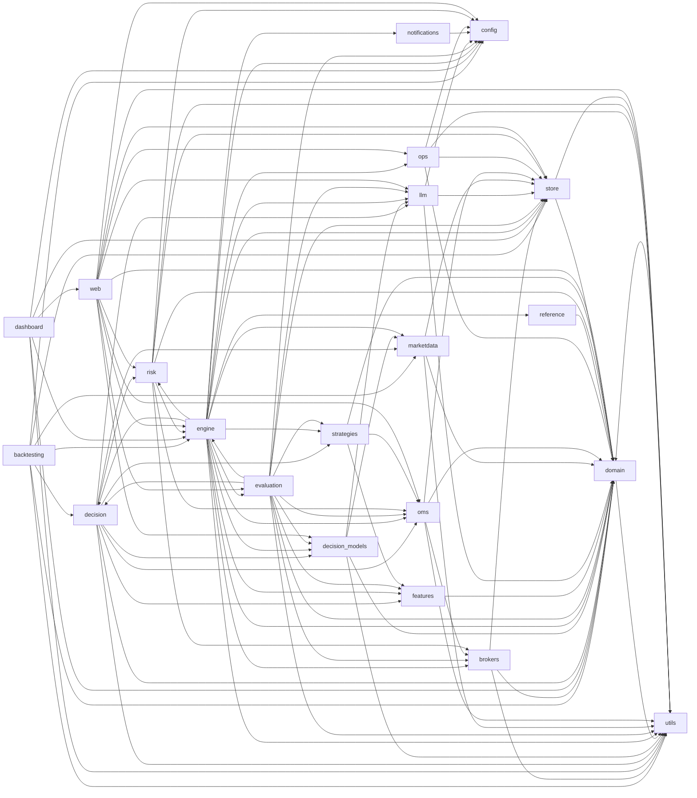

<!-- Generated by scripts/gen_docs.py from the code: do not edit by hand. -->

# Packages

The import root is `src`. Each package with its purpose (its `__init__` docstring, else its first module's), its modules, and the packages it imports.

## `src/backtesting`

Backtesting (plan M11): the paper engine itself replayed over daily bars (:mod:`src.backtesting.session`, :mod:`src.backtesting.bars`) and the edge statistics and gate (:mod:`src.backtesting.edge`).

Imports: `config`, `decision`, `domain`, `engine`, `marketdata`, `store`, `utils`.

| Module | Purpose |
| --- | --- |
| `backtesting/bars.py` | Daily bars as intraday quotes (plan M11.1), so the paper engine itself can backtest. |
| `backtesting/edge.py` | Is there an edge? The statistics and the gate for a v2 backtest (plan M11.2; audit §Y.3). |
| `backtesting/session.py` | Backtest the live engine itself (plan M11.1): every session of the period is an ordinary paper session - the same lifecycle, features, strategies, TradePolicy, RiskEngine, OMS, simulated broker, exit manager and NSE costs - fed the quotes its daily bars imply (:mod:`src.backtesting.bars`) on a replay clock, one session after another on one event store. State carries from day to day exactly as it does across real restarts (the OMS and positions are rebuilt from events, the broker, exit manager, risk state and kill switches from the store). |

## `src/brokers`

Broker abstraction (audit §H): the adapter protocol, capabilities, errors and adapters.

Imports: `domain`, `store`, `utils`.

| Module | Purpose |
| --- | --- |
| `brokers/base.py` | The broker adapter contract (plan M3.1; audit §H.2-§H.4). |
| `brokers/simulated/broker.py` | SimulatedBroker (plan M3.3; audit §M): an NSE-like exchange for paper trading that implements :class:`~src.brokers.base.BrokerAdapter`, so the OMS runs exactly the code path it would run against a real broker. |
| `brokers/simulated/costs.py` | Product-aware NSE charges (plan M3.2; audit §M.3), rates in ``src/config/costs_nse.yaml``. |
| `brokers/simulated/fill_model.py` | The simulated fill model (plan M3.3; audit §M.2). Pure functions; the broker applies them. |

## `src/config`

Configuration module for the trading agent.

Imports: none.

| Module | Purpose |
| --- | --- |
| `config/errors.py` | Configuration errors: invalid configuration stops the process with exit code 2. |
| `config/limits.py` | Bounded risk limits (plan M4.5; audit F-15). |
| `config/settings.py` | Application settings and configuration management. |

## `src/dashboard`

The terminal dashboard (``--mode cli``): the engine's state in ``rich``, from the projections.

Imports: `config`, `domain`, `engine`, `store`, `utils`, `web`.

| Module | Purpose |
| --- | --- |
| `dashboard/cli.py` | The terminal dashboard (plan M12.2): the running engine in ``rich``, read from the same projections as the web console (:mod:`src.web.queries`, which never imports FastAPI) - every book's summary, the risk strip, open positions, the last decisions and warnings. |

## `src/decision`

The decision layer (plan M5.4): deterministic decisions, optional per-book advisors (M8).

Imports: `decision_models`, `domain`, `features`, `llm`, `marketdata`, `oms`, `risk`, `strategies`, `utils`.

| Module | Purpose |
| --- | --- |
| `decision/advisors/llm_veto.py` | Book C's LLM veto advisor (plan M6 roles, M8 books; audit §I.2, §J.2). |
| `decision/advisors/typed_veto.py` | Book B's typed veto (plan M7.9): the decision-model cascade (Laya → Jev) reviews a proposal. |
| `decision/engine.py` | The deterministic decision engine (plan M5.4; audit §F.2): plain async, no LangGraph, run by the engine once per session in the ENTRY_WINDOW. |

## `src/decision_models`

Typed decision models (plan M7): Laya (local) and Jev (TypeSafe), cascaded and calibrated.

Imports: `domain`, `llm`, `marketdata`, `utils`.

| Module | Purpose |
| --- | --- |
| `decision_models/adapters.py` | Decision-model adapters (plan M7.2). |
| `decision_models/base.py` | Typed decision models (plan M7.1; decision D7): Laya (local, open) and Jev (TypeSafe, remote) answer typed questions about a **state** with calibrated probabilities. |
| `decision_models/cache.py` | Decision-model response cache (plan M8.5): live runs record every answer keyed by ``sha256(model, checkpoint, state, questions)`` in the event store's ``kv_state``; a replay serves them back (``replay_only``: a miss is a model error → ABSTAIN, never a fresh, different answer), so a replayed day reproduces the live decisions. |
| `decision_models/calibration.py` | Calibration of decision-model answers (plan M7.5). |
| `decision_models/cascade.py` | The decision-model cascade (plan M7.3): Laya first, Jev only when Laya should not be trusted. |
| `decision_models/labels.py` | The labelled announcement set for decision-model calibration (plan M7.5). |
| `decision_models/setup.py` | Building the decision-model cascade from the settings (plan M7): Laya when the optional ``decision-local`` extra is installed and enabled, Jev when ``TYPESAFE_API_KEY`` is set. With neither, there is no cascade and callers degrade (announcements are stored, not classified). |
| `decision_models/tasks/announcements.py` | The announcement classifier (plan M7.7): every new ``AnnouncementReceived`` becomes a ``TypedEvent`` (projected into ``typed_events``) for the event gate (M7.8) and Book B (M7.9). |

## `src/domain`

Pure domain layer: canonical types, events, ids, clocks and the exchange calendar.

Imports: `utils`.

| Module | Purpose |
| --- | --- |
| `domain/base.py` | Base classes for domain records: immutable, strictly-shaped and JSON round-trippable. |
| `domain/calendar.py` | NSE trading calendar (plan M1.4). |
| `domain/clock.py` | Clocks (plan M1.4). Everything time-dependent asks a :class:`Clock`, never ``datetime.now()``, so a session can run on wall time or on a recorded tape. |
| `domain/events.py` | Event envelope and catalogue (plan M1.2; audit §G.2). |
| `domain/ids.py` | Identifiers (plan M1.3). |
| `domain/sink.py` | Event sinks: how producers (market data, lifecycle, OMS, ...) emit events without knowing where they go. A sink stamps the payload with its clock's time and records it. |
| `domain/types.py` | Canonical domain types (plan M1.1; audit §H.2, §K.4, §L.3). |

## `src/engine`

The v2 engine: session lifecycle and (from M5) the asyncio tasks that run a trading day.

Imports: `brokers`, `config`, `decision`, `decision_models`, `domain`, `evaluation`, `features`, `llm`, `marketdata`, `notifications`, `oms`, `ops`, `reference`, `risk`, `store`, `strategies`, `utils`.

| Module | Purpose |
| --- | --- |
| `engine/demo.py` | The demo (plan M2.6, M5.6, M9.6): the real v2 engine replaying the **bundled fixture tape** (``src/engine/demo_tape/``, one synthetic session on :data:`DEMO_DAY`), paced so the whole session plays in a few minutes. Every price is ``MarketDataSource.SIMULATED``, which the RiskEngine allows to trade only in the ``demo`` environment (its own ``var/demo/`` state). |
| `engine/lifecycle.py` | Session lifecycle (plan M2.5), driven by the exchange calendar and a :class:`Clock`: |
| `engine/live.py` | Running the v2 engine behind a front end (plan M5.6, M12.2): the CLI paints it through an :class:`EngineView` (``src/dashboard/cli.py``); the web console needs none - it reads the store's projections and the engine's live state itself (``src/web/``). |
| `engine/market.py` | Market data for the engine (plan M5.6): one service the decision engine, the RiskGate, the risk monitor, the simulated broker and the exit manager all read, so they see the same prices. |
| `engine/replay.py` | Replaying a recorded day (plan M8.5; audit §G.4): the same engine, books, advisors and report, on a :class:`ReplayClock`, from what the system recorded - no network. |
| `engine/runner.py` | The engine runner (plan M5.6, M8.1-8.2): the trading day, end to end, for one or more paired **books**. The same code runs live (wall clock, YFinance) and in replay (ReplayClock, a tape). |
| `engine/tasks.py` | The engine's periodic tasks (plan M5.6; audit §F.4, §G.3). |

## `src/evaluation`

Evaluation (plan M8): the experiment, paired books, shadow ledger, daily report, review.

Imports: `brokers`, `config`, `decision`, `decision_models`, `domain`, `engine`, `features`, `llm`, `oms`, `store`, `strategies`, `utils`.

| Module | Purpose |
| --- | --- |
| `evaluation/books.py` | Paired books (plan M8.1-8.2): the experiment's books → the engine's per-book stacks and advisors. |
| `evaluation/daily_report.py` | The daily report (plan M8.4; audit §Y.2), generated from the event store alone, so any day can be regenerated offline and every number traces back to recorded events. |
| `evaluation/experiment.py` | The experiment definition (plan M8.1): ``src/config/experiment.yaml`` → a validated :class:`ExperimentConfig`, and from it the engine's book list, capital, entry window, policy and strategies. Month 1 is CNC long-only with learning injection off; anything else fails startup. |
| `evaluation/review.py` | The nightly post-trade review (plan M8.7; audit §J.2): role ``review`` (prompt ``review_v1``) writes structured lessons for each trade closed that day, from the trade's full lineage - the signal and its reasons, the risk decision, the book's advisor verdict, the counterfactual and the day's regime. Each review is a ``TradeReview`` event stamped ``resolved_at`` (point in time). |
| `evaluation/shadow_ledger.py` | The shadow ledger (plan M8.3; audit §Y.1): the counterfactual of **every** signal - approved, vetoed (in any book), risk-rejected, or from a shadow strategy - simulated on the live tape with the same TradePolicy exit rules, net of modelled NSE costs, settled at exit. |

## `src/features`

Deterministic features: technical indicators and the market regime (plan M5).

Imports: `domain`.

| Module | Purpose |
| --- | --- |
| `features/regime.py` | The deterministic NIFTY 50 regime (plan M5.3; audit §I.1, F-19). |
| `features/technical.py` | Technical features of one instrument on its **settled** daily bars (plan M5.1). |

## `src/llm`

The LLM provider layer (plan M6): registry, clients, router, pricing and prompts.

Imports: `config`, `domain`, `store`.

| Module | Purpose |
| --- | --- |
| `llm/clients/anthropic_native.py` | Claude through the native Anthropic SDK (plan M6; written against the claude-api skill and the installed ``anthropic`` 1.x bindings). |
| `llm/clients/base.py` | The client contract (plan M6) and the JSON-schema helpers both client kinds share. |
| `llm/clients/openai_compat.py` | Every OpenAI-compatible provider (plan M6): OpenAI, OpenRouter, Groq, Ollama, any ``compat`` URL. |
| `llm/pricing.py` | LLM pricing (plan M6): USD per 1M tokens per ``provider:model`` from ``src/config/llm_pricing.yaml``, and conversion to INR at the ``USD_INR`` setting. |
| `llm/prompts/base.py` | Versioned prompt templates (plan M6; audit §I.2 rule 4). |
| `llm/prompts/evidence.py` | The hallucination check (audit §J.2): every claim an LLM makes must cite an ``evidence_ref`` that names a key in the input it was given (``features.rsi_14``, ``events[2]``, ``events[2].title``). A reference to anything that was not in the input fails the check, and the caller turns the verdict into ABSTAIN. |
| `llm/prompts/templates.py` | The prompt templates and their output schemas (plan M6): ``veto_v1`` (Book C, online), ``review_v1`` (nightly post-trade review), ``explain_v1`` (trade narratives) and ``label_announcement_v1`` (teacher labels for decision-model calibration, M7). |
| `llm/registry.py` | The LLM provider registry (plan M6; decision D6): any role on any provider by changing one config string, ``"provider:model"``. No code changes, no blocking dependency on one vendor. |
| `llm/router.py` | The LLM router (plan M6): ``LLMRouter.complete(role, messages, schema, ...)`` - the only way the system calls an LLM. |
| `llm/setup.py` | Building the LLM router from the settings (plan M6): roles validated at startup (a bad enabled role is a ``ConfigError`` → exit 2), today's spend rebuilt from the store, the reply cache in the store. |
| `llm/types.py` | Shared LLM types (plan M6): usage, a client's reply, and the failures the router acts on. |

## `src/marketdata`

Market data v2: batched, honestly time-stamped quotes and daily history (plan M2).

Imports: `domain`, `store`, `utils`.

| Module | Purpose |
| --- | --- |
| `marketdata/announcements.py` | Corporate-announcement ingestion (plan M7.6). |
| `marketdata/bhavcopy.py` | NSE capital-market bhavcopies (UDiFF) as a point-in-time daily dataset (plan M11.3). |
| `marketdata/history.py` | Daily history (plan M2.3): one batched ``yf.download(period="1y", interval="1d", auto_adjust=False, actions=True)`` per day, pre-open. |
| `marketdata/replay.py` | Replaying a recorded tape (plan M5.6 acceptance; audit §G.4): the same engine, driven by a :class:`~src.domain.clock.ReplayClock` over what the system received on a past day. |
| `marketdata/symbols.py` | Mapping between NSE instruments and Yahoo Finance tickers. |
| `marketdata/validation.py` | Quote validation (plan M2.2; audit §K.4). A quote is dropped, with a ``QuoteRejected`` event, when: |
| `marketdata/yfinance_source.py` | Batched, non-blocking YFinance quote poller (plan M2.1; audit §D, F.0). |

## `src/notifications`

Notifications module for RakshaQuant.

Imports: `config`.

| Module | Purpose |
| --- | --- |
| `notifications/telegram.py` | Telegram Notification Module |

## `src/oms`

Order management (plan M3.4/M3.5): the OMS, the fill-driven PositionBook and exits.

Imports: `brokers`, `domain`, `store`, `utils`.

| Module | Purpose |
| --- | --- |
| `oms/exit_manager.py` | Exit management for CNC swing positions (plan M3.5; ported from ``src/execution/exit_manager.py`` with the audit F-01/F-06/F-09/F-19 fixes). |
| `oms/oms.py` | The OMS (plan M3.4; audit §H.5): the **single** entry point for every order - entries, exits, flattens and operator orders - and the only writer of the book. |
| `oms/position_book.py` | The PositionBook (plan M3.4; audit §F.1 "one book", F-01/F-02/F-07): a book's positions and cash, changed **only by fills**, each fill applied at most once (by ``fill_id``). |

## `src/ops`

Operational plumbing: process lifecycle, exit codes, locks (and, later, logging).

Imports: `config`, `domain`, `store`, `utils`.

| Module | Purpose |
| --- | --- |
| `ops/context.py` | Lineage context for logs (plan M1.6; audit §O.1): ``cycle_id``, ``decision_id``, ``component``, ``symbol`` and ``book_id`` live in ``contextvars``, so every log record emitted inside a :func:`log_context` block carries them. ``asyncio`` tasks and ``asyncio.to_thread`` copy the current context, so the ids follow work into tasks and worker threads. |
| `ops/deadman.py` | The dead-man check (plan M12.4). Task Scheduler runs it at 10:00 and 13:00 IST on weekdays (``scripts/deadman_check.py``). During market hours, it raises the alarm when the engine's last ``Heartbeat`` (every 30 s) is older than :data:`STALE_AFTER_S`, or when there is none today. |
| `ops/exit_codes.py` | Process exit codes shared by every entry point, so a scheduler can tell outcomes apart. |
| `ops/instance_lock.py` | Single-instance guard: at most one RakshaQuant process per state directory. |
| `ops/logging_config.py` | Logging (plan M1.6; audit §O.2). |
| `ops/process.py` | Entry-point runner (plan M1.6): every ``scripts/*.py`` runs its ``main`` through :func:`run_entry_point`, which gives all of them the same process contract: |
| `ops/version.py` | The running code's version (plan M12.4): the package version plus the git commit, so every session's ``ProcessStarted`` event records exactly which code ran. During the month run that is how a P0 fix shows up in the experiment's own record (audit §U: "each such fix is logged"). |

## `src/reference`

Reference data (plan M2.4): the fixed universe, sector map, instrument master and price bands.

Imports: `domain`.

| Module | Purpose |
| --- | --- |
| `reference/bands.py` | Price bands (plan M2.4). NSE's daily file (verified 2026-10-02): ``https://nsearchives.nseindia.com/content/equities/sec_list.csv`` with columns ``Symbol, Series, Security Name, Band, Remarks``; ``Band`` is 2/5/10/20/40 (%) or ``No Band``. F&O stocks (every NIFTY 50 name) are ``No Band``: they have dynamic price bands instead, which we represent as ``None``. When the file is unavailable a per-series default table is used. |
| `reference/download.py` | Dated, cached downloads of reference files into ``var/reference/``. |
| `reference/instruments.py` | Instrument master (plan M2.4) from Dhan's scrip master (verified 2026-10-02): ``https://images.dhan.co/api-data/api-scrip-master.csv`` (~25 MB, ~200k rows). NSE cash equities are rows with ``SEM_EXM_EXCH_ID=NSE``, ``SEM_SEGMENT=E``, ``SEM_INSTRUMENT_NAME=EQUITY``. |
| `reference/refresh.py` | The pre-open reference refresh (plan M2.4/M2.5): universe, instrument master and price bands. |
| `reference/universe.py` | The trading universe (plan D13, M2.4): the NIFTY 50 constituents as of a snapshot date. |

## `src/risk`

Deterministic risk guards (drawdown tracking + NSE circuit-limit detection).

Imports: `brokers`, `config`, `domain`, `engine`, `oms`, `store`, `utils`.

| Module | Purpose |
| --- | --- |
| `risk/checks/base.py` | The risk-check contract (audit §L.3) and helpers to build results. |
| `risk/checks/events.py` | Event-calendar checks (plan M7.8; audit §J.2): entries are blocked in windows built by :mod:`src.risk.events` from classified announcements. They never apply to exits. |
| `risk/checks/order.py` | Order-level checks (audit §L.3): sizing caps, stop sanity, price sanity, shorting, reduce-only. |
| `risk/checks/portfolio.py` | Portfolio-level checks (audit §L.3, minus PF_NET and VaR): positions, exposure, heat, cash, MTM daily loss and drawdown. Every capacity check includes the batch's reservations. |
| `risk/checks/strategy.py` | Strategy-level checks (audit §L.3): enablement, kill switch, capital, losses, order rate. |
| `risk/checks/system.py` | System-level risk checks (audit §L.3). M4 wraps these in the RiskEngine's check protocol. |
| `risk/engine.py` | The RiskEngine (plan M4.1; audit §L.1-§L.3): the single, binding pre-trade decision for every order - opens, increases, reductions, closes, flattens and operator orders. |
| `risk/events.py` | The event calendar (plan M7.8): classified announcements (``TypedEvent``) → windows in which new entries in an instrument are blocked, per the deterministic rules in ``src/config/event_rules.yaml``. Windows are counted in NSE trading sessions. |
| `risk/gate.py` | The OMS's pre-trade gate (plan M4.2; audit §L.1): every order - entries, exits, flattens and operator orders - is evaluated by the :class:`~src.risk.engine.RiskEngine` against a **fresh** :class:`~src.risk.snapshot.RiskSnapshot`, and the ``RiskDecision`` is persisted **before** the OMS records ``OrderSubmitted`` and routes. There is no other path to the broker. |
| `risk/guards.py` | Deterministic risk guards — independent of the LLM agent stack. |
| `risk/kill_switch.py` | Kill switches (plan M4.4; audit §L.4). |
| `risk/marks.py` | Marking the book for risk: per-position owners and open P&L by strategy. |
| `risk/monitor.py` | The risk monitor task (plan M4.3/M4.4): every ``interval_s`` (60 s in month 1), independently of signal cycles - so a breach on a day with no signals still halts or flattens. |
| `risk/snapshot.py` | What a risk decision is made against (plan M4.1; audit §L.3). |
| `risk/state.py` | The persisted per-IST-day risk state of one book (plan M4.3; audit §L.4). |
| `risk/utilisation.py` | How much of each portfolio limit a book is using (plan M10: the Risk Center's meters). |

## `src/store`

Persistence: the SQLite event store with its projections, and the Parquet market tape.

Imports: `domain`, `utils`.

| Module | Purpose |
| --- | --- |
| `store/event_store.py` | The event store (plan M1.5; audit §G.4): an append-only ``events`` table in SQLite (WAL) plus projections kept in step **in the same transaction**. Events are the system of record; projections are disposable and can be rebuilt from them at any time. |
| `store/kv.py` | Durable key/value state for components that keep their own state outside the event log (the simulated broker's exchange-side book, the exit manager's stops). Not a projection. |
| `store/projections.py` | Projections: read-model tables maintained from events (plan M1.5). |
| `store/sink.py` | An :class:`~src.domain.sink.EventSink` that appends to the event store. |
| `store/sqlite.py` | SQLite connection and schema migrations (plan M1.5). |
| `store/tape.py` | Parquet market tape (plan M1.5; audit §G.4): what the system *received*, kept for replay. |

## `src/strategies`

Strategies (plan M5.1): one module per strategy, all deterministic and backtestable.

Imports: `domain`, `features`, `oms`.

| Module | Purpose |
| --- | --- |
| `strategies/base.py` | The strategy contract (plan M5.1). |
| `strategies/breakout.py` | Breakout (ported from the legacy SignalEngine; shadow-only in month 1, plan D8). |
| `strategies/mean_reversion.py` | Mean reversion (ported from the legacy SignalEngine): Bollinger-band extremes with RSI. |
| `strategies/momentum.py` | Momentum (ported from the legacy SignalEngine): MACD histogram with RSI room to run. |
| `strategies/policy.py` | TradePolicy (plan M5.2): the one place a signal becomes an order proposal - shared by the live decision engine, the shadow ledger (M8) and the backtest (M11). |
| `strategies/trend_following.py` | Trend following (ported from the legacy SignalEngine; shadow-only in month 1, plan D8). |

## `src/utils`

Shared helpers: :mod:`src.utils.market_time` (IST, NSE session hours).

Imports: `domain`.

| Module | Purpose |
| --- | --- |
| `utils/market_time.py` | Market time helpers. |

## `src/web`

Web console for RakshaQuant - the browser front end (``--mode web``).

Imports: `config`, `decision_models`, `domain`, `engine`, `evaluation`, `llm`, `oms`, `ops`, `risk`, `store`, `utils`.

| Module | Purpose |
| --- | --- |
| `web/control.py` | Operator controls (plan M9.3; audit §L.4, §N.1 #1): halt, resume and flatten the books' global kill switches, each recorded as a ``ControlCommand`` event whether or not it changed anything. |
| `web/models.py` | The web API's response models (plan M9.2). They are the contract: FastAPI turns them into the OpenAPI document that ``frontend/src/api/types.gen.ts`` is generated from (M9.5). |
| `web/queries.py` | The read side of both front ends (plan M9.2; the CLI too since M12.2): projections and events from the event store, turned into :mod:`src.web.models`. Everything here is synchronous and side-effect free, so callers run it in a worker thread on their own read connection (WAL readers never block the engine). Nothing here imports FastAPI: the CLI-only install uses it as well. |
| `web/run_manager.py` | Run manager — owns the trading session as a background task for the web console. |
| `web/security.py` | The web control plane's security (plan M9.1; audit §N.1 #1, §P.1). |
| `web/server.py` | FastAPI server for the RakshaQuant web console. |
| `web/stream.py` | The WebSocket event stream (plan M9.4; audit §N.3). |
